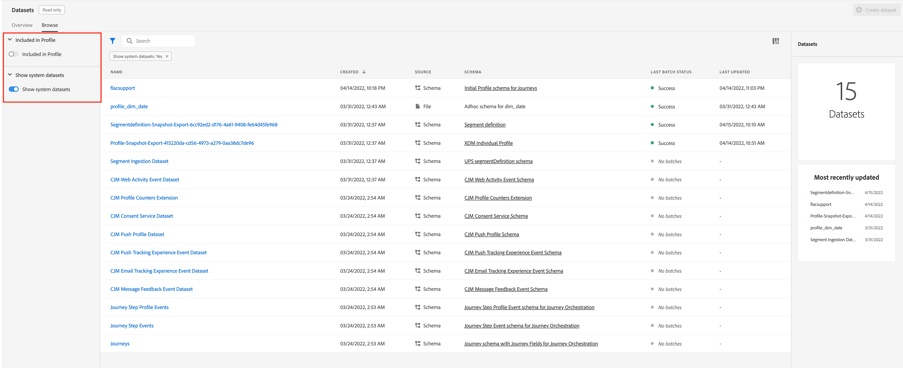

# Kom igång med datauppsättningar {#datasets-gs}

Alla data som importeras till Adobe Experience Platform lagras i Data Lake som datauppsättningar. En datauppsättning är en lagrings- och hanteringskonstruktion för en datamängd, vanligtvis en tabell, som innehåller ett schema (kolumner) och fält (rader).

## Åtkomst till datauppsättningar{#access-datasets}

Med arbetsytan **Datauppsättningar** i [!DNL Adobe Journey Optimizer] kan du utforska data och skapa datauppsättningar.

Välj **Datauppsättningar** i den vänstra navigeringen för att öppna instrumentpanelen för datauppsättningar.

Att lägga till data i [!DNL Adobe Experience Platform] är grunden för att skapa en profil. Du kan sedan utnyttja profiler i [!DNL Adobe Journey Optimizer]. Börja med att definiera scheman, använd ETL-verktyg för att förbereda och standardisera data och skapa sedan datauppsättningar baserade på dina scheman.

Välj fliken **Bläddra** om du vill visa listan över alla tillgängliga datauppsättningar för din organisation. Information visas för varje datamängd som anges, inklusive namn, schema som datauppsättningen följer och status för den senaste importen.

Som standard visas bara de datauppsättningar som du har kapslat in i. Om du vill se de systemgenererade datauppsättningarna aktiverar du alternativet **Visa systemdatauppsättningar** från filtret.

>[!NOTE]
>
>Från och med 1 november 2024 har direktuppspelningssegmentering inte längre stöd för skicka och öppna händelser från [!DNL Journey Optimizer] spårnings- och feedbackdatauppsättningar. Använd affärsregler i stället för att implementera frekvensbegränsning eller trötthetshantering. Mer information finns i [det här avsnittet](../conflict-prioritization/rule-sets.md), inklusive en fallförklaring för det dagliga taktavlägget [här](https://experienceleaguecommunities.adobe.com/t5/journey-optimizer-blogs/elevate-customer-experience-with-daily-frequency-capping-in-ajo/ba-p/761510){target="_blank"}.
>
>Från och med februari 2025 introduceras dessutom ett TTL-skyddsutkast till Journey Optimizer systemgenererade datauppsättningar. [Läs mer](datasets-ttl.md)

Markera namnet på en datauppsättning för att komma åt aktivitetsskärmen för datauppsättningen och se information om den datauppsättning du valde. Fliken Aktivitet innehåller ett diagram som visar hur många meddelanden som har förbrukats samt en lista över lyckade och misslyckade batchar.

Systemdatauppsättningar för Adobe Journey Optimizer visas nedan.

>[!CAUTION]
>
> Systemdatauppsättningarna **får inte ändras**. Alla ändringar återställs automatiskt vid varje produktuppdatering.

**Rapportering**

* _Rapportering - händelsedatauppsättning för meddelandefeedback_: Meddelandeleveransloggar. Information om alla mejl från Journey Optimizer för rapportering och målgruppsframställning. Feedback från e-postleverantörer om studsar registreras också i den här datauppsättningen.
* _Rapportering - händelsedatauppsättning för e-postspårning_: Interaktionsloggar för e-postkanal som används för rapportering och målgruppsskapande. Information som lagras om åtgärder som slutanvändaren utför via e-post (öppningar, klick etc.).
* _Rapportering - händelsedatauppsättningen Push Tracking Experience_: Interaktionsloggar för push-kanal som används för att skapa rapporter och målgrupper. Information som lagras om åtgärder som slutanvändaren utför i push-meddelanden.
* _Rapportering - Resestegshändelse_: Hämtar alla händelser för körningssteg som har genererats från Journey Optimizer och som ska användas av tjänster som rapportering. Viktigt för att skapa rapporter i Customer Journey Analytics för YY-analys. Kopplad till en resemetadata.
* _Rapportering - Resor_: Inlämningsinformation för metadatadatadatauppsättningar för varje steg i en resa.
* _Rapportering - BCC_: Datauppsättning för feedbackhändelse som lagrar leveransloggar för BCC-e-post. Ska användas för rapportering.

**Godkännande**

* _Samtyckestjänstdatauppsättning_: lagrar sambandsinformation för en profil.

**Intelligenta tjänster**

* _Poäng för optimering vid sändning/engagemang_: Resultat för AI vid körning på resa.

Om du vill visa en fullständig lista över fält och attribut för varje schema kan du läsa [Journey Optimizer schemaordlista](https://experienceleague.adobe.com/tools/ajo-schemas/schema-dictionary.html?lang=sv-SE){target="_blank"}.

## Förhandsgranska datauppsättningar{#preview-datasets}

På aktivitetsskärmen för datauppsättningen väljer du **Förhandsgranska datauppsättning** i skärmens övre högra hörn för att förhandsgranska den senaste lyckade gruppen i den här datauppsättningen. När en datauppsättning är tom inaktiveras förhandsgranskningslänken.

## Skapa datauppsättningar{#create-datasets}

Om du vill skapa en ny datauppsättning börjar du med att välja **Skapa datauppsättning** på instrumentpanelen för datauppsättningar.

Du kan:

* Skapa datauppsättning från schema. [Läs mer i den här dokumentationen](https://experienceleague.adobe.com/docs/experience-platform/catalog/datasets/user-guide.html?lang=sv-SE#schema){target="_blank"}
* Skapa datauppsättning från CSV-fil. [Läs mer i den här dokumentationen](https://experienceleague.adobe.com/docs/experience-platform/ingestion/tutorials/map-a-csv-file.html?lang=sv-SE){target="_blank"}

I den här videon får du lära dig hur du skapar en datauppsättning, mappar den till ett schema, lägger till data i den och bekräftar att data har importerats.

>[!VIDEO](https://video.tv.adobe.com/v/334293?quality=12)

## Dataförvaltning

I en datauppsättning bläddrar du till fliken **Datastyrning** för att kontrollera etiketter på data- och fältnivå. Datastyrning kategoriserar data efter vilken typ av policyer som gäller.

En av kärnfunktionerna i [!DNL Adobe Experience Platform] är att samla data från flera företagssystem så att marknadsförarna bättre kan identifiera, förstå och engagera kunder. Dessa data kan vara föremål för användarbegränsningar som fastställts av din organisation eller av juridiska bestämmelser. Det är därför viktigt att se till att dataåtgärderna är kompatibla med dataanvändningspolicyer.

Med [!DNL Adobe Experience Platform Data Governance] kan du hantera kunddata och säkerställa efterlevnad av regler, begränsningar och policyer som gäller för dataanvändning. Det spelar en nyckelroll inom Experience Platform på olika nivåer, bland annat i fråga om katalogisering, datalinje, dataanvändningsetiketter, dataanvändningspolicyer och kontroll av användningen av data för marknadsföringsåtgärder.

Läs mer om etiketter för datastyrning och dataanvändning i [dokumentationen för datastyrning](https://experienceleague.adobe.com/docs/experience-platform/data-governance/labels/user-guide.html?lang=sv-SE){target="_blank"}

## Exempel och användningsområden{#uc-datasets}

Lär dig hur du skapar ett schema, en datauppsättning och importerar data för att lägga till testprofiler i Adobe Journey Optimizer i [det här exempelexemplet från början till slut](../audience/creating-test-profiles.md)

Läs mer om hur du skapar datauppsättningar i [Adobe Experience Platform-dokumentationen](https://experienceleague.adobe.com/docs/experience-platform/catalog/datasets/overview.html?lang=sv-SE){target="_blank"}.

Lär dig hur du använder användargränssnittet för datauppsättningar i översiktsdokumentationen för [datainmatning](https://experienceleague.adobe.com/docs/experience-platform/ingestion/home.html?lang=sv-SE){target="_blank"}.

En lista över användningsfall med frågeexempel finns [här](../data/datasets-query-examples.md).

>[!MORELIKETHIS]
>
>* [Översikt över direktuppspelningsförslag](https://experienceleague.adobe.com/docs/experience-platform/ingestion/streaming/overview.html?lang=sv){target="_blank"}
>* [Infoga data i Adobe Experience Platform](https://experienceleague.adobe.com/docs/experience-platform/ingestion/tutorials/ingest-batch-data.html?lang=sv-SE){target="_blank"}
