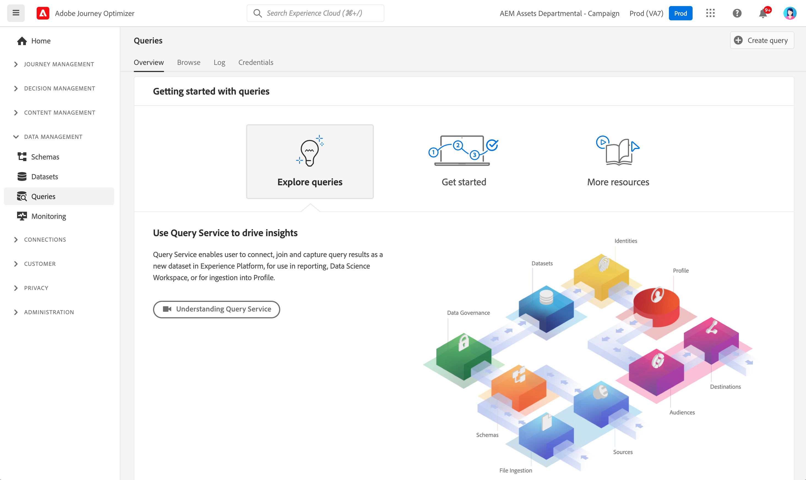

# Kom igång med frågor {#queries-gs}

Frågeredigeraren är ett interaktivt verktyg som tillhandahålls av Adobe Experience Platform Query Service, som gör att du kan skriva, validera och köra frågor för kundupplevelsedata i [!DNL Adobe Journey Optimizer]-användargränssnittet.

Frågeredigeraren har stöd för att utveckla frågor för analys och datautforskande, och gör att du kan köra interaktiva frågor i utvecklingssyfte samt icke-interaktiva frågor för att fylla i [datamängder](get-started-datasets.md).

Lär dig hur du använder frågeredigeraren i [den här dokumentationen](https://experienceleague.adobe.com/docs/experience-platform/query/ui/user-guide.html){target="_blank"}.

>[!MORELIKETHIS]
>
>* [Dokumentation för frågetjänsten](https://experienceleague.adobe.com/docs/experience-platform/query/home.html?lang=sv){target="_blank"}
>* [Översiktsvideo om frågetjänsten](https://experienceleague.adobe.com/docs/platform-learn/tutorials/queries/understanding-query-service.html){target="_blank"}
