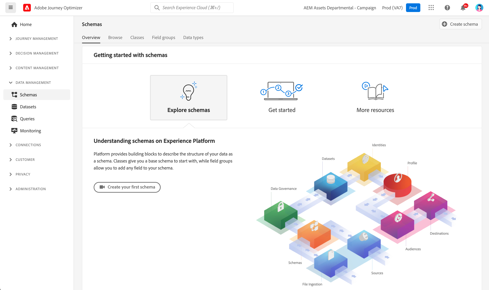

# Kom igång med scheman {#schemas-gs}

Scheman är standardmetoden för att beskriva data i Experience Platform, så att alla data som överensstämmer med scheman kan återanvändas i en organisation utan konflikter, eller till och med delas mellan flera organisationer.

➡️ [Lär dig hur du skapar och konfigurerar ett schema i den här videon](#video-schema) (video)

Ett schema är en uppsättning regler som representerar och validerar datastrukturen och dataformatet. På en hög nivå ger scheman en abstrakt definition av ett objekt i verkligheten (till exempel en person) och ger en översikt över vilka data som ska inkluderas i varje instans av objektet (till exempel förnamn, efternamn, födelsedag o.s.v.).

Lär dig hur du skapar scheman i [den här dokumentationen](https://experienceleague.adobe.com/docs/experience-platform/xdm/schema/composition.html){target="_blank"}.

Med arbetsytan **Scheman** i användargränssnittet [!DNL Adobe Journey Optimizer] kan du hantera Experience Data Model-resurser (XDM), inklusive scheman, klasser, schemafältgrupper och datatyper. Du kan se och utforska de viktigaste resurserna i Adobe och skapa anpassade resurser och scheman för din organisation.

Lär dig hur du använder schemaanvändargränssnittet i [den här dokumentationen](https://experienceleague.adobe.com/docs/experience-platform/xdm/ui/overview.html){target="_blank"}

Stegvis dokumentation om hur du skapar ett schema med Schemaredigeraren finns i [Adobe Experience Platform-dokumentationen](https://experienceleague.adobe.com/docs/experience-platform/xdm/tutorials/create-schema-ui.html){target="_blank"}.

Gå till [Journey Optimizer schemaordlista](https://experienceleague.adobe.com/tools/ajo-schemas/schema-dictionary.html){target="_blank"} om du vill visa en fullständig lista över fält och attribut för varje schema.

## Instruktionsvideo{#video-schema}

Lär dig hur du skapar ett schema, lägger till fältgrupper, skapar och konfigurerar anpassade fältgrupper.

>[!VIDEO](https://video.tv.adobe.com/v/334461?quality=12)

>[!MORELIKETHIS]
>
>* [Skapa ett schema, en datauppsättning och inmatningsdata för att lägga till testprofiler i Journey Optimizer](../audience/creating-test-profiles.md)
>* [Översikt över XDM-systemet](https://experienceleague.adobe.com/docs/experience-platform/xdm/home.html?lang=sv){target="_blank"}
>* [Bästa tillvägagångssätt för datamodellering](https://experienceleague.adobe.com/docs/experience-platform/xdm/schema/best-practices.html){target="_blank"}
>* [Skapa ett schema med API:t för schemaregister](https://experienceleague.adobe.com/docs/experience-platform/xdm/tutorials/create-schema-api.html){target="_blank"}
>* [Definiera en relation mellan två scheman med Schemaredigeraren](https://experienceleague.adobe.com/docs/experience-platform/xdm/tutorials/relationship-ui.html){target="_blank"}
