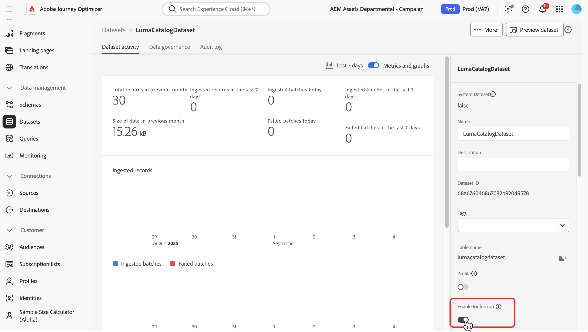
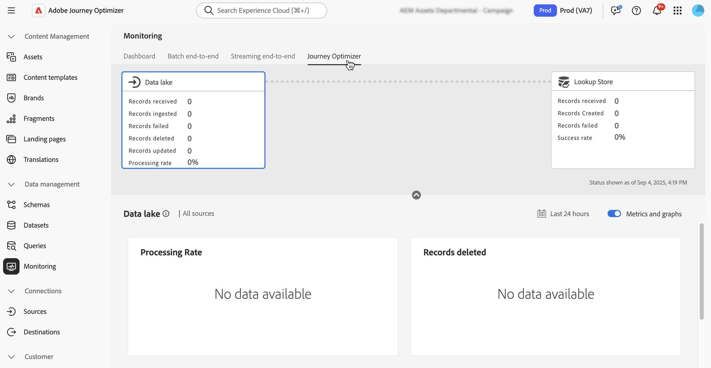

# Använd Adobe Experience Platform-data {#aep-data}

>[!CONTEXTUALHELP]
>id="lookup-aep-data"
>title="Aktivera för sökning"
>abstract="Genom att aktivera en datauppsättning för sökning kan ni utnyttja data i Journey Optimizer personalisering, beslutsfattande och möjlighet att samordna kundresor."

Med Journey Optimizer kan ni utnyttja data från Adobe Experience Platform med funktioner för personalisering, beslutsfattande och resesamordning. För att göra detta måste postbaserade datauppsättningar som behövs för sökpersonalisering först aktiveras för söktjänsten enligt beskrivningen nedan.

## Måste läsas

### Guardsutkast och riktlinjer {#guidelines}

Läs följande begränsningar och riktlinjer innan du börjar:

* **Ingen PII i datauppsättningar** - datauppsättningar som har aktiverats för sökning får inte innehålla någon PII (Personally Identiitable Information).

* 
   * **Borttagningsrisk** - Datauppsättningar som används i personalisering skyddas inte från att tas bort. Du måste hålla reda på vilka datauppsättningar som används för att vara säker på att de inte tas bort.

* **Schematyp** - Datauppsättningar måste associeras med ett schema som är **NOT** av profiltyp eller händelsetyp.

* **Aktivera** för att aktivera och inaktivera sökningen - Undvik att aktivera och inaktivera datauppsättningar flera gånger. Om du gör det kan det leda till oväntade indexeringsbeteenden. Det bästa sättet är att låta datauppsättningen vara aktiverad så länge du tänker använda den för uppslag.

* **Batch med borttagning av data** - Om du tar bort en grupp med data från datauppsättningen tas alla matchande nycklar bort helt från söktjänsten. Exempel:

  **Grupp 1**: Sku1, Sku2, Sku3\
  **Grupp 2**: SKU1, SKU2, SKU3, SKU4, SKU5, SKU6\
  **Grupp 3**: Sku7, Sku8, Sku9, Sku10

  Om du tar bort **Grupp 1** tas Sku1, Sku2 och Sku3 bort från sökningsarkivet. De resulterande sökdata kommer sedan att innehålla: Sku4, Sku5, Sku6, Sku7, Sku8, Sku9, Sku10.

* **Inga kedjade sökningar** - Det går inte att koppla datauppsättningssökningar. Du kan med andra ord inte använda resultatet av en sökning som en variabel för att sedan bli nyckeln för att utföra en andra sökning.

### Tillstånd för sökningstjänst

| Funktionskomponent | Gränser | Anteckningar |
| ------- | ------- | ------- |
| Aktiverade uppslagsdatauppsättningar | Max 10 per organisation | Maximalt antal datauppsättningar som kan konfigureras för sökning vid en given tidpunkt. Den här gränsen gäller det totala antalet uppslagsdatauppsättningar både i produktions- och utvecklingssandlådor i kundinstansen. |
| Antal datauppsättningsposter | Upp till 2 miljoner poster per datauppsättning | Maximalt antal poster som tillåts i en enskild datauppsättning, beräknat som det totala antalet för alla batchar i den datauppsättningen. |
| Poststorlek | Upp till 2 kB per post | Maximal standardpoststorlek stöds. |
| Datauppsättningsstorlek | Upp till 4 GB | Maximal storlek för en enskild datauppsättning, inte den kombinerade storleken för alla datauppsättningar i en sandlåda. Antalet poster och storleksbegränsningarna för datauppsättningar är oberoende garderobar - båda måste vara uppfyllda. |
| Uppdateringar av datauppsättningsfrekvens | Upp till 5 uppdateringar per dag per datauppsättning | Maximal frekvens för uppdateringsåtgärder som tillåts för en enskild datauppsättning per dag. |

>[!NOTE]
>
>Om du behöver ytterligare volymer utöver de säkerhetsalternativ som anges ovan kontaktar du Adobe.

## Aktivera en datauppsättning för datasökning {#enable}

För att kunna utnyttja data från datauppsättningen för personalisering måste du aktivera datauppsättningen för sökning.

### Förhandskrav {#prerequisites-enable}

Schemat som är associerat med din datauppsättning som du vill aktivera för sökning måste vara av posttyp. Schemat ska INTE vara av profil- eller händelseklass.

+++Exempel


+++

Schemat måste ha en primär identitet definierad.

+++Exempel


+++

Om ett anpassat namnutrymme inte har definierats än kontrollerar du att identiteten är en icke-personidentifierare.

+++Exempel


+++

### Aktivera datauppsättningen för sökning i datauppsättningens hanteringsgränssnitt

Använd växlingsknappen i användargränssnittet för datauppsättningshantering för att aktivera datauppsättningen för sökning.



>[!NOTE]
>
>Vi rekommenderar att datauppsättningen INTE är aktiverad för profilen eftersom detta kan leda till ökad profilrikedom och inte behövs för att utföra sökningarna.

### API-metod

Följ anvisningarna i [den här dokumentationen](https://developer.adobe.com/journey-optimizer-apis/references/authentication/) för att konfigurera miljön för att skicka API-kommandon.

#### Förhandskrav

* Utvecklarprojektet måste ha Adobe Journey Optimizer- och Adobe Experience Platform-API:erna tillagda i projektet.

  

* Du måste ha behörighet att hantera datauppsättningar som en del av din roll.

* Schemat som datauppsättningen baseras på måste innehålla en primär identitet som kan fungera som söknyckeln.

#### API-anropsstruktur

```shell
curl -s -XPATCH "https://platform.adobe.io/data/core/entity/lookup/dataSets/${DATASET_ID}/${ACTION}" \ -H "Authorization: Bearer ${ACCESS_TOKEN}" \ -H "x-api-key: ${API_KEY}" \ -H "x-gw-ims-org-id: ${IMS_ORG}" \ -H "x-sandbox-name: ${SANDBOX_NAME}" 
```

Var:

* URL är `https://platform.adobe.io/data/core/entity/lookup/dataSets/${DATASET_ID}/${ACTION}`
* Datauppsättnings-ID är den datauppsättning som du vill aktivera.
* Åtgärden är aktiverad eller inaktiverad.
* Åtkomsttoken kan hämtas från utvecklarkonsolen.
* API-nyckeln kan hämtas från utvecklarkonsolen.
* IMS Org ID är din Adobe-organisation.
* Sandlådenamn är namnet på sandlådan som datauppsättningen finns i (d.v.s. prod, dev.s.).

>[!NOTE]
>
>Om du får ett felmeddelande nedan när du försöker aktivera datauppsättningar kan du försöka med att ta bort Adobe Journey Optimizer API:er från ditt utvecklarkonsolprojekt och sedan lägga till dem igen:
>
>`"error_code": "403003",`
>`"message": "Api Key is invalid"`

## Datauppsättningsövervakning

När en datauppsättning har aktiverats för sökning kan du granska statusen för inmatning i sökningstjänsten genom att gå till **[!UICONTROL Monitoring]**-menyn och välja fliken **[!UICONTROL Journey Optimizer]**.

Den här processindikatorn hjälper till att förstå när nya grupper med data är tillgängliga i sökningstjänsten.



## Nästa steg

När en datauppsättning har aktiverats för sökning med ett API-anrop kan du använda data med personalisering och beslutsfunktioner för [!DNL Journey Optimizer]. Mer information finns i följande avsnitt:

* [Använd Adobe Experience Platform-data för personalisering](../personalization/aep-data-perso.md)
* [Använd Adobe Experience Platform-data för beslut](../experience-decisioning/aep-data-exd.md)
* [Använd Adobe Experience Platform-data för resesamordning](../building-journeys/dataset-lookup.md)
