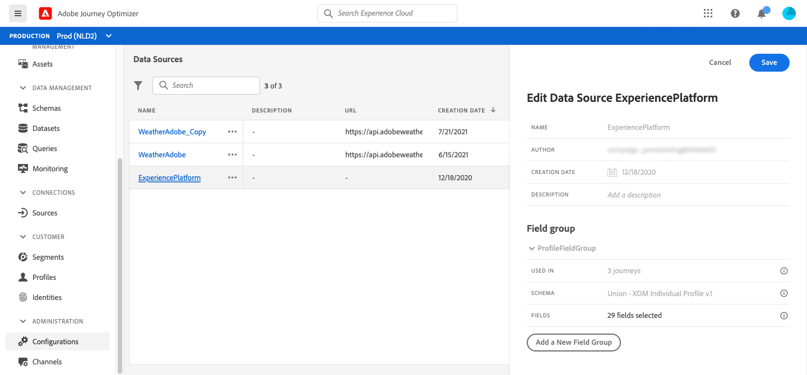

# Datakällan i Adobe Experience Platform {#concept_zrb_nqt_52b}

Adobe Experience Platform datakälla definierar anslutningen till kundprofiltjänsten i realtid. Den här datakällan är inbyggd och förkonfigurerad. Den kan inte tas bort. Den här datakällan är utformad för att hämta och använda data från kundprofiltjänsten i realtid (kontrollera t.ex. om personen som gjorde en resa är kvinna). Ni kan använda profildata och Experience Events-data. Mer information om kundprofiltjänsten i realtid finns i [Adobe Experience Platform-dokumentation](https://experienceleague.adobe.com/docs/experience-platform/profile/home.html){target=&quot;_blank&quot;}.

>[!NOTE]
>
>Du kan hämta de 1 000 senaste upplevelsehändelserna som skapades för mindre än ett år sedan.

För att tillåta anslutningen till kundprofiltjänsten i realtid måste vi använda en nyckel för att identifiera en person och ett namnutrymme som kontextualiserar nyckeln. Därför kan du bara använda den här datakällan om dina resor börjar med en händelse som innehåller en nyckel och ett namnutrymme. Läs [den här sidan](../building-journeys/journey.md).

Du kan redigera den förkonfigurerade fältgruppen med namnet &quot;ProfileFieldGroup&quot;, lägga till nya och ta bort de som inte används i utkast- eller direktresor. Läs [den här sidan](../datasource/configure-data-sources.md#define-field-groups).

Här är de viktigaste stegen för att lägga till fältgrupper i den inbyggda datakällan.

1. Välj den inbyggda Adobe Experience Platform-datakällan i listan över datakällor.

   Detta öppnar konfigurationsfönstret för datakällan till höger på skärmen.

   

1. Klicka på **[!UICONTROL Add a New Field Group]** för att definiera en ny serie med fält som ska hämtas. Läs [den här sidan](../datasource/configure-data-sources.md#define-field-groups).

   

1. Välj ett schema i listrutan **[!UICONTROL Schema]**. I det här fältet visas profilscheman och Experience Events-scheman som är tillgängliga i Adobe Experience Platform. Schemat skapas inte i [!DNL Journey Optimizer]. Det genomförs i Adobe Experience Platform.
1. Markera de fält som du vill använda.
1. Definiera cachens varaktighet.
1. Klicka på **[!UICONTROL Save]**.

När du placerar markören på namnet på en fältgrupp visas två ikoner till höger. De gör att du kan ta bort och duplicera fältgruppen. Observera att ikonen **[!UICONTROL Delete]** bara är tillgänglig om fältgruppen inte används i någon direktresa eller utkastresa (information visas i fältet **[!UICONTROL Used in]**).
