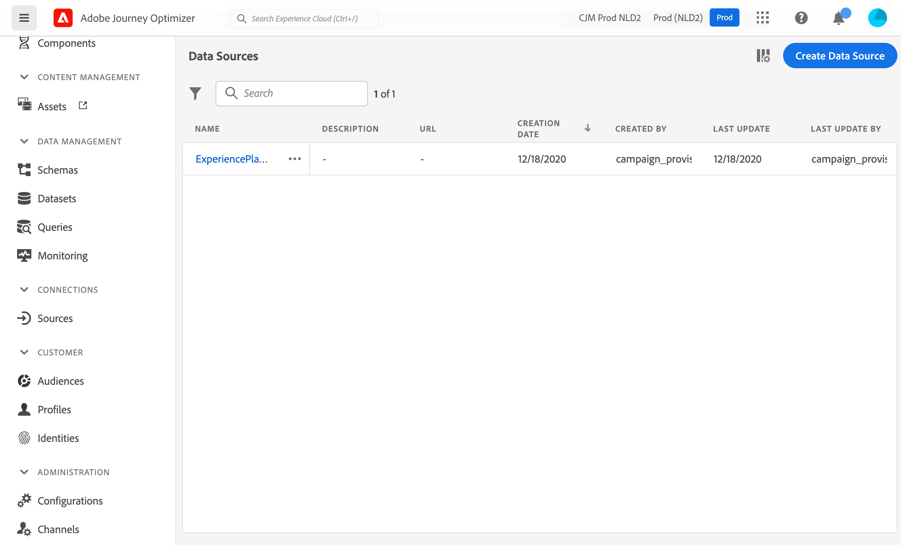
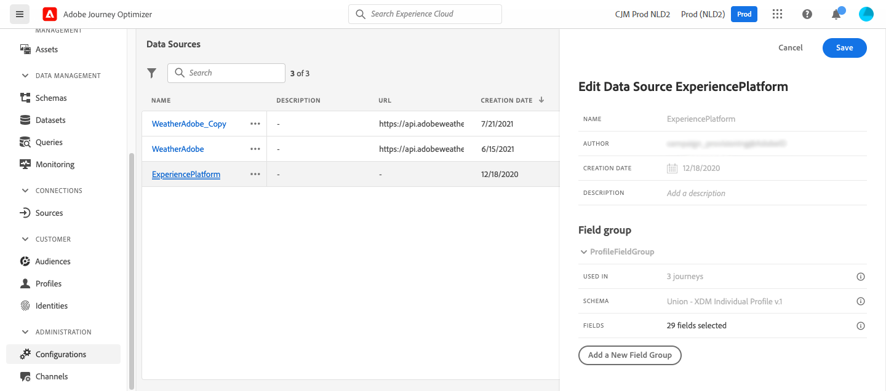

# Konfigurera en datakälla {#configure-data-source}

>[!NOTE]
>
>Datakällans konfiguration utförs alltid av en **teknisk användare**.

Så här konfigurerar du en datakälla:

1. Välj **[!UICONTROL Configurations]** på menyn Administration. Klicka på **[!UICONTROL Data Sources]** i avsnittet **[!UICONTROL Manage]**. Listan med datakällor visas. Mer information om gränssnittet finns på [den här sidan](../start/user-interface.md).

   

1. Sedan kan du antingen lägga till fältgrupper i den inbyggda datakällan (se [den här sidan](../datasource/adobe-experience-platform-data-source.md)) eller skapa en ny extern datakälla (se [den här sidan](../datasource/external-data-sources.md)) och associerade fältgrupper (se [den här sidan](../datasource/configure-data-sources.md#define-field-groups)).

   

1. Klicka på **[!UICONTROL Save]**.

   Datakällan är nu konfigurerad och redo att användas i resorna.

## Definiera fältgrupper {#define-field-groups}

Fältgrupper är uppsättningar fält som du kan hämta från en datakälla och använda under en resa.

För varje datakälla kan du definiera flera fältgrupper.

Du kan till exempel skapa en fältgrupp med telefonnummer, e-post, förnamn och adress för profilen. Sedan kan ni använda dessa data under resan för att skapa villkor. Du kan till exempel välja att bara skicka ett push-meddelande om kunden har installerat mobilappen. Om den är tom kan du skicka ett e-postmeddelande.

Även om ett standardnamn läggs till automatiskt rekommenderar vi att du ger fältgruppen ett namn. Fältgruppnamnet visas för andra användare i [!DNL Journey Optimizer]. Att ge fältgrupper ett relevant namn är en god vana.

När ett datakällfält används i en resa hämtas alla fält som är definierade för den fältgruppen. Därför är det bäst att bara välja de fält som du behöver för dina resor. Detta minskar svarstiden för förfrågningar i dina resor och därmed ökar prestandan. Observera att du enkelt kan lägga till fler fält i fältgrupper senare.

Antalet resor som använder en fältgrupp visas i fältet **[!UICONTROL Used in]**. Du kan klicka på knappen **[!UICONTROL View journeys]** om du vill visa listan över resor som använder den här fältgruppen.

>[!NOTE]
>
>Observera att om en fältgrupp inte har något fält visas den inte i uttrycksredigeraren.

## Livscykel för fältgrupp {#field-group-lifecycle}

Du kan lägga till eller ta bort fält från en fältgrupp som inte används i ett utkast eller en direktresa.

Om fältgruppen används i ett eller flera utkast- eller direktresor kan du stegvis lägga till nya fält från det valda schemat, men du kan inte avmarkera/ta bort/ändra fält som redan har markerats. Uppdateringar till en fältgrupp tillåts inte om befintliga schemafält som redan används av utkast- eller direktresor ändras, till exempel ändring av datatypen för ett fält. På så sätt undviks att resorna bryts

Följ de här stegen för att ta bort ett fält från en fältgrupp som används i en eller flera resor. Låt oss använda ett exempel på en fältgrupp med namnet&quot;Fältgrupp A&quot;.

1. Placera markören på Fältgrupp A i listan över fältgrupper och klicka på ikonen **[!UICONTROL Duplicate]** till höger. Ge t.ex. den duplicerade fältgruppen namnet Fältgrupp B.
1. I Fältgrupp B tar du bort de fält som du inte längre vill använda.
1. I Fältgrupp A ska du kontrollera var fältgruppen används. Den här informationen visas i fältet **[!UICONTROL Used in]**.
1. Öppna alla resor som använder fältgrupp A.
1. Skapa nya versioner av var och en av dessa resor. Redigera alla aktiviteter med fältgrupp A och välj Fältgrupp B.
1. Stoppa gamla versioner av resor som använder fältgrupp A. Du ska då inte ha någon resa med fältgrupp A.
1. Ta bort fältgrupp A eftersom den inte längre används.
