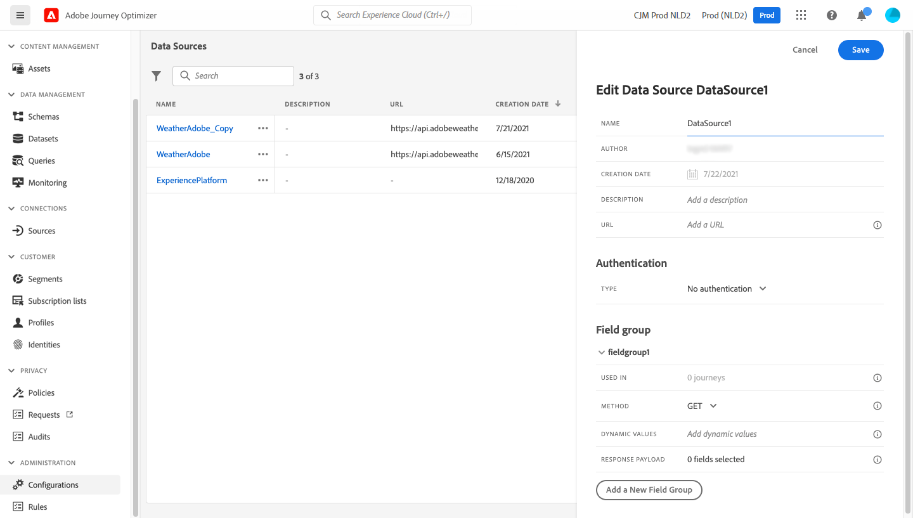
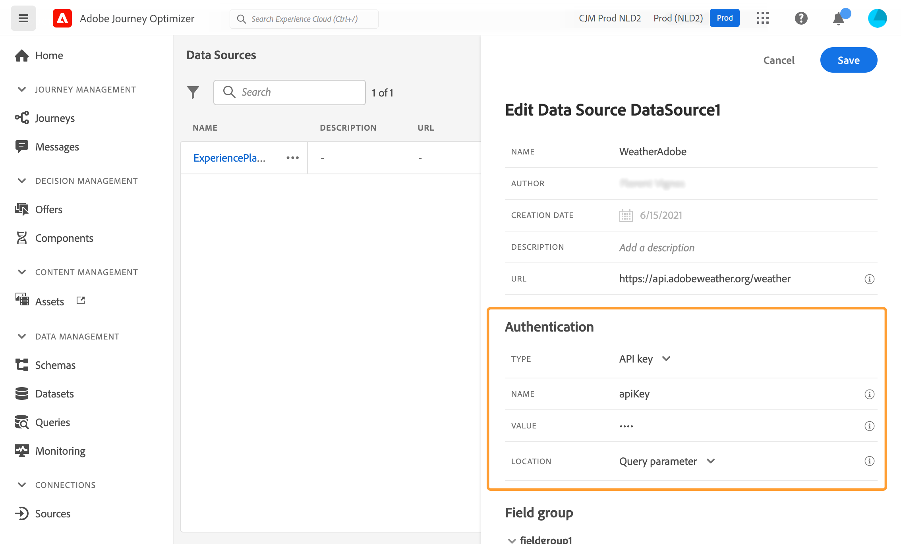

# Externa datakällor {#external-data-sources}

>[!CONTEXTUALHELP]
>id="ajo_journey_data_source_custom"
>title="Externa datakällor"
>abstract="Med externa datakällor kan du definiera en anslutning till tredjepartssystem, till exempel om du använder ett bokningssystem för hotell för att kontrollera om personen har registrerat ett rum. I motsats till den inbyggda Adobe Experience Platform-datakällan kan du skapa så många externa datakällor du behöver."

## Arbeta med externa datakällor {#gs-ext-data-sources}

Med externa datakällor kan du definiera en anslutning till tredjepartssystem, till exempel om du använder ett bokningssystem för hotell för att kontrollera om personen har registrerat ett rum. I motsats till den inbyggda Adobe Experience Platform-datakällan kan du skapa så många externa datakällor du behöver.

>[!NOTE]
>
>* Garantier visas på [den här sidan](../configuration/external-systems.md) när du arbetar med externa system.
>
>* Eftersom svaren nu stöds bör du använda anpassade åtgärder i stället för datakällor för externa datakällor som användningsfall. Mer information om svar finns i [avsnittet](../action/action-response.md)

Stöd finns för REST API:er som använder POST eller GET och returnerar JSON. API-nyckel samt grundläggande och anpassade autentiseringslägen stöds.

Låt oss använda en API-tjänst för väder som exempel. Jag vill använda den för att anpassa resans beteenden beroende på väderdata i realtid.

Här är två exempel på API-anropet:

* _https://api.adobeweather.org/weather?city=London,uk&amp;appid=1234_
* _https://api.adobeweather.org/weather?lat=35&amp;lon=139&amp;appid=1234_

Anropet består av en huvud-URL (_https://api.adobeweather.org/weather_), två parameteruppsättningar (&quot;city&quot; för staden och &quot;lat/long&quot; för latitud och longitud) och API-nyckeln (appid).

>[!TIP]
>
>Vi rekommenderar att du lämnar minst en buffert på en minut mellan det externa API:ts giltighetsperiod för token och din Journey Optimizer [`cacheDuration`-inställning ](#custom-authentication-access-token), särskilt under stora arbetsbelastningar, för att undvika avvikelser vid förfallodatum och 401 fel.

## Skapa och konfigurera en extern datakälla {#create-ext-data-sources}

Nedan beskrivs de viktigaste stegen för att skapa och konfigurera en ny extern datakälla:

1. Klicka på **[!UICONTROL Create Data Source]** i listan med datakällor för att skapa en ny extern datakälla.

   

   Detta öppnar konfigurationsfönstret för datakällan till höger på skärmen.

   

1. Ange ett namn för datakällan.

Endast alfanumeriska tecken och understreck tillåts. Maximala längden är 30 tecken.

1. Lägg till en beskrivning om datakällan. Det här steget är valfritt.
1. Lägg till den externa tjänstens URL. I vårt exempel: _https://api.adobeweather.org/weather_.

   >[!CAUTION]
   >
   >Vi rekommenderar starkt att HTTPS används av säkerhetsskäl. Observera också att vi inte tillåter användning av Adobe-adresser som inte är allmänt tillgängliga och användning av IP-adresser.

   

1. Konfigurera autentiseringen beroende på den externa tjänstkonfigurationen: **[!UICONTROL No authentication]**, **[!UICONTROL Basic]**, **[!UICONTROL Custom]** eller **[!UICONTROL API key]**.

   För det grundläggande autentiseringsläget måste du fylla i ett användarnamn och ett lösenord.

   >[!NOTE]
   >
   >* När autentiseringsanropet utförs läggs strängen `<username>:<password>`, som är kodad i base64, till i autentiseringshuvudet.
   >
   >* Adobe Journey Optimizer krypterar automatiskt hemligheter som definieras i anpassade åtgärder. Varje organisations krypteringsnycklar hanteras på ett säkert sätt i ett dedikerat valv som är kopplat till organisationen. När inloggningsuppgifter visas i gränssnittet maskeras de som standard för att förhindra oavsiktlig exponering.


   Mer information om det anpassade autentiseringsläget finns i [det här avsnittet](../datasource/external-data-sources.md#custom-authentication-mode). I vårt exempel väljer vi autentiseringsläget för API-nycklar enligt nedan:

   * **[!UICONTROL Type]**: &quot;API-nyckel&quot;
   * **[!UICONTROL Name]**: &quot;appid&quot; (det här är API-nyckelns parameternamn)
   * **[!UICONTROL Value]**: &quot;1234&quot; (det här är värdet på vår API-nyckel)
   * **[!UICONTROL Location]**: &quot;Frågeparameter&quot; (API-nyckeln finns i webbadressen)

     

1. Klicka på **[!UICONTROL Add a New Field Group]** för att lägga till en ny fältgrupp för varje API-parameteruppsättning. Endast alfanumeriska tecken och understreck tillåts i fältgruppsnamnet. Maximala längden är 30 tecken. I vårt exempel behöver vi skapa två fältgrupper. En för varje parameteruppsättning (&quot;city&quot; och &quot;long/lat&quot;).

För parameteruppsättningen &quot;long/lat&quot; skapar vi en fältgrupp med följande information:

* **[!UICONTROL Used in]**: visar antalet resor som använder en fältgrupp. Du kan klicka på ikonen **[!UICONTROL View journeys]** för att visa en lista över resor som använder den här fältgruppen.
* **[!UICONTROL Method]**: välj metoden POST eller GET. I vårt fall väljer vi metoden GET.
* **[!UICONTROL Dynamic Values]**: ange de olika parametrarna avgränsade med kommatecken – &quot;long,lat&quot; i vårt exempel. Eftersom parameterns värden är beroende av körningens sammanhang definieras de i resorna. [Läs mer](../building-journeys/expression/expressionadvanced.md)
* **[!UICONTROL Response Payload]**: klicka inuti fältet **[!UICONTROL Payload]** och klistra in ett exempel på nyttolasten som returneras av anropet. Vi har till exempel använt en nyttolast som finns på en API-webbplats för väder. Kontrollera att fälttyperna är korrekta. Varje gång API:et anropas hämtas alla fält som ingår i exemplets nyttolast. Observera att du kan klicka på **[!UICONTROL Paste a new payload]** för att ändra den nyttolast som för närvarande används.
* **[!UICONTROL Sent Payload]**: det här fältet visas inte i vårt exempel. Det är endast tillgängligt om du väljer metoden POST. Klistra in nyttolasten som ska skickas till tredjepartssystemet.

Om ett GET-anrop som kräver parametrar används ska du ange parametrarna i fältet **[!UICONTROL Dynamic Values]** och de läggs sedan till automatiskt i slutet av anropet. Om ett POST-anrop används måste du:

* lista de parametrar som ska skickas vid anropet i fältet **[!UICONTROL Dynamic Values]** (i exemplet nedan: &quot;identifier&quot;).
* även ange dem med exakt samma syntax i brödtexten i den skickade nyttolasten. Om du vill göra det måste du lägga till: &quot;param&quot;: &quot;name of your parameter&quot; (i exemplet nedan: &quot;identifier&quot;). Följ syntaxen nedan:

```json
{"id":{"param":"identifier"}}
```


När dina ändringar har sparats är datakällan konfigurerad och klar att användas i dina resor, till exempel under dina förhållanden eller för att anpassa ett e-postmeddelande. Om temperaturen är över 30 °C kan du välja att skicka ett visst meddelande.

## Anpassat autentiseringsläge {#custom-authentication-mode}

>[!CONTEXTUALHELP]
>id="jo_authentication_payload"
>title="Om anpassad autentisering"
>abstract="Det anpassade autentiseringsläget används vid komplex autentisering för att anropa API-omslutningsprotokoll som OAuth2. Körningen av åtgärden är en process i två steg. Först görs ett anrop till slutpunkten för att generera en åtkomsttoken. Denna åtkomsttoken injiceras sedan i åtgärdens HTTP-begäran."

Det anpassade autentiseringsläget används för komplex autentisering, som ofta används för att anropa API-omslutningsprotokoll som OAuth2, för att hämta en åtkomsttoken som ska injiceras i den faktiska HTTP-begäran för åtgärden.

När du konfigurerar den anpassade autentiseringen använder du knappen **[!UICONTROL Click to check the authentication]** för att kontrollera om den anpassade autentiseringsnyttolasten är korrekt konfigurerad.


När testet är klart blir knappen grön.


I det här autentiseringsläget är åtgärdskörningen en tvåstegsprocess:

1. Anropa slutpunkten för att generera en åtkomsttoken.
1. Anropa REST API:et genom att injicera åtkomsttoken på rätt sätt.


>[!NOTE]
>
>**Den här autentiseringen består av två delar.**

### Definition av slutpunkten som ska anropas för att generera åtkomsttoken{#custom-authentication-endpoint}

* `endpoint`: URL som ska användas för att generera slutpunkten
* HTTP-begärans metod på slutpunkten (`GET` eller `POST`)
* `headers`: nyckelvärdepar som ska injiceras som huvuden i det här anropet om det behövs
* `body`: beskriver brödtexten för anropet om metoden är POST. Vi stöder en begränsad brödstruktur, som definieras i bodyParams (key-value pairs). Brödtextens typ beskriver formatet och kodningen för brödtexten i anropet:
   * `form`: innebär att innehållstypen kommer att vara application/x-www-form-urlencoded (charset UTF-8) och nyckelvärdepar kommer att serialiseras som: key1=value1&amp;key2=value2&amp;...
   * `json`: innebär att innehållstypen blir application/json (charset UTF-8) och nyckelvärdepar kommer att serialiseras som ett json-objekt som är: _{ &quot;key1&quot;: &quot;value1&quot;, &quot;key2&quot;: &quot;value2&quot;, ...}_

### Definition av hur åtkomsttoken måste matas in i åtgärdens HTTP-begäran{#custom-authentication-access-token}

* **permissionType**: definierar hur den genererade åtkomsttoken måste injiceras i HTTP-anropet för åtgärden. Möjliga värden är:

   * `bearer`: anger att åtkomsttoken måste injiceras i auktoriseringshuvudet, till exempel: _Auktorisering: Bearer &lt;åtkomsttoken>_
   * `header`: anger att åtkomsttoken måste matas in som ett huvud, det rubriknamn som definieras av egenskapen `tokenTarget`. Om till exempel `tokenTarget` är `myHeader` kommer åtkomsttoken att matas in som en rubrik som: _myHeader: &lt;åtkomsttoken>_
   * `queryParam`: anger att åtkomsttoken måste matas in som queryParam, frågeparameternamnet som definieras av egenskapen tokenTarget. Om till exempel tokenTarget är myQueryParam blir webbadressen för åtgärdsanropet: _&lt;url>?myQueryParam=&lt;åtkomsttoken>_

* **tokenInResponse**: anger hur åtkomsttoken ska extraheras från autentiseringsanropet. Den här egenskapen kan vara:
   * `response`: anger att HTTP-svaret är åtkomsttoken
   * en väljare i en json (förutsatt att svaret är en json, stöder vi inte andra format som XML). Den här väljarens format är _json://&lt;sökväg till åtkomsttokens egenskap>_. Om svaret på anropet till exempel är: _{ &quot;access_token&quot;: &quot;theToken&quot;, &quot;timestamp&quot;: 12323445656 }_, kommer tokenInResponse att vara: _json: //access_token_

Autentiseringsformatet är:

```json
{
    "type": "customAuthorization",
    "endpoint": "<URL of the authentication endpoint>",
    "method": "<HTTP method to call the authentication endpoint, in 'GET' or 'POST'>",
    (optional) "headers": {
        "<header name>": "<header value>",
        ...
    },
    (optional, mandatory if method is 'POST') "body": {
        "bodyType": "<'form'or 'json'>,
        "bodyParams": {
            "param1": value1,
            ...
        }
    },
    "tokenInResponse": "<'response' or json selector in format 'json://<field path to access token>'",
    "cacheDuration": {
        (optional, mutually exclusive with 'duration') "expiryInResponse": "<json selector in format 'json://<field path to expiry>'",
        (optional, mutually exclusive with 'expiryInResponse') "duration": <integer value>,
        "timeUnit": "<unit in 'milliseconds', 'seconds', 'minutes', 'hours', 'days', 'months', 'years'>"
    },
    "authorizationType": "<value in 'bearer', 'header' or 'queryParam'>",
    (optional, mandatory if authorizationType is 'header' or 'queryParam') "tokenTarget": "<name of the header or queryParam if the authorizationType is 'header' or 'queryParam'>",
}
```

>[!NOTE]
>
>Encode64 är den enda funktionen som är tillgänglig i autentiseringsnyttolasten.

Du kan ändra cachevaraktigheten på en token för en anpassad autentiseringsdatakälla. Nedan visas ett exempel på en anpassad autentiseringsnyttolast. Cachevaraktigheten definieras i parametern `cacheDuration`. Den anger varaktigheten för den genererade token i cachen. Enheten kan vara millisekunder, sekunder, minuter, timmar, dagar, månader och år.

Här följer ett exempel på autentiseringstypen för innehavare:

```json
{
    "type": "customAuthorization",
    "endpoint": "https://<your_auth_endpoint>/epsilon/oauth2/access_token",
    "method": "POST",
    "headers": {
      "Authorization": "Basic EncodeBase64(<epsilon Client Id>:<epsilon Client Secret>)"
    },
    "body": {
      "bodyType": "form",
      "bodyParams": {
        "scope": "cn mail givenname uid employeeNumber",
        "grant_type": "password",
        "username": "<epsilon User Name>",
        "password": "<epsilon User Password>"
      }
    },
    "tokenInResponse": "json://access_token",
    "cacheDuration": {
      "duration": 5,
      "timeUnit": "minutes"
    },
  },
```

>[!NOTE]
>
>* Autentiseringstoken cachelagras per resa: om två resor använder samma anpassade åtgärd har varje resa en egen token cachelagrad. Denna token delas inte mellan dessa resor.
>
>* Cachens varaktighet hjälper till att undvika för många anrop till slutpunkterna för autentisering. Kvarhållande av autentiseringstoken cachelagras i tjänster, det finns ingen beständighet. Om en tjänst startas om börjar den med en ren cache. Cachevaraktigheten är som standard 1 timme. I den anpassade autentiseringsnyttolasten kan den anpassas genom att ange en annan kvarhållningstid.
>

Här är ett exempel på autentiseringstypen för sidhuvud:

```json
{
  "type": "customAuthorization",
  "endpoint": "https://myapidomain.com/v2/user/login",
  "method": "POST",
  "headers": {
    "x-retailer": "any value"
  },
  "body": {
    "bodyType": "form",
    "bodyParams": {
      "secret": "any value",
      "username": "any value"
    }
  },
  "tokenInResponse": "json://token",
  "cacheDuration": {
    "expiryInResponse": "json://expiryDuration",
    "timeUnit": "minutes"
  },
  "authorizationType": "header",
  "tokenTarget": "x-auth-token"
} 
```

Här är ett exempel på svaret på inloggnings-API-anropet:

```json
{
  "token": "xDIUssuYE9beucIE_TFOmpdheTqwzzISNKeysjeODSHUibdzN87S",
  "expiryDuration" : 5
}
```

>[!CAUTION]
>
>Observera att kapslade JSON-objekt (t.ex. underobjekt inom `bodyParams`) **stöds** när du konfigurerar anpassad autentisering för en anpassad åtgärd.