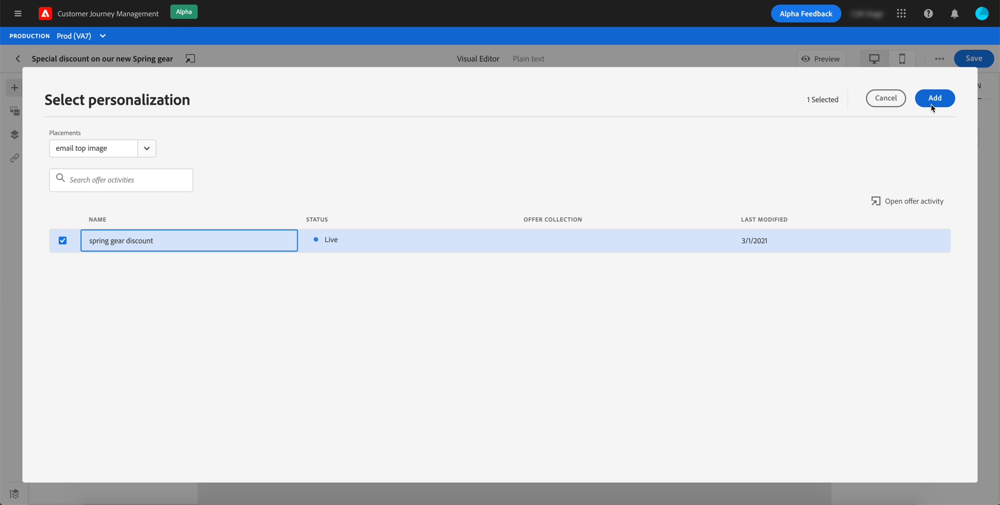
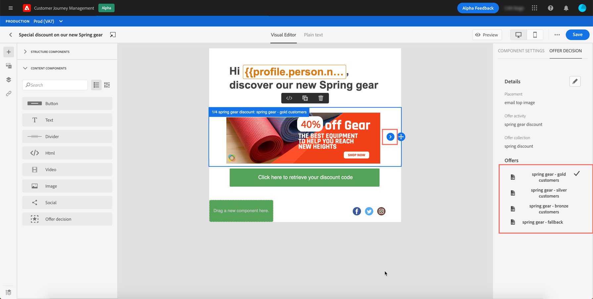
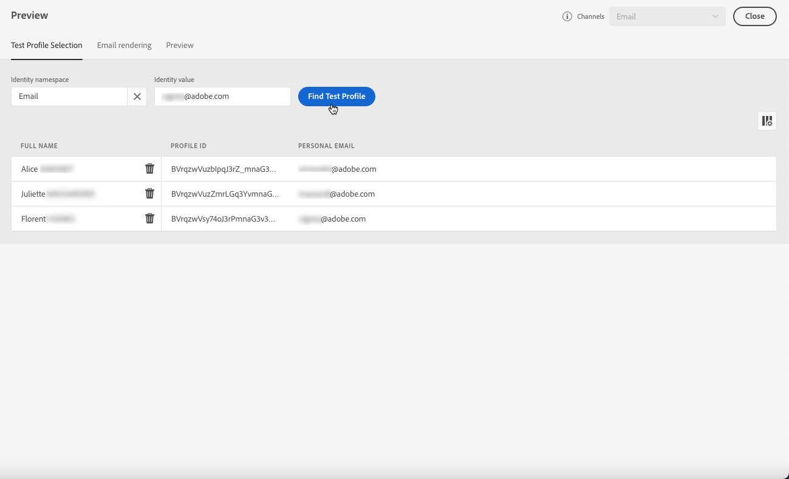

# Lägg till personaliserade erbjudanden {#deliver-personalized-offers}

I [!DNL Journey Optimizer]-e-postmeddelanden kan du infoga beslut (som tidigare kallats&quot;erbjudandeaktiviteter&quot;) som utnyttjar beslutsmotorn för erbjudanden för att välja det bästa erbjudandet som ska levereras till dina kunder.

Du kan t.ex. lägga till ett beslut som i ditt e-postmeddelande visas ett särskilt rabatterbjudande som varierar beroende på mottagarens lojalitetsnivå.

Mer information om hur du skapar och hanterar erbjudanden finns i [det här avsnittet](offers/get-started/starting-offer-decisioning.md).

Om du vill ha ett **fullständigt exempel** som visar hur du konfigurerar erbjudanden kan du använda dem i ett beslut och använda det här beslutet i ett e-postmeddelande kan du läsa [det här avsnittet](offers/offers-e2e.md#insert-decision-in-email).

➡️ [Lär dig hur du lägger till erbjudanden som personalisering i den här videon](#video-offers)

## Infoga ett beslut i ett e-postmeddelande {#insert-offers}

>[!CAUTION]
>
>Innan du börjar måste du [definiera ett erbjudandebeslut](offers/offer-activities/create-offer-activities.md).

Följ stegen nedan för att infoga ett beslut i ett e-postmeddelande:

1. Skapa e-postmeddelandet och öppna sedan e-postdesignern för att konfigurera innehållet.

1. Lägg till en **[!UICONTROL Offer decision]**-innehållskomponent.

   

   Lär dig hur du använder innehållskomponenter i [det här avsnittet](content-components.md).

1. Fliken **[!UICONTROL Offer decision]** visas på den högra paletten. Klicka på **[!UICONTROL Select Offer decision]**.

   

1. I det fönster som visas väljer du den placering som motsvarar de erbjudanden som du vill visa.

   [Placeringar ](offers/offer-library/creating-placements.md) är behållare som används för att visa upp dina erbjudanden. I det här exemplet använder vi placeringen&quot;e-post top image&quot;. Den här placeringen har skapats i erbjudandebiblioteket för att visa erbjudanden av bildtyp som ligger överst i meddelandena.

1. Välj den erbjudandeaktivitet som ska användas i innehållskomponenten och klicka sedan på **[!UICONTROL Add]**.

   >[!NOTE]
   >
   >Endast beslut som är kompatibla med den valda placeringen visas i listan. I det här exemplet matchar endast en erbjudandeaktivitet placeringen &quot;email top image&quot;.

   

Erbjudandeaktiviteten har nu lagts till i komponenten.

## Förhandsgranska erbjudanden via e-post {#preview-offers-in-email}

Du kan förhandsgranska de olika erbjudanden som ingår i det beslut som läggs till i e-postmeddelandet med hjälp av **[!UICONTROL Offers]**-avsnittet eller innehållskomponentpilarna.

Följ stegen nedan för att visa de olika erbjudanden som ingår i beslutet med en kundprofil.

1. Klicka på **[!UICONTROL Preview]**.

   

   >[!NOTE]
   >
   >Du måste ha testprofiler tillgängliga för att kunna förhandsgranska dina meddelanden. Lär dig hur du [skapar testprofiler](building-journeys/creating-test-profiles.md).

1. Välj det namnutrymme som ska användas för att identifiera testprofiler genom att välja **[!UICONTROL Email]** i fältet **[!UICONTROL Identity namespace]**.

   >[!NOTE]
   >
   >I det här exemplet använder vi namnutrymmet **Email**. Läs mer om Adobe Experience Platform identitetsnamnutrymmen [i det här avsnittet](get-started-identity.md).

1. Välj **[!UICONTROL Email]** i listan med identitetsnamnutrymmen och klicka på **[!UICONTROL Select]**.

1. I fältet **[!UICONTROL Identity value]** anger du värdet som ska identifiera testprofilen. I det här exemplet anger du e-postadressen för en testprofil.

   <!--For example enter smith@adobe.com and click the **[!UICONTROL Add profile]** button.-->

1. Lägg till andra profiler så att du kan testa olika varianter av meddelandet beroende på profildata.

   

1. Klicka på fliken **[!UICONTROL Preview]** för att testa meddelandet.

1. Välj en testprofil. Erbjudandet som motsvarar den valda profilen (en kvinna) visas.

   

1. Välj andra testprofiler om du vill förhandsgranska e-postinnehållet för varje variant av meddelandet. I meddelandeinnehållet visas nu erbjudandet som motsvarar den valda testprofilen (nu en man).

   

Läs mer om de detaljerade stegen för att kontrollera meddelandeförhandsgranskningen i [det här avsnittet](#preview-your-messages).

## Instruktionsvideo{#video-offers}

Lär dig hur du lägger till en offer decisioning i meddelanden i [!DNL Journey Optimizer].

>[!VIDEO](https://video.tv.adobe.com/v/334088?quality=12)
