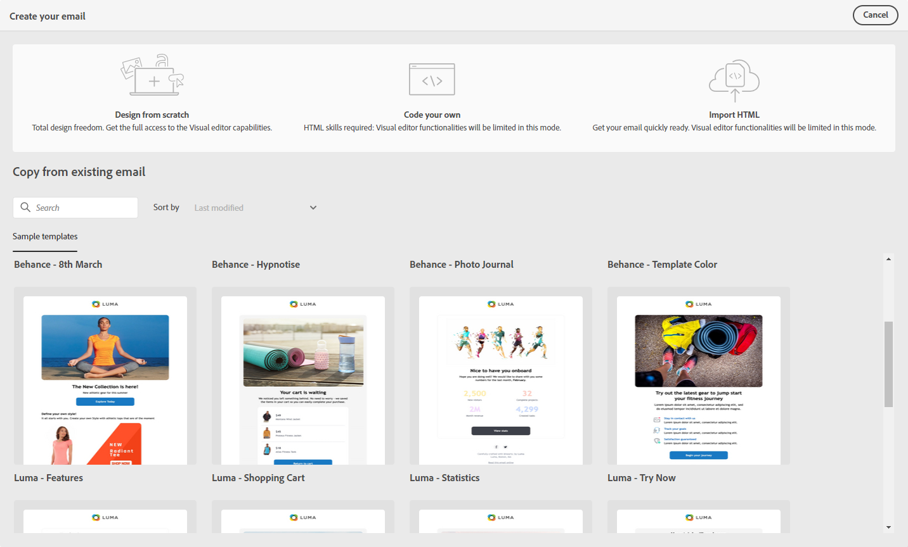

# Kom igång med e-postdesign {#get-started-content-design}

➡️ [Upptäck den här funktionen i en video](#video)

1. Välj **[!UICONTROL Email designer]** i **[!UICONTROL Body]** -avsnitt.

   

1. På hemsidan för e-postdesignern väljer du hur du vill utforma e-postmeddelandet bland följande alternativ:

   * **Designa din e-post från grunden** via e-postdesignerns gränssnitt och utnyttja bilder från [Adobe Experience Manager Assets Essentials](assets-essentials.md). Lär dig hur du utformar e-postinnehåll eller använder inbyggda mallar [i det här avsnittet](create-email-content.md).

   * **Kod eller klistra in Raw HTML** direkt i e-postdesignern. Lär dig koda eget innehåll [i det här avsnittet](code-content.md).

   * **Importera befintligt HTML-innehåll** från en fil eller en ZIP-mapp. Lär dig hur du importerar ett e-postinnehåll [i det här avsnittet](existing-content.md).

   

Alla dessa funktioner är tillgängliga när du öppnar e-postdesignern från meddelandefönstret. [Läs mer om att skapa meddelanden](../messages/get-started-content.md).

>[!NOTE]
>
>Observera att mallarna i det nedre området är statiska och inte kan redigeras. Dessa finns endast för illustrationsändamål.
>
>När du har [skapade ditt meddelande](../messages/get-started-content.md)kan du börja skapa ditt e-postinnehåll.

## Instruktionsvideo {#video}

Lär dig hur du skapar e-postinnehåll med meddelanderedigeraren.

>[!VIDEO](https://video.tv.adobe.com/v/334150?quality=12)