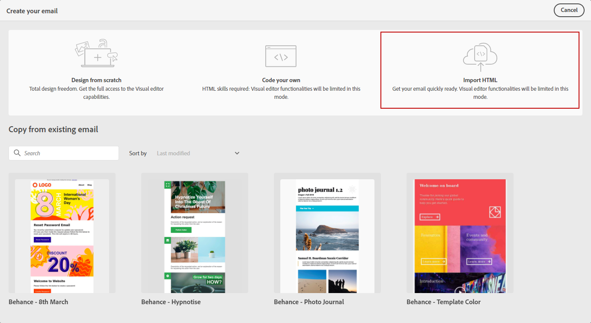

# Importera e-postinnehåll {#existing-content}

Med Journey Optimizer kan du importera befintligt HTML-innehåll för att utforma dina e-postmeddelanden. Innehållet kan vara:

* An **HTML-fil** med en infogad formatmall,
* A **ZIP-mapp** med HTML-filen, formatmallen (.css) och bilderna.

   >[!NOTE]
   >
   >ZIP-filstrukturen har inga begränsningar. Referenserna måste dock vara relativa och passa med trädstrukturen i ZIP-mappen.

Om du vill importera en fil som innehåller HTML-innehåll följer du stegen nedan:

1. På e-postdesignerns startsida väljer du **[!UICONTROL Import HTML]**.

   

1. Dra och släpp HTML- eller ZIP-filen med HTML.

1. När HTML-innehållet har överförts kan du använda e-postdesignerns funktioner för att redigera och förhandsgranska e-postmeddelandet. [Läs mer i det här avsnittet](create-email-content.md).

   

## Instruktionsvideo {#video}

Lär dig hur du importerar befintligt HTML-innehåll, ändrar designen, lägger till spegelsideslänkar och avbryter prenumerationen samt hur du kodar ditt innehåll.

>[!VIDEO](https://video.tv.adobe.com/v/334102?quality=12)
