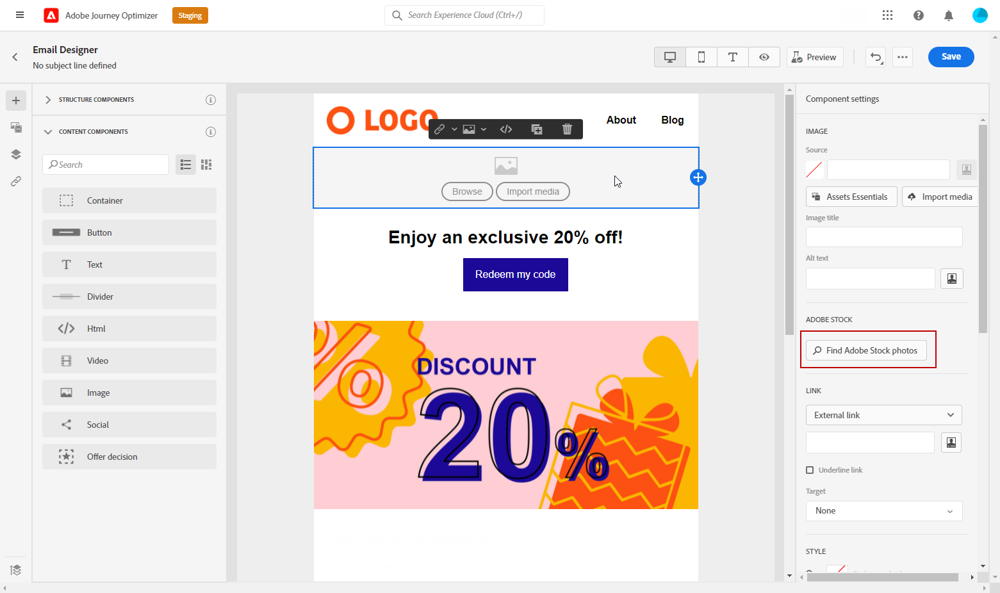

# Hantera [!DNL Adobe Stock] bilder {#stock}

## Kom igång med [!DNL Adobe Stock] {#get-started-stock}

[!DNL Adobe Stock] ger tillgång till miljontals utvalda och royaltyfria foton, videor, illustrationer och vektorbilder av hög kvalitet. Du kan välja att köpa ett kreditpaket för att licensiera mediefiler eller bara köpa en Standard- eller Extended-licens för den mediefil du behöver. Adobe Stock erbjuder också en kostnadsfri samling resurser.

Mer information om [!DNL Adobe Stock], se [Kom igång med Adobe Stock](https://helpx.adobe.com/stock/get-started.html).

Med [!DNL Adobe Journey Optimizer]kan du överföra bilder till e-postmeddelanden direkt från [!DNL Adobe Stock] och lägga till den i resursmappen. The **[!UICONTROL Find Similar Image]** hjälper dig att hitta bilder som matchar innehållet, färgen och kompositionen för resursen som används i leveransen.
[Läs mer om e-postdesign](design-emails.md).

## Infoga och importera [!DNL Adobe Stock] bilder {#add-stock-image}

>[!NOTE]
>
> The **[!UICONTROL Find Adobe Stock photos]** är endast tillgängligt för användare som har tillgång till en AEM Assets Essentials-produktprofil. Mer information finns i [Grundläggande dokumentation](https://experienceleague.adobe.com/docs/experience-manager-assets-essentials/help/get-started-admins/deploy-administer.html#add-users-to-essentials).

När du har redigerat och anpassat e-postmeddelandet kan du lägga till bilder från [!DNL Adobe Stock] till din mall:

1. Dra och släpp en bild **[!UICONTROL Content components]** till din e-postadress.

   

1. Från **[!UICONTROL Component settings]** meny, välja **[!UICONTROL Find Adobe Stock photos]**.

   

1. Bläddra i biblioteket eller ange söktermen i fältet. Markera den valda bilden och klicka på **[!UICONTROL Save]**.

   

1. Om du vill licensiera och hämta din bild väljer du din image **[!UICONTROL Content components]** och klicka **[!UICONTROL License Adobe Stock image]**. Du omdirigeras till [!DNL Adobe Stock] webbplats.

   >[!NOTE]
   > Om din bild redan är licensierad visas den av  ikon. I så fall kan du gå vidare till steg 7.

   

1. Från [!DNL Adobe Stock] måste du köpa resursen för att kunna hämta bilden och ta bort vattenstämpeln.

   Köpet beror på din Adobe Stock-plan eller prenumeration. Observera att om du har flera Adobe Stock-konton kommer du att omdirigeras till det senast använda Stock ID:t. I så fall måste du se till att du är inloggad på rätt konto innan du licensierar resursen.
Se denna [sida](https://stock.adobe.com/plans) för mer information om detta.

   >[!WARNING]
   > Om ett e-postmeddelande med en olicensierad bild skickas behåller bilden sin olicensierade form med vattenstämpeln.

   

1. När köpet är klart kan du gå tillbaka till e-postmeddelandet i [!DNL Adobe Journey Optimizer] och markera **[!UICONTROL Import stock image]** för att importera din licensierade bild till dina resurser.

   

1. Välj i vilken mapp resursen ska lagras. Mer information om [!DNL Assets Essentials], se [page](assets-essentials.md#get-started-assets-essentials).

   

1. När du har valt bilden från [!DNL Adobe Stock], använder du **[!UICONTROL Find similar Stock photos]** för att hitta resurser som matchar innehållet, färgen och kompositionen i en bild.

   Observera att det här alternativet är tillgängligt för licensierade/ej licensierade Stock-bilder och bilder från din resursmapp.

   

1. Anpassa bilden ytterligare med **[!UICONTROL Components settings]** -menyn. [Läs mer om komponentinställningar](content-components.md)

   

När ditt meddelande har skapats och anpassats kan du publicera det så att det blir tillgängligt för exekvering. [Läs mer](../messages/publish-manage-message.md)
