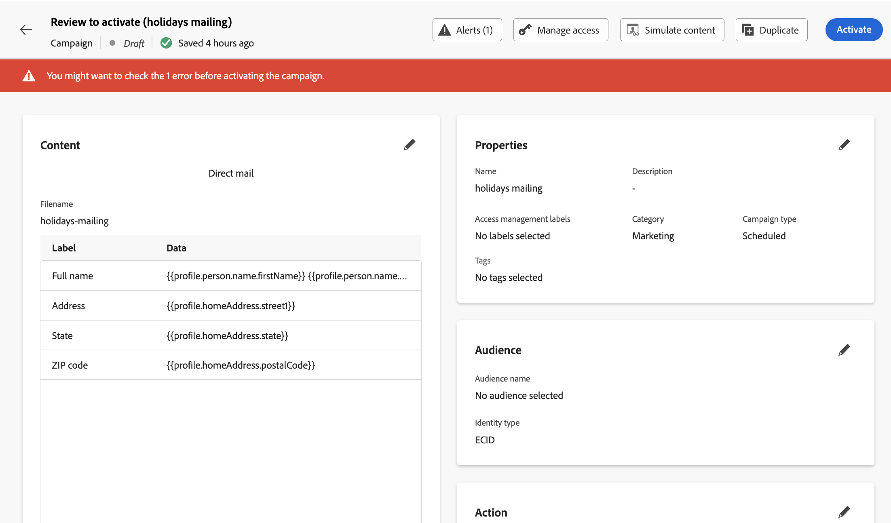

# Testa och skicka ett direktmejl {#direct-mail-test-send}

## Förhandsgranska extraheringsfilen {#preview-dm}

När innehållet i extraheringsfilen har definierats kan du använda testprofiler för att förhandsgranska det. Om du har infogat anpassat innehåll kan du kontrollera hur det här innehållet visas i meddelandet med hjälp av testprofildata.

1. På konfigurationsskärmen för extraheringsfilinnehåll klickar du på **[!UICONTROL Simulate content]**.

   {width="800" align="center"}

1. Klicka **[!UICONTROL Manage test profiles]** för att lägga till en testprofil.

1. Hitta din testprofil med **[!UICONTROL Identity namespace]** och **[!UICONTROL Identity value]** fält. Klicka sedan på **[!UICONTROL Add profile]**.

   {width="800" align="center"}

1. När du har valt din testprofil kan du stänga **[!UICONTROL Add test profile]** -fönstret.

1. Från **Förhandsgranska och testa** testprofildata läggs till i extraheringsfilens innehåll så att du kan förhandsgranska hur filen kommer att återges.

   {width="800" align="center"}

När filinnehållet är klart att skickas stänger du simuleringsskärmen och klickar sedan på **[!UICONTROL Review to activate]** -knappen.

## Validera och aktivera direktreklamkampanjen {#dm-validate}

Kontrollera att kampanjen och extraheringsfilen är korrekt konfigurerade innan du aktiverar kampanjen för direktreklam. Om du vill göra det kontrollerar du varningarna i den övre delen av redigeraren. Vissa av dem är enkla varningar, men andra kan hindra dig från att skicka meddelandet. Två typer av varningar kan inträffa: varningar och fel.

* **Varningar** hänvisa till rekommendationer och bästa praxis. Ett varningsmeddelande visas till exempel om SMS-meddelandet är tomt.

* **Fel** hindra er från att publicera kampanjen, så länge de inte är lösta. Ett felmeddelande varnar dig till exempel när ämnesraden saknas.

{width="800" align="center"}

Klicka på knappen **[!UICONTROL Activate]** -knappen. När kampanjen startar genereras extraheringsfilen automatiskt och exporteras till den server som anges i [konfiguration för filroutning](../direct-mail/direct-mail-configuration.md).

När ni har skickat det kan ni mäta effekten av er direktreklamkampanj i Campaign-rapporterna. Mer information om rapportering finns i det här avsnittet.
