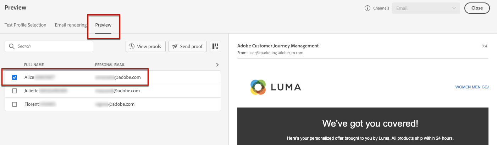

# Lägg in skräddarsydda erbjudanden {#deliver-personalized-offers}

I [!DNL Journey Optimizer] e-postmeddelanden kan du infoga beslut som utnyttjar beslutsmotorn för att välja det bästa erbjudandet som ska levereras till dina kunder.

Du kan t.ex. lägga till ett beslut som i ditt e-postmeddelande visas ett särskilt rabatterbjudande som varierar beroende på mottagarens lojalitetsnivå.

>[!IMPORTANT]
>
>Om ett beslut om erbjudande som används i ett kundmeddelande ändras måste du avpublicera resan och publicera den på nytt.  På så sätt säkerställs att ändringarna införlivas i kundens budskap och att meddelandet överensstämmer med de senaste uppdateringarna.

* Mer information om hur du skapar och hanterar erbjudanden finns i [det här avsnittet](../offers/get-started/starting-offer-decisioning.md).
* Om du vill ha ett **fullständigt exempel från början till slut** som visar hur du konfigurerar erbjudanden kan du använda dem i ett beslut och använda det här beslutet i ett e-postmeddelande, gå till [det här avsnittet](../offers/offers-e2e.md#insert-decision-in-email).

➡️ [Lär dig hur du lägger till erbjudanden som personalisering i den här videon](#video-offers)

## Infoga ett beslut i ett e-postmeddelande {#insert-offers}

>[!CAUTION]
>
>Innan du börjar måste du [definiera ett erbjudandebeslut](../offers/offer-activities/create-offer-activities.md).

Följ stegen nedan för att infoga ett beslut i ett e-postmeddelande:

1. Skapa e-postmeddelandet och öppna sedan e-post-Designer för att konfigurera innehållet.

1. Lägg till en **[!UICONTROL Offer decision]**-innehållskomponent.

   

   Lär dig hur du använder innehållskomponenter i [det här avsnittet](content-components.md).

1. Fliken **[!UICONTROL Offer decision]** visas på den högra paletten. Klicka på **[!UICONTROL Select Offer decision]**:

   1. I det fönster som visas väljer du den placering som motsvarar de erbjudanden som du vill visa.

      [Placeringar](../offers/offer-library/creating-placements.md) är behållare som används för att visa upp dina erbjudanden. I det här exemplet använder vi placeringen&quot;e-post top image&quot;. Den här placeringen har skapats i erbjudandebiblioteket för att visa erbjudanden av bildtyp som ligger överst i meddelandena.

   1. Beslut som matchar den valda placeringsvisningen. Välj vilket beslut som ska användas i innehållskomponenten och klicka sedan på **[!UICONTROL Add]**.

      >[!NOTE]
      >
      >Endast beslut som är kompatibla med den valda placeringen visas i listan. I det här exemplet matchar endast en erbjudandeaktivitet placeringen &quot;email top image&quot;.

      

Beslutet läggs nu till i komponenten. När du har sparat dina ändringar kan erbjudandena visas för de relevanta profilerna när du skickar meddelandet som en del av en resa.

>[!NOTE]
>
>När du uppdaterar ett erbjudande, ett reserverbjudande, en erbjudandesamling eller ett erbjudandebeslut som refereras direkt eller indirekt i ett meddelande, visas uppdateringarna automatiskt i motsvarande meddelande.

## Förhandsgranska erbjudanden i ett e-postmeddelande {#preview-offers-in-email}

Du kan förhandsgranska de olika erbjudanden som ingår i det beslut som lagts till i e-postmeddelandet med hjälp av **[!UICONTROL Offer]**-avsnittet eller innehållskomponentpilarna.

Följ stegen nedan för att visa de olika erbjudanden som ingår i beslutet med en kundprofil.

1. Välj de testprofiler som ska användas för att förhandsgranska erbjudandet:

   1. Klicka på knappen **[!UICONTROL Simulate Content button]** och välj sedan det namnutrymme som ska användas för att identifiera testprofiler från fältet **[!UICONTROL Identity namespace]**.

      >[!NOTE]
      >
      >I det här exemplet använder vi namnutrymmet **Email**. Läs mer om Adobe Experience Platform identitetsnamnutrymmen [i det här avsnittet](../audience/get-started-identity.md).

   1. I fältet **[!UICONTROL Identity value]** anger du värdet för att identifiera testprofilen. I det här exemplet anger du e-postadressen för en testprofil.

   <!--For example enter smith@adobe.com and click the **[!UICONTROL Add profile]** button.-->

   1. Lägg till andra profiler så att du kan testa olika varianter av meddelandet beroende på profildata.

      

1. Klicka på fliken **[!UICONTROL Preview]** för att testa meddelandet och välj sedan en testprofil. Erbjudandet som motsvarar den valda profilen (en kvinna) visas.

   

   Du kan välja andra testprofiler om du vill förhandsgranska e-postinnehållet för varje variant av meddelandet. I meddelandeinnehållet visas nu erbjudandet som motsvarar den valda testprofilen (nu en man).

Läs mer om de detaljerade stegen för att kontrollera förhandsgranskning av meddelanden i [det här avsnittet](#preview-your-messages).

## Instruktionsvideo{#video-offers}

Lär dig hur du lägger till en beslutshanteringskomponent i meddelanden i [!DNL Journey Optimizer].

>[!VIDEO](https://video.tv.adobe.com/v/334088?quality=12)
