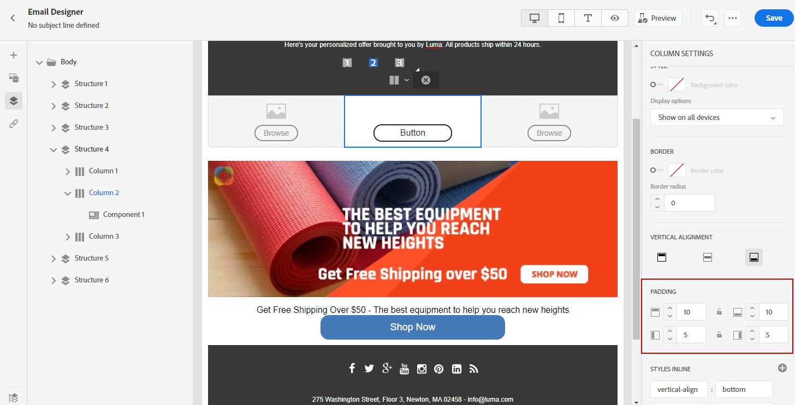

# Justera lodrät justering och utfyllnad {#alignment-and-padding}

I det här exemplet justerar vi utfyllnad och lodrät justering inuti en strukturkomponent som består av tre kolumner.

1. Markera strukturkomponenten direkt i e-postmeddelandet eller använd **[!UICONTROL Navigation tree]** som finns i den vänstra menyn.

1. Klicka på **[!UICONTROL Select a column]** i verktygsfältet och välj den som du vill redigera. Du kan också välja det i strukturträdet.

   De redigerbara parametrarna för den kolumnen visas på fliken **[!UICONTROL Styles]**.

   

1. Under **[!UICONTROL Alignment]** väljer du **[!UICONTROL Top]**, **[!UICONTROL Middle]** eller **[!UICONTROL Bottom]**.

   

1. Ange utfyllnaden för alla sidor under **[!UICONTROL Padding]**.

   Välj **[!UICONTROL Different padding for each side]** om du vill finjustera utfyllnaden. Klicka på låsikonen för att bryta synkroniseringen.

   

1. Gör på samma sätt om du vill justera justeringen och utfyllnaden för de andra kolumnerna.

1. Spara ändringarna.

>[!TIP]
>
>När du utformar e-postinnehåll för Gmail på Android-enheter måste du se till att kolumnutfyllnad används i stället för stora, fasta marginaler för bilder och delare. Gmail på Android återger ofta överdimensionerade bilder och marginaler felaktigt, vilket kan orsaka layoutspill eller reducerade avdelarlinjer. Använd en mindre bildbredd eller använd kolumnbaserad utfyllnad för enhetlig visning.
