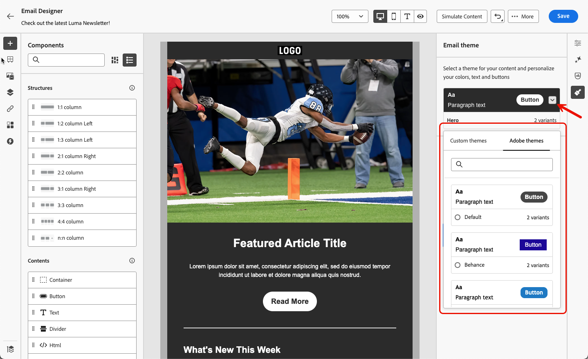

# Använd teman i ditt e-postinnehåll {#apply-email-themes}

>[!CONTEXTUALHELP]
>id="ajo_use_theme"
>title="Använd ett tema i e-postmeddelandet"
>abstract="Välj ett tema för e-postmeddelandet om du snabbt vill använda en viss stil som passar ert varumärke och er design."

>[!AVAILABILITY]
>
>Den här funktionen är begränsad. Kontakta din Adobe-representant för att få åtkomst.

Med teman kan icke-tekniska användare skapa återanvändbart innehåll som passar ett visst varumärke och designspråk genom att lägga till anpassad formatering ovanpå standardmallarna <!-- to achieve brand specific results-->.

Den här funktionen gör att marknadsförarna kan använda visuellt tilltalande, varumärkesenhetliga e-postmeddelanden snabbare och enklare, samtidigt som de erbjuder avancerade anpassningsalternativ för unika designbehov.

## Skyddsritningar och begränsningar {#themes-guardrails}

* När du skapar ett e-postmeddelande från grunden kan du välja att börja bygga ditt innehåll med ett tema för att snabbt tillämpa en specifik formatering som passar ert varumärke och er design.

  Om du väljer läget Manuell formatering kan du inte använda några teman om du inte återställer e-postmeddelandet.

* [Fragment](../content-management/fragments.md) är inte korskompatibla mellan lägena Använd teman och Manuell formatering.

   * Om du vill utnyttja ett [fragment](../content-management/fragments.md) i ett temainnehåll måste det här fragmentet ha skapats själv med teman. [Läs mer](#leverage-themes-fragment)

   * När du använder ett fragment i e-postinnehåll måste du se till att du använder ett tema som du har definierat för det här fragmentet. Om du inte gör det kan det orsaka visningsproblem, särskilt i Outlook 2021 och tidigare versioner. [Läs mer](#leverage-themes-fragment)

* Om du använder innehåll som har skapats i HTML är du i [kompatibilitetsläge](existing-content.md) och du kan inte använda teman direkt på det här innehållet.

   * Om du vill använda teman måste du först spara det importerade innehållet [&#x200B; som en ny mall](../content-management/create-content-templates.md#save-as-template) och sedan konvertera mallen till ett temakompatibelt innehåll. Du kan sedan använda den här mallen för att skapa ditt e-postinnehåll. Lär dig hur du konverterar en mall som har skapats med manuell formatering i [det här avsnittet](#theme-convertor).

   * Du kan även konvertera ditt importerade HTML-innehåll. [Läs mer](existing-content.md)

  <!--To fully leverage all the capabilities of the Email Designer, including themes, you must either create a new content in Use Themes mode, or convert your imported HTML content. [Learn more](existing-content.md)-->

<!--If you apply a theme to a content using a [fragment](../content-management/fragments.md) created with Manual Styling mode, the rendering may not be optimal.-->

## Skapa ett tema {#create-and-edit-themes}

Följ stegen nedan för att definiera ett tema som du kan använda i ditt framtida e-postinnehåll.

1. Skapa en ny [innehållsmall](../content-management/create-content-templates.md) för att komma igång.

1. Välj alternativet **[!UICONTROL Create or edit themes]**.

   

1. Välj ett Adobe-tema. I det här exemplet väljer du **[!UICONTROL Default theme]** och klickar på **[!UICONTROL Create]**.

   

1. Du kan också välja en anpassad mall på fliken **[!UICONTROL My themes]** och uppdatera den genom att klicka på **[!UICONTROL Edit]**.

   

1. Börja definiera ditt tema på fliken **[!UICONTROL General settings]** genom att ge det ett specifikt namn som passar ditt varumärke. Du kan justera standardbredden för visningsrutan för dina e-postmeddelanden och även exportera det aktuella temat för att [dela det över sandlådor](../configuration/copy-objects-to-sandbox.md).

   <!---->

1. Använd listen till höger för att navigera mellan de olika flikarna och uppdatera designinställningarna.

   

1. Från fliken **[!UICONTROL Colors]**:

   * Använd knappen **[!UICONTROL Edit]** för att konfigurera en **[!UICONTROL Color palette]** med standardfärger för ditt varumärke. Välj en **[!UICONTROL Preset]** om du snabbt vill skapa ett färgschema eller justera varje färg i temat individuellt. Du kan också använda en kombination av båda.

     

   * Klicka på **[!UICONTROL Add variant]** om du vill skapa flera färgvarianter, till exempel ljust och mörkt läge, där varje variant av temat har sina egna färgpaletter och nyanskontroller.

     

   * För varje variant klickar du på ikonen **[!UICONTROL Edit]** för att redigera ett enskilt element. Du kan använda standardpaletten som du har skapat eller andra anpassade färger.

     

1. I **[!UICONTROL Text settings]** kan du ange det globala teckensnitt som du vill använda för hela temat. Du kan också redigera varje rubrik- och stycketyp för att justera teckensnitt, storlek, format och så vidare.

   

1. På fliken **[!UICONTROL Spacing]** väljer du ett enskilt element i listan för att det ska vara tillräckligt stort mellan de olika komponenterna.

   <!---->

1. Med de andra flikarna till höger kan du hantera varje knappelement, avgränsare, extra bildformatering och mellanrum för stödrasterlayout separat för det här temat.

   

1. Klicka på **[!UICONTROL Save]** om du vill lagra det här temat för framtida bruk. Den visas nu på fliken **[!UICONTROL My themes]**.

<!--A little strange upon hitting Save, because once the theme is created, you need to hit Close to go back to Design your template screen, then click Cancel if you don't want to proceed with template creation.-->

## Använda teman i ett e-postinnehåll {#apply-themes-email}

Följ stegen nedan om du vill använda standardteman eller anpassade formatteman i en innehållsmall eller i ett e-postmeddelande.

1. I [!DNL Journey Optimizer] [lägger du till en e-poståtgärd](create-email.md) för en resa eller kampanj, eller skapar en [innehållsmall](../content-management/create-content-templates.md#create-template-from-scratch) för e-post och [redigerar e-posttexten](get-started-email-design.md#key-steps).

1. Du kan välja någon av följande åtgärder:

   * Välj en inbyggd [e-postmall](use-email-templates.md) för att öppna e-post-Designer. Ett standardtema som är specifikt för varje mall används automatiskt.

   * Designa ett [nytt innehåll från grunden](content-from-scratch.md) och välj **[!UICONTROL Use Themes]** för att börja med ett fördefinierat formattema.

     

     >[!CAUTION]
     >
     >Om du väljer läget Manuell formatering kan du inte använda några teman om du inte återställer designen.
     >
     >Om du vill utnyttja ett [fragment](../content-management/fragments.md) i ett temainnehåll måste det här fragmentet ha skapats själv med teman. [Läs mer](#leverage-themes-fragment)

1. Klicka på knappen **[!UICONTROL Themes]** till höger i e-post-Designer. Standardtemat eller mallens tema visas. Du kan växla mellan de två färgvarianterna för det här temat.

   

1. Klicka på pilen bredvid det tema som används för närvarande. Listan med tillgängliga anpassade teman och Adobe-teman visas.

   

1. Klicka på **[!UICONTROL My themes]** och välj ett tema som du har skapat.

   

1. Klicka utanför listrutan. Det nya anpassade temat använder automatiskt sina format på alla e-postkomponenter. Du kan växla mellan färgvarianterna om det finns några.

1. När du har valt ett tema i en innehållsmall kan du uppdatera det genom att klicka på knappen **[!UICONTROL Edit theme]**. [Läs mer](#create-and-edit-themes)

   {width="40%"}

   >[!NOTE]
   >
   >Det här alternativet är inte tillgängligt när du använder teman i e-postinnehåll.

1. Om du använder flera färgvarianter för att utnyttja ett tema kan du välja en specifik variant för en viss strukturkomponent. På så sätt kan du definiera en färgvariant för hela innehållet och använda en annan variant för bara en viss struktur.

   >[!NOTE]
   >
   >Du kan inte utföra den här åtgärden på innehållskomponenter.

   Om du vill göra det väljer du en strukturkomponent, klickar på **[!UICONTROL Use specific theme's variant option]** på fliken **[!UICONTROL Styles]** till höger och använder önskad variant på strukturen.

   

   I det här exemplet tillämpas den första färgvarianten i det aktuella temat på hela e-postinnehållet, men den tredje färgvarianten tillämpas på den valda strukturen. Du kan se att innehålls- och visningsrutans bakgrundsfärger för den specifika strukturen skiljer sig från resten av innehållet.

Du kan växla teman när som helst. E-postinnehållet ändras inte, men formaten uppdateras för att återspegla det nya temat.

### Låsa upp format {#unlocking-styles}

När en komponent är markerad kan du låsa upp dess stil med den dedikerade ikonen på fliken **[!UICONTROL Styles]**.

{width="90%"}

Det valda temat används fortfarande på den komponenten, men du kan åsidosätta dess formatelement. Om du ändrar teman tillämpas det nya temat bara på formatelement som inte åsidosatts.<!--can you revert this action?-->

Om du till exempel låser upp en textkomponent kan du ändra <!--the font size from 11 to 14 and -->teckenfärgen från svart till rött:

{width="80%" align="center" zoomable="yes"}

Om du ändrar teman <!--the font size is still 14 and -->är teckensnittsfärgen fortfarande röd för den komponenten, men bakgrundsfärgen för den här komponenten ändras med det nya temat:

{width="80%"}

## Använd teman i ett fragment {#leverage-themes-fragment}

Om du vill utnyttja ett fragment i en mall eller i ett e-postmeddelande med [teman tillämpade](#apply-themes-email) måste det här fragmentet ha skapats själv med teman. Annars kan du inte använda det här fragmentet i ditt temainnehåll.

Följ stegen nedan för att skapa ett fragment som är kompatibelt med teman.

1. I [!DNL Journey Optimizer] skapar du ett visuellt fragment och klickar på **[!UICONTROL Create]** för att utforma innehållet i fragmentet. [Lär dig hur](../content-management/create-fragments.md)

1. Välj **[!UICONTROL Use Themes]** om du vill börja med ett fördefinierat formattema.

   {width="100%"}

   >[!CAUTION]
   >
   >Om du väljer läget Manuell formatering kan du inte använda några teman om du inte återställer fragmentdesignen.

1. När du är i e-postversionen av Designer kan du börja skapa ditt fragment.

1. Klicka på knappen **[!UICONTROL Themes]** till höger. Standardtemat visas. Du kan växla mellan olika färgvarianter för det här temat.

   {width="100%" align="center" zoomable="yes"}

1. Du kan välja andra teman om du vill förhandsgranska fragmentinnehållet. Om du vill göra det markerar du pilen bredvid standardtemat och klickar på **[!UICONTROL Select themes]**.

   {width="40%"}

1. Du kan navigera mellan flikarna **[!UICONTROL Adobe themes]** och **[!UICONTROL My themes]** och välja upp till fem kompatibla teman (från båda flikarna) för fragmentet.

   {width=70%}

   >[!CAUTION]
   >
   >När du använder fragmentet i ett e-postinnehåll måste du [använda ett tema](#apply-themes-email) som du har definierat för det här fragmentet. Om du inte gör det kan det orsaka visningsproblem, särskilt i Outlook 2021 och tidigare versioner.

1. Klicka på **[!UICONTROL Close]**.

1. Välj pilen bredvid **[!UICONTROL Default theme]** igen. Du kan nu växla mellan de olika teman du just valt för att förhandsgranska varje stilåtergivning.

   {width=90%}

1. Klicka på **[!UICONTROL Select themes]** igen om du vill lägga till fler teman eller ändra urvalet.

## Gör en mall kompatibel med teman {#theme-convertor}

Med [!DNL Journey Optimizer] kan du konvertera en mall som har skapats med manuell formatering till ett temakompatibelt innehåll. Detta kan vara särskilt användbart om du har skapat innehållsmallar innan teman introducerades i [!DNL Journey Optimizer] eller om du importerar externt innehåll.

1. Öppna en [innehållsmall](../content-management/create-content-templates.md) för e-post och redigera innehållet med e-post-Designer.

1. Markera ikonen **[!UICONTROL Themes]** till höger och klicka på knappen **[!UICONTROL Generate theme from content]**.

   {width=100%}

1. Fönstret **[!UICONTROL Create a theme]** öppnas. [!DNL Journey Optimizer] identifierar automatiskt formatelement och konsoliderar dem till ett nytt tema.

   {width=90%}

1. Ge temat ett namn.

1. Gör egna justeringar efter behov, precis som när du skapar ett tema från början, som att lägga till en färgvariant, redigera teckensnitt osv. [Lär dig hur](#create-and-edit-themes)

   {width=90%}

1. Klicka på **[!UICONTROL Save]** om du vill lagra det nya temat för återanvändning. Du kan nu använda det här temat för ditt innehåll, till exempel andra teman. [Lär dig hur](#leverage-themes-fragment)