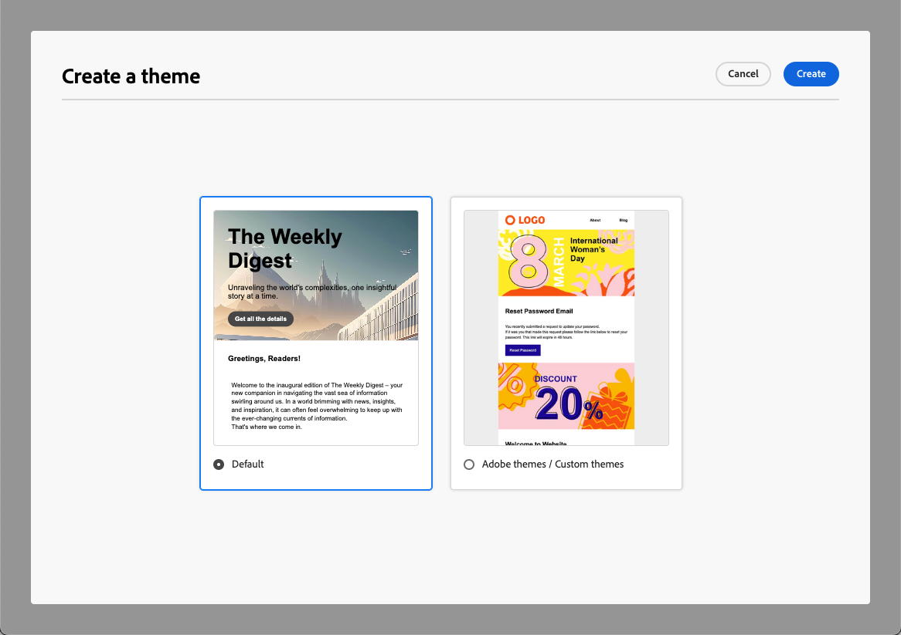

# Använd teman i ditt e-postinnehåll {#apply-email-themes}

>[!CONTEXTUALHELP]
>id="ajo_use_theme"
>title="Använd ett tema i e-postmeddelandet"
>abstract="Välj ett tema för e-postmeddelandet om du snabbt vill använda en viss stil som passar ert varumärke och er design."

<!--This documentation provides a comprehensive guide to using themes to streamline your email creation process. With the ability to define reusable themes and leverage pre-designed modules, marketers can create professional, brand-aligned emails faster and with less effort.-->

>[!AVAILABILITY]
>
>Funktionen finns för närvarande i betaversion och är endast tillgänglig för betatestare. Kontakta din Adobe-representant om du vill delta i betaprogrammet.

Med teman kan icke-tekniska användare skapa återanvändbart innehåll som passar ett visst varumärke och designspråk genom att lägga till anpassad formatering ovanpå standardmallarna <!-- to achieve brand specific results-->.

Den här funktionen gör att marknadsförarna kan använda visuellt tilltalande, varumärkesenhetliga e-postmeddelanden snabbare och enklare, samtidigt som de erbjuder avancerade anpassningsalternativ för unika designbehov.

<!--What is the Enhanced Email Authoring Experience?

This feature introduces two key components to simplify and enhance email creation:

* **Theme Management System**: A centralized system for creating, customizing, and applying reusable themes to emails. Themes ensure consistent styling across campaigns and eliminate the need for repetitive manual styling.

* **Modules**: Pre-designed, reusable content blocks that abstract common email elements (e.g., titles, descriptions, images, and links). Modules are built using customizable low-level components, offering flexibility while maintaining design standards.

Key Benefits:

- **Consistency**: Ensure all emails align with your brand's design guidelines.
- **Efficiency**: Save time by reusing themes and modules across campaigns.
- **Customization**: Add custom CSS and mobile-specific styles for advanced designs.
- **Scalability**: Eliminate repetitive styling tasks, enabling faster email creation.-->

## Skyddsritningar och begränsningar {#themes-guardrails}

* När du skapar ett e-postmeddelande från grunden kan du välja att börja bygga ditt innehåll med ett tema för att snabbt tillämpa en specifik formatering som passar ert varumärke och er design.

  Om du väljer läget Manuell formatering kan du inte använda några teman om du inte återställer e-postmeddelandet.

* [Fragment](../content-management/fragments.md) är inte korskompatibla mellan lägena Använd teman och Manuell formatering.

  Om du vill kunna använda ett fragment i ett innehåll där ett tema används, måste det här fragmentet skapas i läget Använd teman.

* Om du använder innehåll som skapats i HTML är du i [kompatibilitetsläge](existing-content.md) och du kan inte använda teman för det här innehållet.

  Om du vill utnyttja alla funktioner i e-post-Designer, inklusive teman, måste du antingen skapa ett nytt innehåll i läget Använd teman eller konvertera ditt importerade HTML-innehåll. [Läs mer](existing-content.md)

<!--If using a content created in Manual Styling mode or HTML, you cannot apply themes to this content. You must create a new content in Use Themes mode.

If you apply a theme to a content using a [fragment](../content-management/fragments.md) created in Manual Styling mode, the rendering may not be optimal.-->

## Skapa ett tema {#create-and-edit-themes}

Följ stegen nedan för att definiera ett tema som du kan använda i ditt framtida e-postinnehåll.

1. Skapa en ny [innehållsmall](../content-management/create-content-templates.md) för att komma igång.

1. Välj alternativet **[!UICONTROL Create or edit themes]**.

   

1. Du kan antingen välja standardtemat eller använda en Adobe-mall eller en anpassad mall. I det här exemplet väljer du standardtemat och klickar på **[!UICONTROL Create]**.

   

1. Börja att definiera ditt tema på fliken **[!UICONTROL General settings]** genom att ge det ett specifikt namn för ditt varumärke. Du kan justera standardbredden för dina e-postmeddelanden och även exportera det aktuella temat till [dela det över sandlådor](../configuration/copy-objects-to-sandbox.md).

   <!---->

1. Använd listen till höger för att navigera mellan de olika flikarna och uppdatera designinställningarna.

   

1. Från fliken **[!UICONTROL Colors]**:

   * Använd knappen **[!UICONTROL Edit]** för att konfigurera en **[!UICONTROL Color palette]** med standardfärger för ditt varumärke. Välj en **[!UICONTROL Preset]** om du snabbt vill skapa ett färgschema eller justera varje färg i temat individuellt. Du kan också använda en kombination av båda.

     

   * Klicka på **[!UICONTROL Add variant]** om du vill skapa flera färgvarianter, till exempel ljust och mörkt läge, där varje variant har sina egna färgpalett- och nyanskontroller.

     

   * Klicka på redigeringsikonen för varje variant för att redigera ett enskilt element. Du kan använda standardpaletten som du har skapat eller andra anpassade färger.

     

1. I **[!UICONTROL Text settings]** kan du ange det globala teckensnitt som du vill använda för hela temat. Du kan också redigera varje rubrik- och stycketyp för att justera teckensnitt, storlek, format och så vidare.

   

1. På fliken **[!UICONTROL Spacing]** väljer du ett enskilt element i listan för att det ska vara tillräckligt stort mellan de olika komponenterna.

   <!---->

1. Med de andra flikarna till höger kan du hantera varje knappelement, avgränsare, extra bildformatering och mellanrum för stödrasterlayout separat för det här temat.

   <!---->

1. Klicka på **[!UICONTROL Save]** om du vill lagra det här temat för framtida bruk.

## Använda teman i ett e-postmeddelande {#apply-themes}

Följ stegen nedan om du vill använda standardteman eller anpassade formatteman i ett e-postmeddelande.

1. I [!DNL Journey Optimizer] [lägger du till en e-poståtgärd &#x200B;](create-email.md) för en resa eller kampanj och [redigerar e-postbrödtexten](get-started-email-design.md#key-steps).

1. Du kan välja någon av följande åtgärder:

   * Välj en inbyggd [e-postmall](use-email-templates.md) för att öppna e-post-Designer. Ett standardtema som är specifikt för varje mall används automatiskt.

   * Designa ett [nytt innehåll från grunden](content-from-scratch.md) och välj **[!UICONTROL Use Theme]s** för att börja med ett fördefinierat formattema.

     

     >[!CAUTION]
     >
     >Om du väljer läget Manuell formatering kan du inte använda några teman om du inte återställer e-postmeddelandet.
     >
     >Om du vill använda ett [fragment](../content-management/fragments.md) i läget Använd teman måste det här fragmentet ha skapats själv i läget Använd teman.

1. Klicka på knappen **[!UICONTROL Themes]** till höger i e-post-Designer. Standardtemat eller mallens tema visas. Du kan växla mellan de två färgvarianterna för det här temat.

   

1. Klicka på pilen bredvid det tema som används för närvarande. Listan med tillgängliga anpassade teman och Adobe-teman visas.

   

1. Klicka på **[!UICONTROL Custom themes]** och välj det tema som du skapade.

   

1. Klicka utanför listrutan. Det nya anpassade temat använder automatiskt sina format på alla e-postkomponenter. Du kan växla mellan de två färgvarianterna.

1. När en komponent är markerad kan du fortfarande låsa upp dess stil med den dedikerade ikonen.

   

Du kan växla teman när som helst. E-postinnehållet ändras inte, men formaten uppdateras för att återspegla det nya temat.

<!--
>[!NOTE]
> - Themes apply styles globally. Ensure your theme is finalized before applying it to multiple emails.
> - Switching themes may override custom styles applied to individual components.

>[!CAUTION]
> - When using fragments, the email's theme will override the fragment's styles. A warning will be displayed in the editor if there is a conflict.

## Example Use Cases {#example-use-cases}

### 1. Creating a New Theme
- A marketer creates a theme with their brand's colors, fonts, and button styles.
- The theme is saved and reused across multiple email campaigns.

### 2. Switching Themes
- A marketer applies a holiday-themed design to an existing email by switching to a pre-designed holiday theme.-->
