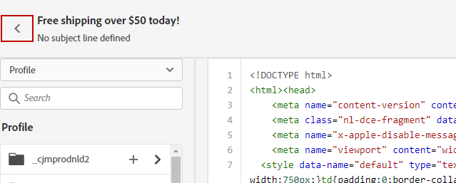

# Koda eget innehåll {#code-content}

Med **[!UICONTROL Code your own]** kan du skriva eller klistra in raw HTML för att skapa e-postinnehåll direkt i [!DNL Journey Optimizer] Email Designer. Använd det här läget när du behöver ha fullständig kontroll över markeringar eller när du importerar befintliga HTML.

Du måste ha kunskaper i HTML, och när du väl har valt det här läget kan du inte växla till den visuella redigeraren.

➡️ [Upptäck den här funktionen i en video](#video)

>[!NOTE]
>
>**[!UICONTROL Code your own]** är inte samma sak som den avancerade HTML-redigeraren i innehållsmallar. Med den avancerade HTML-redigeraren kan du växla mellan HTML-vyn och den visuella vyn (Skrivbord) när du vill - inte kodredigeraren. [Läs mer om den avancerade HTML-redigeraren](../content-management/email-template-expert-mode.md).

## Använda kodredigeraren {#use-code-editor}

Följ de här stegen för att skapa eller redigera e-postinnehåll med kodredigeraren.

1. På hemsidan [E-posta Designer](get-started-email-design.md) väljer du **[!UICONTROL Code your own]**.

   

1. Ange eller klistra in HTML-råkod.

1. Använd den vänstra rutan för att utnyttja [!DNL Journey Optimizer]-personaliseringsfunktioner. [Läs mer](../personalization/personalize.md)

   

   >[!NOTE]
   >
   >Personaliseringsredigeraren i e-postprogrammet Designer har vissa funktionsbegränsningar jämfört med reseuttryck. [Läs mer om begränsningar för datum/tid-funktioner](#date-time-limitations)

1. Om du vill ta bort ditt e-postinnehåll och starta e-postmeddelandet från en ny design väljer du **[!UICONTROL Change your design]** på Alternativ-menyn.

   

   >[!NOTE]
   >
   >Den här åtgärden öppnar den markerade mallen i e-post-Designer. Därifrån kan du antingen slutföra designen av ditt e-postmeddelande eller gå tillbaka till kodredigeraren med alternativet **[!UICONTROL Switch to code editor]**.

1. Klicka på knappen **[!UICONTROL Preview]** om du vill kontrollera meddelandets design och anpassning med testprofiler. [Läs mer](../content-management/preview-test.md)

   

1. När koden är klar klickar du på **[!UICONTROL Save]** och går sedan tillbaka till skärmen för att skapa meddelandet för att slutföra meddelandet.

   

>[!CAUTION]
>
>Det går inte att referera till bilder från [Adobe Experience Manager Assets](../integrations/assets.md) när du använder din egen kodmetod. Lagra bilder som refereras i din HTML-kod på en offentlig plats.

## Funktionsbegränsningar för datum och tid {#date-time-limitations}

När du använder personalisering i kodredigeraren för e-post-Designer är funktionen `now()` inte tillgänglig för dynamiska datumberäkningar.

>[!IMPORTANT]
>
>Funktionen `now()` stöds **inte** i e-postbyggarens uttrycksspråk. Även om `now()` är tillgängligt under resan kan den inte användas i e-postinnehåll eller kodredigeraren.

**Tillgängliga alternativ:**

Använd följande funktioner för att arbeta med aktuellt datum och aktuell tid i e-postpersonalisering:

* **`getCurrentZonedDateTime()`** - Returnerar aktuellt datum och aktuell tid med tidszonsinformation. Detta är det rekommenderade alternativet till `now()`.

  Exempel: `` returnerar `2024-12-06T17:22:02.281067+05:30[Asia/Kolkata]`

* **`currentTimeInMillis()`** - Returnerar aktuell tid i epok i millisekunder.

  Exempel: ``

**Rekommenderade tillfälliga lösningar:**

Om du behöver utföra datumberäkningar i ditt e-postinnehåll:

* **Förberäkna datumfält** - Beräkna obligatoriska datumvärden i din datariod eller profilattribut innan du skickar e-postmeddelandet och referera sedan till dessa förberäknade värden i din personalisering.

  Exempel: ``

* **Använd funktioner för datumändring** - Använd [datum-/tidsfunktioner](../personalization/functions/dates.md) som `dayOfYear()` eller `diffInDays()` med datumvärden från profilattribut.

  Exempel: ``

* **Använd beräknade attribut** - Skapa [beräknade attribut](../audience/computed-attributes.md) som utför komplexa datumberäkningar och gör resultaten tillgängliga som profilattribut.

En fullständig lista över funktioner som stöds finns i [Datum- och tidsfunktioner](../personalization/functions/dates.md).
