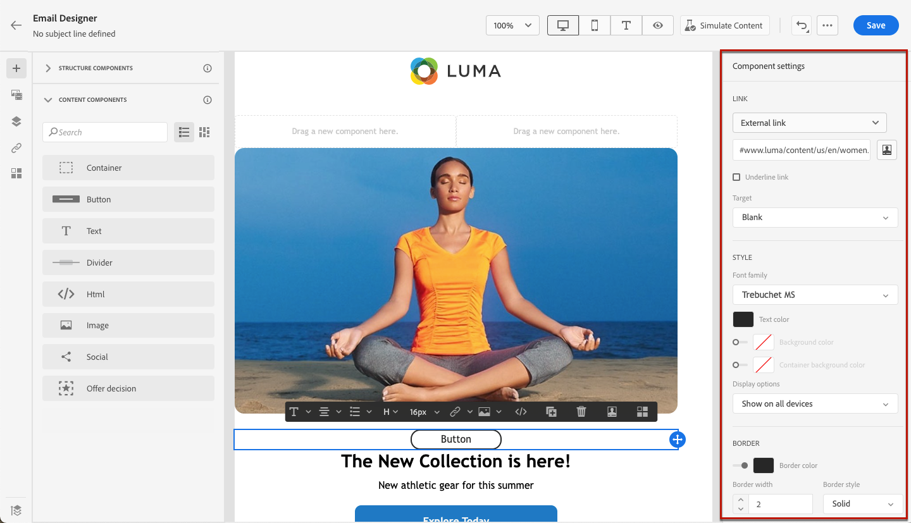

# Använda e-posta Designer-innehållskomponenter {#content-components}

>[!CONTEXTUALHELP]
>id="ac_content_components_email"
>title="Om Innehållskomponenter"
>abstract="Innehållskomponenterna är tomma platshållare för innehåll som du kan använda för att skapa layouten för ett e-postmeddelande."

>[!CONTEXTUALHELP]
>id="ac_content_components_landing_page"
>title="Om Innehållskomponenter"
>abstract="Innehållskomponenterna är tomma platshållare för innehåll som du kan använda för att skapa layouten för en landningssida."

>[!CONTEXTUALHELP]
>id="ac_content_components_fragment"
>title="Om Innehållskomponenter"
>abstract="Innehållskomponenter är tomma platshållare för innehåll som du kan använda för att skapa layouten för ett fragment."

>[!CONTEXTUALHELP]
>id="ac_content_components_template"
>title="Om Innehållskomponenter"
>abstract="Innehållskomponenter är tomma platshållare för innehåll som du kan använda för att skapa layouten för en mall."

När du skapar ditt e-postinnehåll kan du i **[!UICONTROL Content components]** anpassa din e-post ytterligare med raw-komponenter som du kan redigera när du väl har placerat i ett e-postmeddelande.

Du kan lägga till så många innehållskomponenter du behöver i en eller flera strukturkomponenter, som definierar layouten för e-postmeddelandet.

## Lägga till innehållskomponenter {#add-content-components}

Följ stegen nedan för att lägga till innehållskomponenter i e-postmeddelanden och anpassa dem efter dina behov.

1. Använd ett befintligt innehåll eller dra och släpp **[!UICONTROL Structure components]** i ditt tomma innehåll för att definiera layouten för e-postmeddelandet i e-postmeddelandet. [Lär dig hur](content-from-scratch.md)

1. Om du vill komma åt avsnittet **[!UICONTROL Content components]** väljer du motsvarande knapp i den vänstra rutan för e-post-Designer.

   

1. Dra och släpp de innehållskomponenter du vill ha inuti de relevanta strukturkomponenterna.

   

   >[!NOTE]
   >
   >Du kan lägga till flera komponenter i en enda strukturkomponent och i varje kolumn i en strukturkomponent.

1. Justera attribut och format för varje komponent med flikarna **[!UICONTROL Settings]** och **[!UICONTROL Style]** till höger. Du kan till exempel ändra textstil, utfyllnad eller marginal för varje komponent. [Läs mer om justering och utfyllnad](alignment-and-padding.md)

   

1. På den avancerade menyn i **[!UICONTROL Content component]** kan du enkelt ta bort eller duplicera innehållskomponenter efter behov.

   

## Behållare {#container}

Om du vill tillämpa en viss formatering på en grupp innehållskomponenter kan du lägga till en **[!UICONTROL Container]**-komponent och sedan lägga till den eller de innehållskomponenter som du vill använda. På så sätt kan du tillämpa ett distinkt format på behållaren, vilket skiljer sig från det format som tillämpas på innehållskomponenterna i behållaren.

Lägg till exempel till en **[!UICONTROL Container]**-komponent och lägg sedan till en [&#x200B; Button](#button) -komponent i den behållaren. Du kan använda en specifik bakgrund för behållaren och en annan för knappen.

## Knapp {#button}

Använd komponenten **[!UICONTROL Button]** för att infoga en eller flera knappar i e-postmeddelandet och dirigera om din e-postmålgrupp till en annan sida.

1. Dra och släpp **[!UICONTROL Button]**-komponenten från **[!UICONTROL Content components]** till en **[!UICONTROL Structure component]**.

1. Klicka på den nyligen tillagda knappen om du vill anpassa texten och få tillgång till flikarna **[!UICONTROL Settings]** och **[!UICONTROL Styles]** i den högra rutan E-posta Designer.

   

1. Lägg till den URL som du vill omdirigera till när du klickar på knappen på menyn **[!UICONTROL Link]**.

1. Välj hur målgruppen ska omdirigeras med den nedrullningsbara listan **[!UICONTROL Target]**:

   * **[!UICONTROL None]**: öppnar länken i samma ram som den klickades på (standard).
   * **[!UICONTROL Blank]**: öppnar länken i ett nytt fönster eller på en ny flik.
   * **[!UICONTROL Self]**: öppnar länken i samma ram som den klickades på.
   * **[!UICONTROL Parent]**: öppnar länken i den överordnade ramen.
   * **[!UICONTROL Top]**: öppnar länken i hela fönstrets brödtext.

   

1. Du kan anpassa knappen ytterligare genom att ändra formatattribut som **[!UICONTROL Border]**, **[!UICONTROL Size]**, **[!UICONTROL Margin]** osv. från rutan **[!UICONTROL Component settings]**.

## Text {#text}

Använd komponenten **[!UICONTROL Text]** för att infoga text i e-postmeddelandet och justera formatet (kantlinje, storlek, utfyllnad osv.) med fliken **[!UICONTROL Styles]**.

1. Dra och släpp **[!UICONTROL Text]**-komponenten från **[!UICONTROL Content components]** till en **[!UICONTROL Structure component]**.

1. Klicka på den nya komponenten som du har lagt till för att anpassa texten och för att få tillgång till flikarna **[!UICONTROL Settings]** och **[!UICONTROL Styles]** i den högra rutan i e-post-Designer.

1. Ändra texten med följande alternativ i verktygsfältet:

   

   * **[!UICONTROL Change text style]**: Använd fet, kursiv, understrykning eller genomstrykning i texten.
   * **Ändra justering**: välj mellan vänsterjustering, högerjustering, centrering eller marginaljustering för texten.
   * **[!UICONTROL Create list]**: lägg till punkt- eller nummerlista i texten.
   * **[!UICONTROL Set heading]**: lägg till upp till sex rubriknivåer i texten.
   * **Teckensnittsstorlek**: välj teckensnittsstorleken för texten i pixlar.
   * **[!UICONTROL Change font color]**: välj färg för teckensnittet.
   * **[!UICONTROL Insert link]**: lägg till alla typer av länkar i ditt innehåll.
   * **[!UICONTROL Edit image]**: lägg till en bild eller en resurs i textkomponenten. [Läs mer om resurshantering](../integrations/assets.md)
   * **[!UICONTROL Change font color]**: välj färg för teckensnittet.
   * **[!UICONTROL Add personalization]**: lägg till anpassningsfält för att anpassa innehållet från dina profildata. [Läs mer om innehållspersonalisering](../personalization/personalize.md)
   * **[!UICONTROL Show the source code]**: visa källkoden för texten. Den kan inte ändras.
   * **[!UICONTROL Enable conditional content]**: lägg till villkorligt innehåll för att anpassa komponentens innehåll till målprofilerna. [Läs mer om dynamiskt innehåll](../personalization/get-started-dynamic-content.md)
   * **[!UICONTROL Duplicate]**: lägg till en kopia av textkomponenten.
   * **[!UICONTROL Delete]**: ta bort den markerade textkomponenten från e-postmeddelandet.

1. Justera övriga formatattribut, t.ex. textfärg, teckensnittsfamilj, kantlinje, utfyllnad, marginal. från fliken **[!UICONTROL Styles]**.

   

## Delare {#divider}

Använd komponenten **[!UICONTROL Divider]** för att infoga en delningslinje för att ordna layouten och innehållet i ditt e-postmeddelande.

Du kan justera formatattribut som linjefärg, format och höjd på flikarna **[!UICONTROL Settings]** och **[!UICONTROL Styles]**.

## HTML {#HTML}

Använd komponenten **[!UICONTROL HTML]** för att kopiera och klistra in de olika delarna av din befintliga HTML. På så sätt kan du skapa kostnadsfria modulära HTML-komponenter för att återanvända externt innehåll.

1. Dra och släpp **[!UICONTROL HTML]**-komponenten från **[!UICONTROL Content Components]** till en **[!UICONTROL Structure component]**.

1. Klicka på den nya komponenten och välj sedan **[!UICONTROL Show the source code]** i det sammanhangsberoende verktygsfältet för att lägga till din HTML.

   

1. Kopiera och klistra in den HTML-kod som du vill lägga till i e-postmeddelandet och klicka på **[!UICONTROL Save]**.

   

>[!NOTE]
>
>Adobe rekommenderar att du skapar ett meddelande från grunden och kopierar innehållet från ditt befintliga e-postmeddelande till komponenter, så att du enkelt kan göra ett externt innehåll kompatibelt med e-postprogrammet Designer.

## Bild {#image}

Använd komponenten **[!UICONTROL Image]** för att infoga en bildfil från datorn i e-postinnehållet.

1. Dra och släpp **[!UICONTROL Image]**-komponenten från **[!UICONTROL Content components]** till en **[!UICONTROL Structure component]**.

   

1. Klicka på **[!UICONTROL Browse]** på fliken **[!UICONTROL Settings]** för att välja en bildfil från dina resurser eller på **[!UICONTROL Import media]** för att överföra en resurs till Adobe Experience Manager Assets.

   Mer information om [!DNL Adobe Experience Manager Assets] finns i [Adobe Experience Manager Assets-dokumentationen](https://experienceleague.adobe.com/docs/experience-manager-assets-essentials/help/introduction.html?lang=sv-SE){target="_blank"}.

   >[!NOTE]
   >
   > För att länkarna ska förbli aktiva och för att undvika problem med förfallodatum rekommenderar vi att du använder Adobe Assets istället för att förlita dig på en käll-URL för dina bilder.

1. Du kan även söka direkt i Adobe Stock med alternativet **[!UICONTROL Find Adobe Stock photos]**.

1. Klicka på den nya komponenten och ange bildegenskaper:

   * Med **[!UICONTROL Image title]** kan du definiera en titel för bilden.
   * Med **[!UICONTROL Alt text]** kan du definiera bildtexten som är länkad till bilden. Detta motsvarar alt-HTML-attributet.

   

1. Du kan också välja att **[!UICONTROL Find similar Stock photos]**. [Läs mer](../integrations/stock.md)

1. På fliken **[!UICONTROL Styles]** justerar du övriga formatattribut som marginal, kant osv. eller lägga till en länk för att dirigera om din målgrupp till ett annat innehåll från rutan **[!UICONTROL Component settings]**.

## Social {#social}

Använd komponenten **[!UICONTROL Social]** för att infoga länkar till sidor för sociala medier i ditt e-postinnehåll.

1. Dra och släpp **[!UICONTROL Social]**-komponenten från **[!UICONTROL Content Components]** till en **[!UICONTROL Structure component]**.

1. Markera den nya komponenten.

1. I fältet **[!UICONTROL Social]** på fliken **[!UICONTROL Settings]** väljer du vilka sociala medier du vill lägga till eller ta bort.

   

1. Välj storlek på ikonerna i det dedikerade fältet.

1. Klicka på var och en av dina ikoner för sociala medier för att konfigurera **[!UICONTROL URL]** som din målgrupp ska omdirigeras till.

   

1. Du kan också ändra ikonerna för vart och ett av dina sociala medier om det behövs från din Assets.

1. Justera övriga formatattribut, t.ex. format, marginal, kant. från fliken **[!UICONTROL Styles]**.

## Beslut om erbjudandet {#offer-decision}

Använd komponenten **[!UICONTROL Offer decision]** för att infoga erbjudanden i dina meddelanden. Motorn för [beslutshantering](../offers/get-started/starting-offer-decisioning.md) väljer det bästa erbjudandet som ska levereras till dina kunder.

1. Dra och släpp **[!UICONTROL Offer decision]**-komponenten från **[!UICONTROL Content Components]** till en **[!UICONTROL Structure component]**.

1. Klicka på **[!UICONTROL Add]** för att välja din **[!UICONTROL Offer decision]**.

   

1. Välj **[!UICONTROL Placements]** i listrutan.  Välj sedan den **[!UICONTROL Offer decision]** som du vill lägga till i ditt innehåll och klicka på **[!UICONTROL Add]**.

   

1. På fliken **[!UICONTROL Offer decision]** kan du förhandsgranska eller ändra det infogade erbjudandet.

Lär dig hur du lägger till anpassade erbjudanden i ett e-postmeddelande i [det här avsnittet](add-offers-email.md).

>[!IMPORTANT]
>
>Om ett beslut om erbjudande som används i ett kundmeddelande ändras måste du avpublicera resan och publicera den på nytt.  På så sätt säkerställs att ändringarna införlivas i kundens budskap och att meddelandet överensstämmer med de senaste uppdateringarna.
