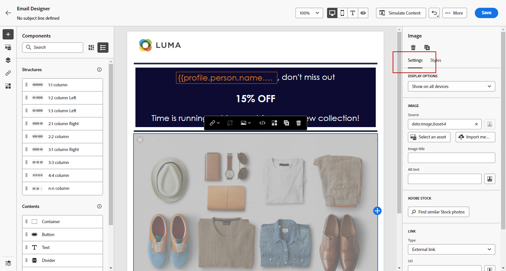
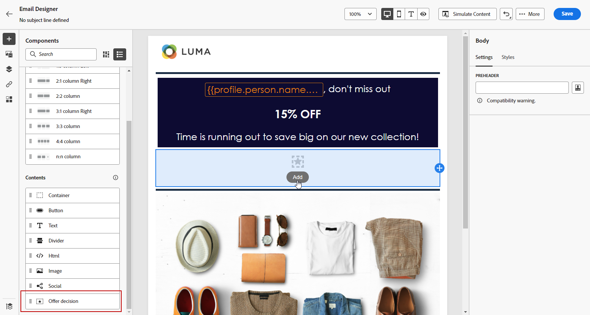

# Använda e-postdesignerns innehållskomponenter {#content-components}

>[!CONTEXTUALHELP]
>id="ac_content_components_email"
>title="Om innehållskomponenter"
>abstract="Innehållskomponenterna är tomma platshållare för innehåll som du kan använda för att skapa layouten för ett e-postmeddelande."

>[!CONTEXTUALHELP]
>id="ac_content_components_landing_page"
>title="Om innehållskomponenter"
>abstract="Innehållskomponenterna är tomma platshållare för innehåll som du kan använda för att skapa layouten för en landningssida."

>[!CONTEXTUALHELP]
>id="ac_content_components_fragment"
>title="Om innehållskomponenter"
>abstract="Innehållskomponenter är tomma platshållare för innehåll som du kan använda för att skapa layouten för ett fragment."

>[!CONTEXTUALHELP]
>id="ac_content_components_template"
>title="Om innehållskomponenter"
>abstract="Innehållskomponenter är tomma platshållare för innehåll som du kan använda för att skapa layouten för en mall."

När du skapar ditt e-postinnehåll **[!UICONTROL Content components]** gör att du kan anpassa e-postmeddelandet ytterligare med råkomponenter som du kan redigera när du väl har placerat i ett e-postmeddelande.

Du kan lägga till så många innehållskomponenter du behöver i en eller flera strukturkomponenter, som definierar layouten för e-postmeddelandet.

## Lägga till innehållskomponenter {#add-content-components}

Följ stegen nedan för att lägga till innehållskomponenter i e-postmeddelanden och anpassa dem efter dina behov.

1. Använd ett befintligt innehåll i e-postdesignern eller dra och släpp **[!UICONTROL Structure components]** till ditt tomma innehåll för att definiera layouten för ditt e-postmeddelande. [Lär dig mer](content-from-scratch.md)

1. Så här öppnar du **[!UICONTROL Content components]** markerar du motsvarande knapp i den vänstra rutan i E-postdesignern.

   

1. Dra och släpp de innehållskomponenter du vill ha inuti de relevanta strukturkomponenterna.

   

   >[!NOTE]
   >
   >Du kan lägga till flera komponenter i en enda strukturkomponent och i varje kolumn i en strukturkomponent.

1. Justera attribut och format för varje komponent med **[!UICONTROL Settings]** och **[!UICONTROL Style]** till höger. Du kan till exempel ändra textstil, utfyllnad eller marginal för varje komponent. [Läs mer om justering och utfyllnad](alignment-and-padding.md)

   

1. På den avancerade menyn i **[!UICONTROL Content component]** kan du enkelt ta bort eller duplicera innehållskomponenter efter behov.

   

## Behållare {#container}

Om du vill använda en viss stil på en grupp innehållskomponenter kan du lägga till en **[!UICONTROL Container]** och sedan lägga till innehållskomponenter i den. På så sätt kan du tillämpa ett distinkt format på behållaren, vilket skiljer sig från det format som tillämpas på innehållskomponenterna i behållaren.

Lägg till exempel till en **[!UICONTROL Container]** och sedan lägga till en [Knapp](#button) -komponenten i den behållaren. Du kan använda en specifik bakgrund för behållaren och en annan för knappen.

## Knapp {#button}

Använd **[!UICONTROL Button]** om du vill infoga en eller flera knappar i e-postmeddelandet och dirigera om din e-postpublik till en annan sida.

1. Från **[!UICONTROL Content components]**, dra och släpp **[!UICONTROL Button]** till en **[!UICONTROL Structure component]**.

1. Klicka på den nya knappen för att anpassa texten och få tillgång till **[!UICONTROL Settings]** och **[!UICONTROL Styles]** -flikar i det högra fönstret i E-postdesignern.

   

1. Från **[!UICONTROL Link]** lägger du till den URL som du vill omdirigera till när du klickar på knappen.

1. Välj hur er målgrupp ska omdirigeras med **[!UICONTROL Target]** nedrullningsbar lista:

   * **[!UICONTROL None]**: öppnar länken i samma ram som den klickades på (standard).
   * **[!UICONTROL Blank]**: öppnar länken i ett nytt fönster eller på en ny flik.
   * **[!UICONTROL Self]**: öppnar länken i samma ram som den klickades på.
   * **[!UICONTROL Parent]**: öppnar länken i den överordnade ramen.
   * **[!UICONTROL Top]**: öppnar länken i hela fönstret.

   

1. Du kan anpassa knappen ytterligare genom att ändra formatattribut som **[!UICONTROL Border]**, **[!UICONTROL Size]**, **[!UICONTROL Margin]**, osv. från **[!UICONTROL Component settings]** fönster.

## Text {#text}

Använd **[!UICONTROL Text]** om du vill infoga text i e-postmeddelandet och justera formatet (kantlinje, storlek, utfyllnad osv.) med **[!UICONTROL Styles]** -fliken.

1. Från **[!UICONTROL Content components]**, dra och släpp **[!UICONTROL Text]** till en **[!UICONTROL Structure component]**.

1. Klicka på den komponent som du har lagt till för att anpassa texten och få tillgång till **[!UICONTROL Settings]** och **[!UICONTROL Styles]** i den högra rutan i e-postdesignern.

1. Ändra texten med följande alternativ i verktygsfältet:

   

   * **[!UICONTROL Change text style]**: använda fet, kursiv, understrykning eller genomstrykning i texten.
   * **Ändra justering**: Välj mellan vänster, höger, centrerad eller marginaljusterad justering för texten.
   * **[!UICONTROL Create list]**: lägg till punkt- eller nummerlista i texten.
   * **[!UICONTROL Set heading]**: kan du lägga till upp till sex rubriknivåer i texten.
   * **Teckenstorlek**: markera teckensnittsstorleken för texten i pixlar.
   * **[!UICONTROL Change font color]**: välj färg för teckensnittet.
   * **[!UICONTROL Insert link]**: lägga till alla typer av länkar till ditt innehåll.
   * **[!UICONTROL Edit image]**: lägga till en bild eller en resurs i textkomponenten. [Läs mer om resurshantering](assets-essentials.md)
   * **[!UICONTROL Change font color]**: välj färg för teckensnittet.
   * **[!UICONTROL Add personalization]**: lägga till anpassningsfält för att anpassa innehållet utifrån dina profildata. [Läs mer om innehållspersonalisering](../personalization/personalize.md)
   * **[!UICONTROL Show the source code]**: visa textens källkod. Den kan inte ändras.
   * **[!UICONTROL Enable conditional content]**: lägga till villkorsstyrt innehåll för att anpassa komponentens innehåll till målprofilerna. [Läs mer om dynamiskt innehåll](../personalization/get-started-dynamic-content.md)
   * **[!UICONTROL Duplicate]**: lägga till en kopia av textkomponenten.
   * **[!UICONTROL Delete]**: ta bort den markerade textkomponenten från e-postmeddelandet.

1. Justera övriga formatattribut, t.ex. textfärg, teckensnittsfamilj, kantlinje, utfyllnad, marginal. från **[!UICONTROL Styles]** -fliken.

   

## Delare {#divider}

Använd **[!UICONTROL Divider]** om du vill infoga en delningslinje för att ordna layouten och innehållet i ditt e-postmeddelande.

Du kan justera formatattribut som linjefärg, format och höjd på menyn **[!UICONTROL Settings]** och **[!UICONTROL Styles]** -tabbar.

## HTML {#HTML}

Använd **[!UICONTROL HTML]** om du vill kopiera och klistra in de olika delarna av din befintliga HTML. På så sätt kan du skapa kostnadsfria modulära HTML-komponenter för att återanvända externt innehåll.

1. Från **[!UICONTROL Content Components]**, dra och släpp **[!UICONTROL HTML]** till en **[!UICONTROL Structure component]**.

1. Klicka på den nya komponenten och välj sedan **[!UICONTROL Show the source code]** från kontextverktygsfältet för att lägga till HTML.

   

1. Kopiera och klistra in den HTML-kod som du vill lägga till i e-postmeddelandet och klicka på **[!UICONTROL Save]**.

   

>[!NOTE]
>
>Adobe rekommenderar att du skapar ett meddelande från grunden och kopierar innehållet från ditt befintliga e-postmeddelande till komponenter, så att det externa innehållet helt enkelt blir kompatibelt med e-postdesignern.

## Bild {#image}

Använd **[!UICONTROL Image]** om du vill infoga en bildfil från datorn i ditt e-postinnehåll.

1. Från **[!UICONTROL Content components]**, dra och släpp **[!UICONTROL Image]** till en **[!UICONTROL Structure component]**.

   

1. Klicka **[!UICONTROL Browse]** om du vill välja en bildfil bland dina resurser.

   Om du vill veta mer om [!DNL Assets Essentials], se [Adobe Experience Manager Assets Essentials-dokumentation](https://experienceleague.adobe.com/docs/experience-manager-assets-essentials/help/introduction.html){target="_blank"}.

1. Klicka på den nya komponenten och ange bildegenskaperna i **[!UICONTROL Settings]** tab:

   * **[!UICONTROL Image title]** I kan du definiera en titel för bilden.
   * **[!UICONTROL Alt text]** I kan du definiera den bildtext som är länkad till bilden. Detta motsvarar attributet alt HTML.

   

1. Du kan också välja att **[!UICONTROL Find similar Stock photos]**. [Läs mer](stock.md)

1. Från **[!UICONTROL Styles]** kan du justera andra formatattribut, t.ex. marginal, kant. eller lägga till en länk för att dirigera om målgruppen till ett annat innehåll från **[!UICONTROL Component settings]** fönster.

## Social {#social}

Använd **[!UICONTROL Social]** för att infoga länkar till sidor för sociala medier i ditt e-postinnehåll.

1. Från **[!UICONTROL Content Components]**, dra och släpp **[!UICONTROL Social]** till en **[!UICONTROL Structure component]**.

1. Markera den nya komponenten.

1. I **[!UICONTROL Social]** fält för **[!UICONTROL Settings]** väljer du vilka sociala medier du vill lägga till eller ta bort.

   

1. Välj storlek på ikonerna i det dedikerade fältet.

1. Klicka på ikonerna för sociala medier för att konfigurera **[!UICONTROL URL]** som er målgrupp kommer att omdirigeras till.

   

1. Du kan också ändra ikonerna för vart och ett av dina sociala medier om det behövs från dina resurser.

1. Justera övriga formatattribut, t.ex. format, marginal, kant. från **[!UICONTROL Styles]** -fliken.

## Beslut om erbjudandet {#offer-decision}

Använd **[!UICONTROL Offer decision]** -komponent för att infoga erbjudanden i dina meddelanden. The [beslutsfattande](../offers/get-started/starting-offer-decisioning.md) kommer att välja det bästa erbjudandet att leverera till era kunder.

1. Från **[!UICONTROL Content Components]**, dra och släpp **[!UICONTROL Offer decision]** till en **[!UICONTROL Structure component]**.

1. Klicka **[!UICONTROL Add]** för att välja **[!UICONTROL Offer decision]**.

   

1. I listrutan väljer du **[!UICONTROL Placements]**.  Välj sedan **[!UICONTROL Offer decision]** du vill lägga till i innehållet och klicka på **[!UICONTROL Add]**.

   

1. Från **[!UICONTROL Offer decision]** kan du förhandsgranska eller ändra det infogade erbjudandet.

Lär dig hur du lägger till personaliserade erbjudanden i ett e-postmeddelande i [det här avsnittet](add-offers-email.md).

>[!IMPORTANT]
>
>Om ett beslut om erbjudande som används i ett kundmeddelande ändras måste du avpublicera resan och publicera den på nytt.  På så sätt säkerställs att ändringarna införlivas i kundens budskap och att meddelandet överensstämmer med de senaste uppdateringarna.
