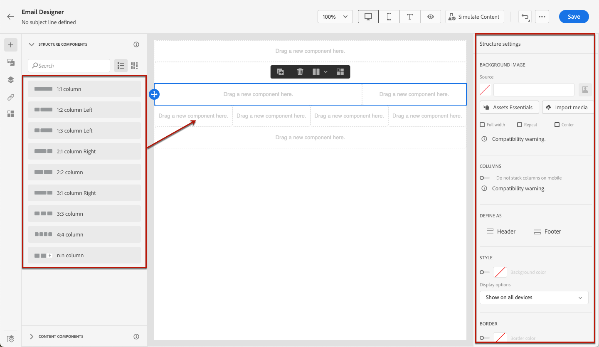

# Designa material från scratch med e-post-Designer {#content-from-scratch}

>[!CONTEXTUALHELP]
>id="ac_structure_components_email"
>title="Lägg till strukturkomponenter"
>abstract="Strukturkomponenter definierar layouten för e-postmeddelandet. Dra och släpp en **Structure**-komponent på arbetsytan för att börja designa ditt e-postinnehåll."

>[!CONTEXTUALHELP]
>id="ac_structure_components_landing_page"
>title="Lägg till strukturkomponenter"
>abstract="Strukturkomponenter definierar landningssidans layout. Dra och släpp en **Structure**-komponent på arbetsytan för att börja designa innehållet på landningssidan."

>[!CONTEXTUALHELP]
>id="ac_structure_components_fragment"
>title="Lägg till strukturkomponenter"
>abstract="Strukturkomponenter definierar fragmentets layout. Dra och släpp en **Structure**-komponent på arbetsytan för att börja designa innehållet i fragmentet."

>[!CONTEXTUALHELP]
>id="ac_structure_components_template"
>title="Lägg till strukturkomponenter"
>abstract="Strukturkomponenter definierar mallens layout. Dra och släpp en **Struktur**-komponent på arbetsytan för att börja designa innehållet i mallen."

>[!CONTEXTUALHELP]
>id="ac_edition_columns_email"
>title="Definiera e-postkolumner"
>abstract="Med e-post-Designer kan du enkelt definiera layouten för e-postmeddelandet genom att välja kolumnstrukturen."

>[!CONTEXTUALHELP]
>id="ac_edition_columns_landing_page"
>title="Definiera landningssidans kolumner"
>abstract="Med Designer kan du enkelt definiera layouten för landningssidan genom att välja kolumnstrukturen."

>[!CONTEXTUALHELP]
>id="ac_edition_columns_fragment"
>title="Definiera fragmentkolumner"
>abstract="Med Designer kan du enkelt definiera fragmentets layout genom att välja kolumnstrukturen."

>[!CONTEXTUALHELP]
>id="ac_edition_columns_template"
>title="Definiera mallkolumner"
>abstract="Med Designer kan du enkelt definiera mallens layout genom att välja kolumnstrukturen."

Använd e-post-Designer för [!DNL Adobe Journey Optimizer] för att enkelt definiera innehållsstrukturen. Genom att lägga till och flytta strukturella element med enkla dra och släpp-åtgärder kan du designa formen på innehållet på några sekunder.

>[!NOTE]
>
>I den [europeiska tillgänglighetslagen](https://eur-lex.europa.eu/legal-content/EN/TXT/?uri=CELEX%3A32019L0882){target="_blank"} anges att all digital kommunikation ska vara tillgänglig. Kontrollera att du följer de specifika riktlinjerna som anges på [den här sidan](accessible-content.md) när du designar innehåll i [!DNL Journey Optimizer].

Följ stegen nedan när du vill börja skapa ditt innehåll:

1. På Designer hemsida väljer du alternativet **[!UICONTROL Design from scratch]**.

   

1. Snabba upp e-postgenereringen med AI Assistant och generera komplett e-postinnehåll med text och bilder med [AI Assistant för generering av fullständigt innehåll](../content-management/generative-full-content.md).

1. Börja designa ditt innehåll genom att dra och släppa **[!UICONTROL Structures]** på arbetsytan för att definiera layouten för e-postmeddelandet.

   >[!NOTE]
   >
   >Det går inte att stapla kolumner i alla e-postprogram. Om det inte finns stöd för det här alternativet staplas inte kolumner.

   <!--Once placed in the email, you cannot move nor remove your components unless there is already a content component or a fragment placed inside. This is not true in AJO - TBC?-->

1. Lägg till så många **[!UICONTROL Structures]** som behövs och redigera inställningarna i den dedikerade rutan till höger.

   

   Välj komponenten **[!UICONTROL n:nkolumn]** för att definiera antalet kolumner som du väljer (mellan 3 och 10). Du kan också definiera bredden på varje kolumn genom att flytta pilarna längst ned i varje kolumn.

   >[!NOTE]
   >
   >Varje kolumnstorlek får inte vara mindre än 10 % av strukturkomponentens totala bredd. Du kan inte ta bort en kolumn som inte är tom.

1. Expandera avsnittet **[!UICONTROL Contents]** och lägg till så många element du behöver i en eller flera strukturkomponenter. [Läs mer om innehållskomponenter](content-components.md)

1. Varje komponent kan anpassas ytterligare med flikarna **[!UICONTROL Settings]** eller **[!UICONTROL Style]** på den högra menyn. Du kan till exempel ändra textstil, utfyllnad eller marginal för varje komponent. [Läs mer om justering och utfyllnad](alignment-and-padding.md)

   

1. Från **[!UICONTROL Asset picker]** kan du välja resurser som lagras direkt i **[!UICONTROL Assets library]**. [Läs mer om resurshantering](../integrations/assets.md)

   Dubbelklicka på den mapp som innehåller dina resurser. Dra och släpp dem i en strukturkomponent.

   

1. Infoga anpassningsfält för att anpassa innehållet utifrån profilattribut, målgruppsmedlemskap, sammanhangsbaserade attribut med mera. [Läs mer om innehållspersonalisering](../personalization/personalize.md)

   

1. Klicka på **[!UICONTROL Enable condition content]** om du vill lägga till dynamiskt innehåll och anpassa innehållet till målprofilerna baserat på villkorliga regler. [Kom igång med dynamiskt innehåll](../personalization/get-started-dynamic-content.md)

   

1. Klicka på fliken **[!UICONTROL Links]** i den vänstra rutan för att visa alla URL:er för ditt innehåll som ska spåras. Du kan ändra deras **[!UICONTROL Tracking Type]** eller **[!UICONTROL Label]** och lägga till **[!UICONTROL Tags]** vid behov. [Läs mer om länkar och spårning](message-tracking.md)

   

1. Om det behövs kan du anpassa din e-post ytterligare genom att klicka på **[!UICONTROL Switch to code editor]** på den avancerade menyn. På så sätt kan du redigera e-postkällkoden, till exempel för att lägga till spårning eller anpassade HTML-taggar. [Läs mer om kodredigeraren](code-content.md)

   >[!CAUTION]
   >
   >Du kan inte återgå till den visuella designern för det här e-postmeddelandet efter att du har växlat till kodredigeraren.

1. När innehållet är klart klickar du på knappen **[!UICONTROL Simulate content]** för att kontrollera återgivningen. Du kan välja skrivbordsvy eller mobilvy. Detaljerad information om hur du väljer testprofiler och förhandsgranskar innehåll finns i avsnittet [Innehållshantering](../content-management/preview-test.md).

   

1. Ni kan också validera innehållskvaliteten för att utvärdera läsbarhet, effektivitet och innehållets enhetlighet. [Läs mer om validering av innehållskvalitet](../content-management/brands-score.md#validate-quality)

1. När innehållet är klart klickar du på **[!UICONTROL Save]**.
