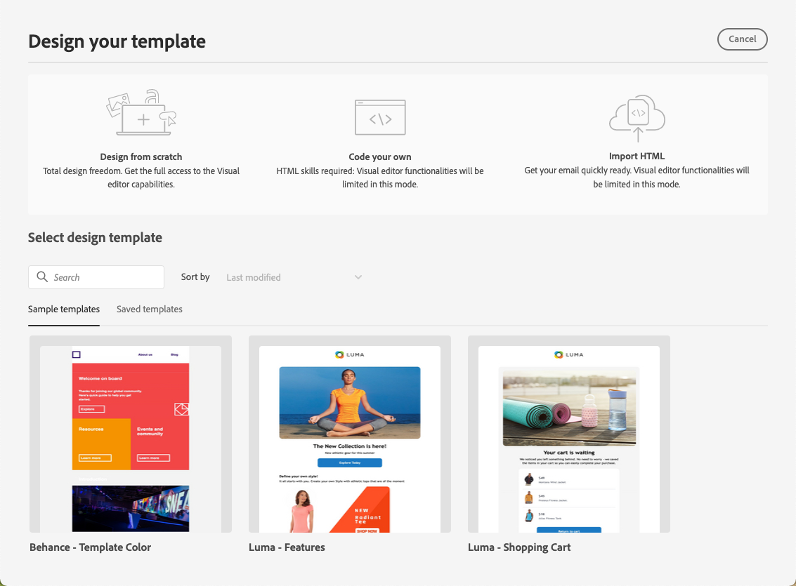

# Arbeta med innehållsmallar {#content-templates}

För en snabbare och förbättrad designprocess kan du skapa fristående mallar för att enkelt återanvända anpassat innehåll i [!DNL Journey Optimizer] kampanjer och resor.

Med den här funktionen kan innehållsorienterade användare arbeta med mallar utanför kampanjer eller resor. Marknadsförare kan sedan återanvända och anpassa dessa fristående innehållsmallar på sina egna resor eller i sina egna kampanjer.

En användare i företaget ansvarar t.ex. bara för innehållet och har därför inte tillgång till kampanjer eller resor. Den här användaren kan dock skapa en e-postmall som organisationens marknadsförare kan välja att använda i alla e-postmeddelanden som utgångspunkt.

Du kan också skapa och hantera innehållsmallar med API:er. Mer information finns i [Dokumentation för Journey Optimizer API:er](https://developer.adobe.com/journey-optimizer-apis/references/content/).

➡️ [Lär dig hur du skapar och använder mallar i den här videon](#video-templates)

>[!CAUTION]
>
>Om du vill skapa, redigera och ta bort innehållsmallar måste du ha **[!DNL Manage Library Items]** behörighet som ingår i **[!DNL Content Library Manager]** produktprofil. [Läs mer](../administration/ootb-product-profiles.md#content-library-manager)

## Få åtkomst till och hantera mallar {#access-manage-templates}

Om du vill komma åt innehållsmalllistan väljer du **[!UICONTROL Content Management]** > **[!UICONTROL Content Templates]** från den vänstra menyn.

Alla mallar som skapades i den aktuella sandlådan - antingen från en resa eller en kampanj med [Spara som mall](#save-as-template) alternativ, antingen från **[!UICONTROL Content Templates]** -menyn visas.

Du kan sortera innehållsmallar efter skapad- eller ändringsdatum. Du kan också välja att bara visa de objekt som du har skapat eller ändrat.

Om du vill redigera ett mallinnehåll klickar du på önskat objekt i listan och väljer **[!UICONTROL Edit content]**.

Om du vill ta bort en mall väljer du papperskorgsikonen bredvid önskad mall.

>[!NOTE]
>
>När en mall redigeras eller tas bort påverkas inte kampanjer eller resor inklusive e-post som skapats med den här mallen.

## Skapa innehållsmallar {#create-content-templates}

>[!CONTEXTUALHELP]
>id="ajo_create_template"
>title="Definiera en egen innehållsmall"
>abstract="Skapa en egen mall från scratch för att göra innehållet återanvändbart på flera resor och i flera kampanjer."

Det finns två sätt att skapa innehållsmallar:

* Skapa en innehållsmall från grunden med den vänstra listen **[!UICONTROL Content Templates]** -menyn. [Lär dig mer](#create-template-from-scratch)

* När du utformar ett e-postmeddelande inom en kampanj eller resa sparar du ditt e-postinnehåll som en mall. [Lär dig mer](#save-as-template)

När du har sparat din innehållsmall är den tillgänglig för användning i en kampanj eller på en resa. Oavsett om du har skapat från grunden eller från ett tidigare e-postmeddelande kan du nu använda den här mallen när du skapar [e-post](get-started-email-design.md) inom [!DNL Journey Optimizer]. [Lär dig mer](email-templates.md)

>[!NOTE]
>
>* Ändringar som görs i innehållsmallar sprids inte till kampanjer eller resor, vare sig de är live eller utkast.
>
>* När mallar används i en kampanj eller en resa påverkas inte heller den tidigare använda innehållsmallen av ändringar som du gör i kampanj- och reseinnehåll.

### Skapa mall från grunden {#create-template-from-scratch}

Följ stegen nedan för att skapa en innehållsmall från grunden.

1. Få åtkomst till innehållsmalllistan via **[!UICONTROL Content Management]** > **[!UICONTROL Content Templates]** vänster meny.

1. Välj **[!UICONTROL Create template]**.

1. Fyll i mallinformationen.

   

   >[!NOTE]
   >
   >För närvarande bara **E-post** kanal och **HTML** type stöds.

1. Om du vill tilldela etiketter för anpassad eller grundläggande dataanvändning till mallen väljer du **[!UICONTROL Manage access]**. [Läs mer om OLAC (Object Level Access Control)](../administration/object-based-access.md).

1. Markera eller skapa Adobe Experience Platform-taggar från **[!UICONTROL Tags]** fält för att kategorisera mallen för förbättrad sökning. [Läs mer](../start/search-filter-categorize.md#tags)

1. Klicka **[!UICONTROL Create]** och välja hur du vill utforma mallen bland de olika alternativen:

   * [Designa din e-post från grunden](content-from-scratch.md) via e-postdesignerns gränssnitt.

   * [Kod eller kopiera-klistra in Raw-HTML](code-content.md) direkt in i e-postdesignern.

   * [Importera befintligt HTML-innehåll](existing-content.md) från en fil eller en ZIP-mapp.

   * Använd befintligt innehåll från en lista med inbyggda eller anpassade mallar. Stegen för hur du använder en innehållsmall i ett e-postmeddelande beskrivs i [det här avsnittet](email-templates.md).

   

1. The [E-postdesigner](get-started-email-design.md) visas. Redigera innehållet efter behov, på samma sätt som för alla e-postmeddelanden som finns på en resa eller en kampanj, beroende på vilket alternativ du valt.

   Du kan testa ditt innehåll om det behövs. [Lär dig mer](#test-template)

1. När mallen är klar klickar du **[!UICONTROL Save]**.

1. Klicka vid behov på pilen bredvid mallnamnet för att gå tillbaka till **[!UICONTROL Details]** och redigera mallen.

   

Den här mallen kan nu användas när du skapar e-post i [!DNL Journey Optimizer]. [Lär dig mer](email-templates.md)

### Spara som mall {#save-as-template}

>[!CONTEXTUALHELP]
>id="ajo_messages_depecrated_inventory"
>title="Lär dig hur du migrerar meddelanden"
>abstract="Den 25 juli 2022 försvann menyn Meddelanden och meddelanden skrivs nu direkt från en resa. Om du vill återanvända dina gamla meddelanden under resor måste du spara dem som mallar."

När du utformar en [e-post](get-started-email-design.md) i en kampanj eller en resa kan du spara ditt e-postinnehåll för framtida återanvändning. Följ stegen nedan för att göra detta.

1. Klicka på ellipsen högst upp till höger på skärmen i e-postdesignern.

1. Välj **[!UICONTROL Save as content template]** i listrutan.

   

1. Lägg till ett namn och en beskrivning för mallen.

   

1. Om du vill tilldela etiketter för anpassad eller grundläggande dataanvändning till mallen väljer du **[!UICONTROL Manage access]**. [Läs mer](../administration/object-based-access.md).

1. Markera eller skapa en Adobe Experience Platform-tagg från **Taggar** fält för att kategorisera mallen. [Läs mer](../start/search-filter-categorize.md#tags)

1. Klicka på **[!UICONTROL Save]**.

1. Mallen sparas i **[!UICONTROL Content Templates]** lista, tillgänglig från [!DNL Journey Optimizer] egen meny. Det blir en fristående innehållsmall som du kan komma åt, redigera och ta bort som alla andra objekt i listan. [Läs mer](#access-manage-templates)

Du kan nu använda den här mallen när du skapar [e-post](get-started-email-design.md) inom [!DNL Journey Optimizer]. [Lär dig mer](email-templates.md)

>[!NOTE]
>
>Ändringar i den nya mallen sprids inte till det e-postmeddelande som den kommer från. På samma sätt ändras inte den nya mallen när det ursprungliga innehållet redigeras i det e-postmeddelandet.

## Testa innehållsmallen {#test-template}

Du kan testa återgivningen av alla mallar för e-postinnehåll, oavsett om de har skapats från grunden eller från ett e-postmeddelande. För att göra detta, följ nedanstående steg.

>[!CAUTION]
>
>Om du vill simulera innehåll måste du ha **[!DNL Manage Simulate Content]** behörighet som ingår i **[!DNL Content Library Manager]** produktprofil. [Läs mer](../administration/ootb-product-profiles.md#content-library-manager)

1. Få åtkomst till innehållsmalllistan via **[!UICONTROL Content Management]** > **[!UICONTROL Content Templates]** och välj en mall.

1. Klicka **[!UICONTROL Edit content]** från **[!UICONTROL Template properties]**.

1. Klicka **[!UICONTROL Simulate Content]** och välj en testprofil för att kontrollera e-poståtergivningen. Du kan välja skrivbordsvy eller mobilvy. [Läs mer](preview.md)

   

1. Du kan skicka ett bevis för att testa ditt innehåll och få det godkänt av vissa interna användare innan du använder det under en resa eller i en kampanj.

   * Klicka på **[!UICONTROL Send proof]** och följer stegen som beskrivs i [det här avsnittet](preview.md#send-proofs).

   * Innan du skickar korrekturet måste du välja [e-postyta](../configuration/channel-surfaces.md) som kommer att användas för att testa ditt innehåll.

     

>[!CAUTION]
>
>Spårning stöds för närvarande inte vid testning av mallar för e-postinnehåll, vilket innebär att spårningshändelser, UTM-parametrar och länkar på landningssidor inte kommer att vara effektiva i korrektur som skickas från en mall. Testa spårning [använda innehållsmallen](email-templates.md) i ett mejl och [skicka ett bevis](preview.md#send-proofs).

## Instruktionsvideo {#video-templates}

Lär dig hur du skapar, redigerar och använder innehållsmallar i [!DNL Journey Optimizer].

>[!VIDEO](https://video.tv.adobe.com/v/3413743/?quality=12)
