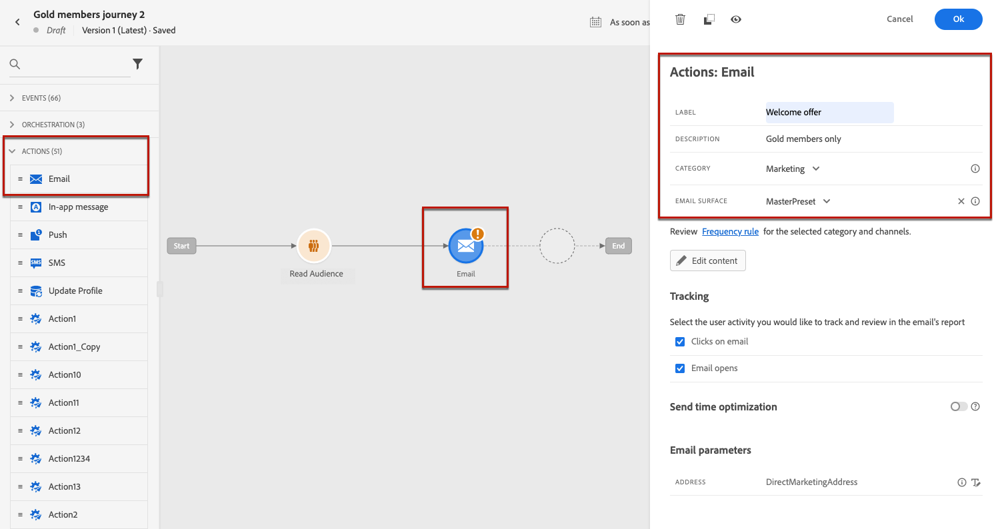
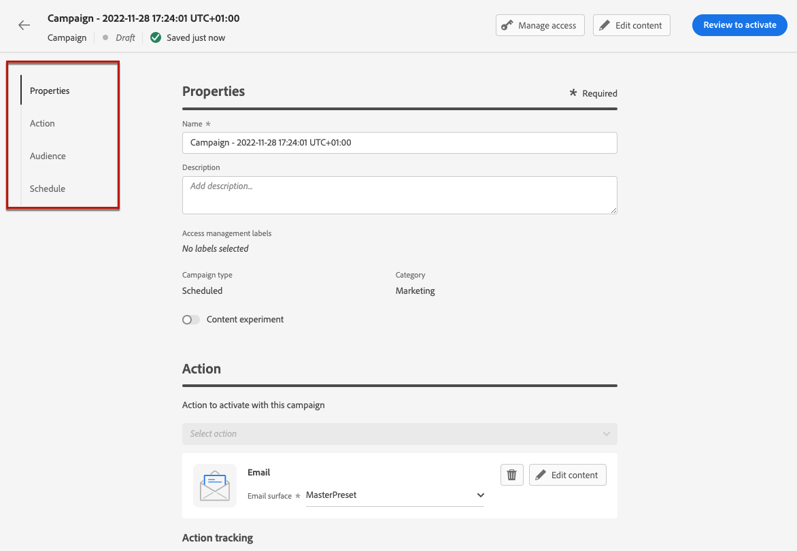
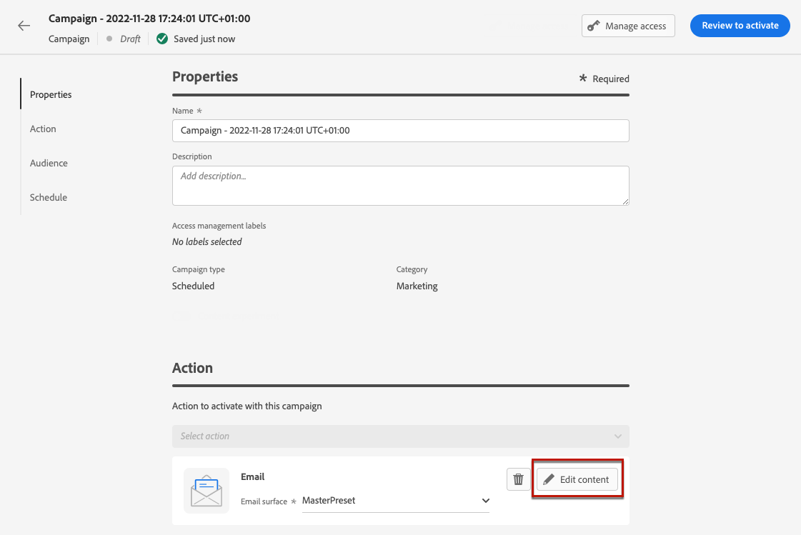

# Skapa ett e-postmeddelande {#create-email}

>[!CONTEXTUALHELP]
>id="ajo_message_email"
>title="Skapa e-post"
>abstract="Definiera din ämnesrad för e-post och öppna e-post-Designer för att skapa innehållet i e-postmeddelandet."

## Lägg till en e-poståtgärd {#email-action}

Om du vill skapa ett e-postmeddelande i [!DNL Journey Optimizer] lägger du till en **[!UICONTROL Email]**-åtgärd för en resa eller en kampanj. Följ sedan instruktionerna nedan.

>[!BEGINTABS]

>[!TAB Lägg till ett e-postmeddelande till en resa]

1. Öppna din resa och dra och släpp en **[!UICONTROL Email]**-aktivitet från **[!UICONTROL Actions]**-delen av paletten.

1. Ange grundläggande information i meddelandet (etikett, beskrivning, kategori).

1. Välj eller skapa [e-postkonfigurationen](email-settings.md).

   

   Fältet är som standard förifyllt med den senaste konfigurationen som användaren använde för den kanalen.

>[!NOTE]
>
>Du kan använda alternativet för optimering av sändningstid för att förutsäga den bästa tidpunkten för att skicka meddelandet för att maximera engagemanget baserat på tidigare öppnings- och klickfrekvenser. [Lär dig hur du arbetar med optimering vid sändning](../building-journeys/send-time-optimization.md)

Mer information om hur du konfigurerar en resa finns på [den här sidan](../building-journeys/journey-gs.md).

>[!TAB Lägg till ett e-postmeddelande till en kampanj]

1. Skapa en ny schemalagd eller API-utlöst kampanj och välj **[!UICONTROL Email]** som din åtgärd.

1. Slutför stegen för att skapa en e-postkampanj, till exempel kampanjegenskaperna, [målgrupp](../audience/about-audiences.md) och [schema](../campaigns/campaign-schedule.md#action-campaign-schedule).

   

1. Välj åtgärden **[!UICONTROL Email]**.

1. Välj eller skapa e-postkonfigurationen. [Läs mer](email-settings.md)

   

<!--
From the **[!UICONTROL Action]** section, specify if you want to track how your recipients react to your delivery: you can track email opens, and/or clicks on links and buttons in your email.

-->

Mer information om hur du konfigurerar en kampanj finns på [den här sidan](../campaigns/get-started-with-campaigns.md).

>[!ENDTABS]

## Definiera ditt e-postinnehåll {#define-email-content}

<!-- update the quarry component with right ID value-->

>[!CONTEXTUALHELP]
>id="test_id"
>title="Konfigurera e-postinnehåll"
>abstract="Skapa innehållet i e-postmeddelandet. Definiera ämnet och använd sedan e-post-Designer för att skapa och personalisera e-postmeddelandets brödtext."

1. Klicka på knappen **[!UICONTROL Edit content]** på skärmen för resan eller kampanjkonfigurationen för att konfigurera e-postinnehållet. [Läs mer](get-started-email-design.md)

   

1. Växla **[!UICONTROL Enable decisioning]** om du vill lägga till beslutsprinciper i e-postmeddelandet.

   Beslutspolicyer är behållare för era erbjudanden som utnyttjar beslutsmotorn för att dynamiskt returnera det bästa innehållet för varje målgruppsmedlem. [Lär dig hur du lägger till en beslutsprincip i ett e-postmeddelande](../experience-decisioning/create-decision.md#create-decision)

   

   >[!AVAILABILITY]
   >
   >För närvarande kan man skapa policy i e-postmeddelanden med begränsad tillgänglighet. Kontakta din Adobe-representant för att få åtkomst.

1. Kontrollera fälten **[!UICONTROL Header]**, **[!UICONTROL From name]** och **[!UICONTROL From email]** i avsnittet **[!UICONTROL BCC]**. De konfigureras i den e-postkonfiguration som du har valt. [Läs mer](email-settings.md) <!--check if same for journey-->

   

1. Lägg till en ämnesrad för meddelandet. Klicka på ikonen **[!UICONTROL Open personalization dialog]** om du vill konfigurera och anpassa ämnesraden med personaliseringsredigeraren. [Läs mer](../personalization/personalization-build-expressions.md)

   >[!NOTE]
   >
   >Ämnesraden är obligatorisk. Den får inte innehålla radbrytningar.

1. Klicka på knappen **[!UICONTROL Edit email body]** för att komma åt e-post-Designer och börja skapa ditt innehåll. [Läs mer](get-started-email-design.md)

   

1. Om du deltar i en kampanj kan du även klicka på knappen **[!UICONTROL Code Editor]** för att koda ditt eget innehåll i vanliga HTML med hjälp av popup-fönstret som visas.

   

   >[!NOTE]
   >
   >Om du redan har skapat eller importerat innehåll via e-post-Designer visas innehållet i HTML.

## Kontrollera aviseringar {#check-email-alerts}

När du utformar meddelanden visas varningar i gränssnittet (längst upp till höger på skärmen) när nyckelinställningarna saknas.

>[!NOTE]
>
>Om du inte ser den här knappen har ingen varning identifierats.

De inställningar och element som kontrolleras av systemet visas nedan. Du hittar även information om hur du anpassar konfigurationen för att lösa motsvarande problem.

Två typer av varningar kan inträffa:

* **Varningar** hänvisar till rekommendationer och bästa praxis, som:

   * **[!UICONTROL The opt-out link is not present in the email body]**: det är bäst att lägga till en länk för att avbryta prenumerationen i e-postmeddelandet. Lär dig hur du konfigurerar det i [det här avsnittet](../privacy/opt-out.md#opt-out-decision-management).

     >[!NOTE]
     >
     >E-postmeddelanden av marknadsföringstyp måste innehålla en länk för avanmälan, vilket inte krävs för transaktionsmeddelanden. Meddelandekategorin (**[!UICONTROL Marketing]** eller **[!UICONTROL Transactional]**) definieras på nivån [kanalkonfiguration](email-settings.md#email-type) och när [meddelandet](#create-email-journey-campaign) skapas från en resa eller en kampanj.

   * **[!UICONTROL Text version of HTML is empty]**: glöm inte att definiera en textversion av din e-postbrödtext, eftersom den kommer att användas när HTML-innehåll inte kan visas. Lär dig skapa textversionen i [det här avsnittet](text-version-email.md).

   * **[!UICONTROL Empty link is present in email body]**: Kontrollera att alla länkar i e-postmeddelandet är korrekta. Lär dig hantera innehåll och länkar i [det här avsnittet](content-from-scratch.md).

   * **[!UICONTROL Email size has exceeded the limit of 100KB]**: Kontrollera att e-postmeddelandets storlek inte överstiger 100 kB för optimal leverans. Lär dig hur du redigerar e-postinnehåll i [det här avsnittet](content-from-scratch.md).

* **Fel** hindrar dig från att testa eller aktivera resan/kampanjen så länge de inte är lösta, till exempel:

   * **[!UICONTROL The subject line is missing]**: Ämnesraden för e-post är obligatorisk. Lär dig hur du definierar och anpassar den i [det här avsnittet](create-email.md).

  <!--HTML is empty when Amp HTML is present-->

   * **[!UICONTROL The email version of the message is empty]**: Det här felet visas när e-postinnehållet inte har konfigurerats. Lär dig hur du utformar e-postinnehåll i [det här avsnittet](get-started-email-design.md).

   * **[!UICONTROL configuration doesn't exist]**: Du kan inte använda meddelandet om den konfiguration du har valt tas bort efter att meddelandet har skapats. Om det här felet inträffar väljer du en annan konfiguration i meddelandet **[!UICONTROL Properties]**. Läs mer om kanalkonfigurationer i [det här avsnittet](../configuration/channel-surfaces.md).

>[!CAUTION]
>
>Om du vill kunna testa eller aktivera resan/kampanjen med e-postmeddelandet måste du lösa alla **error**-varningar.

## Kontrollera och skicka din e-post

När meddelandeinnehållet har definierats kan du använda testprofiler för att förhandsgranska det, skicka korrektur och kontrollera återgivningen i vanliga dator-, mobil- och webbaserade klienter. Om du har infogat anpassat innehåll kan du kontrollera hur det här innehållet visas i meddelandet med hjälp av testprofildata.

>[!NOTE]
>
>Utöver testprofiler kan du i [!DNL Journey optimizer] även testa olika varianter av ditt innehåll genom att förhandsgranska det och skicka korrektur med exempelindata som har överförts från en CSV-/JSON-fil, eller lagts till manuellt. [Lär dig hur du simulerar innehållsvariationer](../test-approve/simulate-sample-input.md)

Det gör du genom att klicka på **[!UICONTROL Simulate content]** och sedan lägga till en testprofil för att kontrollera meddelandet med hjälp av testprofildata.

Detaljerad information om hur du väljer testprofiler och förhandsgranskar innehåll finns i avsnittet [Innehållshantering](../content-management/preview-test.md).

När din e-post är klar slutför du konfigurationen av din [resa](../building-journeys/journey-gs.md) eller [kampanj](../campaigns/create-campaign.md) och aktiverar den för att skicka meddelandet.

>[!NOTE]
>
>Om du vill spåra mottagarnas beteende genom att öppna e-post och/eller interaktioner kontrollerar du att de dedikerade alternativen i avsnittet **[!UICONTROL Tracking]** är aktiverade i kundens [e-postaktivitet](../building-journeys/journeys-message.md) eller i e-postkampanjen [kampanjen](../campaigns/create-campaign.md).<!--to move?-->

<!--

## Define your email content {#email-content}

Use [!DNL Journey Optimizer] Email Designer to [design your email from scratch](../email/content-from-scratch.md). If you have an existing content, you can [import it in the Email Designer](../email/existing-content.md), or [code your own content](../email/code-content.md) in [!DNL Journey Optimizer]. 

[!DNL Journey Optimizer] comes with a set of [built-in templates](email-templates.md) to help you start. Any email can also be saved as a template.

Use [!DNL Journey Optimizer] personalization editor to personalize your messages with profiles' data. For more on personalization, refer to [this section](../personalization/personalize.md).

Adapt the content of your messages to the targeted profiles by using [!DNL Journey Optimizer] dynamic content capabilities. [Get started with dynamic content](../personalization/get-started-dynamic-content.md)

## Email tracking {#email-tracking}

If you want to track the behavior of your recipients through openings and/or clicks on links, enable the following options: **[!UICONTROL Email opens]** and **[!UICONTROL Click on email]**. 

Learn more about tracking in [this section](message-tracking.md).

## Validate your email content {#email-content-validate}

Control the rendering of your email, and check personalization settings with test profiles, using the preview section on the left-hand side. For more on this, refer to [this section](preview.md).

You must also check alerts in the upper section of the editor.  Some of them are simple warnings, but others can prevent you from using the message. 

-->

