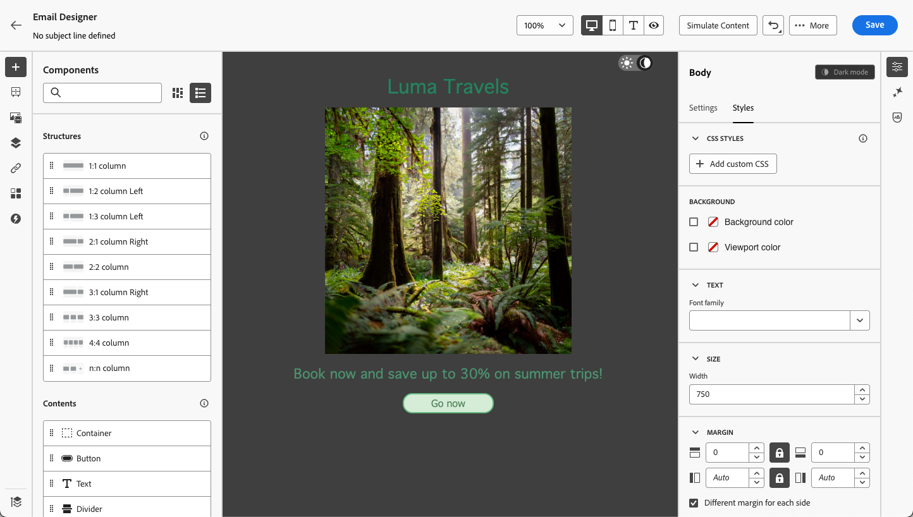

# Definiera innehåll i mörkt läge {#dark-mode}

>[!CONTEXTUALHELP]
>id="ac_edition_darkmode"
>title="Växla till mörkt läge"
>abstract="Växla till mörkt läge där du kan förhandsgranska hur det kan återge och definiera specifika anpassade inställningar.  Varning! Den slutliga återgivningen beror på mottagarens e-postklient. Alla e-postklienter stöder inte anpassat mörkt läge."

>[!CONTEXTUALHELP]
>id="ac_edition_darkmode_image"
>title="Använd en viss bild för mörkt läge"
>abstract="Du kan välja en annan bild som ska visas när mörkt läge är aktiverat.  Varning! Om du lägger till en viss bild för mörkt läge visas ingen garanti för att den återges korrekt i alla e-postklienter. Alla e-postklienter stöder inte anpassat mörkt läge."

>[!CONTEXTUALHELP]
>id="ac_edition_darkmode_preview"
>title="Växla till mörkt läge"
>abstract="Växla till mörkt läge om du vill förhandsgranska hur det kan återges på e-postklienter som stöds.  Varning! Den slutliga återgivningen beror på mottagarens e-postklient. Alla e-postklienter stöder inte anpassat mörkt läge."

När du utformar dina e-postmeddelanden kan du med [!DNL Journey Optimizer] [Designer](get-started-email-design.md) växla till **[!UICONTROL Dark mode]** där du kan definiera anpassade inställningar. När det mörka läget är aktiverat visas de inställningar som du har definierat för det här läget.

>[!WARNING]
>
>Den slutliga återgivningen i mörkt läge beror på mottagarens e-postklient.
>
>Alla e-postklienter stöder inte anpassat mörkt läge. <!--[See the list](#non-supporting-email-clients)-->Vissa e-postklienter använder dessutom bara sitt eget mörka standardläge för alla e-postmeddelanden som tas emot. I det här fallet går det inte att återge de anpassade inställningarna som du definierade i e-post-Designer.

En lista över e-postklienter som stöder mörkt läge visas i [det här avsnittet](#supporting-email-clients).

## Vad är mörkt läge? {#what-is-dark-mode}

I mörkt läge kan e-postklienter och appar som stöds visa e-postmeddelanden med mörkare bakgrunder och ljusare färger för text, knappar och andra gränssnittselement. Det gör det möjligt att minska ögonbelastningen, spara batteritid och förbättra läsbarheten i miljöer med svag belysning för en mer bekväm visningsupplevelse.

<!--Dark Mode uses a dark color palette with light text and UI elements to reduce eye strain, save battery life, and improve readability in low-light environments.-->

Som en allt större trend för de vanligaste operativsystemen och apparna (Apple Mail, Gmail, Outlook, Twitter, Slack) har det blivit en viktig faktor i den moderna e-postdesignen för att säkerställa att innehållet förblir läsbart och visuellt tilltalande för alla användare.

Det går dock inte att garantera att e-postmeddelandet ser exakt likadant ut i mörkt läge på alla enheter. Vissa visuella ändringar kan också orsakas av att e-postappen eller enheten åsidosätter den ursprungliga designen.

Det mörka läget används av e-postklienter och kan variera på följande sätt: <!--between different devices and apps-->

* Alla e-postklienter stöder inte den här funktionen.

  >[!NOTE]
  >
  >En lista över e-postklienter som inte stöder mörkt läge visas i [det här avsnittet](#non-supporting-email-clients).

* Vissa e-postklienter justerar automatiskt färger, bakgrunder och bilder. Om du i det här fallet definierar anpassade inställningar i e-post-Designer återges förmodligen inte dessa inställningar.

* Andra e-postklienter ger möjlighet att återge anpassat mörkt läge (till exempel med metoden `@media (prefers-color-scheme: dark)`). I det här fallet ska de specifika inställningar som du anger i e-post-Designer visas. Lär dig hur du definierar anpassade inställningar för mörkt läge i e-post-Designer i [det här avsnittet](#define-custom-dark-mode).

## Mörkt läge i e-post-Designer {#dark-mode-email-designer}

När det gäller det mörka läget i e-post-Designer finns det två aspekter att tänka på:

* Du kan få en förhandsvisning av hur det mörka standardläget kommer att återges i de flesta e-postklienter som stöds. [Läs mer](#preview-dark-mode)

<!--
    >[!CAUTION]
    >
    >The final rendering may vary according to the recipient's email client. To see the exact rendering for each email client, use the [Email rendering](../content-management/rendering.md) option.-->

* Om du vill åsidosätta standardinställningarna för stöd av e-postklienter kan du definiera anpassade inställningar för mörkt läge som gäller för det e-postmeddelande som du redigerar. [Läs mer](#define-custom-dark-mode)

<!--
    >[!WARNING]
    >
    >Not all email clients support custom dark mode. Some email clients only apply their own default dark mode for all emails that are received. In this case, the custom settings that you defined in the Email Designer cannot be rendered. [Learn more](#guardrails)-->

### Förhandsvisa standardläget för mörk {#preview-dark-mode}

Följ stegen nedan för att öppna det mörka läget i e-postprogrammet Designer och få en förhandsvisning av standardinställningarna för det mörka läget.

1. Välj alternativet **[!UICONTROL Design from scratch]** på hemsidan för e-post till Designer. [Läs mer](content-from-scratch.md)

   >[!NOTE]
   >
   >För närvarande kan du inte växla till mörkt läge om du väljer en [e-postmall](use-email-templates.md) eller om du använder ett [tema](apply-email-themes.md).

1. Lägg till [strukturer](content-from-scratch.md) och [innehållskomponenter](content-components.md) i ditt innehåll.

1. Växla till **[!UICONTROL Dark mode]** överst till höger på arbetsytan i mitten.

   

1. Standardförhandsvisningen i mörkt läge visas.

   
<!--
    >[!NOTE]
    >
    >Dark mode applies to all elements, except images and icons.-->

Som standard används färgschemat&quot;Fullfärgsinvertering&quot; för alla element utom bilder och ikoner i förhandsvisningen av Designer i mörkt läge. <!--It fully inverts all colors for all the elements (texts, buttons, etc.)-->

Det innebär att det upptäcker områden med ljusa och mörka element och inverterar dem, så att ljusa bakgrunder blir mörka och mörk text blir ljusa, medan mörka bakgrunder blir ljusa och ljusa text blir mörka.

>[!CAUTION]
>
>Den slutliga återgivningen kan variera beroende på mottagarens e-postklient. Använd alternativet [E-poståtergivning](../content-management/rendering.md) om du vill se en simulering som ligger så nära det slutliga resultatet för varje e-postklient som möjligt.

<!--This is custom dark mode:

  

Here you can see that we have applied a different background, defined another image and change the color of the text and button.-->

### Definiera anpassat mörkt läge {#define-custom-dark-mode}

När du har växlat till **[!UICONTROL Dark mode]** kan du välja att redigera specifika formatelement för ditt innehåll som bara visas när mörkt läge är aktiverat i mottagarens e-postklient, förutsatt att det har stöd för den funktionen.

>[!WARNING]
>
>Alla e-postklienter stöder inte mörkt läge. Vissa e-postklienter använder dessutom bara sitt eget mörka standardläge för alla e-postmeddelanden som tas emot. I båda fallen går det inte att återge de anpassade inställningarna som du har definierat i e-post-Designer.

Journey Optimizer använder <!-- `@media (prefers-color-scheme: dark)` method--> för att utnyttja den anpassade stilen för mörkt läge i e-postläge i Designer `@media (prefers-color-scheme: dark)` CSS-fråga som identifierar om användarens e-postklient är inställd på mörkt läge och använder den design med mörka teman som definierats i ditt e-postmeddelande.

Följ stegen nedan för att definiera egna inställningar för mörkt läge.

1. Kontrollera att **[!UICONTROL Dark mode]** är aktiverat i e-post-Designer. [Lär dig hur](#preview-dark-mode)

1. Redigera formatfärgattribut som text, bakgrunder, knapp med mera.

1. Du kan inte ändra färgerna på bilder och ikoner, men du kan definiera specifika resurser enbart för mörkt läge. Markera en bild om du vill göra det. Växla till **[!UICONTROL Dark mode]** med den dedikerade växlingsknappen i rutan **[!UICONTROL Settings]** och välj en annan resurs.

   

   <!---->

1. När alla ändringar för mörkt läge har gjorts klickar du på **[!UICONTROL Simulate content]**.

   

1. Välj **[!UICONTROL Render email]** och anslut till ditt Litmus-konto. Du kan se den slutliga återgivningen i mörkt läge för olika e-postklienter.

   {width="80%"}

   >[!WARNING]
   >
   >Simuleringen simulerar i hög grad hur e-postmeddelanden kommer att se ut i mörkt läge, men den faktiska återgivningen kan variera beroende på variationer i e-postleverantörer eller inställningar på enhetsnivå.

## Bästa praxis {#best-practices}

Efterhand som användningen av mörkt läge ökar för alla större e-postklienter är det viktigt att tänka på hur dina e-postmeddelanden återges i både ljusa och mörka miljöer, oavsett om du använder [anpassat mörkt läge](#define-custom-dark-mode) eller inte.

Mörkt läge kan ändra färger, bakgrunder och bilder - ibland åsidosätta designalternativ. För att säkerställa visuell enhetlighet, tillgänglighet och varumärkesintegritet följer du de bästa metoderna nedan.

**Optimera bilder och logotyper**

* Undvik bilder med hårdkodade vita eller ljusa bakgrunder.

* Spara logotyper och ikoner som PNG-filer med genomskinliga bakgrunder för att undvika synliga vita rutor i mörkt läge.

* Om genomskinlighet inte är ett alternativ kan du placera bilder på en solid bakgrund i designen för att förhindra otydliga färgförändringar.

**Se dina bakgrunder**

* Se till att det finns tillräcklig kontrast mellan text och bakgrundsfärger för läsbarhet i både ljust och mörkt läge.

* Undvik att använda enbart bakgrundsfärger för viktigt innehåll. Vissa klienter åsidosätter bakgrundsfärger i mörkt läge, så se till att viktig information fortfarande visas.

**Designa hjälpmedelsanpassat innehåll i mörkt läge**

* Använd färgkombinationer som är enkla att skilja på för färgblinda.

* Använd en mellantonspalett för att säkerställa kontrast mot både ljusa och mörka bakgrunder.

* Använd tillgängliga färgkombinationer med hög kontrast för att förbättra läsbarheten och följa WCAG-standarderna (Web Content Accessibility Guidelines). Använd verktyg som Kontrast i Kontrast i WebAIM för att kontrollera färgkontrasten.

* Undvik tunna teckensnitt eftersom det kan påverka läsbarheten. Om ert varumärke kräver ett tunt teckensnitt kan du fet stil i mörkt läge.

* Hoppa över rent vitt på rent svart eftersom det kan orsaka ögonproblem och kan inverteras automatiskt av vissa e-postklienter.

* Ange hjälpmedelsanpassad grundformatering om mörkt läge inte stöds.

**Testa dina e-postmeddelanden i mörkt läge**

* Använd Designer [förhandsvisning i mörkt läge](#preview-dark-mode) som använder inverterade färgscheman för att upptäcka problem tidigt.

* Använd alternativet [Återgivning via e-post](../content-management/rendering.md) som använder Litmus för att simulera dina designer för de vanligaste e-postklienterna (Apple Mail, Gmail, Outlook) och se hur färger och bilder beter sig i mörkt läge.

<!--**Inline critical styles**

Inline CSS helps maintain more control over styling, as some clients strip external styles in dark mode.-->

## E-postklienter som stöder mörkt läge {#supporting-email-clients}

Nedan finns en lista över de viktigaste e-postklienterna som stöder mörkt läge. Vissa versioner av e-postklienterna i listan stöder dock inte mörkt läge, så de presenteras också i den här tabellen för tydlighetens och precisionens skull.

>[!WARNING]
>
>Den slutliga återgivningen i mörkt läge beror på varje e-postklient, så resultatet kan variera från en till en annan. Använd alternativet [E-poståtergivning](../content-management/rendering.md) om du vill se en simulering som ligger så nära det slutliga resultatet för varje e-postklient som möjligt.

| E-postklienter som stöder mörkt läge | Kompatibla versioner | Versioner som inte stöds |
|---------|----------|---------|
| Apple Mail macOS | 12.4, 16.0 | *10.3* |
| Apple Mail iOS | 13.0, 16.1 | *12.2* |
| Outlook macOS | 2019, 16.70, 16.80 | NA |
| Outlook.com | 2019-07, 2022-12 | NA |
| Outlook iOS | 2020-01, 2022-12 | NA |
| Outlook Android | 2023-03 | *2020-01, 2022-12* |
| Samsung Email (Android) | 6,1 | *6.0* |
| Mozilla Thunderbird (macOS) | 68,4 | *60.8, 78.5, 91.13* |
| Fastmail (Desktop Webmail) | 2022-12 | *2021-07* |
| HEY (Desktop Webmail) | 2020-06 | *2022-12* |
| Orange webbpost | 2019-08, 2021-03, 2022-12, 2024-04 | NA |
| Orange iOS | 2022-12, 2024-04 | *2020-01* |
| Orange Android | 2024-04 | *2020-01, 2022-12* |
| LaPoste.net | 2021-08, 2022-12 | NA |
| SFR Desktop Webmail | 2019-08, 2022-12 | NA |
| GMX (iOS och Android) | 2022-06 | NA |
| 1&amp;1 (Desktop Webmail och Android) | 2022-06 | NA |
| WEB.DE (iOS och Android) | 2022-06 | NA |
| Free.fr | 2022-12 | NA |

<!--
* Check out the list of [email clients supporting dark mode](https://www.caniemail.com/search/?s=dark){target="_blank"}

* Learn more on Dark mode in this [Litmus blog post](https://www.litmus.com/blog/the-ultimate-guide-to-dark-mode-for-email-marketers){target="_blank"}
-->

## E-postklienter stöder INTE mörkt läge {#non-supporting-email-clients}

Vissa e-postklienter tillåter användare att växla gränssnitt till mörkt läge, men den här inställningen påverkar inte hur HTML e-postmeddelanden visas. Oavsett om gränssnittet är i ljust eller mörkt läge återges e-postmeddelandet på samma sätt. Här är en lista över dessa klienter:

| E-postklienter som inte stöder mörkt läge |
|---------|
| Gmail (Desktop Webmail, iOS, Android, Mobile Webmail) |
| Outlook-fönster |
| Outlook Windows Mail |
| Yahoo!Mail |
| AOL |
| ProtonMail |
| SFR iOS |
| SFR Android |
| GMX Desktop Webmail |
| Mail.ru |
| WEB.DE Desktop Webmail |
| T-online.de |