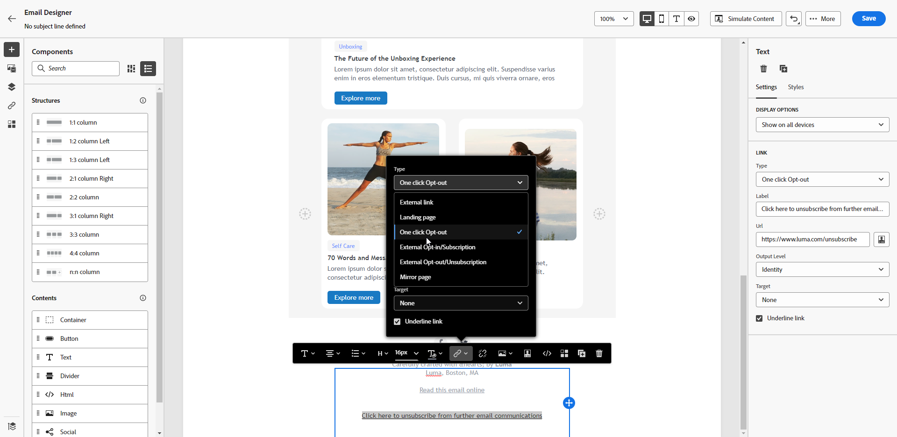

# Hantering av avanmälan via e-post {#email-opt-out}

När ni skickar meddelanden från resor eller kampanjer måste ni alltid se till att kunderna kan avbeställa dem från framtida kommunikation. När prenumerationen har avbrutits tas profilerna automatiskt bort från målgruppen för framtida marknadsföringsmeddelanden.  [Läs mer om sekretess- och avanmälningshantering](../privacy/opt-out.md)

>[!NOTE]
>
>Alla marknadsföringsmeddelanden måste innehålla en länk för avanmälan. Detta krävs inte för transaktionsmeddelanden. Meddelandekategorin - **[!UICONTROL Marketing]** eller **[!UICONTROL Transactional]** - definieras på [kanalkonfigurationsnivån](../configuration/channel-surfaces.md#email-type) och när meddelandet skapas.

Om du vill infoga en länk för att avbryta prenumerationen i ditt e-postinnehåll kan du:

* Lägg till en avbeställnings-URL med ett klick i e-postrubriken. Alternativet **[!UICONTROL Enable List-Unsubscribe]** på kanalkonfigurationsnivå lägger till en länk för att avanmäla sig till e-posthuvudet. [Läs mer om avanmälan i e-postmeddelandehuvudet](#unsubscribe-header)

* Aktivera länken **för avanmälan med ett klick** för ditt e-postmeddelande.  [Lär dig hur du lägger till en länk för avanmälan med ett enda klick](#one-click-opt-out)

* Infoga en **länk till en landningssida**. [Lär dig hur du lägger till en startsida för avanmälan](#opt-out-external-lp)

När en mottagare klickar på avanmälningslänken behandlas deras avanmälningsförfrågan därefter.

Om du vill kontrollera att den motsvarande profilens val har uppdaterats går du till Experience Platform och [bläddrar till profilen](https://experienceleague.adobe.com/en/docs/experience-platform/profile/ui/user-guide#attributes-tab). På fliken **[!UICONTROL Attributes]** kan du se att värdet för **[!UICONTROL choice]** har ändrats till **[!UICONTROL no]**. Läs mer i [Experience Platform-dokumentationen](https://experienceleague.adobe.com/en/docs/experience-platform/profile/ui/user-guide#browse-identity){target="_blank"}.


>[!NOTE]
>
>Ibland kan det ta längre tid att reflektera på profilnivå på grund av databearbetning i efterföljande steg. Ge systemet lite tid att uppdatera.

## Avanmäl dig i ett steg {#opt-out-one-step}

Med [!DNL Adobe Journey Optimizer] kan du konfigurera dina [e-postkonfigurationsinställningar](email-settings.md#list-unsubscribe) med en automatiskt genererad adress för att avbryta prenumerationen och en e-postadress i e-posthuvudet, eller inkludera en URL för att avanmäla dig med ett enda klick i e-postbrödtexten.

### Avbeställ en URL med ett klick i e-postrubriken {#unsubscribe-header}

Den enklickslistade avanmälnings-URL:en är en länk eller knapp för att avbryta prenumerationen som visas bredvid e-postavsändarinformationen och gör att mottagarna kan avanmäla sig direkt från sändlistan med ett enda klick. Lär dig hantera alternativet **[!UICONTROL List unsubscribe]** i [det här avsnittet](list-unsubscribe.md).

### Avanmäl dig från e-postinnehållet med ett klick {#one-click-opt-out}

Om du vill ange en personlig avanmälnings-URL infogar du en länk för att välja bort en anmälan med ett klick i e-postmeddelandets innehåll och anger den URL du vill använda, enligt beskrivningen nedan:

1. Få åtkomst till ditt e-postinnehåll och [infoga en länk](../email/message-tracking.md#insert-links).
1. Välj **[!UICONTROL One click Opt-out]** som typ av länk.

   

1. Ange URL-adressen till landningssidan där användaren omdirigeras när prenumerationen har avbrutits. Den här sidan är här för att bekräfta att avanmälan lyckades.

   >[!NOTE]
   >
   >Om du har aktiverat alternativet **[!UICONTROL List-Unsubscribe]** på [kanalkonfigurationsnivån](email-settings.md#list-unsubscribe) och har standardalternativet **[!UICONTROL One-click unsubscribe URL]** avmarkerat, används även den här URL:en för landningssidan när användarna klickar på länken för att avbryta prenumerationen i e-posthuvudet. [Läs mer](list-unsubscribe.md)

   

   Du kan anpassa länkarna. Läs mer om anpassade URL:er i [det här avsnittet](../personalization/personalization-syntax.md).

1. Välj hur du vill använda avanmälningen: på kanal- eller identitetsnivå.

   

   * **[!UICONTROL Channel]**: Avanmälningen gäller för framtida meddelanden som skickas till profilens mål (dvs. e-postadress) för den aktuella kanalen. Om flera mål är kopplade till en profil gäller avanmälan alla mål (t.ex. e-postadresser) i profilen för den kanalen.
   * **[!UICONTROL Identity]**: Avanmälan gäller för framtida meddelanden som skickas till det specifika målet (dvs. e-postadress) som används för det aktuella meddelandet.
     <!--* **[!UICONTROL Subscription]**: The opt-out applies to future messages associated with a specific subscription list. This option can only be selected if the current message is associated with a subscription list.-->

1. Spara ändringarna.


## Avanmäl dig i två steg {#opt-out-external-lp}

Standardavanmälningsmekanismen bygger på två steg: abonnenten klickar på avanmälningslänken i ett e-postmeddelande och sedan dirigeras de om till en avanmälningssida för att bekräfta sin avanmälan.

Om du vill använda det här avabonnemangsläget måste du skapa och publicera en avanmälningssida och lägga till en länk för avanmälan i dina e-postmeddelanden, med en länk till landningssidan. Dessa steg beskrivs nedan.


### Förhandskrav {#prereq-lp}

Om du vill konfigurera en avanmälningsmekanism i två steg måste du skapa egna avanmälningssidor. Den första landningssidan länkas från ditt meddelande och måste innehålla en call-to-action-knapp. Ett bekräftelsemeddelande ska visas när användaren klickar på knappen.

Lär dig hur du skapar en landningssida i Adobe Journey Optimizer för att hantera avbeställningar på [den här sidan](../landing-pages/lp-use-cases.md#opt-out).

Du kan också använda en extern landningssida. I så fall konfigurerar du API:t så att informationen skickas till Adobe Journey Optimizer när en mottagare har avbrutit prenumerationen.

+++ Lär dig hur du implementerar ett API-anrop för avanmälan

Om du vill att mottagarna ska avanmäla sig när de skickar in sitt val från landningssidan måste du implementera ett **API-anrop för prenumeration** till [Adobe Developer](https://developer.adobe.com){target="_blank"} för att uppdatera inställningarna för motsvarande profiler.

Detta POST-anrop är följande:

Slutpunkt: https://platform.adobe.io/journey/imp/consent/preferences

Frågeparametrar:

* **parametrar**: innehåller den krypterade nyttolasten
* **pid**: krypterat profil-ID

Dessa två parametrar kommer att ingå i den URL till landningssidan som skickas till mottagaren:


Huvudkrav:

* x-api-key
* x-gw-ims-org-id
* x-sandbox-name
* behörighet (användartoken från ditt tekniska konto)

Begärandetext:

```
{
   "marketing": [
       {
            "type": "email",           
            "choice": "no",          
            "scope": "channel"       
        }
    ],
 
}
```

[!DNL Journey Optimizer] använder de här parametrarna för att uppdatera den motsvarande profilens val via API-anropet [ Adobe Developer](https://developer.adobe.com){target="_blank"}.

+++


### Lägg till en länk för att avbryta prenumerationen {#add-unsubscribe-link}

Du måste först lägga till en länk för att avbryta prenumerationen i ett meddelande. Gör så här:

1. Skapa ett meddelande och [infoga en länk](../email/message-tracking.md#insert-links) med hjälp av det sammanhangsberoende verktygsfältet.

   

1. Välj **[!UICONTROL Landing page]** i listrutan **[!UICONTROL Type]** och välj din avanmälningssida i fältet **[!UICONTROL Landing page]**.

   Om du använder en extern landningssida väljer du **[!UICONTROL External Opt-out/Unsubscription]** i listrutan **[!UICONTROL Type]**.

   

   Klistra in länken till tredjepartssidan i fältet **[!UICONTROL Link]**.

   

1. Klicka på **[!UICONTROL Save]**.


### Skicka meddelandet med en länk för att avbryta prenumerationen {#send-message-unsubscribe-link}

När du har konfigurerat länken för att avbryta prenumerationen på din landningssida kan du skapa och skicka ett meddelande.

1. Konfigurera meddelandet med en länk för att avbryta prenumerationen och skicka det till prenumeranterna.

1. Om mottagaren klickar på länken för att avbryta prenumerationen visas din startsida när meddelandet har tagits emot.

   

1. Om mottagaren skickar formuläret - här genom att klicka på knappen **[!UICONTROL Unsubscribe]** på landningssidan - uppdateras profildata via API-anropet.

1. Mottagaren omdirigeras sedan till ett bekräftelsemeddelande som anger att avanmälan lyckades.

   

   Därför får den här användaren inte information från ert varumärke om han eller hon inte prenumererar igen.

