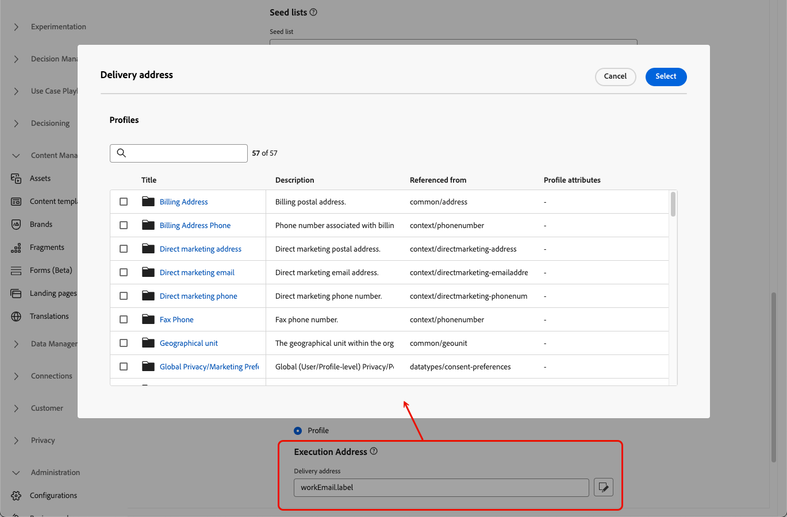

# Konfigurera e-postinställningar {#email-settings}

Om du vill börja skapa ett e-postmeddelande måste du konfigurera e-postkanalskonfigurationer som definierar alla tekniska parametrar som krävs för dina meddelanden. [Lär dig skapa konfigurationer](../configuration/channel-surfaces.md)

>[!NOTE]
>
>För att bevara ditt rykte och förbättra leveransmöjligheterna ska du konfigurera de underdomäner du ska använda för att skicka e-post innan du skapar en e-postkonfiguration. [Läs mer](../configuration/about-subdomain-delegation.md)

Definiera e-postinställningarna i det dedikerade avsnittet i kanalkonfigurationen, enligt beskrivningen nedan.

{width="50%" align="left"}

E-postkonfigurationen hämtas upp för att skicka kommunikation enligt logiken nedan:

* För batchresor gäller det inte batchkörning som redan hade startats innan e-postytans konfiguration gjordes. Ändringen registreras vid nästa återkommande eller nya körning.

* För transaktionsmeddelanden hämtas ändringen omedelbart för nästa kommunikation (upp till fem minuters fördröjning).

>[!NOTE]
>
>De uppdaterade e-postkonfigurationsinställningarna hämtas automatiskt under den resa eller de kampanjer där konfigurationen används.

## E-posttyp {#email-type}

>[!CONTEXTUALHELP]
>id="ajo_admin_presets_emailtype"
>title="Definiera e-posttypen"
>abstract="Välj den typ av e-postmeddelanden som ska skickas när den här konfigurationen används: Marknadsföring för e-postreklam som kräver användarens samtycke eller Transaktion för icke-kommersiella e-postmeddelanden som också kan skickas till profiler som inte längre prenumererar i specifika sammanhang."

I avsnittet **E-posttyp** väljer du typ av meddelande för konfigurationen: **[!UICONTROL Marketing]** eller **[!UICONTROL Transactional]**.

* Välj **Marknadsföring** för e-postreklam, till exempel veckokampanjer för en återförsäljare. Dessa meddelanden kräver användarens samtycke.

* Välj **Transaktionell** för icke-kommersiell e-post, till exempel orderbekräftelse, meddelanden om lösenordsåterställning eller leveransinformation. Dessa e-postmeddelanden kan skickas till profiler som **avbeställer** från marknadsföringsmeddelanden. Dessa meddelanden kan bara skickas i särskilda sammanhang.

När du skapar ett meddelande måste du välja en giltig kanalkonfiguration som matchar den kategori du valde för e-postmeddelandet.

## Underdomän {#subdomains}

Välj den underdomän som ska användas för att skicka e-postmeddelanden.

>[!NOTE]
>
>Om du vill ha större kontroll över e-postinställningarna kan du definiera dynamiska underdomäner. [Läs mer](../email/surface-personalization.md#dynamic-subdomains)

Om du vill bevara domänens anseende, snabba upp processen för IP-uppvärmning och förbättra leveransmöjligheterna delegerar du dina sändande underdomäner till Adobe. [Läs mer](../configuration/about-subdomain-delegation.md)

## Information om IP-pool {#ip-pools}

Välj den IP-pool som ska associeras med konfigurationen. [Läs mer](../configuration/ip-pools.md)

{width="50%" align="left"}

Du kan inte fortsätta med att skapa konfigurationen medan den valda IP-poolen är under [utgåva](../configuration/ip-pools.md#edit-ip-pool) (**[!UICONTROL Processing]** status) och aldrig har associerats med den valda underdomänen. Annars kommer den äldsta versionen av associationen för IP-poolen/underdomänen fortfarande att användas. Om så är fallet sparar du konfigurationen som utkast och försöker igen när IP-poolen har statusen **[!UICONTROL Success]**.

>[!NOTE]
>
>I icke-produktionsmiljöer skapar Adobe inte körklara testunderdomäner och ger inte heller åtkomst till en delad sändande IP-pool. Du måste [delegera dina egna underdomäner](../configuration/delegate-subdomain.md) och använda IP-adresserna från poolen som tilldelats din organisation.

När en IP-pool har valts visas PTR-information när du hovrar över IP-adresserna som visas under listrutan IP-pool. [Läs mer om PTR-poster](../configuration/ptr-records.md)

>[!NOTE]
>
>Om en PTR-post inte är konfigurerad kan du kontakta Adobe.

## Avbeställ lista {#list-unsubscribe}

När du väljer en underdomän från listan visas alternativet **[!UICONTROL Enable List-Unsubscribe]**. Den är aktiverad som standard.

Det gör att du kan inkludera en avbruten URL-adress med ett klick i e-postmeddelandehuvudet. [Läs mer](list-unsubscribe.md)

## Huvudparametrar {#email-header}

I avsnittet **[!UICONTROL Header parameters]** anger du avsändarnamn och e-postadresser som är associerade med den typ av e-post som skickas med den konfigurationen. [Läs mer](header-parameters.md)

## BCC-e-post {#bcc-email}

Du kan skicka en identisk kopia (eller blind kopia) av e-postmeddelanden som skickats av [!DNL Journey Optimizer] till en BCC-inkorg där de lagras för att uppfylla regelkraven eller arkiveras.

Aktivera den valfria funktionen **[!UICONTROL BCC email]** på kanalkonfigurationsnivån om du vill göra det. [Läs mer](../configuration/archiving-support.md#bcc-email)

När du definierar adressen **[!UICONTROL Bcc email]** måste du dessutom se till att använda en underdomän som har en giltig MX-postkonfiguration, annars misslyckas e-postkonfigurationsbearbetningen.

Om du får ett felmeddelande när du skickar e-postkonfigurationen betyder det att MX-posten inte är konfigurerad för underdomänen till den angivna adressen. Kontakta administratören för att konfigurera motsvarande MX-post eller använd en annan adress med en giltig MX-postkonfiguration.

## Skicka till undertryckta e-postadresser {#send-to-suppressed-email-addresses}

>[!CONTEXTUALHELP]
>id="ajo_surface_suppressed_addresses"
>title="Åsidosätt prioritet för undertryckningslista"
>abstract="Du kan välja att skicka transaktionsmeddelanden till profiler även om deras e-postadresser finns med i listan över Adobe Journey Optimizer-inaktiveringar på grund av skräppost. Det här alternativet är inaktiverat som standard."
>additional-url="https://experienceleague.adobe.com/docs/journey-optimizer/using/configuration/monitor-reputation/manage-suppression-list.html?lang=sv-SE" text="Hantera listan över inaktiveringar"

>[!IMPORTANT]
>
>Det här alternativet är bara tillgängligt om du har valt e-posttypen **[!UICONTROL Transactional]**. [Läs mer](#email-type)

I [!DNL Journey Optimizer] samlas alla e-postadresser som är markerade som hårda studsar, mjuka studsar och skräppostklagomål automatiskt in i [suppressionslistan](../configuration/manage-suppression-list.md) och utesluts från att skickas in en resa eller en kampanj.

Du kan dock bestämma dig för att fortsätta skicka meddelanden av typen **transactional** till profiler även om deras e-postadresser finns med i listan över inaktiveringar på grund av skräppost från användaren.

Transaktionsmeddelanden innehåller vanligtvis användbar och förväntad information, t.ex. en orderbekräftelse eller ett meddelande om lösenordsåterställning. Även om de har rapporterat ett av dina marknadsföringsmeddelanden som skräppost vill ni därför oftast att kunderna ska få den här typen av icke-kommersiell e-post.

Om du vill inkludera e-postadresser som inte har angetts på grund av skräppost i målgruppen för transaktionsmeddelanden väljer du motsvarande alternativ i avsnittet **[!UICONTROL Send to suppressed email addresses]**.

>[!NOTE]
>
>Det här alternativet är inaktiverat som standard.

Det här alternativet är som standard inaktiverat för att säkerställa att de kunder som har avanmält sig inte kontaktas. Du kan dock ändra det här standardalternativet, som gör att du kan skicka transaktionsmeddelanden till dina kunder.

När det här alternativet är aktiverat kan kunden, trots att kunden har markerat ditt marknadsföringsmeddelande som skräppost, ta emot dina transaktionsmeddelanden med den aktuella konfigurationen. Se alltid till att hantera avanmälningsinställningar i enlighet med bästa praxis för leveranser.

## Frölista {#seed-list}

>[!CONTEXTUALHELP]
>id="ajo_surface_seed_list"
>title="Lägga till en startvärdeslista"
>abstract="Välj önskad startlista för att automatiskt lägga till specifika interna adresser till era målgrupper. Dessa dirigerade adresser kommer att inkluderas vid leveranstillfället och kommer att få en exakt kopia av meddelandet i säkerhetssyfte."
>additional-url="https://experienceleague.adobe.com/docs/journey-optimizer/using/configuration/seed-lists.html?lang=sv-SE#use-seed-list" text="Vad är utsädeslistor?"

Med en startvärdeslista i [!DNL Journey Optimizer] kan du automatiskt inkludera specifika e-postadresser i dina leveranser. [Läs mer](../configuration/seed-lists.md)

>[!CAUTION]
>
>Den här funktionen gäller för närvarande bara för e-postkanalen.

Välj den lista som är relevant för dig i avsnittet **[!UICONTROL Seed list]**. Lär dig hur du skapar en startvärdeslista i [det här avsnittet](../configuration/seed-lists.md#create-seed-list).

{width="80%"}

>[!NOTE]
>
>Det går bara att välja en startvärdeslista åt gången.

När den aktuella konfigurationen används i en kampanj eller resa, inkluderas e-postadresserna i den valda startlistan vid körningstiden, vilket innebär att de får en kopia av leveransen i säkerhetssyfte.

Lär dig hur du använder startvärdeslista i en kampanj eller en resa i [det här avsnittet](../configuration/seed-lists.md#use-seed-list).

## Parametrar för återförsök av e-post {#email-retry}

>[!CONTEXTUALHELP]
>id="ajo_admin_presets_retryperiod"
>title="Justera tidsperioden för återförsök"
>abstract="Försök utförs i 3,5 dagar (84 timmar) när en e-postleverans misslyckas på grund av ett tillfälligt fel med mjuk avhoppning. Du kan justera den här standardperioden för återförsök så att den passar dina behov bättre."
>additional-url="https://experienceleague.adobe.com/docs/journey-optimizer/using/configuration/monitor-reputation/retries.html?lang=sv-SE" text="Om återförsök"

Du kan konfigurera **parametrarna för återförsök via e-post**.

Som standard är [återförsökstiden](../configuration/retries.md#retry-duration) inställd på 84 timmar, men du kan justera den här inställningen så att den passar dina behov bättre.

Du måste ange ett heltalsvärde (i timmar eller minuter) inom följande intervall:

* För marknadsföringsmeddelanden är den minsta återförsöksperioden 6 timmar.
* För transaktionsmejl är den minsta återförsöksperioden 10 minuter.
* För båda e-posttyperna är den maximala återförsöksperioden 84 timmar (eller 5 040 minuter).

Läs mer om återförsök i [det här avsnittet](../configuration/retries.md).

## URL-uppföljning {#url-tracking}

Du kan använda **[!UICONTROL URL tracking parameters]** för att mäta effekten av dina marknadsföringssatsningar i alla kanaler. [Läs mer](url-tracking.md)

## Körningsadress {#execution-address}

När du anger en profil som mål kan det finnas flera e-postadresser i databasen (professionell e-postadress, personlig e-postadress osv.).

I så fall använder [!DNL Journey Optimizer] den adress som anges i **[!UICONTROL Execution fields]** på sandlådenivå för att avgöra vilken e-postadress som ska användas från profiltjänsten i prioritetsordning. [Läs mer](../configuration/primary-email-addresses.md)

>[!NOTE]
>
>Om du vill kontrollera de fält som används som standard går du till menyn **[!UICONTROL Administration]** > **[!UICONTROL Channels]** > **[!UICONTROL General settings]** > **[!UICONTROL Executions fields]** .

Du kan dock ändra det här standardkörningsfältet på e-postkanalens konfigurationsnivå. Du kan sedan använda den här inställningen för specifika kampanjer eller resor.

Om du vill göra det redigerar du fältet **[!UICONTROL Delivery address]** och väljer ett objekt i listan med tillgängliga XDM-fält för e-posttyp. [Läs mer](../configuration/primary-email-addresses.md#override-execution-address-channel-config)

