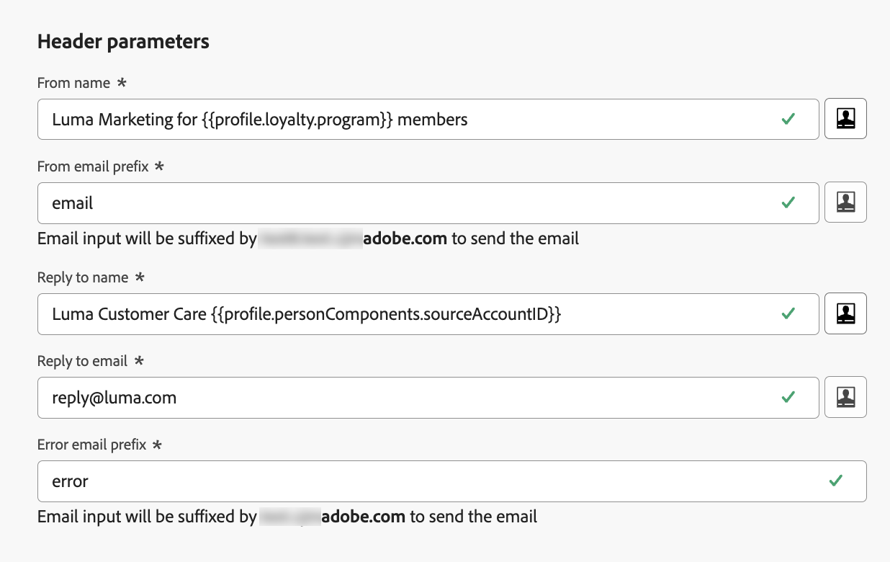

# Konfigurera e-postinställningar {#email-settings}

Om du vill börja skapa ett e-postmeddelande måste du konfigurera e-postkanalskonfigurationer som definierar alla tekniska parametrar som krävs för dina meddelanden. [Lär dig skapa konfigurationer](../configuration/channel-surfaces.md)

>[!NOTE]
>
>För att bevara ditt rykte och förbättra leveransmöjligheterna ska du konfigurera de underdomäner du ska använda för att skicka e-post innan du skapar en e-postkonfiguration. [Läs mer](../configuration/about-subdomain-delegation.md)

Definiera e-postinställningarna i det dedikerade avsnittet i kanalkonfigurationen, enligt beskrivningen nedan.

{width="50%" align="left"}

E-postkonfigurationen hämtas upp för att skicka kommunikation enligt logiken nedan:

* För batchresor gäller det inte batchkörning som redan hade startats innan e-postytans konfiguration gjordes. Ändringarna hämtas vid nästa upprepning eller vid nästa körning.

* För transaktionsmeddelanden hämtas ändringen omedelbart för nästa kommunikation (upp till fem minuters fördröjning).

>[!NOTE]
>
>De uppdaterade inställningarna för e-postkonfigurationen hämtas automatiskt under den resa eller de kampanjer där konfigurationen används.

## E-posttyp {#email-type}

>[!CONTEXTUALHELP]
>id="ajo_admin_presets_emailtype"
>title="Definiera e-posttypen"
>abstract="Välj den typ av e-postmeddelanden som ska skickas när den här konfigurationen används: Marknadsföring för e-postreklam som kräver användarens samtycke eller Transaktion för icke-kommersiella e-postmeddelanden som också kan skickas till profiler som inte längre prenumererar i specifika sammanhang."

I avsnittet **E-posttyp** väljer du typ av meddelande för konfigurationen: **[!UICONTROL Marketing]** eller **[!UICONTROL Transactional]**.

* Välj **Marknadsföring** för e-postreklam, till exempel veckokampanjer för en återförsäljare. Dessa meddelanden kräver användarens samtycke.

* Välj **Transaktionell** för icke-kommersiell e-post, till exempel orderbekräftelse, meddelanden om lösenordsåterställning eller leveransinformation. Dessa e-postmeddelanden kan skickas till profiler som **avbeställer** från marknadsföringsmeddelanden. Dessa meddelanden kan bara skickas i särskilda sammanhang.

När du skapar ett meddelande måste du välja en giltig kanalkonfiguration som matchar den kategori du valde för e-postmeddelandet.

## Underdomän {#subdomains}

Välj den underdomän som ska användas för att skicka e-postmeddelanden.

>[!NOTE]
>
>Om du vill ha större kontroll över e-postinställningarna kan du definiera dynamiska underdomäner. [Läs mer](../email/surface-personalization.md#dynamic-subdomains)

Om du vill bevara domänens anseende, snabba upp processen för IP-uppvärmning och förbättra leveransmöjligheterna delegerar du dina sändande underdomäner till Adobe. [Läs mer](../configuration/about-subdomain-delegation.md)

## Information om IP-pool {#ip-pools}

Välj den IP-pool som ska associeras med konfigurationen. [Läs mer](../configuration/ip-pools.md)

{width="50%" align="left"}

Du kan inte fortsätta med att skapa konfigurationen medan den valda IP-poolen är under [utgåva](../configuration/ip-pools.md#edit-ip-pool) (**[!UICONTROL Processing]** status) och aldrig har associerats med den valda underdomänen. Annars kommer den äldsta versionen av associationen för IP-poolen/underdomänen fortfarande att användas. Om så är fallet sparar du konfigurationen som utkast och försöker igen när IP-poolen har statusen **[!UICONTROL Success]**.

>[!NOTE]
>
>I icke-produktionsmiljöer skapar inte Adobe körklara testunderdomäner och ger inte heller åtkomst till en delad sändande IP-pool. Du måste [delegera dina egna underdomäner](../configuration/delegate-subdomain.md) och använda IP-adresserna från poolen som tilldelats din organisation.

När en IP-pool har valts visas PTR-information när du hovrar över IP-adresserna som visas under listrutan IP-pool. [Läs mer om PTR-poster](../configuration/ptr-records.md)

>[!NOTE]
>
>Om en PTR-post inte är konfigurerad kan du kontakta Adobe.

## Avbeställ sidhuvud{#list-unsubscribe}

<!--Do not modify - Legal Review Done -->

När [du väljer en underdomän ](#subdomains-and-ip-pools) i listan visas alternativet **[!UICONTROL Enable List-Unsubscribe]**.

Det här alternativet är aktiverat som standard för att inkludera en avbruten URL-adress med ett klick i e-posthuvudet, till exempel:

Om du inaktiverar det här alternativet visas ingen avbruten URL i e-posthuvudet med ett enda klick.

Du kan välja medgivandenivå i listrutan **[!UICONTROL Consent level]**. Den kan vara specifik för kanalen eller för profilens identitet. Baserat på den här inställningen uppdateras medgivandet i Adobe Journey Optimizer antingen på kanalnivå eller på ID-nivå när en användare avbeställer prenumerationen med hjälp av den listadress för avbeställning som finns i huvudet i ett e-postmeddelande.

Listan Avbeställ sidhuvud har två funktioner (mailto och One-click unsubscribe URL, som förklaras nedan) som är aktiverade som standard om du inte avmarkerar en eller båda funktionerna:

* En **e-postadress (avbeställ)**, som är den måladress dit avbeställningar skickas för automatisk bearbetning.

  I Journey Optimizer är e-postadressen för avanmälan den **e-postadress (unsubscribe)** som är standard och som visas i kanalkonfigurationen, baserat på din [valda underdomän](#subdomains-and-ip-pools).

  {width="80%" align="left"}

* **En-klicksavbehör-URL**, som är standardvärdet för vårt enklicksmeddelande för att välja URL-genererad lista för att avbryta prenumeration, baserat på den underdomän som du har angett och konfigurerat i kanalkonfigurationsinställningarna.

<!--
    >[!AVAILABILITY]
    >
    >One-click Unsubscribe URL Header will be available in Adobe Journey Optimizer starting June 3, 2024.
    >
-->

Funktionen **[!UICONTROL Mailto (unsubscribe)]** och funktionen **[!UICONTROL One-click Unsubscribe URL]** är valfria. Om du inte vill använda den standardgenererade URL-adressen för ett enda klick kan du avmarkera funktionen. Om du lägger till en [-klicksavanmälningslänk ](../privacy/opt-out.md#one-click-opt-out) i ett meddelande som skapats med den här konfigurationen, kommer rubriken för att avbryta prenumerationen att hämta den enklicksavanmälningslänk som du har infogat i e-postmeddelandets brödtext och använda den som ett-klicksavanmälan. I scenariot där alternativet **[!UICONTROL Opt-out configuration]** är aktiverat och funktionen **[!UICONTROL One-click Unsubscribe URL]** inte är markerad.

>[!NOTE]
>
>Om du inte lägger till en länk för avanmälan med ett enda klick i meddelandeinnehållet och standardadressen för ett klick avmarkeras i kanalkonfigurationsinställningarna, skickas ingen URL till e-posthuvudet som en del av rubriken för att avbryta prenumerationen.

Läs mer om hur du hanterar funktioner för att avbryta prenumerationen i dina meddelanden i [det här avsnittet](../email/email-opt-out.md#unsubscribe-header).

## Huvudparametrar {#email-header}

I avsnittet **[!UICONTROL Header parameters]** anger du avsändarnamn och e-postadresser som är associerade med den typ av e-post som skickas med den konfigurationen.

>[!NOTE]
>
>Om du vill ha större kontroll över e-postinställningarna kan du anpassa rubrikparametrarna. [Läs mer](../email/surface-personalization.md#personalize-header)

* **[!UICONTROL Sender name]**: Avsändarens namn, till exempel ditt varumärkes namn.
* **[!UICONTROL Sender email]**: Den e-postadress som du vill använda för din kommunikation.
* **[!UICONTROL Reply to (name)]**: Namnet som ska användas när mottagaren klickar på knappen **Svara** i sin e-postklientprogramvara.
* **[!UICONTROL Reply to (email)]**: Den e-postadress som ska användas när mottagaren klickar på knappen **Svara** i sin e-postklientprogramvara. [Läs mer](#reply-to-email)
* **[!UICONTROL Error email]**: Alla fel som genereras av Internet-leverantörer efter några dagar efter att e-post har levererats (asynkrona studsar) tas emot på den här adressen. Meddelanden och svar på frågor tas också emot på den här adressen.

  Om du vill få meddelanden och svar på frågor om att tjänsten inte är på kontoret på en viss e-postadress som inte har delegerats till Adobe måste du konfigurera en [framåtriktad process](#forward-email). I så fall ska du se till att du har en manuell eller automatiserad lösning för att bearbeta e-postmeddelanden som landar i den här inkorgen.

>[!CAUTION]
>
>**[!UICONTROL Sender email]**- och **[!UICONTROL Error email]**-adresserna måste använda den valda [delegerade underdomänen](../configuration/about-subdomain-delegation.md). Om den delegerade underdomänen till exempel är *marketing.luma.com* kan du använda *contact@marketing.luma.com* och *error@marketing.luma.com*.

>[!NOTE]
>
>Adresser måste börja med en bokstav (A-Z) och får bara innehålla alfanumeriska tecken. Du kan också använda understreck `_`, punkt `.` och bindestreck `-`.

### Svara på e-post {#reply-to-email}

När du definierar **[!UICONTROL Reply to (email)]**-adressen kan du ange vilken e-postadress som helst, förutsatt att det är en giltig adress, i korrekt format och utan att behöva skriva något.

Den inkorg som används för svar kommer att ta emot alla svarsmeddelanden, utom meddelanden som inte är på kontoret och svarsfrågor som tas emot på **[!UICONTROL Error email]**-adressen.

Följ rekommendationerna nedan för att säkerställa korrekt svarshantering:

* Kontrollera att den dedikerade inkorgen har tillräcklig mottagningskapacitet för att kunna ta emot alla svar som skickas med e-postkonfigurationen. Om inkorgen returnerar studsar kanske vissa svar från dina kunder inte tas emot.

* Svar måste behandlas med hänsyn till sekretess och efterlevnadsskyldigheter eftersom de kan innehålla personligt identifierbar information.

* Markera inte meddelanden som skräppost i svarsinkorgen eftersom det påverkar alla andra svar som skickas till den här adressen.

När du definierar adressen **[!UICONTROL Reply to (email)]** måste du dessutom se till att använda en underdomän som har en giltig MX-postkonfiguration, annars misslyckas e-postkonfigurationsbearbetningen.

Om du får ett felmeddelande när du skickar e-postkonfigurationen betyder det att MX-posten inte är konfigurerad för underdomänen till den angivna adressen. Kontakta administratören för att konfigurera motsvarande MX-post eller använd en annan adress med en giltig MX-postkonfiguration.

>[!NOTE]
>
>Om underdomänen för den adress du angav är en domän som [delegerats](../configuration/delegate-subdomain.md#full-subdomain-delegation) till Adobe, kontaktar du din kontoansvarige på Adobe.

### Vidarebefordra e-post {#forward-email}

Om du vill vidarebefordra alla e-postmeddelanden till en viss e-postadress som tagits emot av [!DNL Journey Optimizer] för den delegerade underdomänen kontaktar du Adobe kundtjänst.

>[!NOTE]
>
>Om den underdomän som används för adressen **[!UICONTROL Reply to (email)]** inte har delegerats till Adobe kan vidarebefordran inte fungera för den här adressen.

Du måste ange:

* Den e-postadress som du väljer. Observera att domänen för e-postadressen för vidarebefordran inte kan matcha någon underdomän som har delegerats till Adobe.
* Namn på din sandlåda.
* Konfigurationsnamnet eller underdomänen som e-postadressen för vidarebefordran ska användas för.
  <!--* The current **[!UICONTROL Reply to (email)]** address or **[!UICONTROL Error email]** address set at the channel configuration level.-->

>[!NOTE]
>
>Det får bara finnas en e-postadress per underdomän. Om flera konfigurationer använder samma underdomän, måste därför samma e-postadress för vidarebefordran användas för alla.

E-postadressen för vidarebefordran konfigureras av Adobe. Detta kan ta 3 till 4 dagar.

När du är klar vidarebefordras alla meddelanden som tas emot på **[!UICONTROL Reply to (email)]**- och **[!UICONTROL Error email]**-adresserna till den angivna e-postadressen.

## BCC-e-post {#bcc-email}

Du kan skicka en identisk kopia (eller blind kopia) av e-postmeddelanden som skickats av [!DNL Journey Optimizer] till en BCC-inkorg där de lagras för att uppfylla regelkraven eller arkiveras.

Aktivera den valfria funktionen **[!UICONTROL BCC email]** på kanalkonfigurationsnivån om du vill göra det. [Läs mer](../configuration/archiving-support.md#bcc-email)

När du definierar adressen **[!UICONTROL Bcc email]** måste du dessutom se till att använda en underdomän som har en giltig MX-postkonfiguration, annars misslyckas e-postkonfigurationsbearbetningen.

Om du får ett felmeddelande när du skickar e-postkonfigurationen betyder det att MX-posten inte är konfigurerad för underdomänen till den angivna adressen. Kontakta administratören för att konfigurera motsvarande MX-post eller använd en annan adress med en giltig MX-postkonfiguration.

## Skicka till undertryckta e-postadresser {#send-to-suppressed-email-addresses}

>[!CONTEXTUALHELP]
>id="ajo_surface_suppressed_addresses"
>title="Åsidosätt prioritet för undertryckningslista"
>abstract="Du kan välja att skicka transaktionsmeddelanden till profiler även om deras e-postadresser finns med i listan över Adobe Journey Optimizer-inaktiveringar på grund av skräppost. Det här alternativet är inaktiverat som standard."
>additional-url="https://experienceleague.adobe.com/docs/journey-optimizer/using/configuration/monitor-reputation/manage-suppression-list.html" text="Hantera listan över inaktiveringar"

>[!IMPORTANT]
>
>Det här alternativet är bara tillgängligt om du har valt e-posttypen **[!UICONTROL Transactional]**. [Läs mer](#email-type)

I [!DNL Journey Optimizer] samlas alla e-postadresser som är markerade som hårda studsar, mjuka studsar och skräppostklagomål automatiskt in i [suppressionslistan](../configuration/manage-suppression-list.md) och utesluts från att skickas in en resa eller en kampanj.

Du kan dock bestämma dig för att fortsätta skicka meddelanden av typen **transactional** till profiler även om deras e-postadresser finns med i listan över inaktiveringar på grund av skräppost från användaren.

Transaktionsmeddelanden innehåller vanligtvis användbar och förväntad information, t.ex. en orderbekräftelse eller ett meddelande om lösenordsåterställning. Även om de har rapporterat ett av dina marknadsföringsmeddelanden som skräppost vill ni därför oftast att kunderna ska få den här typen av icke-kommersiell e-post.

Om du vill inkludera e-postadresser som inte har angetts på grund av skräppost i målgruppen för transaktionsmeddelanden väljer du motsvarande alternativ i avsnittet **[!UICONTROL Send to suppressed email addresses]**.

>[!NOTE]
>
>Det här alternativet är inaktiverat som standard.

Det här alternativet är som standard inaktiverat för att säkerställa att de kunder som har avanmält sig inte kontaktas. Du kan dock ändra det här standardalternativet, som gör att du kan skicka transaktionsmeddelanden till dina kunder.

När det här alternativet är aktiverat kan kunden, trots att kunden har markerat ditt marknadsföringsmeddelande som skräppost, ta emot dina transaktionsmeddelanden med den aktuella konfigurationen. Se alltid till att hantera avanmälningsinställningar i enlighet med bästa praxis för leveranser.

## Frölista {#seed-list}

>[!CONTEXTUALHELP]
>id="ajo_surface_seed_list"
>title="Lägga till en startvärdeslista"
>abstract="Välj önskad startlista för att automatiskt lägga till specifika interna adresser till era målgrupper. Dessa dirigerade adresser kommer att inkluderas vid leveranstillfället och kommer att få en exakt kopia av meddelandet i säkerhetssyfte."
>additional-url="https://experienceleague.adobe.com/docs/journey-optimizer/using/configuration/seed-lists.html#use-seed-list" text="Vad är utsädeslistor?"

Med en startvärdeslista i [!DNL Journey Optimizer] kan du automatiskt inkludera specifika e-postadresser i dina leveranser. [Läs mer](../configuration/seed-lists.md)

>[!CAUTION]
>
>Den här funktionen gäller för närvarande bara för e-postkanalen.

Välj den lista som är relevant för dig i avsnittet **[!UICONTROL Seed list]**. Lär dig hur du skapar en startvärdeslista i [det här avsnittet](../configuration/seed-lists.md#create-seed-list).

>[!NOTE]
>
>Det går bara att välja en startvärdeslista åt gången.

När den aktuella konfigurationen används i en kampanj eller resa, inkluderas e-postadresserna i den valda startlistan vid körningstiden, vilket innebär att de får en kopia av leveransen i säkerhetssyfte.

Lär dig hur du använder startvärdeslista i en kampanj eller en resa i [det här avsnittet](../configuration/seed-lists.md#use-seed-list).

## Parametrar för återförsök av e-post {#email-retry}

>[!CONTEXTUALHELP]
>id="ajo_admin_presets_retryperiod"
>title="Justera tidsperioden för återförsök"
>abstract="Försök utförs i 3,5 dagar (84 timmar) när en e-postleverans misslyckas på grund av ett tillfälligt fel med mjuk avhoppning. Du kan justera den här standardperioden för återförsök så att den passar dina behov bättre."
>additional-url="https://experienceleague.adobe.com/docs/journey-optimizer/using/configuration/monitor-reputation/retries.html" text="Om återförsök"

Du kan konfigurera **parametrarna för återförsök via e-post**.

Som standard är [återförsökstiden](../configuration/retries.md#retry-duration) inställd på 84 timmar, men du kan justera den här inställningen så att den passar dina behov bättre.

Du måste ange ett heltalsvärde (i timmar eller minuter) inom följande intervall:

* För marknadsföringsmeddelanden är den minsta återförsöksperioden 6 timmar.
* För transaktionsmejl är den minsta återförsöksperioden 10 minuter.
* För båda e-posttyperna är den maximala återförsöksperioden 84 timmar (eller 5 040 minuter).

Läs mer om återförsök i [det här avsnittet](../configuration/retries.md).

## URL-uppföljning {#url-tracking}

>[!CONTEXTUALHELP]
>id="ajo_admin_preset_utm"
>title="Definiera parametrar för URL-spårning"
>abstract="Använd det här avsnittet om du automatiskt vill lägga till spårningsparametrar till de URL:er som finns i ditt e-postinnehåll. Den här funktionen är valfri."

>[!CONTEXTUALHELP]
>id="ajo_admin_preset_url_preview"
>title="Förhandsgranska URL-spårningsparametrar"
>abstract="Granska hur spårningsparametrar läggs till i de URL:er som finns i ditt e-postinnehåll."

Du kan använda **[!UICONTROL URL tracking parameters]** för att mäta effekten av dina marknadsföringssatsningar i alla kanaler. Den här funktionen är valfri.

Parametrarna som definieras i det här avsnittet läggs till i slutet av de URL:er som ingår i e-postmeddelandeinnehållet. Du kan sedan hämta parametrarna i webbanalysverktyg som Adobe Analytics eller Google Analytics och skapa olika prestandarapporter.

Du kan lägga till upp till 10 spårningsparametrar med knappen **[!UICONTROL Add new parameter]**.

Om du vill konfigurera en URL-spårningsparameter kan du ange önskade värden direkt i fälten **[!UICONTROL Name]** och **[!UICONTROL Value]**.

Du kan också redigera varje **[!UICONTROL Value]**-fält med [anpassningsredigeraren](../personalization/personalization-build-expressions.md). Klicka på utgåveikonen för att öppna redigeraren. Därifrån kan du välja tillgängliga sammanhangsberoende attribut och/eller redigera texten direkt.

Följande fördefinierade värden är tillgängliga via personaliseringsredigeraren:

* **Source åtgärds-ID**: ID för e-poståtgärden som har lagts till i resan eller kampanjen.

* **Source-åtgärdsnamn**: namnet på e-poståtgärden som har lagts till i resan eller kampanjen.

* **Source-id**: ID för resan eller kampanjen som e-postmeddelandet skickades med.

* **Source-namn**: namn på den resa eller kampanj som e-postmeddelandet skickades med.

* **Source version-ID**: ID för resan eller kampanjversionen som e-postmeddelandet skickades med.

* **Erbjudande-ID**: ID för erbjudandet som används i e-postmeddelandet.

>[!NOTE]
>
>Du kan kombinera textvärden och använda sammanhangsberoende attribut från personaliseringsredigeraren. Varje **[!UICONTROL Value]**-fält kan innehålla ett antal tecken upp till gränsen på 5 kB.

<!--You can drag and drop the parameters to reorder them.-->

Nedan finns exempel på Adobe Analytics- och Google Analytics-kompatibla URL:er.

* Adobe Analytics-kompatibel URL: `www.YourLandingURL.com?cid=email_AJO_{{context.system.source.id}}_image_{{context.system.source.name}}`

* Google Analytics-kompatibel URL: `www.YourLandingURL.com?utm_medium=email&utm_source=AJO&utm_campaign={{context.system.source.id}}&utm_content=image`

Du kan dynamiskt förhandsgranska den resulterande spårnings-URL:en. Varje gång du lägger till, redigerar eller tar bort en parameter uppdateras förhandsvisningen automatiskt.

>[!NOTE]
>
>Du kan också lägga till dynamiska, anpassade spårningsparametrar till länkarna i ditt e-postinnehåll, men detta är inte möjligt på konfigurationsnivå. Du måste göra detta när du redigerar meddelandet med e-postdesignern. [Läs mer](message-tracking.md#url-tracking)

## Körningsadress {#execution-address}

>[!CONTEXTUALHELP]
>id="ajo_email_config_execution_address"
>title="Definiera vilken adress som ska användas"
>abstract="När det finns flera e-postadresser eller telefonnummer i databasen (personliga, professionella, osv.) kan du välja vilken som ska prioriteras för sändning."

När du anger en profil som mål kan det finnas flera e-postadresser i databasen (professionell e-postadress, personlig e-postadress osv.).

I så fall använder [!DNL Journey Optimizer] den adress som anges i **[!UICONTROL Execution fields]** på sandlådenivå för att avgöra vilken e-postadress som ska användas från profiltjänsten i prioritetsordning. [Läs mer](../configuration/primary-email-addresses.md)

>[!NOTE]
>
>Om du vill kontrollera de fält som används som standard går du till menyn **[!UICONTROL Administration]** > **[!UICONTROL Channels]** > **[!UICONTROL General settings]** > **[!UICONTROL Executions fields]** .

Du kan dock ändra det här standardkörningsfältet på e-postkanalens konfigurationsnivå.

Om du vill göra det redigerar du fältet **[!UICONTROL Delivery address]** och väljer ett objekt i listan med tillgängliga XDM-fält för e-posttyp.

Körningsfältet uppdateras och används sedan som primär adress. Den åsidosätter den allmänna inställningen på sandlådenivå.
