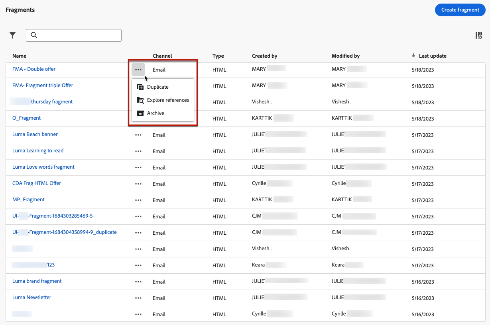

# Arbeta med fragment {#fragments}

Ett fragment är en återanvändbar komponent som kan refereras i en eller flera e-postmeddelanden som [!DNL Journey Optimizer] kampanjer och resor.

Med den här funktionen kan man skapa flera anpassade innehållsblock som kan användas av icke-tekniska marknadsföringsanvändare för att snabbt sammanställa e-postinnehåll i en förbättrad designprocess.

<!--
➡️ [Learn how to create and use templates in this video](#video-templates)-->

>[!CAUTION]
>
>Om du vill skapa, redigera och arkivera fragment måste du ha **[!DNL Manage Library Items]** behörighet som ingår i **[!DNL Content Library Manager]** produktprofil. [Läs mer](../administration/ootb-product-profiles.md#content-library-manager)

Så här använder du fragment på bästa sätt:

* Skapa egna fragment. Se [Skapa fragment](#create-fragments)
* Använd dem så många gånger som behövs i e-postmeddelandena. Se [Använd fragment](#use-fragments)

>[!NOTE]
>
>Den här funktionen är för närvarande bara tillgänglig för e-post.

## Få åtkomst till och hantera fragment {#access-manage-fragments}

Om du vill komma åt fragmentlistan väljer du **[!UICONTROL Content Management]** > **[!UICONTROL Fragments]** från den vänstra menyn.

Alla fragment som skapades i den aktuella sandlådan - antingen från **[!UICONTROL Fragments]** meny, antingen med [Spara som fragment](#save-as-fragment) -alternativ visas.

Du kan filtrera fragment när de skapas eller ändras. Du kan välja att visa alla fragment eller bara de objekt som den aktuella användaren har skapat eller ändrat. Du kan även visa **[!UICONTROL Archived]** fragment. [Läs mer](#archive-fragments)

Från **[!UICONTROL More actions]** -ikonen bredvid varje fragment kan du:

* Duplicera ett fragment.

* Använd **[!UICONTROL Explore references]** möjlighet att se resorna, kampanjerna eller mallarna där de används. [Läs mer](#explore-references)

* Arkivera ett fragment. [Läs mer](#archive-fragments)

### Redigera fragment {#edit-fragments}

Om du vill redigera ett fragment följer du stegen nedan.

1. Klicka på önskat objekt på **[!UICONTROL Fragment]** lista.
1. Från fragmentegenskaperna kan du [utforska referenser](#explore-references), [hantera åtkomsten](../administration/object-based-access.md) och uppdatera fragmentinformationen.

   

1. Markera motsvarande knapp om du vill redigera innehåll på samma sätt som när du skapar ett fragment från början. [Läs mer](#create-from-scratch)

>[!NOTE]
>
>När du redigerar ett fragment sprids ändringarna automatiskt till alla e-postmeddelanden eller mallar som innehåller det fragmentet, förutom e-postmeddelanden som används i **[!UICONTROL Live]** resor eller kampanjer. Du kan också bryta arv från det ursprungliga fragmentet. [Läs mer](#break-inheritance)

<!--Changes made to a fragment are not propagated to live journeys or campaigns where it is used.-->

<!--When added to an email, if you want to modify a fragment for a specific email, you can break the synchronization with the original fragment. The fragment becomes part of the email content and the changes will not be synchronized anymore. [Learn more](#break-inheritance)-->

### Utforska referenser {#explore-references}

Du kan visa en lista över resor, kampanjer och innehållsmallar som för närvarande använder ett fragment.

Om du vill göra det väljer du **[!UICONTROL Explore references]** antingen från **[!UICONTROL More actions]** i fragmentlistan eller från skärmen för fragmentegenskaper.

Välj en flik för att växla mellan resor, kampanjer och mallar. Du kan se deras status och klicka på ett namn som ska omdirigeras till motsvarande objekt där fragmentet refereras.

>[!NOTE]
>
>Om fragmentet används i en resa, kampanj eller mall som har en etikett som hindrar dig från att komma åt det, visas ett varningsmeddelande ovanför den valda fliken. [Läs mer om OLAC (Object Level Access Control)](../administration/object-based-access.md)

### Arkivera fragment {#archive-fragments}

Du kan rensa fragmentlistan från objekt som inte längre är relevanta för ert varumärke.

Om du vill göra det klickar du på **[!UICONTROL More actions]** -ikonen bredvid det önskade fragmentet och välj **[!UICONTROL Archive]**. Den försvinner från fragmentlistan, vilket förhindrar att den används i framtida e-postmeddelanden eller mallar.

>[!NOTE]
>
>Om du arkiverar ett fragment som används i ett e-postmeddelande eller i en innehållsmall <!--it will remain in the email or template, but you won't be able to select it from the fragment list to edit it-->e-postmeddelandet eller mallen kommer inte att påverkas.

Om du vill arkivera ett fragment, filtrera på **[!UICONTROL Archived]** objekt och markera **[!UICONTROL Unarchive]** från **[!UICONTROL More actions]** -menyn. Det är nu igen tillgängligt från fragmentlistan och kan användas i alla e-postmeddelanden och mallar.

## Skapa fragment {#create-fragments}

Det finns två sätt att skapa fragment:

* Skapa ett fragment från grunden med **[!UICONTROL Fragments]** dedikerad meny. [Lär dig mer](#create-template-from-scratch)

* När du utformar ett e-postmeddelande eller en innehållsmall sparar du en del av innehållet som fragment. [Lär dig mer](#save-as-template)

När fragmentet har sparats är det tillgängligt för användning under en resa, en kampanj eller en mall. Oavsett om du har skapat från grunden eller från ett befintligt innehåll kan du nu använda det här fragmentet när du skapar [e-post](get-started-email-design.md) eller [innehållsmall](content-templates.md) inom [!DNL Journey Optimizer]. [Läs mer](#use-fragments)

### Skapa från grunden {#create-from-scratch}

>[!CONTEXTUALHELP]
>id="ajo_create_fragment"
>title="Definiera ditt eget fragment"
>abstract="Skapa ett fristående fragment från scratch för att göra innehållet återanvändbart på flera resor och i flera kampanjer."

Följ stegen nedan om du vill skapa ett fragment från grunden.

1. Åtkomst till fragmentlistan via **[!UICONTROL Content Management]** > **[!UICONTROL Fragments]** vänster meny.

1. Välj **[!UICONTROL Create fragment]**.

1. Fyll i fragmentinformationen, dvs. namn och beskrivning (om det behövs).

   

   >[!NOTE]
   >
   >För närvarande bara **[!UICONTROL Visual fragment]** text och **E-post** kanalen stöds.

1. Om du vill tilldela egna eller grundläggande användningsrubriker till fragmentet väljer du **[!UICONTROL Manage access]**. [Läs mer om OLAC (Object Level Access Control)](../administration/object-based-access.md).

1. Klicka på **[!UICONTROL Create]**.

1. The [E-postdesigner](get-started-email-design.md) visas. Redigera innehåll efter behov, på samma sätt som du gör för alla e-postmeddelanden som finns på en resa eller en kampanj.

   >[!NOTE]
   >
   >Du kan lägga till anpassningsfält och dynamiskt innehåll, men kontextuella attribut stöds inte i fragment.

   

1. När fragmentet är klart klickar du på **[!UICONTROL Save]**.

1. Klicka vid behov på pilen bredvid fragmentnamnet för att gå tillbaka till **[!UICONTROL Details]** och redigera.

   

Det här fragmentet är nu klart att användas när du skapar [e-post](get-started-email-design.md) eller [innehållsmall](content-templates.md) inom [!DNL Journey Optimizer]. [Lär dig mer](#use-fragments)

### Spara som fragment {#save-as-fragment}

När en [innehållsmall](content-templates.md) eller en [e-post](get-started-email-design.md) i en kampanj eller en resa kan du spara en del av innehållet som fragment för framtida återanvändning. Följ stegen nedan för att göra detta.

1. I [E-postdesigner](get-started-email-design.md)klickar du på ellipsen högst upp till höger på skärmen.

1. Välj **[!UICONTROL Save as fragment]** i listrutan.

   

1. The **[!UICONTROL Save as fragment]** visas. Här väljer du de element som du vill inkludera i fragmentet, inklusive anpassningsfält och dynamiskt innehåll. Observera att kontextuella attribut inte stöds i fragment.

   >[!CAUTION]
   >
   >Du kan bara markera intilliggande avsnitt. Du kan inte markera en tom struktur eller ett annat fragment.

   

1. Klicka på **[!UICONTROL Create]**. Fyll i fragmentinformationen, dvs. namn och beskrivning (om det behövs).

   

   >[!NOTE]
   >
   >För närvarande bara **[!UICONTROL Visual fragment]** text och **E-post** kanalen stöds.

1. Om du vill tilldela egna eller grundläggande användningsrubriker till fragmentet väljer du **[!UICONTROL Manage access]**. [Läs mer om OLAC (Object Level Access Control)](../administration/object-based-access.md).

1. Klicka **[!UICONTROL Create]** igen. Fragmentet sparas i **[!UICONTROL Fragments]** lista, tillgänglig från [!DNL Journey Optimizer] dedikerad meny.

   Det blir ett fristående fragment som kan [använd](#access-manage-fragments), [redigerad](#edit-fragments) och [arkiverad](#archive-fragments) som alla andra objekt i den listan.

Du kan nu använda det här fragmentet när du skapar [e-post](get-started-email-design.md) eller [innehållsmall](content-templates.md) inom [!DNL Journey Optimizer]. [Lär dig mer](#use-fragments)

>[!NOTE]
>
>Ändringar i det nya fragmentet sprids inte till e-postmeddelandet eller mallen som det kommer från. På samma sätt ändras inte det nya fragmentet när det ursprungliga innehållet redigeras i e-postmeddelandet eller mallen.

## Använd fragment {#use-fragments}

Du kan använda ett fragment i en [e-post](get-started-email-design.md) inom en resa eller kampanj, eller i [innehållsmall](content-templates.md).

1. Öppna e-post- eller mallinnehåll med [E-postdesigner](get-started-email-design.md).

1. Välj **[!UICONTROL Fragments]** ikonen från den vänstra listen.

   

1. Listan över alla fragment som skapats i den aktuella sandlådan visas. Du kan:

   * Sök efter ett visst fragment genom att börja skriva dess etikett.
   * Sortera fragment i stigande eller fallande ordning.
   * Ändra hur fragmenten visas (kort eller listvy).

1. Du kan också uppdatera listan.

   >[!NOTE]
   >
   >Om vissa fragment har ändrats eller lagts till medan du redigerar innehållet, uppdateras listan med de senaste ändringarna.

1. Dra och släpp ett fragment från listan till området där du vill infoga det.

   

1. Precis som andra komponenter kan du flytta runt fragmentet i innehållet.

1. Markera fragmentet för att visa motsvarande ruta till höger. Därifrån kan du ta bort fragmentet från innehållet eller duplicera det. Du kan också utföra dessa åtgärder direkt från den snabbmeny som visas ovanpå fragmentet.

   

1. Från **[!UICONTROL Settings]** kan du

   * Välj de enheter som du vill att fragmentet ska visas på.
   * Öppna fragmentet på en ny flik om du vill redigera det. [Läs mer](#edit-fragments)
   * Utforska referenser. [Läs mer](#explore-references)

1. Du kan anpassa fragmentet ytterligare med **[!UICONTROL Styles]** -fliken.

1. Vid behov kan du bryta arvet med det ursprungliga fragmentet. [Läs mer](#break-inheritance)

1. Lägg till så många fragment du vill och **[!UICONTROL Save]** dina ändringar.

### Bryt arv {#break-inheritance}

När du redigerar ett fragment synkroniseras ändringarna. De sprids automatiskt till alla **[!UICONTROL Draft]** resor/kampanjer och innehållsmallar som innehåller det fragmentet.

>[!NOTE]
>
>Ändringarna sprids inte till e-postmeddelanden som används i **[!UICONTROL Live]** resor eller kampanjer.

När fragment läggs till i ett e-postmeddelande eller i en innehållsmall synkroniseras de som standard.

Du kan emellertid bryta arvet från det ursprungliga fragmentet. I så fall kopieras fragmentets innehåll till den aktuella designen och ändringarna kommer inte att synkroniseras längre.

Följ stegen nedan för att bryta arv:

1. Markera fragmentet.

1. Klicka på upplåsningsikonen i det sammanhangsberoende verktygsfältet.

   

1. Det fragmentet blir ett fristående element som inte längre är länkat till det ursprungliga fragmentet. Redigera det som vilken annan innehållskomponent som helst i innehållet. [Läs mer](content-components.md)

<!--

## How-to video {#video-templates}

Learn how to create, edit, and use fragments in [!DNL Journey Optimizer].

>[!VIDEO](https://video.tv.adobe.com/v/3413743/?quality=12)

-->
