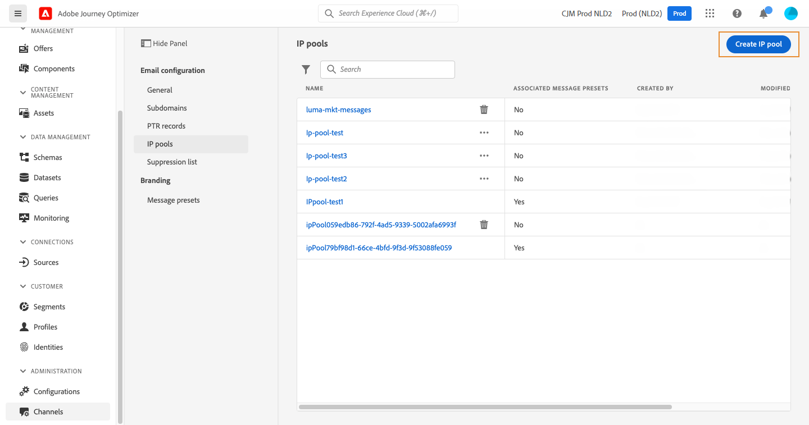

# Kom igång med e-postkonfiguration {#get-starte-email-config}

Om du vill kunna skicka e-post via resor och kampanjer i [!DNL Journey Optimizer] måste du gå igenom ett antal konfigurationssteg.

1. För att säkerställa optimal leverans och skydda ditt rykte börjar du med att **delegera de underdomäner** du tänker använda för att skicka e-postmeddelanden med [!DNL Journey Optimizer] till Adobe. Dessa underdomäner avgör element som webbsidor som ska spåras och URL:er för spegelsidor. [Läs mer](../configuration/about-subdomain-delegation.md)

   

1. Skapa IP-pooler för att **gruppera IP-adresser** som har etablerats med din instans. [Läs mer](../configuration/ip-pools.md)

   

1. Skapa **kanalkonfigurationer** och välj kanalen **[!UICONTROL Email]**. [Läs mer](../configuration/channel-surfaces.md)

   

1. Konfigurera alla **tekniska parametrar** som krävs för att leverera e-postmeddelanden i varje e-postkanalskonfiguration. [Läs mer](email-settings.md)

   * Här väljer du den underdomän som ska användas för att skicka e-postmeddelanden och de IP-pooler som ska associeras med konfigurationen. [Läs mer](email-settings.md#ip-pools)

   

   * **[!UICONTROL Sender email]**- och **[!UICONTROL Error email]**-adresserna måste använda den valda delegerade underdomänen. [Läs mer](email-settings.md#email-header)

   

1. Avgör vilka **körningsfält** som ska användas i prioritetsordning för dina mottagare när flera adresser är tillgängliga i Adobe Experience Platform. [Läs mer](../configuration/primary-email-addresses.md)

   

1. Hantera det antal dagar under vilket **återförsök** utförs innan e-postadresser skickas till listan över utelämnanden. [Läs mer](../configuration/manage-suppression-list.md)

   
