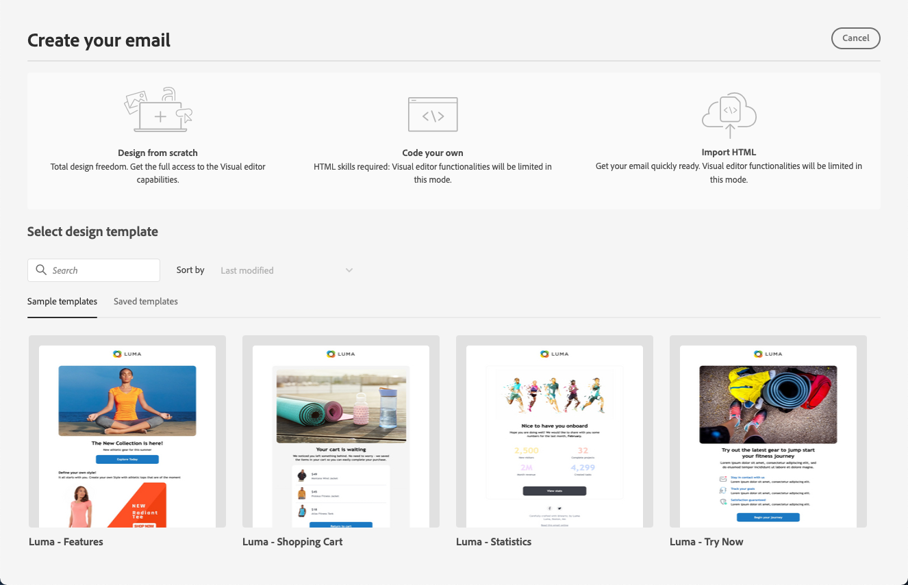

# Kom igång med e-postdesign {#get-started-content-design}

Om du vill få åtkomst till e-postmeddelandet och börja designa ditt e-postinnehåll måste du först [skapa ett e-postmeddelande](create-email.md) under en resa eller en kampanj.

Du kan sedan använda [!DNL Journey Optimizer] **e-postdesignfunktionerna** för att importera befintligt innehåll eller börja skapa responsiva e-postmeddelanden från grunden. [Läs mer](content-from-scratch.md)

Med e-post-Designer kan du även:

* Utnyttja **Adobe Experience Manager Assets Essentials** för att förbättra dina e-postmeddelanden, bygga upp och hantera din egen databas för resurser. [Läs mer](../integrations/assets.md)

* Hitta **Adobe Stock-foton** för att skapa ditt innehåll och förbättra din e-postdesign. [Läs mer](../integrations/stock.md)

* Förbättra kundernas upplevelse genom att skapa personaliserade och dynamiska meddelanden utifrån deras profilattribut. Läs mer om [personalisering](../personalization/personalize.md) och [dynamiskt innehåll](../personalization/get-started-dynamic-content.md).

➡️ [Upptäck den här funktionen i en video](#video)

## Viktiga steg för att skapa e-postinnehåll {#key-steps}

När du har skapat ett e-postmeddelande kan du börja designa ditt e-postinnehåll.

1. Gå igenom skärmen **[!UICONTROL Edit content]** från kundresan eller kampanjkonfigurationsskärmen för att få åtkomst till e-post-Designer. [Läs mer](create-email.md#define-email-content)

   

1. På Designer hemsida för e-post väljer du hur du vill utforma e-postmeddelandet bland följande alternativ:

   * **Designa din e-post från grunden** via e-postgränssnittet i Designer och utnyttja bilder från [Adobe Experience Manager Assets](../integrations/assets.md). Lär dig hur du utformar ditt e-postinnehåll i [det här avsnittet](content-from-scratch.md).

   * **Kod eller klistra in HTML i Raw-format** direkt i Designer-e-postmeddelandet. Lär dig hur du kodar ditt eget innehåll i [det här avsnittet](code-content.md).

     >[!NOTE]
     >
     >I en kampanj kan du även välja knappen **[!UICONTROL Code Editor]** på skärmen **[!UICONTROL Edit content]**. [Läs mer](create-email.md#define-email-content)

   * **Importera befintligt HTML-innehåll** från en fil eller en ZIP-mapp. Lär dig hur du importerar ett e-postinnehåll i [det här avsnittet](existing-content.md).

   * **Konvertera bilddesigner till HTML-mallar** med den AI-baserade bilden till HTML-konverteraren. Lär dig hur du omvandlar statiska bilder till redigerbara e-postmallar i [det här avsnittet](../content-management/image-to-html.md).

   * **Välj ett befintligt innehåll** i en lista med inbyggda eller anpassade mallar. Lär dig hur du arbetar med e-postmallar i [det här avsnittet](../email/use-email-templates.md).

   

1. När e-postinnehållet har definierats och anpassats kan du exportera innehållet för validering eller för senare bruk. Klicka på **[!UICONTROL Export HTML]** om du vill spara en ZIP-fil på datorn som innehåller din HTML och dina resurser.

   

1. Ni kan också validera innehållskvaliteten för att identifiera potentiella problem med läsbarhet, innehållets enhetlighet och effektivitet. [Läs mer om validering av innehållskvalitet](../content-management/brands-score.md#validate-quality)

## Bästa praxis för e-postdesign {#best-practices}

När du skickar e-postmeddelanden är det viktigt att tänka på att mottagarna kan vidarebefordra dem, vilket ibland kan orsaka problem med e-postens återgivning. Detta gäller särskilt när du använder CSS-klasser som kanske inte stöds av e-postleverantören som används för vidarebefordran, till exempel om du använder CSS-klassen&quot;is-desktop-hidden&quot; för att dölja en bild på mobila enheter.

För att minimera dessa återgivningsproblem rekommenderar vi att du håller e-postdesignstrukturen så enkel som möjligt. Försök använda en enda design som fungerar bra för både datorer och mobila enheter, och undvik att använda komplexa CSS-klasser eller andra designelement som kanske inte stöds fullt ut av alla e-postklienter. Genom att följa dessa rutiner kan du se till att dina e-postmeddelanden återges korrekt, oavsett hur mottagarna visar eller vidarebefordrar dem.

I tabellen nedan finns information om de effektivaste strategierna för e-postdesign:

| Rekommenderas | Använd med försiktighet | Rekommenderas inte |
|-|-|-|
| <ul><li><b>Statiska, tabellbaserade layouter</b> för strukturen</li> <li><b>HTML-tabeller och kapslade tabeller</b> för enhetlig layout</li> <li><b>Mallbredder</b> mellan 600px och 800px </li> <li><b>Enkel, infogad CSS</b> för formatering </li> <li><b>Webbsäkra teckensnitt</b> för universell kompatibilitet</li> | <ul><li><b>Bakgrundsbilder</b> kanske inte visas på vissa e-postplattformar.</li><li><b>Anpassade webbteckensnitt</b> saknar universellt stöd.</li><li><b>Bred layout</b> kan visas dåligt på mindre skärmar.</li><li><b>Bildscheman</b> har begränsad funktionalitet.</li><li><b>Inbäddad CSS</b> tas ibland bort under e-postleverans.</li> | <ul><li><b>JavaScript</b> stöds vanligtvis inte i e-postmiljöer.</li> <li> <b>`<iframe>`</b> taggar blockeras på de flesta plattformar. </li> <li><b>Flash</b> är inaktuell och stöds inte längre.</li> <li><b>Inbäddat ljud</b> spelas ofta inte upp.</li> <li><b>Inbäddad video</b> är inte kompatibel med många e-postplattformar.</li> <li> <b>Forms</b> fungerar inte i e-postmeddelanden.</li> <li> `
`-lager kan leda till återgivningsproblem.</li> |

>[!NOTE]
>
>I den [europeiska tillgänglighetslagen](https://eur-lex.europa.eu/legal-content/EN/TXT/?uri=CELEX%3A32019L0882){target="_blank"} anges att all digital kommunikation ska vara tillgänglig. Förutom de bästa metoderna för e-postdesign som anges i det här avsnittet, måste du även följa riktlinjerna som anges på [den här sidan](accessible-content.md) när det gäller att skapa tillgängligt innehåll med e-post-Designer.

## Instruktionsfilmer {#video}

Lär dig skapa e-postinnehåll med meddelanderedigeraren.

>[!VIDEO](https://video.tv.adobe.com/v/334150?quality=12)

Lär dig hur du konfigurerar innehållsexperiment till A/B-tester och utforskar e-postinnehåll på bästa sätt för dina affärsmål.

>[!VIDEO](https://video.tv.adobe.com/v/3419893)
