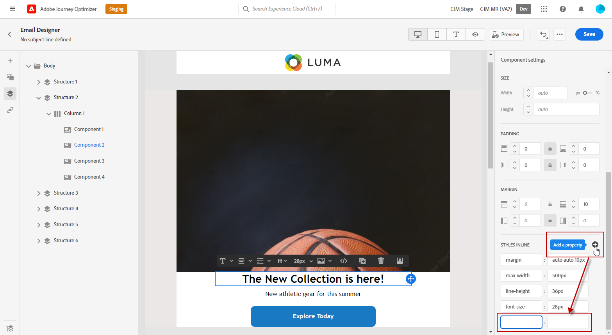

# Lägg till textbundna formatattribut {#inline-styling}

När du markerar ett element och visar dess inställningar på sidopanelen i gränssnittet för e-postdesignern kan du anpassa infogade attribut och deras värde för det specifika elementet.

1. Markera ett element i innehållet.

1. Från **[!UICONTROL Styles]** flik, leta efter **[!UICONTROL Styles Inline]** inställningarna under **[!UICONTROL Advanced]** nedrullningsbar meny.

   

1. Ändra värdena för de befintliga attributen eller lägg till nya med **+** -knappen. Du kan lägga till alla attribut och värden som är CSS-kompatibla.

   

Formateringen används sedan på det markerade elementet. Om de underordnade elementen inte har några definierade formatattribut ärvs det överordnade elementets formatering.
