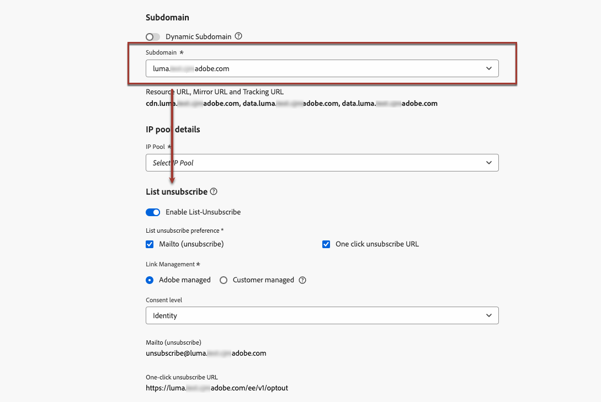

# Avbeställ lista{#list-unsubscribe}

<!--Do not modify - Legal Review Done -->

När du konfigurerar en ny e-postkanalskonfiguration i [!DNL Adobe Journey Optimizer] visas alternativet [&#x200B; när du &#x200B;](email-settings.md#ip-pools)väljer en underdomän **[!UICONTROL Enable List-Unsubscribe]** i listan. Den är aktiverad som standard.



En länk för att avbryta prenumerationen eller klicka på knappen som visas bredvid e-postavsändarinformationen. Mottagarna kan också avanmäla sig från sändlistan med ett enda klick.

En länk visas till exempel nedan i Gmail med en klickning för att avbryta prenumerationen:


>[!IMPORTANT]
>
>Om du vill visa URL:en för att avsluta prenumerationen med ett klick i e-posthuvudet måste mottagarens e-postklient ha stöd för den här funktionen.

Beroende på e-postklienten och inställningarna för att avbryta prenumerationen för e-postkonfigurationen kan du klicka på länken för att avbryta prenumerationen i e-posthuvudet om du vill ha följande effekter:

* När funktionen **Mailto (unsubscribe)** är aktiverad skickas begäran om att avbryta prenumerationen till den standardadress för att avbryta prenumerationen som baseras på den underdomän som du har konfigurerat.
* När funktionen **Ett klick för att avbryta prenumeration på URL** är aktiverad - eller om du har infogat en URL för att avsluta prenumeration i ditt e-postinnehåll - är mottagaren direkt avanmäld, antingen på kanalnivå eller på ID-nivå (beroende på hur medgivandet är konfigurerat), när mottagaren klickar på den URL för att avbryta prenumerationen (baserat på den underdomän du har konfigurerat).

>[!NOTE]
>
>Lär dig hur du hanterar avprenumerationsinställningarna i [det här avsnittet](#enable-list-unsubscribe) nedan.

I båda fallen bearbetas deras begäran om att avbryta prenumerationen när en mottagare klickar på länken för att avanmäla sig. Motsvarande profil är omedelbart avanmäld och det här valet uppdateras i [Experience Platform](https://experienceleague.adobe.com/docs/experience-platform/profile/ui/user-guide.html){target="_blank"}. Läs mer om godkännandebearbetning i [Experience Platform-dokumentationen](https://experienceleague.adobe.com/docs/experience-platform/landing/governance-privacy-security/consent/adobe/overview.html){target="_blank"}.

>[!NOTE]
>
>Ibland kan det ta längre tid att reflektera på profilnivå på grund av databearbetning i efterföljande steg. Ge systemet lite tid att uppdatera.

## Aktivera avanmälan av lista {#enable-list-unsubscribe}

>[!CONTEXTUALHELP]
>id="ajo_admin_preset_unsubscribe"
>title="Lägg till en avbruten URL i dina e-postmeddelanden"
>abstract="Aktivera det här alternativet om du automatiskt vill lägga till en URL för att avbryta prenumerationen i e-postrubriken. Du kan också ange en avanmälnings-URL i ett meddelande genom att infoga en länk för avanmälan med ett klick i e-postinnehållet."
>additional-url="https://experienceleague.adobe.com/en/docs/journey-optimizer/using/channels/email/email-opt-out#one-click-opt-out" text="Ange avanmälan med ett klick från e-postinnehållet"

När alternativet **[!UICONTROL Enable List-Unsubscribe]** är aktiverat, om det stöds av mottagarnas e-postklient, innehåller e-posthuvudet både ett mailto och/eller en URL som standard som mottagarna kan använda för att avbryta prenumerationen från din e-postlista.

>[!NOTE]
>
>Om du inaktiverar det här alternativet visas ingen avbruten URL i e-posthuvudet med ett enda klick.

Rubriken för att avbryta prenumerationen på List har två alternativ som är aktiverade som standard om du inte avmarkerar ett av dem eller båda:

{width="80%"}

* En **[!UICONTROL Mailto (unsubscribe)]**-adress, som är den måladress dit begäran om att avbryta prenumerationen dirigeras för automatisk bearbetning. I [!DNL Journey Optimizer] är e-postadressen för att avbryta prenumerationen den **[!UICONTROL Mailto (unsubscribe)]** standardadress som visas i kanalkonfigurationen, baserat på den [valda underdomänen](email-settings.md#subdomains). <!--With this method, clicking the Unsubscribe link sends a pre-filled email to the unsubscribe address specified in the email header.-->

* **[!UICONTROL One-click unsubscribe URL]**, som som standard är den URL som genereras av en klickning för att avbryta prenumerationen, baserat på den [valda underdomänen](email-settings.md#subdomains). <!--With this method, clicking the Unsubscribe link directly unsubscribes the user, requiring only a single action to unsubscribe.-->

Du kan välja **[!UICONTROL Consent level]** i motsvarande listruta. Den kan vara specifik för kanalen eller för profilens identitet. Baserat på den här inställningen uppdateras medgivandet i [!DNL Adobe Journey Optimizer], antingen på kanalnivå eller på ID-nivå, när en användare avbeställer prenumerationen med hjälp av URL:en för att avbryta prenumerationen i huvudet i ett e-postmeddelande.

## Skyddsutkast och rekommendationer {#list-unsubscribe-guardrails}

Med funktionen för att avbeställa en prenumeration på en lista kan mottagarna enkelt avanmäla sig från din kommunikation. Eftersom inte alla e-postklienter stöder den här länken i e-posthuvudet rekommenderar Adobe att du även lägger till en [länk för att avanmäla dig med ett klick](email-opt-out.md#one-click-opt-out) eller en [länk för att avbryta prenumerationen](email-opt-out.md#add-unsubscribe-link) i e-postmeddelandets brödtext.

Funktionen **[!UICONTROL Mailto (unsubscribe)]** och funktionen **[!UICONTROL One-click unsubscribe URL]** är valfria.

* Om du har aktiverat alternativet **[!UICONTROL Enable List-Unsubscribe]** i konfigurationsinställningarna för [e-post](email-settings.md) rekommenderar vi att du aktiverar båda metoderna - **Mailto (unsubscribe)** och **One-Click Unsubscribe URL**. Alla e-postklienter har inte stöd för HTTP-metoden. Med funktionen för att avbryta prenumeration på e-postlista kan du välja ett alternativ, ditt avsändarrykte kan skyddas bättre och alla mottagare kan använda funktionen för att avbryta prenumerationen.

* Om du inte vill använda den standardgenererade URL-adressen för ett enda klick kan du avmarkera funktionen.

   * Om du lägger till en **[!UICONTROL Enable List-Unsubscribe]**-klicksavanmälningslänk **[!UICONTROL One-click Unsubscribe URL]** i ett meddelande som skapats med den här konfigurationen, kommer rubriken Lista avanmälan att hämta den enklicksavanmälningslänk som du har infogat i e-postmeddelandets brödtext och använda den som ett-klicksvärde för att avbryta prenumerationen i scenariot där alternativet [&#x200B; är aktiverat och funktionen &#x200B;](../email/email-opt-out.md#one-click-opt-out) inte är markerad.

     

   * Om du inte lägger till en länk för avanmälan med ett enda klick i meddelandeinnehållet och standardinställningen **[!UICONTROL One-click unsubscribe URL]** inte är markerad i kanalkonfigurationsinställningarna, skickas ingen URL till e-posthuvudet som en del av rubriken för att avbryta prenumeration av lista.

  >[!NOTE]
  >
  >Läs mer om hur du hanterar funktioner för att avbryta prenumerationen i dina meddelanden i [det här avsnittet](../email/email-opt-out.md#unsubscribe-header).

I [!DNL Journey Optimizer] hanteras samtycke av Experience Platform [Consent schema](https://experienceleague.adobe.com/docs/experience-platform/xdm/field-groups/profile/consents.html){target="_blank"}. Som standard är värdet för medgivandefältet tomt och behandlas som samtycke för att ta emot dina meddelanden. Du kan ändra det här standardvärdet vid introduktion till ett av de möjliga värden som anges [här](https://experienceleague.adobe.com/docs/experience-platform/xdm/data-types/consents.html#choice-values){target="_blank"}, eller använda [medgivandeprinciper](../action/consent.md) för att åsidosätta standardlogiken.

[!DNL Journey Optimizer] lägger för närvarande inte till någon specifik tagg för att avbryta prenumerationshändelser som utlöses av funktionen för att avsluta prenumerationen. Om du behöver skilja ut avbeställningsklickningar i List från andra avbeställningsåtgärder måste du implementera anpassad taggning externt eller utnyttja en extern landningssida för spårning.

## Hantera avbeställningsdata externt {#custom-managed}

>[!CONTEXTUALHELP]
>id="ajo_email_config_unsubscribe_custom"
>title="Definiera hur data för att avbryta prenumerationen hanteras"
>abstract="**Adobe hanterat**: Medgivandedata hanteras av dig i Adobe-systemet.<br>**Kundhanterad**: Medgivandedata hanteras av dig i ett externt system och ingen synkronisering av medgivandedata uppdateras i Adobe-systemet såvida det inte initieras av dig."

>[!CONTEXTUALHELP]
>id="ajo_email_config_unsubscribe_custom_url"
>title="Ange en egen adress för att avsluta prenumerationen med ett klick"
>abstract="**En-klicknings-URL** för att avbryta prenumerationen måste använda metoden POST-begäran."

Om du hanterar samtycke utanför Adobe väljer du alternativet **[!UICONTROL Customer managed]** för att ange en anpassad e-postadress för att avbryta prenumerationen och en egen adress för att avsluta prenumerationen med ett enda klick.

{width="80%"}

**[!UICONTROL One-click Unsubscribe URL]** måste vara POST-URL.

>[!WARNING]
>
>Om du använder alternativet **[!UICONTROL Customer managed]** kommer Adobe inte att lagra några data om att prenumerera eller godkänna. Med alternativet **[!UICONTROL Customer managed]** väljer organisationer att använda ett externt system och ansvarar för att hantera sina medgivandedata i ett sådant externt system. Det finns ingen automatisk synkronisering av medgivandedata mellan det externa systemet och [!DNL Journey Optimizer]. Synkronisering av medgivandedata, som kommer från det externa systemet för att uppdatera användarens medgivandedata i [!DNL Journey Optimizer], måste initieras av organisationen som en dataöverföring för att överföra medgivandedata tillbaka till [!DNL Journey Optimizer].

### Lägg till anpassade attribut till slutpunkterna {#custom-attributes}

Om du har markerat alternativet **[!UICONTROL Customer managed]** och anger anpassade slutpunkter och använder dem i en kampanj eller resa, lägger [!DNL Journey Optimizer] till vissa standardprofilspecifika parametrar i medgivandeuppdateringshändelsen <!--sent to the custom endpoint --> när mottagarna klickar på länken för att avbryta prenumerationen.

Om du vill anpassa slutpunkterna <!-- (**[!UICONTROL Mailto (unsubscribe)]** and **[!UICONTROL One-click Unsubscribe URL]**)--> ytterligare kan du definiera anpassade attribut som också läggs till i medgivandehändelsen.

>[!AVAILABILITY]
>
>Den här funktionen är tillgänglig med begränsad tillgänglighet. Kontakta din Adobe-representant för att få åtkomst.
>
>För alternativet **[!UICONTROL Mailto (unsubscribe)]** måste du använda de nya frågeparametrarna som beskrivs i avsnittet **Mailto (unsubscribe) med anpassade attribut (Begränsad tillgänglighet)** [nedan](#configure-decrypt-api).

Använd avsnittet **[!UICONTROL URL tracking parameters]** om du vill definiera anpassade attribut för slutpunkterna. Alla URL-spårningsparametrar som du anger i motsvarande avsnitt läggs till i slutet av de anpassade slutpunkterna, förutom standardparametrarna. [Lär dig hur du ställer in anpassad URL-spårning](url-tracking.md)

### Konfigurera dekrypterings-API {#configure-decrypt-api}

När dina mottagare klickar på en anpassad länk för att avbryta prenumerationen skickas parametrarna som är tillagda i den godkända uppdateringshändelsen till slutpunkten på ett krypterat sätt. Det externa tillståndssystemet måste därför implementera ett specifikt API via [Adobe Developer](https://developer.adobe.com){target="_blank"} för att dekryptera de parametrar som skickas av Adobe.

GET-anropet för att hämta de här parametrarna beror på det alternativ för att avbryta prenumerationen som du använder - **[!UICONTROL One-click unsubscribe URL]** eller **[!UICONTROL Mailto (unsubscribe)]**.

<!--To configure the API to send back the information to [!DNL Adobe Journey Optimizer] when a recipient has unsubscribed using the List unsubscribe option with custom endpoints, follow the steps below.-->

+++ Avbeställ en URL med ett klick

Med alternativet **[!UICONTROL One-click unsubscribe URL]** klickar du på länken Avbeställ direkt för att avsluta prenumerationen på användaren.

GET-samtalet är följande:

Slutpunkt: https://platform.adobe.io/journey/imp/consent/decrypt

Frågeparametrar:

* **parametrar**: innehåller den krypterade nyttolasten
* **pid**: krypterat profil-ID

Dessa två parametrar kommer att inkluderas i den händelse för uppdatering av samtycke som skickas till de anpassade slutpunkterna.

Huvudkrav:

* x-api-key
* x-gw-ims-org-id
* behörighet (användartoken från ditt tekniska konto)

Nedan visas exempelparametrar och samtycke:

| Frågeparameter | Exempel på nyttolast |
|---------|----------|
| pid | {<br>&quot;pid&quot; : &quot;514273041546020095851529937068211571&quot;,<br>&quot;pns&quot; : &quot;CRMID&quot;,<br> 2}&quot;e&quot;    :&quot;john@google.com&quot;,<br>&quot;ens&quot; :&quot;Email&quot;,<br>&rbrace; |
| parametrar | {<br>&quot;m&quot; : &quot;messageExecutionId&quot;,<br>&quot;ci&quot; : &quot;campaignId&quot;,<br>&quot;jv&quot; : &quot;travelVersionId&quot;,<br>&quot;ja&quot; : &quot;travelActionId&quot;,<br>&quot;s&quot; : &quot;sandboxId&quot;,<br>&quot;us&quot; : &quot;unsubscribeScope&quot;<br>} |

Samtyckessvar:

```
{
    "profileNameSpace": " CRMID ",
    "profileId": "5142733041546020095851529937068211571",
    "emailAddress": "john@google.com",
    "emailNameSpace": "Email",
    "sandboxId": "sandboxId",
    "optOutLevel": "channel",
    "channelType": "email",
    "timestamp": "2024-11-26T14:25:09.316930Z"
    "utm": [
         {
            "utm_source": "AJO",
            "utm_medium": "Email"
        }
    ]
}
```

+++

+++ Mailto (avsluta prenumeration)

Med alternativet **[!UICONTROL Mailto (unsubscribe)]** skickas ett förifyllt e-postmeddelande till den angivna avanmälningsadressen när du klickar på länken för att avbryta prenumerationen.

GET-samtalet är som följer.

Slutpunkt: https://platform.adobe.io/journey/imp/consent/decrypt

Frågeparametrar:

* **emailParams**: sträng som innehåller parametrarna **params** (krypterad nyttolast) och **pid** (krypterat profil-ID).

Parametrarna **params** och **pid** inkluderas i den händelse för uppdatering av samtycke som skickas till de anpassade slutpunkterna.

Huvudkrav:

* x-api-key
* x-gw-ims-org-id
* behörighet (användartoken från ditt tekniska konto)

Nedan visas exempelparametrar och samtycke:

| Frågeparameter | Exempel på nyttolast |
|---------|----------|
| emailParams | &lbrace;<br>&quot;p&quot; : &quot;profileId&quot;,<br>&quot;pn&quot; : &quot;profileNamespace&quot;,<br>&quot;en&quot; : &quot;emailNamespace&quot;,<br>&quot;ci&quot; : &quot;campaignId&quot;,<br>&quot;jv&quot; : &quot;travelVersionId&quot;,<br>&quot;ja&quot; : &quot;travelActionId&quot;,<br>&quot;si&quot; : &quot;sandboxId&quot;,<br>&quot;us&quot;: &quot;unsubscribeScope&quot;<br> |

Samtyckessvar:

```
{
    "profileNameSpace": " CRMID ",
    "profileId": "5142733041546020095851529937068211571",
    "emailAddress": "john@google.com",
    "emailNameSpace": "Email",
    "sandboxId": "sandboxId",
    "optOutLevel": "channel",
    "channelType": "email",
    "timestamp": "2024-11-26T14:25:09.316930Z"
}
```

+++

+++ Mailto (unsubscribe) med anpassade attribut (begränsad tillgänglighet)

Med alternativet **[!UICONTROL Mailto (unsubscribe)]** skickas ett förifyllt e-postmeddelande till den angivna avanmälningsadressen när du klickar på länken för att avbryta prenumerationen.

Från och med oktober 2025 kan du, om du använder alternativet **[!UICONTROL Customer managed]** för slutpunkten **[!UICONTROL Mailto (unsubscribe)]**, definiera anpassade attribut som läggs till i medgivandehändelsen. I det här fallet måste du använda frågeparametrarna som beskrivs nedan.

>[!AVAILABILITY]
>
>Den här funktionen är tillgänglig med begränsad tillgänglighet. Kontakta din Adobe-representant för att få åtkomst.

GET-samtalet är som följer.

Slutpunkt: https://platform.adobe.io/journey/imp/consent/decrypt

Frågeparametrar:

* **emailParamsSub**: strängen har extraherats från ämnet för e-postmeddelandet som togs emot på Mailto-adressen.

   * Exempel: *unsubscribev1.abc*

   * Analyserat värde: *v1.abc*

* **emailParamsBody**: sträng extraherad från e-postbrödtexten (om sådan finns) i formatet *unsubscribev1.xyz*.

   * Analyserat värde: *v1.xyz*

API-exempel: https://platform.adobe.io/journey/imp/consent/decrypt?emailParamsSub=v1.abc&emailParamsBody=v1.xyz

>[!CAUTION]
>
>Om du använde den tidigare implementeringen (till exempel: https://platform.adobe.io/journey/imp/consent/decrypt?emailParams=&lt;v1.xxx>) måste du använda de nya parametrarna **emailParamsSub** och **emailParamsBody** i stället för **emailParams**. Kontakta Adobe om du vill ha mer information.

Parametrarna **emailParamsSub** och **emailParamsBody** kommer att inkluderas i den medgivandeuppdateringshändelse som skickas till de anpassade slutpunkterna.

Huvudkrav:

* x-api-key
* x-gw-ims-org-id
* behörighet (användartoken från ditt tekniska konto)

Samtyckessvar:

```
{
    "profileNameSpace": " CRMID ",
    "profileId": "5142733041546020095851529937068211571",
    "emailAddress": "john@google.com",
    "emailNameSpace": "Email",
    "sandboxId": "sandboxId",
    "optOutLevel": "channel",
    "channelType": "email",
    "timestamp": "2024-11-26T14:25:09.316930Z"
    "utm": [
        {
            "utm_source": "AJO",
            "utm_medium": "Email"
        }
    ]
}
```

+++
