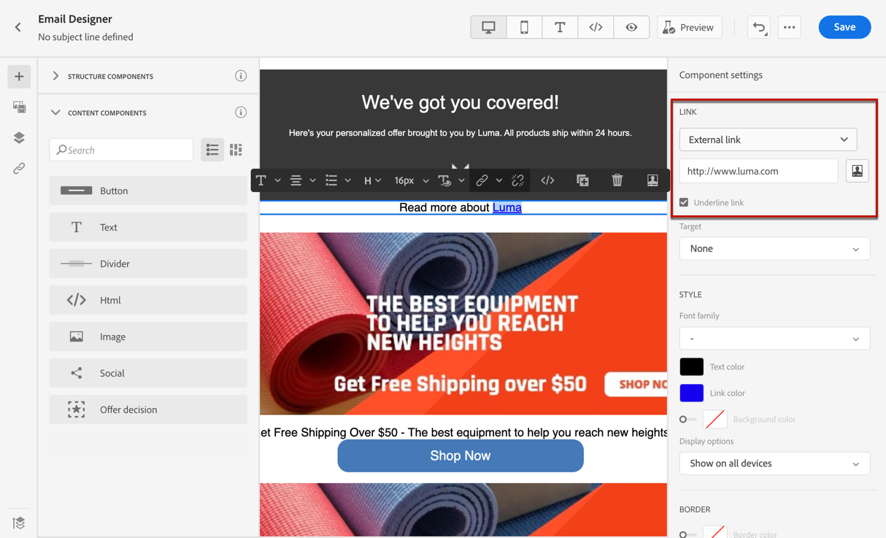
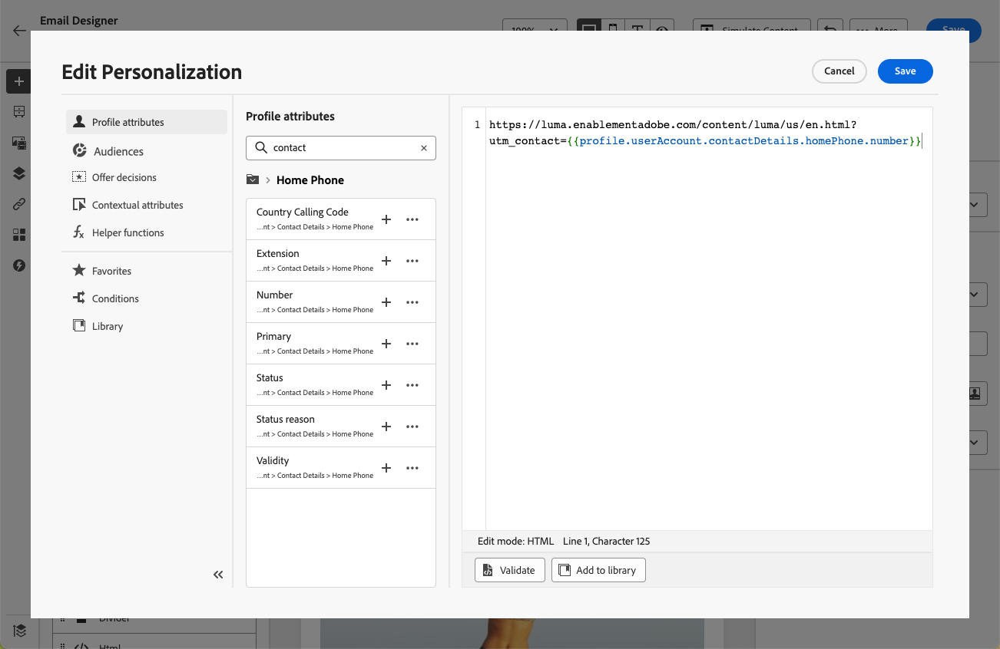

# Lägga till länkar och spåra meddelanden {#tracking}

Använd [!DNL Journey Optimizer] om du vill lägga till länkar till ditt innehåll och spåra meddelanden som skickats för att övervaka mottagarnas beteende.

>[!NOTE]
>
>När länkar inkluderas i ditt innehåll går de ut **25 månader** efter att meddelandet har skickats, med undantag för länkar till en spegelsida som går ut efter **90 dagar**. När fördröjningen är slut är länkarna inte längre tillgängliga.

## Aktivera spårning {#enable-tracking}

Du kan aktivera spårning på e-postmeddelandenivå genom att kontrollera alternativen **[!UICONTROL Email opens]** och/eller **[!UICONTROL Click on email]** när du skapar ditt meddelande inuti en resa eller kampanj, vilket visas på flikarna nedan:

>[!BEGINTABS]

>[!TAB Aktivera spårning i en resa]

>[!TAB Aktivera spårning i en kampanj]

>[!ENDTABS]

>[!NOTE]
>
>Båda alternativen är aktiverade som standard.

När det här alternativet är aktiverat spåras beteendet hos mottagarna av dina meddelanden:

* Måttet **[!UICONTROL Email opens]** kontrollerar hur många meddelanden som har öppnats.
* Måttet **[!UICONTROL Click on email]** beräknar antalet klick på länkar i ett e-postmeddelande.

## Infoga länkar {#insert-links}

När [spårning är aktiverat](#enable-tracking) spåras alla länkar som ingår i meddelandeinnehållet.

>[!NOTE]
>
>Länkar från fragment som används i e-postmeddelanden spåras också. [Läs mer om fragment](../content-management/fragments.md)

Följ stegen nedan om du vill infoga länkar i ditt e-postinnehåll:

1. Markera ett element (text eller bild) och klicka på **[!UICONTROL Insert link]** i det sammanhangsberoende verktygsfältet.

   

1. Välj den typ av länk som du vill skapa:

   * Välj **[!UICONTROL External link]** om du vill infoga en länk till en extern URL.

   * Välj **[!UICONTROL Landing page]** om du vill infoga en länk till en landningssida. [Läs mer](../landing-pages/get-started-lp.md)

   * Välj **[!UICONTROL One click Opt-out]** om du vill infoga en länk så att användare snabbt kan avbryta prenumerationen på dina meddelanden utan att behöva bekräfta att de vill avanmäla sig. [Läs mer](email-opt-out.md#one-click-opt-out).

   * Välj **[!UICONTROL External Opt-in/Subscription]** om du vill infoga en länk för att ta emot meddelanden från ditt varumärke.

   * Välj **[!UICONTROL External Opt-out/Unsubscription]** om du vill infoga en länk för att avbryta prenumerationen på meddelanden från ditt varumärke. Läs mer om hantering av avanmälan i [det här avsnittet](email-opt-out.md#opt-out-management).

   * Välj **[!UICONTROL Mirror page]** om du vill lägga till en länk på sidan för e-postspegling. [Läs mer](#mirror-page)

1. Ange önskad URL-adress i motsvarande fält eller välj en landningssida och definiera länkinställningar och format. [Läs mer](#adjust-links)

   >[!NOTE]
   >
   >För att tolka URL:er uppfyller [!DNL Journey Optimizer] URI-syntaxen ([RFC 3986 standard](https://datatracker.ietf.org/doc/html/rfc3986){target="_blank"}), vilket inaktiverar vissa internationella specialtecken i URL:er. När du försöker skicka korrekturet eller e-postmeddelandet och returnerar ett fel som inbegriper en URL som har lagts till i innehållet, kan du URL-koda strängen som en tillfällig lösning.

1. Du kan anpassa länkarna. [Läs mer](../personalization/personalization-build-expressions.md)

1. Spara ändringarna.

1. När länken har skapats kan du fortfarande ändra den från rutorna **[!UICONTROL Settings]** och **[!UICONTROL Styles]** till höger.

   

>[!NOTE]
>
>E-postmeddelanden av marknadsföringstyp måste innehålla en [länk för avanmälan](../privacy/opt-out.md#opt-out-management), vilket inte krävs för transaktionsmeddelanden. Meddelandekategorin (**[!UICONTROL Marketing]** eller **[!UICONTROL Transactional]**) definieras i [kanalkonfigurationen](../configuration/channel-surfaces.md#email-type) när meddelandet skapas.

När meddelandet har skickats är kvarhållningsperioden för en länk **25 månader**. Efter den fördröjningen är länken inte längre tillgänglig.

## Länka till en spegelsida {#mirror-page}

Spegelsidan är en onlineversion av ditt e-postmeddelande. Att lägga till en länk till spegelsidan är en bra metod för e-postmarknadsföring. Användare kan bläddra till den spegelsida som finns i ett e-postmeddelande, t.ex. om de får problem med återgivningen eller om det finns skadade bilder när de försöker visa dem i sin inkorg. Vi rekommenderar även att du tillhandahåller en onlineversion av tillgänglighetsskäl eller för att uppmuntra social delning.

Spegelsidan som genererats av Adobe Journey Optimizer innehåller alla personaliseringsdata.

Om du vill lägga till en länk till en spegelsida i ditt e-postmeddelande [infogar du en länk](#insert-links) och väljer **[!UICONTROL Mirror page]** som typ av länk.

Spegelsidan skapas automatiskt. När e-postmeddelandet har skickats visas innehållet i e-postmeddelandet i sin standardwebbläsare när mottagarna klickar på länken för spegelsidan.

Kvarhållningsperioden för en spegelsida är **90 dagar**. Efter den fördröjningen är spegelsidan inte längre tillgänglig.

>[!CAUTION]
>
>* Länkar för spegelsidor genereras automatiskt och kan inte redigeras. De innehåller alla krypterade, personliga data som krävs för att återge det ursprungliga e-postmeddelandet. Om du använder anpassade attribut med stora värden kan det därför generera långa URL-adresser för spegelsidor, vilket kan förhindra länken från att fungera i webbläsare som har en maximal URL-längd.
>
>* När du skapar e-postmeddelanden som är starkt beroende av körtidspersonalisering (t.ex. `#each`-slingor, kapslade objekt, stora nyttolastdata) kan URL:er för spegelsidor bli alltför stora, särskilt i API-utlösta kampanjer som använder omfattande kontextuella data från nyttolaster. Detta kan orsaka HTTP-fel (404, 422, 502) i webbläsare eller e-postklienter. Adobe rekommenderar att du begränsar bredden och djupet på dynamiska fält, minskar beroendet av komplexa fragment och förenklar personaliseringsstrukturer för att förhindra länkfel.
>
>* I det [korrektur](../content-management/proofs.md) som skickas till testprofilerna är länken till spegelsidan inte aktiv. Den är bara aktiv i de slutliga meddelandena.

## Anpassa länkutseende och mål {#adjust-links}

Du kan justera länkarna, t.ex. stryka under dem, ändra deras färg eller välja mål.  De här ändringarna anges i rutorna **[!UICONTROL Settings]** och **[!UICONTROL Styles]** till höger i innehållsredigeraren.

### Target {#link-target}

Attributet **target** används för att styra var en länkad sida ska öppnas. Om du lägger till ett målattribut i en ankartagg kan du ange om länken ska öppnas på en ny flik, på samma flik eller i en annan bildruta.

Så här definierar du målet för en länk:

1. Markera länken i en **[!UICONTROL Text]**-komponent där en länk infogas.

1. På fliken **[!UICONTROL Settings]** väljer du var länken ska öppnas i listrutan **[!UICONTROL Target]**. Möjliga värden anges nedan:

   * **[!UICONTROL None]**: öppnar länken i samma ram som den klickades på (standard).
   * **[!UICONTROL Blank]**: öppnar länken i ett nytt fönster eller på en ny flik.
   * **[!UICONTROL Self]**: öppnar länken i samma ram som den klickades på.
   * **[!UICONTROL Parent]**: öppnar länken i den överordnade ramen.
   * **[!UICONTROL Top]**: öppnar länken i hela fönstrets brödtext.

   

1. Spara ändringarna.

### Understrykningslänk {#link-underline}

Markera alternativet **[!UICONTROL Underline link]** om du vill stryka under etiketten för länken.

### Länkfärg {#link-color}

Om du vill ändra färg på länken klickar du på **[!UICONTROL Link color]** på fliken **[!UICONTROL Styles]**.

## Hantera spårning {#manage-tracking}

Med [e-post-Designer](content-from-scratch.md) kan du hantera spårade URL-adresser, till exempel redigera spårningstypen för varje länk.

1. Klicka på ikonen **[!UICONTROL Links]** i den vänstra rutan om du vill visa en lista över alla URL:er för ditt innehåll som ska spåras.

   Med den här listan kan du ha en centraliserad vy och hitta varje URL i e-postinnehållet.

1. Om du vill redigera en länk klickar du på motsvarande pennikon.

1. Du kan ändra **[!UICONTROL Tracking Type]** om det behövs:

   

   För varje spårad URL kan du ange spårningsläget till något av följande värden:

   * **[!UICONTROL Tracked]**: Aktiverar spårning på den här URL:en.
   * **[!UICONTROL Opt out]**: Utser den här URL:en som en avanmälnings- eller avanmälnings-URL.
   * **[!UICONTROL Mirror page]**: Den här URL:en är en URL för en spegelsida.
   * **[!UICONTROL Never]**: Aktiverar aldrig spårning av den här URL:en.

Det finns rapporter om öppningar och klick i [Live-rapporten](../reports/live-report.md) och i [Customer Journey Analytics-rapporten](../reports/report-gs-cja.md).

## Anpassa URL-spårning {#url-tracking}

[URL-spårning](email-settings.md#url-tracking) hanteras på konfigurationsnivå och gäller för alla URL:er som ingår i meddelandeinnehållet.

Du kan också anpassa enskilda URL:er i e-post-Designer. Följ stegen nedan om du vill lägga till personaliserade URL-spårningsparametrar för en enda länk i innehållet.

1. Markera en länk och klicka på **[!UICONTROL Insert link]** i det sammanhangsberoende verktygsfältet.

1. Välj personaliseringsikonen. Det är bara tillgängligt för följande typer av länkar: **Extern länk**, **Avprenumerationslänk** och **Avanmäl dig**.

   

1. Lägg till URL-spårningsparametern och välj ett profilattribut i [anpassningsredigeraren](../personalization/personalization-build-expressions.md).

   

1. Spara ändringarna.

1. Upprepa stegen ovan för varje länk som du vill lägga till spårningsparametern i.

När e-postmeddelandet skickas läggs den här parametern automatiskt till i slutet av URL:en. Du kan sedan hämta den här parametern i webbanalysverktyg eller i resultatrapporter.

>[!NOTE]
>
>Om du vill verifiera den slutliga URL:en kan du [skicka ett korrektur](../content-management/preview-test.md#send-proofs) och klicka på länken i innehållet i e-postmeddelandet när du har fått korrekturet. URL:en ska visa spårningsparametern. I exemplet ovan blir den slutliga URL:en: <https://luma.enablementadobe.com/content/luma/us/en.html?utm_contact=profile.userAccount.contactDetails.homePhone.number>
