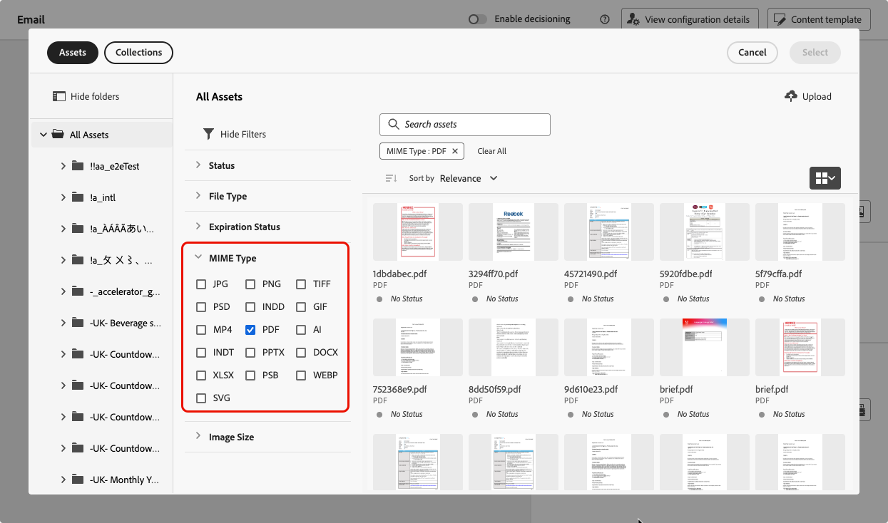

# Bifoga en PDF-fil i ett e-postmeddelande {#pdf-attachments}

>[!CONTEXTUALHELP]
>id="ajo_pdf_attachments"
>title="Lägg till en bifogad PDF-fil"
>abstract="Bläddra och välj en PDF-fil som du vill bifoga i e-postmeddelandet. Du kan skicka upp till 6 meddelanden med en PDF-bilaga per profil och år. Den största tillåtna filstorleken för varje bifogad fil är 5 MB. Du kan köpa ett tilläggspaket för alla ytterligare storlekar och volymer. Mer information får du av Adobe."

Du kan bifoga en statisk PDF-fil till e-postmeddelanden som du skickar med [!DNL Journey Optimizer].

>[!IMPORTANT]
>
>* Du kan skicka upp till 6 meddelanden med en PDF-bilaga per profil och år.
>
>* Den största tillåtna filstorleken för varje bifogad fil är 5 MB.
>
>För ytterligare storlekar och volymer kan du köpa tillägget PDF-bilagor. Mer information får du av Adobe.

Följ stegen nedan för att bifoga en PDF-fil till ett e-postmeddelande.

1. Skapa ett e-postmeddelande i en resa eller en kampanj. [Läs mer](create-email.md)

1. Välj **[!UICONTROL Content]** i avsnittet **[!UICONTROL Add asset]** på fliken för resan eller kampanjen **[!UICONTROL Attachment]**.

   

1. Databasen Resurser Essentials visas.

   >[!NOTE]
   >
   >När du utformar meddelanden får du tillgång till databasen Assets Essentials direkt från Journey Optimizer gränssnitt. Mer information om det inbäddade [!DNL Assets Essentials]-användargränssnittet finns i [dokumentationen för Experience Manager Assets Essentials](https://experienceleague.adobe.com/docs/experience-manager-assets-essentials/help/introduction.html?lang=sv-SE){target="_blank"}.

1. Använd filtret **[!UICONTROL PDF]** i avsnittet **[!UICONTROL MIME Type]** för att begränsa urvalet till rätt filformat.

   

   >[!NOTE]
   >
   >Endast PDF-formatet tillåts för bilagor.

1. Välj önskad fil.

   * Du kan bara markera en fil i taget.
   * Den största tillåtna filstorleken för varje bifogad fil är 5 MB.

1. När du är klar visas namnet och storleken på den valda filen i avsnittet **[!UICONTROL Attachment]**.

   Du kan ta bort den markerade filen med ikonen Fler åtgärder bredvid filnamnet.

   

>[!NOTE]
>
>När du sparar meddelandet som [innehållsmall](../content-management/create-content-templates.md) behålls inte PDF-bilagan tillsammans med mallen. Om du skapar ett nytt e-postmeddelande från den sparade innehållsmallen måste du bifoga filen igen.
