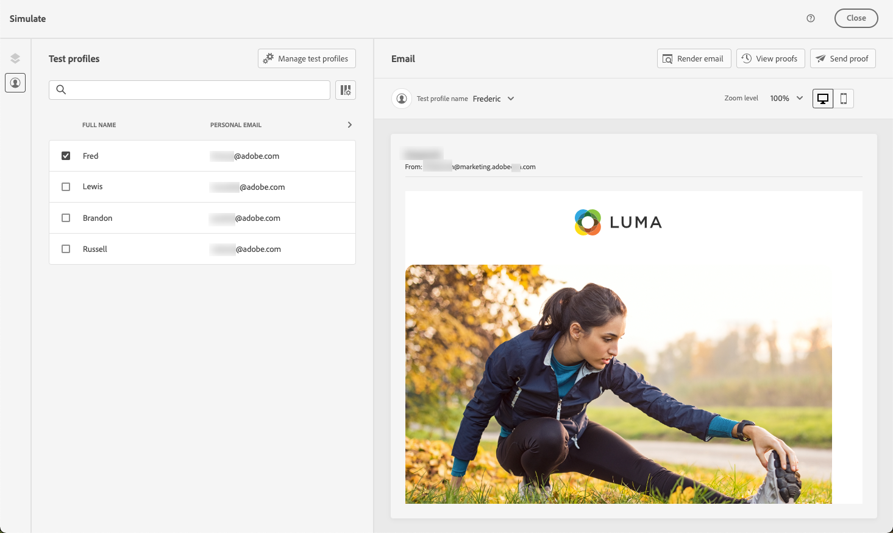
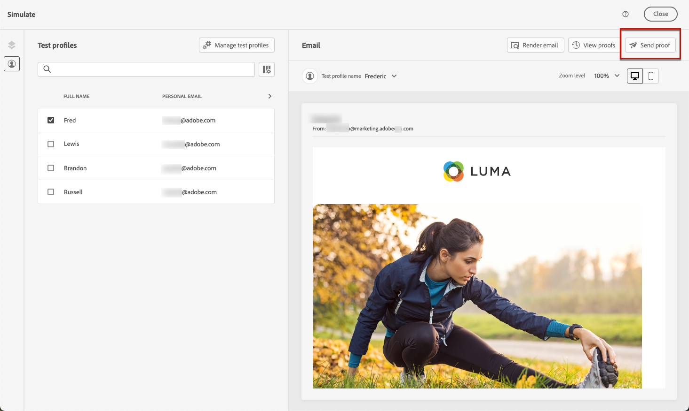

# Förhandsgranska och testa din e-post {#preview-and-proof}

>[!CONTEXTUALHELP]
>id="ac_preview_testprofiles"
>title="Förhandsgranska och testa dina meddelanden"
>abstract="När meddelandeinnehållet har definierats kan du använda testprofiler för att förhandsgranska och testa det."

När e-postinnehållet har definierats kan du använda testprofiler för att förhandsgranska och testa det. Om du infogade [personaliserat innehåll](../personalization/personalize.md)kan du med hjälp av testprofildata kontrollera hur det här innehållet visas i meddelandet.

Om du vill identifiera eventuella fel i e-postinnehåll eller personaliseringsinställningar skickar du korrektur för att testa profiler. Ett korrektur ska skickas varje gång en ändring görs för att validera det senaste innehållet.

>[!CAUTION]
>
>Du måste ha testprofiler tillgängliga för att kunna förhandsgranska meddelanden och skicka korrektur.
>
>Lär dig hur du skapar testprofiler i [den här sidan](../audience/creating-test-profiles.md).

Om du vill testa ditt e-postinnehåll måste du:

* [Välj testprofiler](#select-test-profiles)
* [Kontrollera förhandsgranskningen av meddelandet](#preview-your-messages)

Då kan du [skicka korrektur](#send-proofs) till testprofilerna.

Dessutom kan du **Litmus** konto till [!DNL Journey Optimizer] för att omedelbart förhandsgranska **e-poståtergivning** i vanliga e-postklienter. Sedan kan ni se till att e-postinnehållet ser bra ut och fungerar som det ska i alla inkorgar. Lär dig hur du låser upp Litmus-e-postförhandsvisningar i [det här avsnittet](#email-rendering).

>[!CAUTION]
>
>När du förhandsgranskar ett meddelande eller skickar korrektur visas endast profilpersonaliseringsdata. Personalisering som bygger på kontextdata, t.ex. händelseinformation, kan bara testas i samband med en resa. Lär dig hur du testar personalisering i [det här användningsfallet](../personalization/personalization-use-case.md).

➡️ [Lär dig hur du förhandsgranskar och korrekturerar e-postmeddelanden i den här videon](#video-preview)

## Välj testprofiler {#select-test-profiles}

Använd [Testprofiler](../audience/creating-test-profiles.md) om du vill rikta in dig på fler mottagare som inte matchar de definierade målinriktningskriterierna.

Så här väljer du testprofiler:

1. I [Redigera innehåll](create-email.md#define-email-content) eller i e-postdesignern klickar du på **[!UICONTROL Simulate content]** för att komma åt valet av testprofil.

   

1. Välj **[!UICONTROL Manage test profiles]**.

   

1. Markera namnutrymmet som ska användas för att identifiera testprofiler genom att klicka på **[!UICONTROL Identity namespace]** markeringsikon.

   

   Läs mer om Adobe Experience Platform identitetsnamnutrymmen [i det här avsnittet](../audience/get-started-identity.md).

   I exemplet nedan använder vi **E-post** namnutrymme.

1. Använd sökfältet för att hitta namnutrymmet, markera det och klicka på **[!UICONTROL Select]**

   

1. I **[!UICONTROL Identity value]** anger du värdet (här är e-postadressen) för att identifiera testprofilen och klickar på **[!UICONTROL Add profile]**.

   <!---->

1. Om du har lagt till personalisering i ditt meddelande lägger du till andra profiler så att du kan testa olika varianter av meddelandet beroende på profildata. När du har lagt till profiler visas de under de valda fälten.

   

   Baserat på elementen för meddelandeanpassning visar den här listan data för varje testprofil i de relaterade kolumnerna.

### Förhandsgranska e-post {#preview-email}

En gång [testprofiler](#select-test-profiles) om du har valt det här alternativet kan du förhandsgranska ditt e-postinnehåll. Följ stegen nedan:

1. I [Redigera innehåll](create-email.md#define-email-content) eller i e-postdesignern klickar du på **[!UICONTROL Simulate content]** -knappen.

1. Välj en testprofil. Du kan kontrollera de värden som är tillgängliga i kolumnerna. Använd höger-/vänsterpilarna för att bläddra bland data.

   

   >[!NOTE]
   >
   >Om du vill lägga till fler testprofiler väljer du **[!UICONTROL Manage test profiles]**. [Läs mer](#select-test-profiles)

1. Klicka på **[!UICONTROL Select data]** -ikonen ovanför listan för att lägga till eller ta bort kolumner.

   

   I slutet av listan visas personaliseringsfält som är specifika för det aktuella meddelandet. I det här exemplet är profilens ort, förnamn och efternamn. Markera de fälten och se till att dessa värden är ifyllda i testprofilerna.

1. I meddelandeförhandsgranskningen ersätts anpassade element med de valda testprofildata.

   För det här meddelandet är till exempel både e-postinnehåll och e-postämne personliga:

   

1. Välj andra testprofiler om du vill förhandsgranska e-poståtergivningen för varje variant av meddelandet.

## Skicka korrektur {#send-proofs}

Ett korrektur är ett specifikt meddelande som gör att du kan testa ett meddelande innan det skickas till huvudmålgruppen. Mottagarna av beviset ansvarar för att godkänna meddelandet: rendering, innehåll, personaliseringsinställningar, konfiguration.

En gång [testprofiler](#select-test-profiles) om du har valt det här alternativet kan du skicka korrektur.

1. I **[!UICONTROL Simulate]** klickar du på **[!UICONTROL Send proof]** -knappen.

   

1. Från **[!UICONTROL Send proof]** fönster, skriv in mottagarens e-postadress och klicka på **[!UICONTROL Add]** för att skicka beviset till dig själv eller medlemmar i din organisation.

   Observera att du kan lägga till upp till tio mottagare för korrekturleveransen.

   

1. Välj sedan **Testprofiler** som kommer att användas för att anpassa meddelandeinnehållet.

   Varje mottagare får lika många meddelanden som antalet valda testprofiler. Om du till exempel har lagt till fem e-postmeddelanden till mottagare och valt tio testprofiler, skickar du femtio korrekturmeddelanden och varje mottagare får tio av dem.

1. Du kan vid behov lägga till ett prefix till korrekturens ämnesrad. Endast alfanumeriska tecken och specialtecken som . - _ ( ) [ ] är tillåtna som prefix till ämnesraden.

1. Klicka på **[!UICONTROL Send proof]**.

   

1. Tillbaka i  **[!UICONTROL Simulate]** klickar du på  **[!UICONTROL View proofs]** för att kontrollera status.

   

Vi rekommenderar att du skickar korrektur efter varje ändring av meddelandeinnehållet.

>[!NOTE]
>
>I det skickade korrekturet är länken till spegelsidan inte aktiv. Den aktiveras endast i de slutliga meddelandena.

## Använd e-poståtergivning {#email-rendering}

Du kan använda **Litmus** konto till [!DNL Journey Optimizer] för att omedelbart förhandsgranska **e-poståtergivning** i vanliga e-postklienter.

Om du vill få åtkomst till funktionerna för e-poståtergivning måste du:

* Har ett Litmus-konto
* [Välj testprofiler](#select-test-profiles)

Följ sedan stegen nedan:

1. I [Redigera innehåll](create-email.md#define-email-content) eller i e-postdesignern klickar du på **[!UICONTROL Simulate content]** -knappen.

1. Markera knappen **[!UICONTROL Render email]**.

   

1. Klicka **Anslut ditt Litmus-konto** i det övre högra avsnittet.

   

1. Ange dina inloggningsuppgifter och logga in.

   

1. Klicka på **Kör test** om du vill generera förhandsgranskningar via e-post.

1. Kontrollera e-postinnehållet i vanliga dator-, mobil- och webbaserade klienter.

   

>[!CAUTION]
>
>När du ansluter **Litmus** konto med [!DNL Journey Optimizer]godkänner du att testmeddelanden skickas till Litmus: när de väl har skickats hanteras dessa e-postmeddelanden inte längre av Adobe. Följaktligen gäller Litmus-principen för datalagring i dessa e-postmeddelanden, inklusive personaliseringsdata som kan inkluderas i dessa testmeddelanden.

## Instruktionsvideo {#video-preview}

Lär dig hur du testar e-poståtergivning i olika inkorgar, hur du förhandsgranskar anpassade e-postmeddelanden mot testprofiler och skickar korrektur.

>[!VIDEO](https://video.tv.adobe.com/v/334239?quality=12)
