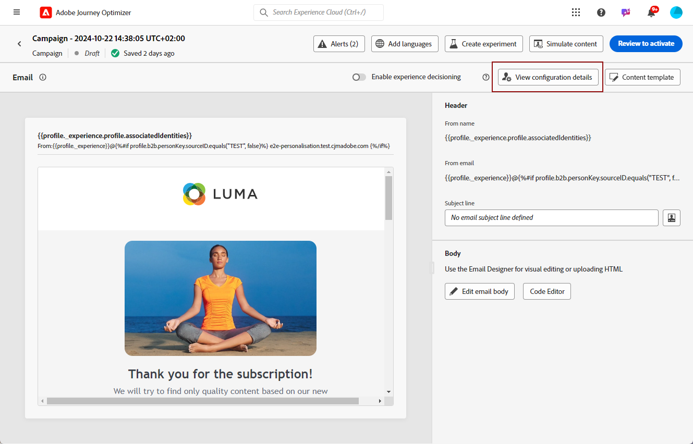
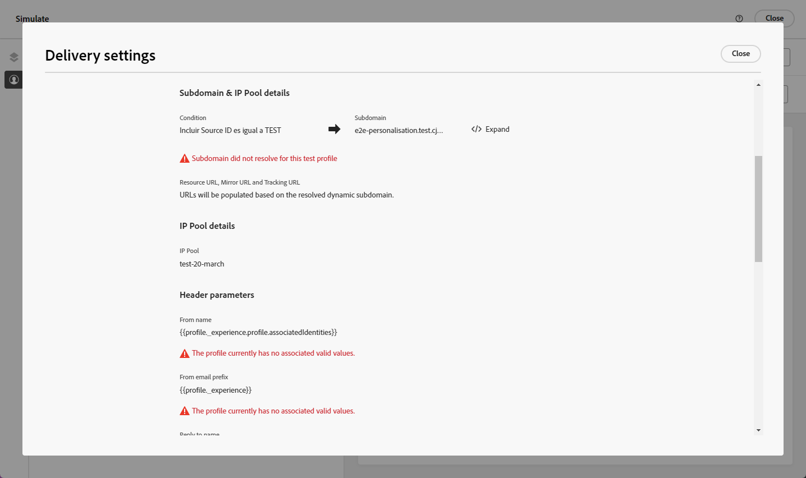

# Anpassa inställningar för e-postkonfiguration {#surface-personalization}

För större flexibilitet och kontroll över e-postinställningarna kan du med [!DNL Journey Optimizer] definiera anpassade värden för underdomäner, rubriker och parametrar för URL-spårning när du skapar e-postkonfigurationer.

## Lägg till dynamiska underdomäner {#dynamic-subdomains}

>[!CONTEXTUALHELP]
>id="ajo_surface_perso_not_available"
>title="Personalization är inte tillgängligt"
>abstract="Den här konfigurationen skapades utan några personaliseringsattribut. Läs dokumentationen om hur du löser ett problem med personalisering."

>[!CONTEXTUALHELP]
>id="ajo_surface_dynamic_subdomain"
>title="Aktivera dynamiska underdomäner"
>abstract="När du skapar en e-postkonfiguration kan du konfigurera dynamiska underdomäner baserat på villkor som du definierar med personaliseringsredigeraren. Du kan lägga till upp till 50 dynamiska underdomäner."

När du skapar en e-postkonfiguration kan du konfigurera dynamiska underdomäner baserat på specifika villkor.

Om du till exempel har juridiska begränsningar för att skicka meddelanden från en dedikerad e-postadress per land kan du använda dynamiska underdomäner. Detta gör att du kan skapa en enda konfiguration med flera sändande underdomäner som motsvarar olika länder, i stället för att skapa flera konfigurationer för varje land. Sedan kan ni inrikta er på kunder i olika länder som samlas i en enda kampanj.

Följ stegen nedan för att definiera dynamiska underdomäner i en e-postkanalskonfiguration.

1. Innan du skapar en konfiguration ska du konfigurera de underdomäner som du vill använda för att skicka e-post enligt ditt användningsexempel. [Lär dig hur](../configuration/about-subdomain-delegation.md)

   Anta att du vill använda olika underdomäner för olika länder: konfigurera en underdomän som är specifik för USA, en som är specifik för Storbritannien, osv.

1. Skapa en kanalkonfiguration. [Lär dig hur](../configuration/channel-surfaces.md)

1. Välj kanalen **[!UICONTROL Email]**.

1. Aktivera alternativet **i avsnittet** Underdomän **[!UICONTROL Dynamic Subdomain]**.

   

1. Välj redigeringsikonen bredvid det första **[!UICONTROL Condition]**-fältet.

1. [Anpassningsredigeraren](../personalization/personalization-build-expressions.md) öppnas. I det här exemplet anger du ett villkor som `Country` är lika med `US`.

   

1. Markera den underdomän som du vill associera med det här villkoret. [Läs mer om underdomäner](../configuration/about-subdomain-delegation.md)

   >[!NOTE]
   >
   >Vissa underdomäner är för närvarande inte tillgängliga för markering på grund av registrering av [feedbackloop](../reports/deliverability.md#feedback-loops). Den här processen kan ta upp till 10 arbetsdagar. När du är klar kan du välja bland alla tillgängliga underdomäner. <!--where FL registration happens? is it when delegating a subdomain and you are awaiting from subdomain validation? or is it on ISP side only?-->

   

   Alla mottagare som är baserade i USA får meddelanden med den valda underdomänen för det landet, vilket innebär att alla URL:er (som spegelsida, spårnings-URL eller länk för att avbryta prenumerationen) fylls i baserat på den underdomänen.

1. Ange andra dynamiska underdomäner efter behov. Du kan lägga till upp till 50 objekt.

   

   <!--Select the [IP pool](../configuration/ip-pools.md) to associate with the configuration. [Learn more](email-settings.md#ip-pools)-->

1. Definiera alla andra [e-postinställningar](email-settings.md) och [skicka](../configuration/channel-surfaces.md#create-channel-surface) i din konfiguration.

När du har lagt till en eller flera dynamiska underdomäner i en konfiguration fylls följande objekt i baserat på den lösta dynamiska underdomänen för den här konfigurationen:

* Alla URL:er (resurs-URL, URL för spegelsida och URL för spårning)

* URL:en [för att avbryta prenumerationen](email-settings.md#list-unsubscribe)

* Suffixen **Från e-post** och **Felmeddelande**

>[!NOTE]
>
>Om du konfigurerar dynamiska underdomäner och sedan inaktiverar alternativet **[!UICONTROL Dynamic Subdomain]** tas alla dynamiska värden bort. Välj en underdomän och skicka konfigurationen så att ändringarna börjar gälla.

## Anpassa sidhuvudet {#personalize-header}

Du kan också använda personalisering för alla huvudparametrar som definieras i en konfiguration.

Om du till exempel har flera varumärken kan du skapa en enda konfiguration och använda anpassade värden för dina e-posthuvuden. På så sätt kan du se till att alla e-postmeddelanden som skickas från dina olika varumärken adresseras till var och en av dina kunder med rätt **From**-namn och e-postmeddelanden. När mottagarna trycker på knappen **Svara** i e-postklientprogramvaran vill du på liknande sätt att **Svara på** namn och e-post motsvarar rätt varumärke för rätt användare.

Följ stegen nedan om du vill använda personaliserade variabler för konfigurationshuvudets parametrar.

>[!NOTE]
>
>Du kan anpassa alla **[!UICONTROL Header parameters]**-fält utom fältet **[!UICONTROL Error email prefix]**.

1. Definiera sidhuvudsparametrarna som vanligt. [Lär dig hur](email-settings.md#email-header)

1. För varje fält väljer du ikonen Redigera.

   

1. [Anpassningsredigeraren](../personalization/personalization-build-expressions.md) öppnas. Definiera ditt tillstånd efter behov och spara ändringarna.

   <!--For example, set a condition such as each recipient receives an email from their own brand representative.-->

   >[!NOTE]
   >
   >Du kan bara välja **[!UICONTROL Profile attributes]** och **[!UICONTROL Helper functions]**.

   Du vill till exempel hantera dynamiskt skickade e-postmeddelanden för en relationshanterare, vars information lagras i kundprofilen, så att alla kunder är länkade till en relationshanterare. I en [resa](../building-journeys/journey-gs.md) kan e-posthuvudet (avsändarens namn, avsändarens e-postadress, svarsadressen) anpassas med relationshanterarens parametrar utifrån profilattributen.

   <!--The examples below use event parameters, which are currently not available.
    
    Let's say you want to handle dynamically emails sent on behalf of a sales assistant, where the sales assistant is retrieved from an event or campaign contextual parameters. For example: In a [journey](../building-journeys/journey-gs.md), when a purchase event is linked to the sales assistant of a specific shop, the email header (sender name, sender email, reply to address) can be personalized with the sales assistant parameters, taken from the event attributes. In an [API-triggered campaign](../campaigns/api-triggered-campaigns.md), initiated externally by a sales assistant, the triggered email can be sent on behalf of the sales assistant and the header personalization values taken from campaign contextual parameters.-->

1. Upprepa stegen ovan för varje parameter som du vill lägga till personalisering i.

>[!NOTE]
>
>Om du har lagt till en eller flera dynamiska underdomäner i din konfiguration fylls suffixen **Från e-post** och **Fel-e-post** i baserat på den matchade [dynamiska underdomänen](#dynamic-subdomains).

## Använd personlig URL-spårning {#personalize-url-tracking}

Följ stegen nedan om du vill använda personaliserade URL-spårningsparametrar.

1. Gå till avsnittet **[!UICONTROL URL tracking parameters]** i e-postkanalskonfigurationen. [Läs mer](url-tracking.md)

1. Klicka på ikonen Redigera bredvid varje fält. Förutom kontextattribut kan du välja profilattribut.

1. Välj det profilattribut du vill använda i [anpassningsredigeraren](../personalization/personalization-build-expressions.md).

1. Upprepa stegen ovan för varje spårningsparameter som du vill anpassa.

När e-postmeddelandet skickas läggs den anpassade parametern automatiskt till i slutet av webbadressen. Du kan sedan hämta den här parametern i webbanalysverktyg eller i resultatrapporter.

## Visa konfigurationsinformation {#view-surface-details}

När du använder en konfiguration med anpassade inställningar i en kampanj eller resa kan du visa konfigurationsinformationen direkt i kampanjen eller under resan. Följ stegen nedan.

1. Skapa ett [kampanj](../campaigns/create-campaign.md) eller [resa](../building-journeys/journey-gs.md) via e-post.

1. Markera knappen **[!UICONTROL Edit content]**.

1. Klicka på knappen **[!UICONTROL View configuration details]**.

   

1. Fönstret **[!UICONTROL Delivery settings]** visas. Du kan visa alla konfigurationsinställningar, inklusive dynamiska underdomäner och anpassade huvudparametrar.

   >[!NOTE]
   >
   >All information på den här skärmen är skrivskyddad.

1. Välj **[!UICONTROL Expand]** om du vill visa information om de dynamiska underdomänerna.

   

## Kontrollera konfigurationen {#check-configuration}

När du använder en anpassad konfiguration i en kampanj eller en resa kan du förhandsgranska ditt e-postinnehåll med testprofiler för att kontrollera om det finns potentiella fel med de dynamiska inställningar du har definierat. Följ stegen nedan.

>[!NOTE]
>
>Utöver testprofiler kan du i [!DNL Journey optimizer] även testa olika varianter av ditt innehåll genom att förhandsgranska det och skicka korrektur med exempelindata som har överförts från en CSV-/JSON-fil, eller lagts till manuellt. [Lär dig hur du simulerar innehållsvariationer](../test-approve/simulate-sample-input.md)

Så här förhandsgranskar du ditt innehåll med testprofiler:

1. Klicka på knappen **[!UICONTROL Simulate content]** på skärmen Redigera innehåll i ditt meddelande eller i e-post-Designer. [Läs mer](../content-management/preview.md)

1. Välj en [testprofil](../content-management/test-profiles.md).

1. Om ett fel visas klickar du på knappen **[!UICONTROL View configuration details]**.

   

1. Kontrollera **[!UICONTROL Delivery settings]**-skärmen för felinformation.

   

Möjliga fel kan vara följande:

* **underdomänen** löstes inte för den valda testprofilen. I konfigurationen används till exempel flera sändande underdomäner som motsvarar olika länder, men den valda profilen har inget definierat värde för attributet `Country`, eller så är attributet inställt på `France`, men det här värdet är inte associerat med någon underdomän i den konfigurationen.

* Den valda profilen har inga associerade värden för en eller flera **rubrikparametrar**.

Vid något av dessa fel skickas inte e-post till den valda testprofilen.

Om du vill undvika den här typen av fel kontrollerar du att de rubrikparametrar du definierar använder anpassade attribut med värden för de flesta av dina profiler. Värden som saknas kan påverka e-postleveransen.

>[!NOTE]
>
>Läs mer om levererbarhet i [det här avsnittet](../reports/deliverability.md)
