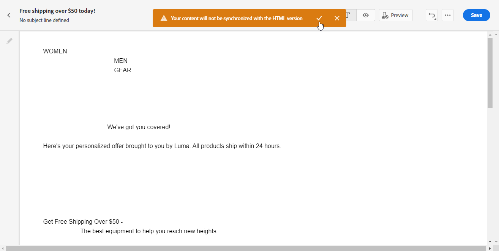

# Skapa textversionen av ett e-postmeddelande {#text-version-email}

Vi rekommenderar att du skapar en textversion av e-postbrödtexten, som används när HTML-innehåll inte kan visas.

Som standard skapar e-post-Designer en **[!UICONTROL Plain text]**-version av ditt e-postmeddelande, inklusive anpassningsfält. Den här versionen genereras och synkroniseras automatiskt med HTML-versionen av ditt innehåll.

Om du föredrar att använda ett annat innehåll för den oformaterade textversionen följer du stegen nedan:

1. Välj ikonen **[!UICONTROL Plain text]** i ditt e-postmeddelande.

   

1. Använd växlingsknappen **[!UICONTROL Sync with HTML]** för att inaktivera synkronisering. Bekräfta ditt val genom att klicka på bockmarkeringen.

   

1. Du kan sedan redigera den oformaterade textversionen efter behov.

>[!CAUTION]
>
> * När synkronisering är inaktiverat återspeglas inte ändringar som görs i vyn **[!UICONTROL Plain text]** i HTML-vyn.
>
>* Om du återaktiverar alternativet **[!UICONTROL Sync with HTML]** efter att ha uppdaterat ditt oformaterade textinnehåll, kommer dina ändringar att gå förlorade och ersättas med textinnehåll som genererats från HTML-versionen.

## När anpassade rena textversioner ska användas {#when-to-use}

Att förstå när man ska skapa en anpassad oformaterad textversion jämfört med att använda automatisk synkronisering hjälper till att säkerställa optimal e-postleverans och läsbarhet.

### Använd anpassad oformaterad text (inaktivera synkronisering) när:

* **Komplexa HTML-layouter** - Ditt HTML-e-postmeddelande innehåller layouter med flera kolumner, tabeller eller komplex CSS som inte går att omvandla på ett bra sätt till oformaterad text.
* **Visuellt tungt innehåll** - Ditt e-postmeddelande är starkt beroende av bilder och du vill tillhandahålla beskrivande textalternativ för bildinaktiverade klienter.
* **Olika meddelandestrukturer** - Du vill ha en förenklad eller omstrukturerad meddelandestruktur som är optimerad för vanliga textläsare.
* **Tillgänglighetskrav** - Du behöver specifik formatering med oformaterad text för att uppfylla tillgänglighetsstandarder.
* **Äldre e-postklienter** - Din målgrupp innehåller användare på äldre e-postklienter (t.ex. Outlook 2003, textbaserade mobilklienter) som behöver särskilt formaterat innehåll.
* **ASCII-formatering** - Du vill inkludera specifik oformaterad text som ASCII-bilder, tabeller eller specifika radbrytningar.

### Använd automatisk synkronisering (standard) när:

* **Enkel HTML-design** - Din HTML-e-postadress har en enkel, linjär struktur som översätts bra till oformaterad text.
* **Konsekvent innehåll** - Du vill ha exakt konsekvens mellan HTML och oformaterad text.
* **Vanliga uppdateringar** - Du uppdaterar regelbundet e-postinnehåll och vill undvika manuell duplicering.
* **Personalization fungerar bra** - dina anpassningsfält fungerar korrekt i båda formaten.
* **Tidsbegränsningar** - Du måste snabbt starta e-postmeddelanden utan ytterligare vanlig textanpassning.

## Exempel {#practical-examples}

I följande exempel visas verkliga scenarier som hjälper dig att avgöra om du ska använda anpassad oformaterad text eller automatisk synkronisering. I varje exempel förklaras sammanhanget, den rekommenderade metoden och grunderna bakom beslutet.

+++Exempel 1: Marknadsföringsnyhetsbrev med komplex layout

**Scenario:** Nyhetsbrev med flera kolumner och bilder, formaterade knappar och färgkodade avsnitt.


**Rekommendation:** Använd anpassad oformaterad text (inaktivera synkronisering).

**Varför anpassad oformaterad text:** I HTML-versionen används en stödrasterlayout med tre kolumner och banderollbilder, formaterade knappar och färgkodade avsnitt. Dessa visuella element översätter inte så bra till oformaterad text via automatisk synkronisering, vilket ger rörigt och lättläst innehåll. Med en anpassad oformaterad textversion kan du strukturera om innehållet till ett linjärt, lättgenomskinligt format med tydliga avsnittsrubriker och korrekt formaterade länkar.

**Exempel på anpassad oformaterad text:**

```
================================================
YOUR BRAND - MONTHLY NEWSLETTER
December 2025
================================================

🌟 FEATURED ARTICLE
"10 Ways to Optimize Your Customer Journeys"
Read more: https://example.com/articles/optimize-journeys

📢 UPCOMING WEBINAR
"Mastering Email Personalization"
December 15, 2025 at 2:00 PM EST
Register: https://example.com/webinar/register

📦 NEW PRODUCTS
- Winter Collection: https://example.com/winter
- Holiday Gift Guide: https://example.com/gifts

================================================
Website: https://example.com
Unsubscribe: https://example.com/unsubscribe
================================================
```

+++

+++Exempel 2: Transaktionsorderbekräftelse

**Scenario:** Orderbekräftelse med strukturerade data (ordernummer, artiklar, priser, leveransinformation).


**Rekommendation:** Använd automatisk synkronisering.

**Varför automatisk synkronisering fungerar:** Orderbekräftelser har en enkel, linjär struktur som översätts naturligt från HTML till oformaterad text. Informationen flödar logiskt (orderinformation → artiklar → summor → frakt) och fält för personalisering som ordernummer och kundnamn fungerar likadant i båda formaten. Den strukturerade, tabellbaserade informationen konverteras utan manuella justeringar, vilket sparar tid samtidigt som klarheten bevaras.

+++

+++Exempel 3: Evenemangsinbjudan med multimedia

**Scenario:** Händelseinbjudan med bakgrundsbilder, inbäddade videor och interaktiva element.


**Rekommendation:** Använd anpassad oformaterad text (inaktivera synkronisering).

**Varför anpassad oformaterad text:** HTML-versionen är beroende av visuell effekt - bakgrundsbilder, inbäddade videofiler och interaktiva RSVP-knappar. Automatisk synkronisering tar bort dessa element och lämnar en förvirrande textversion med brutna referenser. Med en anpassad oformaterad textversion kan du tillhandahålla tydlig händelseinformation, högtalarinformation och direktregistreringslänkar i ett välorganiserat format som fungerar utan visuella element.

**Exempel på anpassad oformaterad text:**

```
YOU'RE INVITED!
Annual Customer Summit 2025

📅 When: March 15-17, 2025
📍 Where: San Francisco Convention Center
         123 Market Street, San Francisco, CA

KEYNOTE SPEAKERS
- Jane Smith, CEO TechCorp: "The Future of Digital Marketing"
- John Doe, Chief Innovation Officer: "AI and Customer Experience"

REGISTER NOW: https://example.com/summit/register
Early bird discount ends February 1st

Full agenda: https://example.com/summit/agenda
Questions: events@example.com | 1-800-555-0123
```

+++

## Vanliga användningsfall {#common-use-cases}

I följande exempel visas situationer där det är bra att skapa en anpassad oformaterad textversion (inaktivera synkronisering). I varje exempel visas utmaningen med HTML-versionen och hur en anpassad lösning för oformaterad text löser den.

+++Användningsfall 1: E-post för produktkataloger

**Utmaning:** HTML visar produktrutnät med bilder, priser och köpknappar

**Oformaterad textlösning:** Skapa en strukturerad lista med tydliga produktnamn, priser och direkta länkar

```
FEATURED PRODUCTS
=================

1. Premium Leather Wallet
   Price: $89.99
   View product: https://example.com/product/wallet
   
2. Designer Sunglasses
   Price: $129.99
   View product: https://example.com/product/sunglasses
```

+++

+++Användningsfall 2: Välkomstserie för e-post

**Utmaning:** Välkomstmeddelande med företagslogotyp och formaterad formatering

**Oformaterad textlösning:** Använd ASCII-bilder eller textformatering för att skapa en visuell hierarki

```
***************************************************
*                                                 *
*     WELCOME TO [BRAND NAME]                    *
*     We're thrilled to have you!                *
*                                                 *
***************************************************
```

+++

+++Använd fall 3: Undersökning eller begäran om feedback

**Problem:** HTML innehåller formaterade knappar och formulärelement

**Oformaterad textlösning:** Tillhandahåll tydliga textlänkar med instruktioner

```
We'd love your feedback!
------------------------

Please take 2 minutes to complete our survey:
https://example.com/survey/customer-feedback

Your input helps us improve our service.
```

+++

## Vanliga frågor och svar {#faq}

**Fungerar mina anpassningsfält som ren text?**\
Ja, anpassningsbara fält som `{{profile.firstName}}` fungerar likadant i både HTML och vanliga textversioner.

**Hur testar jag min oformaterade textversion?**
* Växla till vyn **[!UICONTROL Plain text]** i e-post-Designer. [Lär dig hur](#text-version-email)
* Skicka testmeddelanden via e-post till e-postklienter som tidigare versioner av Pine eller grundläggande mobilappar.

**Vad händer om jag glömmer att skapa en oformaterad textversion?**\
Systemet genererar automatiskt en oformaterad textversion från HTML, som kanske inte är optimalt formaterad, men som säkerställer leverans till klienter med endast text.

**Kan jag använda en annan personalisering i HTML jämfört med vanlig text?**\
Ja, när du har inaktiverat synkroniseringen kan du anpassa varje version separat, inklusive med hjälp av olika anpassningsfält eller innehåll.

**Vilka e-postklienter stöder endast oformaterad text?**\
Mycket få moderna klienter är textbaserade, men vissa av företagets e-postregler, tillgänglighetsverktyg och äldre mobila enheter kan visa oformaterad text. Det är också en reserv när HTML-återgivningen misslyckas.

**Hur ofta ska jag uppdatera min oformaterade textversion?**\
Uppdatera det när du gör betydande ändringar i ditt HTML-innehåll. Mindre HTML-ändringar kanske inte kräver några enkla textuppdateringar om huvudmeddelandet inte ändras.

**Kan jag inkludera länkar i e-postmeddelanden med oformaterad text?**\
Ja! Inkludera fullständiga URL:er (t.ex. https://example.com/page) så gör de flesta e-postklienter automatiskt dem klickbara.

**Ska jag inkludera bilder i oformaterad text?**\
Nej, normal text stöder inte bilder. Beskriv i stället vad bilden visar eller skapa en länk för att visa den online.
