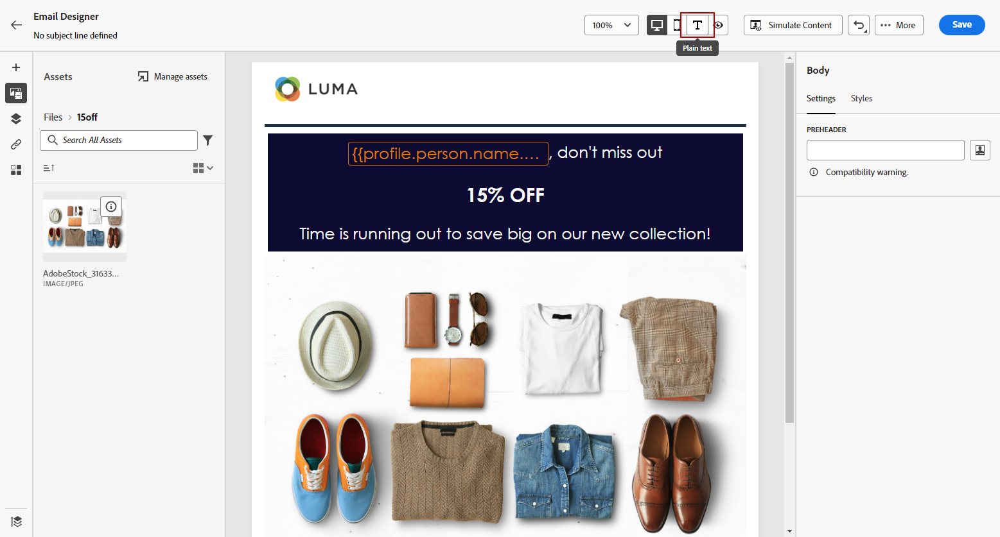
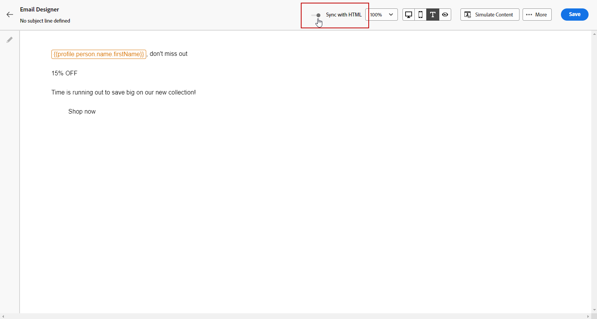

# Skapa textversionen av ett e-postmeddelande {#text-version-email}

Vi rekommenderar att du skapar en textversion av e-postbrödtexten, som används när HTML inte kan visas.

Som standard skapar e-postdesignern en **[!UICONTROL Plain text]** version av e-postmeddelandet, inklusive personaliseringsfält. Den här versionen genereras och synkroniseras automatiskt med HTML-versionen av ditt innehåll.

Om du föredrar att använda ett annat innehåll för den oformaterade textversionen följer du stegen nedan:

1. I ditt e-postmeddelande väljer du **[!UICONTROL Plain text]** ikon.

   

1. Använd **[!UICONTROL Sync with HTML]** om du vill inaktivera synkronisering.

   

1. Bekräfta ditt val genom att klicka på bockmarkeringen.

   

1. Du kan sedan redigera den oformaterade textversionen efter behov.

>[!CAUTION]
>
>* Ändringar gjorda i **[!UICONTROL Plain text]** vyn inte visas i HTML.
>
>* Om du aktiverar **[!UICONTROL Sync with HTML]** när du har uppdaterat oformaterad text kommer ändringarna att gå förlorade och ersättas med textinnehåll som genererats från HTML-versionen.

