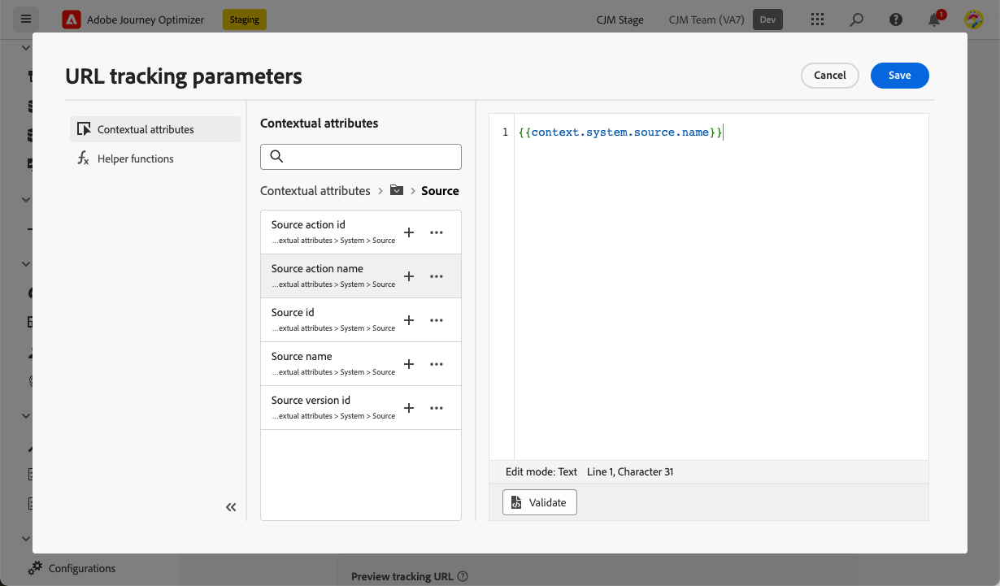

# URL-uppföljning {#url-tracking}

>[!CONTEXTUALHELP]
>id="ajo_admin_preset_utm"
>title="Definiera parametrar för URL-spårning"
>abstract="Använd det här avsnittet om du automatiskt vill lägga till spårningsparametrar till de URL:er som finns i ditt e-postinnehåll. Den här funktionen är valfri."

>[!CONTEXTUALHELP]
>id="ajo_admin_preset_url_preview"
>title="Förhandsgranska URL-spårningsparametrar"
>abstract="Granska hur spårningsparametrar läggs till i de URL:er som finns i ditt e-postinnehåll."

När du konfigurerar en ny [e-postkanalskonfiguration](email-settings.md) kan du definiera **[!UICONTROL URL tracking parameters]** för att mäta effekten av dina marknadsföringssatsningar i olika kanaler. Det är valfritt att aktivera den här funktionen.

Parametrarna som definieras i motsvarande avsnitt läggs till i slutet av de URL:er som ingår i e-postmeddelandeinnehållet. Du kan sedan hämta parametrarna i webbanalysverktyg som Adobe Analytics eller Google Analytics och skapa olika prestandarapporter.

>[!NOTE]
>
>Ordningen på parametrarna för URL-spårning som läggs till i URL:en är slumpmässig och kan inte kontrolleras. Om systemet kräver parametrar i en viss ordning måste du analysera dem och ordna om dem på din sida.

Du kan lägga till upp till 10 spårningsparametrar med knappen **[!UICONTROL Add new parameter]**.

{width="80%"}

Om du vill konfigurera en URL-spårningsparameter kan du ange önskade värden direkt i fälten **[!UICONTROL Name]** och **[!UICONTROL Value]**.

Du kan också redigera varje **[!UICONTROL Value]**-fält med [anpassningsredigeraren](../personalization/personalization-build-expressions.md). Klicka på utgåveikonen för att öppna redigeraren. Därifrån kan du välja tillgängliga sammanhangsberoende attribut och/eller redigera texten direkt.

Följande fördefinierade värden är tillgängliga via personaliseringsredigeraren:

* **Meddelandeprofil-ID**: Meddelandeorienterat attribut som unikt identifierar varje meddelande som skickas till varje målprofil i en leverans.

* **Erbjudande-ID**: ID för erbjudandet som används i e-postmeddelandet.

* **Source åtgärds-ID**: ID för e-poståtgärden som har lagts till i resan eller kampanjen.

* **Source-åtgärdsnamn**: namnet på e-poståtgärden som har lagts till i resan eller kampanjen.

* **Source-id**: ID för resan eller kampanjen som e-postmeddelandet skickades med.

* **Source-namn**: namn på den resa eller kampanj som e-postmeddelandet skickades med.

* **Source version-ID**: ID för resan eller kampanjversionen som e-postmeddelandet skickades med.

>[!NOTE]
>
>Du kan kombinera textvärden och använda sammanhangsberoende attribut från personaliseringsredigeraren. Varje **[!UICONTROL Value]**-fält kan innehålla ett antal tecken upp till gränsen på 5 kB.

<!--You can drag and drop the parameters to reorder them.-->

Nedan finns exempel på Adobe Analytics- och Google Analytics-kompatibla URL:er.

* Adobe Analytics-kompatibel URL: `www.YourLandingURL.com?cid=email_AJO_{{context.system.source.id}}_image_{{context.system.source.name}}`

* Google Analytics-kompatibel URL: `www.YourLandingURL.com?utm_medium=email&utm_source=AJO&utm_campaign={{context.system.source.id}}&utm_content=image`

Du kan dynamiskt förhandsgranska den resulterande spårnings-URL:en. Varje gång du lägger till, redigerar eller tar bort en parameter uppdateras förhandsvisningen automatiskt.

>[!NOTE]
>
>Du kan också lägga till dynamiska personaliserade spårningsparametrar till länkarna i ditt e-postinnehåll. [Läs mer](surface-personalization.md#personalize-url-tracking)
