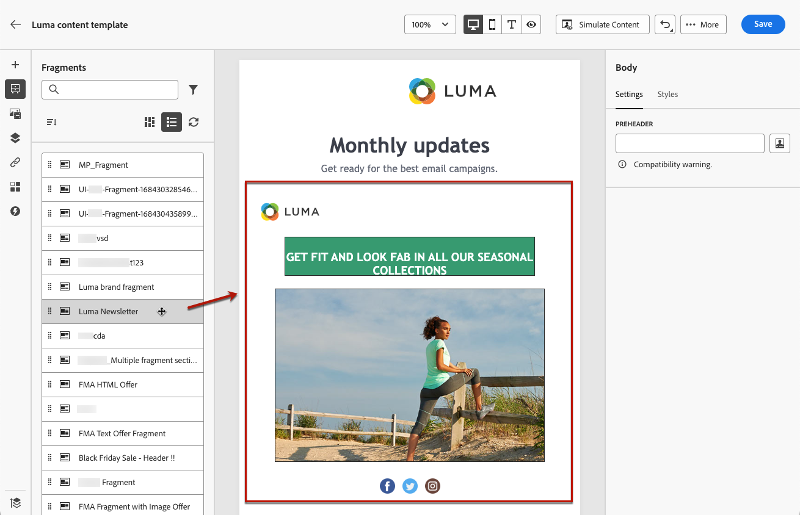

# Lägg till visuella fragment i e-postmeddelanden {#use-visual-fragments}

Ett fragment är en återanvändbar komponent som kan refereras i ett eller flera e-postmeddelanden för Journey Optimizer-kampanjer, resor eller innehållsmall. Med den här funktionen kan man skapa färdiga anpassade innehållsblock som kan användas av marknadsföringsanvändare för att snabbt sammanställa e-postinnehåll i en förbättrad designprocess. [Lär dig skapa och hantera fragment](../content-management/fragments.md).

➡️ [Lär dig hur du hanterar, redigerar och använder fragment i den här videon](../content-management/fragments.md#video-fragments)

## Använda ett fragment {#use-fragment}

Följ stegen nedan om du vill använda ett fragment i ett e-postmeddelande.

>[!NOTE]
>
>Du kan lägga till upp till 30 fragment i en viss leverans. Fragment kan bara kapslas upp till 1 nivå.

1. Öppna e-post- eller mallinnehåll med hjälp av [e-post-Designer](get-started-email-design.md).

1. Välj ikonen **[!UICONTROL Fragments]** i den vänstra listen.

   

1. Listan över alla visuella fragment som skapats i den aktuella sandlådan visas. De sorteras efter skapandedatum: nyligen tillagda visuella fragment visas först i listan. Du kan:

   * Sök efter ett visst fragment genom att börja skriva dess etikett.
   * Sortera fragment i stigande eller fallande ordning.
   * Ändra hur fragmenten visas (kort eller listvy).
   * Uppdatera listan.

   >[!NOTE]
   >
   >Om vissa fragment har ändrats eller lagts till medan du redigerar innehållet, uppdateras listan med de senaste ändringarna.

1. Dra och släpp ett fragment från listan till området där du vill infoga det.

   

   >[!CAUTION]
   >
   >Du kan lägga till valfritt **utkast**- eller **Live**-fragment till ditt innehåll. Du kan dock inte aktivera din resa eller kampanj om ett fragment med statusen Utkast används i det. Vid en resa eller kampanjpublicering kommer utkastsfragment att visa ett fel och du måste godkänna dem för att kunna publicera.

1. Precis som andra komponenter kan du flytta runt fragmentet i innehållet.

1. Markera fragmentet för att visa motsvarande ruta till höger. Därifrån kan du ta bort fragmentet från innehållet eller duplicera det. Du kan också utföra dessa åtgärder direkt från den snabbmeny som visas ovanpå fragmentet.

   

1. På fliken **[!UICONTROL Settings]** kan du:

   * Välj de enheter som du vill att fragmentet ska visas på.
   * Öppna fragmentet på en ny flik om du vill redigera det. [Läs mer](../content-management/fragments.md#fragments)
   * Utforska referenser. [Läs mer](../content-management/fragments.md#visual-expression)

1. Du kan anpassa fragmentet ytterligare med fliken **[!UICONTROL Styles]**.

1. Vid behov kan du bryta arvet med det ursprungliga fragmentet. [Läs mer](#break-inheritance)

1. Lägg till så många fragment du vill och **[!UICONTROL Save]** dina ändringar.

### Begränsningar när dynamiskt innehåll används i fragment {#fragment-dynamic-content}

>[!CAUTION]
>
>Tänk på följande begränsning när du arbetar med fragment som innehåller dynamiskt innehåll (villkorligt innehåll):
>
>**Kapsling av fragment med dynamiskt innehåll stöds inte.** Du kan inte placera ett fragment som innehåller dynamiskt innehåll i ett olåst fragment som även innehåller dynamiskt innehåll. Den här konfigurationen som inte stöds kan orsaka:
>
>* Förlorade villkorade innehållsmappningar
>* Varningar för kompatibilitetsläge i e-postmeddelandet om Designer
>* Inkonsekvent e-poståtergivning
>
>**Rekommenderad metod:** Om du använder flera fragment med dynamiskt innehåll i ditt e-postmeddelande lägger du till varje fragment direkt i dess eget strukturblock på e-postnivå. Detta garanterar korrekt funktionalitet och förhindrar de problem som nämns ovan.

## Bästa tillvägagångssätt för fragment med dynamiskt innehåll {#fragment-best-practices}

Följ dessa metodtips när du arbetar med visuella fragment och dynamiskt innehåll (villkorligt innehåll):

* **Strukturera e-postmeddelandet korrekt**: När du skapar e-postmeddelanden med fragment som innehåller dynamiskt innehåll lägger du till varje fragment i ett dedikerat strukturblock på e-postnivå. Undvik kapsling av fragment med dynamiskt innehåll i andra olåsta fragment som även innehåller dynamiskt innehåll.

* **Planera framåt**: Innan du lägger till fragment i e-postmeddelandet måste du identifiera vilka som innehåller dynamiskt innehåll och planera layouten utifrån detta. Detta förhindrar konfigurationsproblem och säkerställer en ren struktur från början.

* **Designa återanvändbara fragment noggrant**: När du skapar fragment som ska innehålla dynamiskt innehåll bör du fundera på hur de ska användas. Om ett fragment måste kapslas i andra fragment bör du undvika att lägga till dynamiskt innehåll i både det överordnade och det underordnade fragmentet.

* **Felsökning**: Om villkorliga innehållsmappningar eller kompatibilitetslägesvarningar försvinner:
   * Kontrollera e-poststrukturen för kapslade fragment som innehåller dynamiskt innehåll
   * Strukturera om genom att flytta varje fragment med dynamiskt innehåll till ett eget strukturblock på e-postnivå
   * Spara och verifiera att villkorliga innehållsmappningar återställs korrekt

## Använd implicita variabler {#implicit-variables-in-fragments}

De implicita variablerna förbättrar de befintliga fragmentfunktionerna för att förbättra effektiviteten vid återanvändning av innehåll och användning av skript. Fragment kan använda indatavariabler och skapa utdatavariabler som kan användas i kampanj- och reseinnehåll.

Lär dig använda implicita variabler i [det här avsnittet](../personalization/use-expression-fragments.md#implicit-variables).

## Anpassa redigerbara fält {#customize-fields}

Om vissa delar av det markerade fragmentet har gjorts redigerbara kan du åsidosätta deras standardvärde efter att du har lagt till fragmentet i innehållet. [Lär dig hur du anpassar fragment](../content-management/customizable-fragments.md)

Så här anpassar du redigerbara fält i ett fragment:

1. Lägg till fragmentet i ditt innehåll.

1. Markera den för att öppna egenskapsrutan till höger.

   Alla redigerbara fält i fragmentet visas på fliken **Inställningar** under avsnittet **Fragment** .

1. När du markerar ett redigerbart fält i den högra rutan markeras det i grönt på den centrala förhandsvisningspanelen, vilket gör det enkelt att identifiera var det finns i ditt innehåll.

   I exemplet nedan kan bilden **source** och **alt text** redigeras, liksom knappen &quot;Klicka här&quot; **URL**.

   

## Bryt arv {#break-inheritance}

När du redigerar ett visuellt fragment synkroniseras ändringarna. De sprids automatiskt till alla utkast- eller direktresor/kampanjer och innehållsmallar som innehåller det fragmentet.

När fragment läggs till i ett e-postmeddelande eller i en innehållsmall synkroniseras de som standard. Du kan emellertid bryta arvet från det ursprungliga fragmentet. I så fall kopieras fragmentets innehåll till den aktuella designen och ändringarna synkroniseras inte längre.

Följ stegen nedan för att bryta arv:

1. Markera fragmentet.

1. Klicka på upplåsningsikonen i det sammanhangsberoende verktygsfältet.

   

1. Det fragmentet blir ett fristående element som inte längre är länkat till det ursprungliga fragmentet. Redigera det som vilken annan innehållskomponent som helst i innehållet. [Läs mer](content-components.md)
