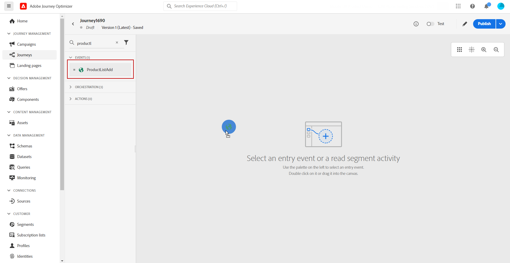

# Arbeta med Adobe Analytics-data {#analytics-data}

Ni kan utnyttja alla webbbeteendedata som ni redan samlar in via Adobe Analytics eller Web SDK och strömmar till Adobe Experience Platform för att utlösa resor och automatisera kundernas upplevelser.

För att detta ska fungera med Adobe Analytics måste du:

1. Aktivera den rapportsvit som du vill använda. [Läs mer](#leverage-analytics-data)
1. Gör det möjligt för Journey Optimizer att använda Adobe Analytics datakälla. [Läs mer](#activate-analytics-data)
1. Lägg till en specifik händelse under resan. [Läs mer](#event-analytic)

>[!NOTE]
>
>Det här avsnittet gäller endast för regelbaserade händelser och kunder som behöver använda Adobe Analytics- eller Web SDK-data.
> 
>Om du använder Adobe Customer Journey Analytics kan du läsa [den här sidan](../reports/cja-ajo.md).
>

## Konfigurera Adobe Analytics- eller Web SDK-data {#leverage-analytics-data}

Data som kommer från Adobe Analytics eller Adobe Experience Platform Web SDK måste vara aktiverade för att kunna användas på dina resor.

Gör så här:

1. Bläddra till menyn **[!UICONTROL Sources]**.

1. I avsnittet Adobe Analytics väljer du **[!UICONTROL Add data]**

   

1. I listan över tillgängliga Adobe Analytics-rapportsviter väljer du **[!UICONTROL Report suite]** som ska aktiveras. Klicka sedan på **[!UICONTROL Next]**.

   

1. Välj om du vill använda ett standardschema eller ett anpassat schema.

1. Välj **[!UICONTROL Dataflow detail]** på skärmen **[!UICONTROL Dataflow name]**.

1. När konfigurationen är klar klickar du på **[!UICONTROL Finish]**.

   

Detta aktiverar Analytics-källkopplingen för den rapportsviten. När informationen kommer in omvandlas den till en Experience-händelse och skickas till Adobe Experience Platform.

Läs mer om Adobe Analytics källanslutning i [Adobe Experience Platform-dokumentation](https://experienceleague.adobe.com/docs/experience-platform/sources/connectors/adobe-applications/analytics.html){target="_blank"} och [självstudiekurs](https://experienceleague.adobe.com/docs/experience-platform/sources/ui-tutorials/create/adobe-applications/analytics.html){target="_blank"}.

## Aktivera den här konfigurationen {#activate-analytics-data}

När konfigurationen är klar kontaktar du Adobe för att aktivera din Journey Optimizer-miljö för att använda den här datakällan. Det här steget krävs bara för Adobe Analytics datakällor. Så här gör du:

1. Hämta datakällans ID. Den här informationen är tillgänglig i användargränssnittet: bläddra till datakällan som du skapade på fliken **Dataflöden** på menyn **Källor**. Det enklaste sättet att hitta den är att filtrera på Adobe Analytics-källor.
1. Kontakta Adobe kundtjänst och lämna följande uppgifter:

   * Angående: Aktivera Adobe Analytics-event för resor

   * Innehåll: Aktivera min miljö för att använda AA-händelser.

      * Organisations-ID: &quot;XXX@AdobeOrg&quot;

      * Datakällans ID: &quot;ID: xxxxx&quot;

1. När du har fått en bekräftelse på att din miljö är klar kan du använda Adobe Analytics-data på dina resor.

## Skapa en resa med ett evenemang med hjälp av Adobe Analytics- eller Web SDK-data {#event-analytics}

Nu kan du skapa en händelse som baseras på Adobe Analytics- eller Adobe Experience Platform Web SDK-data och som ska användas under en resa.

I exemplet nedan får du lära dig att rikta in dig på användare som har lagt till en produkt i sina kundvagnar:

* Om beställningen är klar får användarna ett uppföljningsmejl två dagar senare för att be om feedback.
* Om beställningen inte är slutförd får användarna ett e-postmeddelande som påminner dem om att de kan slutföra beställningen.

1. Öppna menyn **[!UICONTROL Configuration]** från Adobe Journey Optimizer.

1. Välj sedan **[!UICONTROL Manage]** från **[!UICONTROL Events]**-kortet.

   

1. Klicka på **[!UICONTROL Create event]**. Konfigurationsfönstret för händelsen öppnas till höger på skärmen.

1. Fyll i **[!UICONTROL Event]**-parametrarna:

   * **[!UICONTROL Name]**: Anpassa namnet på **[!UICONTROL Event]**.
   * **[!UICONTROL Type]**: Välj **[!UICONTROL Unitary]**-typ. [Läs mer](../event/about-events.md)
   * **[!UICONTROL Event ID type]**: Välj typ av **[!UICONTROL Rule based]** händelse-ID. [Läs mer](../event/about-events.md#event-id-type)
   * **[!UICONTROL Schema]**: Välj Analytics- eller WebSDK-schemat [som skapades före](#leverage-analytics-data).
   * **[!UICONTROL Fields]**: Välj nyttolastfälten. [Läs mer](../event/about-creating.md#define-the-payload-fields)
   * **[!UICONTROL Event ID condition]**: Definiera villkoret för att identifiera de händelser som utlöser din resa.

     Här utlöses händelsen när kunderna lägger till en artikel i sina kundvagnar.
   * **[!UICONTROL Profile Identifier]**: Välj ett fält bland dina nyttolastfält, eller definiera en formel, för att identifiera den person som är associerad med händelsen.

   

1. Välj **[!UICONTROL Save]** när den är konfigurerad.

Nu när evenemanget är klart kan du skapa en resa för att använda det.

1. Öppna eller skapa en resa på menyn **[!UICONTROL Journeys]**. Mer information om detta finns i [det här avsnittet](../building-journeys/journey-gs.md).

1. Lägg till en tidigare konfigurerad Analytics-händelse på resan.

   

1. Lägg till en händelse som utlöses om en order slutförs.

1. Välj alternativen **[!UICONTROL Event menu]** och **[!UICONTROL Define the event timeout]** i din **[!UICONTROL Set a timeout path]**.

   

1. Lägg till en **[!UICONTROL Email]**-åtgärd från timeoutsökvägen. Den här sökvägen kommer att användas för att skicka ett e-postmeddelande till kunder som inte slutfört en order för att påminna dem om att deras kundvagnar fortfarande är tillgängliga.

1. Lägg till en **[!UICONTROL Wait]**-aktivitet efter huvudsökvägen och ställ in den på önskad varaktighet.

   

1. Lägg sedan till en **[!UICONTROL Email action]**. I det här e-postmeddelandet uppmanas kunderna att ge återkoppling om den placerade beställningen.

Nu kan du testa och publicera din resa. [Läs mer](../building-journeys/publishing-the-journey.md)

