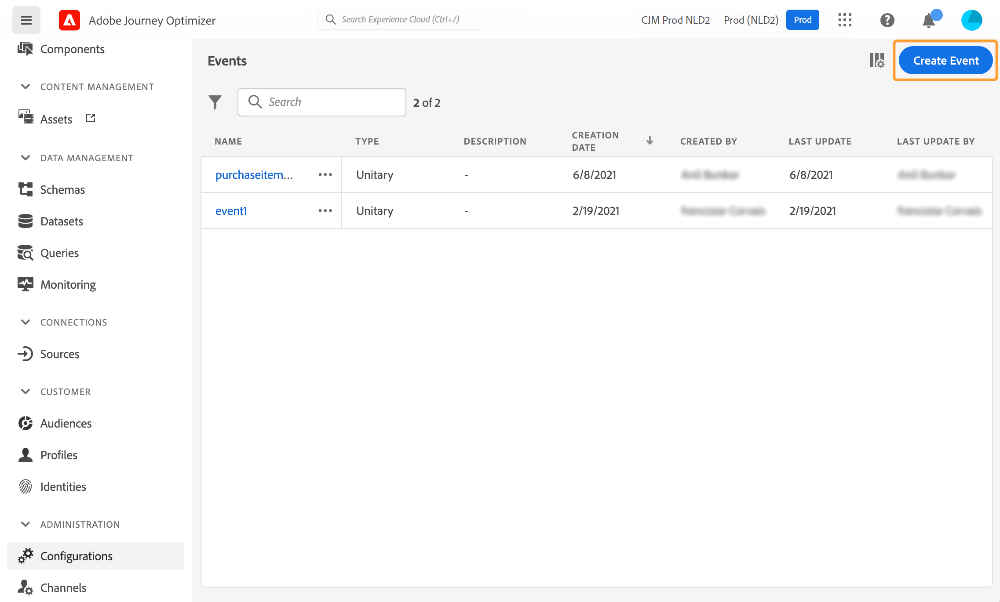
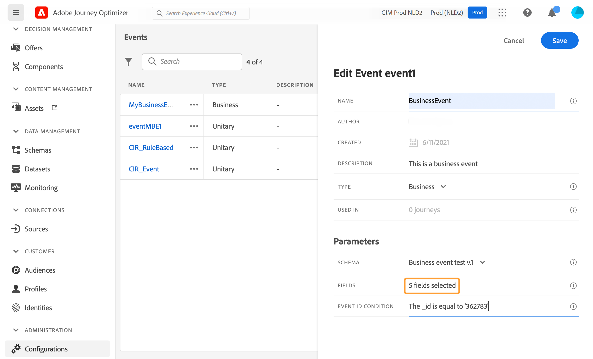

# Konfigurera en affärshändelse {#configure-a-business-event}

>[!CONTEXTUALHELP]
>id="ajo_journey_event_business"
>title="Affärshändelser"
>abstract="Med händelsekonfigurationen kan du definiera den information som Journey Optimizer ska ta emot som händelser. Du kan använda flera händelser (i olika steg på en resa) och flera resor kan använda samma händelse. Till skillnad från enhetshändelser är affärshändelser inte länkade till en viss profil. Händelse-ID-typen är alltid regelbaserad."

Till skillnad från enhetshändelser är affärshändelser inte länkade till en viss profil. Händelse-ID-typen är alltid regelbaserad. Läs mer om affärsevenemang i [det här avsnittet](../event/about-events.md).

Läsningen av målgruppsbaserade resor kan aktiveras i ett enda försök, av en schemaläggare regelbundet eller av en affärshändelse, när händelsen inträffar.

Affärshändelser kan vara&quot;en produkt är tillbaka i lager&quot;,&quot;ett företags aktiekurs når ett visst värde&quot; osv.

>[!NOTE]
>
>Du kan också titta på hur affärshändelser används [självstudiekurs](https://experienceleague.adobe.com/docs/journey-optimizer-learn/tutorials/create-journeys/use-case-business-event.html). Observera att schemat inte behöver aktiveras för profilen.

## Viktiga anteckningar {#important-notes}

* Endast tidsseriescheman är tillgängliga. Scheman för upplevelsehändelser, beslutshändelser och resesteghändelser är inte tillgängliga.
* Händelseschemat måste innehålla en icke-personbaserad primär identitet. Följande fält måste markeras när händelsen definieras: `_id` och `timestamp`
* Affärsevenemang kan bara tas bort som det första steget i en resa.
* När du släpper en affärshändelse som första steg i en resa blir transportens schemaläggartyp&quot;affärshändelse&quot;.
* Bara en läsmålgruppsaktivitet kan tas bort efter en affärshändelse. Det läggs automatiskt till som nästa steg.
* Aktivera motsvarande alternativ i dialogrutan **[!UICONTROL Execution]** del av resans egenskaper.
* När en affärshändelse har utlösts blir det en fördröjning att exportera målgruppen från 15 minuter till upp till en timme.
* När du testar en affärshändelse måste du godkänna händelseparametrarna och identifieraren för den testprofil som kommer att gå in i testet. När du testar en affärshändelsebaserad resa kan du dessutom bara utlösa en enskild profilentré. Se [det här avsnittet](../building-journeys/testing-the-journey.md#test-business). I testläge finns inget kodläge tillgängligt.
* Vad händer med individer som för närvarande är på resa om en ny affärshändelse inträffar? Det fungerar på samma sätt som när enskilda personer fortfarande befinner sig på en återkommande resa när ett nytt återkommande händer. Deras väg är slut. Därför måste marknadsförarna vara uppmärksamma på att de inte behöver skapa för långa resor om de förväntar sig återkommande affärshändelser.
* Affärsevenemang kan inte användas tillsammans med enhetsevenemang eller målgruppsaktiviteter.

## Flera affärshändelser {#multiple-business-events}

Här är några viktiga kommentarer som gäller när flera affärshändelser tas emot i rad.

**Hur beter sig en affärshändelse när resan pågår?**

Affärshändelser följer reglerna för återinträde på samma sätt som för enhetshändelser. Om en resa tillåter återinträde kommer nästa affärshändelse att behandlas.

**Vilka är skyddsräckena för att undvika att överbelasta materialiserade målgrupper?**

När det gäller företagsevenemang som tagits under en viss resa återanvänds data som drivs av det första händelsejobbet under en 1-timmars tidsperiod. För schemalagda resor finns det ingen garanti. Läs mer om målgrupper i [Dokumentation för Adobe Experience Platform Segmenteringstjänst](https://experienceleague.adobe.com/docs/experience-platform/segmentation/home.html).

## Kom igång med affärsevenemang {#gs-business-events}

Här följer de första stegen för att konfigurera en affärshändelse:

1. I avsnittet ADMINISTRATION-menyn väljer du **[!UICONTROL Configurations]**. I  **[!UICONTROL Events]** avsnitt, klicka **[!UICONTROL Manage]**. Listan med händelser visas.

   

1. Klicka på **[!UICONTROL Create Event]** för att skapa en ny händelse. Konfigurationsfönstret för händelsen öppnas till höger på skärmen.

   

1. Ange namnet på händelsen. Du kan också lägga till en beskrivning.

   

   >[!NOTE]
   >
   >Använd inte blanksteg eller specialtecken. Använd maximalt 30 tecken.

1. I **[!UICONTROL Type]** fält, välj **Företag**.

   

1. Antalet resor som använder den här händelsen visas i fältet **[!UICONTROL Used in]**. Du kan klicka på ikonen **[!UICONTROL View journeys]** för att visa en lista över resor som använder den här händelsen.

1. Definiera schema- och nyttolastfälten: Här väljer du den händelseinformation (eller nyttolasten) som ska tas emot. Du kommer att använda den här informationen senare under din resa. Se [det här avsnittet](../event/about-creating-business.md#define-the-payload-fields).

   

   Endast tidsseriescheman är tillgängliga. `Experience Events`, `Decision Events` och `Journey Step Events` scheman är inte tillgängliga. Händelseschemat måste innehålla en icke-personbaserad primär identitet. Följande fält måste markeras när händelsen definieras: `_id` och `timestamp`

   

1. Klicka inuti **[!UICONTROL Event ID condition]** fält. Använd den enkla uttrycksredigeraren för att definiera det villkor som används av systemet för att identifiera de händelser som utlöser din resa.

   

   I vårt exempel skrev vi ett villkor baserat på produktens id. Det innebär att när systemet tar emot en händelse som matchar det här villkoret, kommer det att skickas till resorna.

   >[!NOTE]
   >
   >I den enkla uttrycksredigeraren är inte alla operatorer tillgängliga, de är beroende av datatypen. För en strängtyp av fält kan du till exempel använda &quot;contains&quot; eller &quot;equal to&quot;.

1. Klicka på **[!UICONTROL Save]**.

   

   Händelsen är nu konfigurerad och klar att injiceras i en resa. Ytterligare konfigurationssteg krävs för att ta emot händelser. Läs mer i [den här sidan](../event/additional-steps-to-send-events-to-journey.md).

## Definiera nyttolastfälten {#define-the-payload-fields}

Nyttolastdefinitionen gör att du kan välja vilken information systemet förväntar sig från händelsen under din resa och nyckeln för att identifiera vilken person som är associerad med händelsen. Nyttolasten baseras på Experience Cloud XDM-fältdefinitionen. Mer information om XDM finns i [Adobe Experience Platform-dokumentation](https://experienceleague.adobe.com/docs/experience-platform/xdm/home.html?lang=sv){target="_blank"}.

1. Välj ett XDM-schema i listan och klicka på **[!UICONTROL Fields]** fält eller på **[!UICONTROL Edit]** -ikon.

   

   Alla fält som definieras i schemat visas. Listan med fält varierar mellan olika scheman. Du kan söka efter ett specifikt fält eller använda filtren för att visa alla noder och fält eller endast de markerade fälten. Enligt schemadefinitionen kan vissa fält vara obligatoriska och förmarkerade. Du kan inte avmarkera dem. Alla fält som är obligatoriska för att händelsen ska kunna tas emot på rätt sätt under resor markeras som standard.

   

   >[!NOTE]
   >
   > Kontrollera att följande fält är markerade: `_id` och `timestamp`

1. Markera de fält som du förväntar dig att ta emot från händelsen. Det här är de områden som affärsanvändaren kommer att utnyttja under resan.

1. När du är klar med att markera de fält som behövs klickar du på **[!UICONTROL Save]** eller tryck **[!UICONTROL Enter]**.

   Antalet markerade fält visas i **[!UICONTROL Fields]**.

   

## Förhandsgranska nyttolasten {#preview-the-payload}

Använd nyttolastförhandsvisningen för att validera nyttolastdefinitionen.

1. Klicka på **[!UICONTROL View Payload]** om du vill förhandsgranska den nyttolast som systemet förväntar sig.

   

   Du kan se att de markerade fälten visas.

   

1. Kontrollera förhandsgranskningen för att validera nyttolastdefinitionen.

1. Sedan kan du dela nyttolastförhandsvisningen med den person som ansvarar för händelsen som skickar. Denna nyttolast kan hjälpa dem att utforma konfigurationen av en händelse som [!DNL Journey Optimizer]. Läs [den här sidan](../event/additional-steps-to-send-events-to-journey.md).
