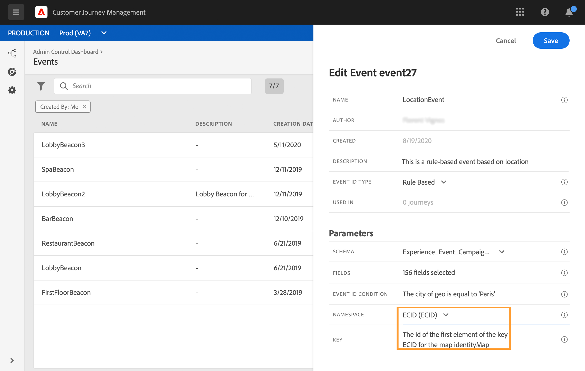

# Konfigurera en enhetshändelse {#configure-an-event}

Enhetshändelser är länkade till en viss profil. De kan vara regelbaserade eller systemgenererade.  Läs mer om enhetshändelse [det här avsnittet](../event/about-events.md).

Här följer de första stegen för att konfigurera en ny händelse:

1. Välj **[!UICONTROL Configurations]** under ADMINISTRATION-menyn. Klicka på **[!UICONTROL Manage]** i **[!UICONTROL Events]**-avsnittet. Listan med händelser visas.

   

1. Klicka på **[!UICONTROL Create Event]** för att skapa en ny händelse. Konfigurationsfönstret för händelsen öppnas till höger på skärmen.

   

1. Ange namnet på händelsen. Du kan också lägga till en beskrivning.

   

   >[!NOTE]
   >
   >Använd inte blanksteg eller specialtecken. Använd maximalt 30 tecken.

1. Välj **Enhet** i fältet **[!UICONTROL Type]**.

   

1. Välj den händelse-ID-typ som du vill använda i fältet **[!UICONTROL Event ID type]**: **Regelbaserad** eller **Systemgenererad**. Läs mer om händelsens ID-typer i [det här avsnittet](../event/about-events.md#event-id-type).

   

1. Antalet resor som använder den här händelsen visas i fältet **[!UICONTROL Used in]**. Du kan klicka på ikonen **[!UICONTROL View journeys]** för att visa en lista över resor som använder den här händelsen.

1. Definiera schema- och nyttolastfälten: Här väljer du den händelseinformation (kallas vanligtvis nyttolast) som resor förväntar sig att ta emot. Du kan sedan använda den här informationen i din resa. Se [det här avsnittet](../event/about-creating.md#define-the-payload-fields).

   

   >[!NOTE]
   >
   >När du väljer typen **[!UICONTROL System Generated]** är endast scheman som har fältet för eventID tillgängliga. När du väljer typen **[!UICONTROL Rule Based]** är alla Experience Event-scheman tillgängliga.

1. För regelbaserade händelser klickar du i fältet **[!UICONTROL Event ID condition]**. Använd den enkla uttrycksredigeraren för att definiera villkoret som ska användas av systemet för att identifiera de händelser som utlöser din resa.
   

   I vårt exempel skrev vi ett villkor baserat på profilens stad. Det innebär att när systemet tar emot en händelse som matchar det här villkoret (**[!UICONTROL City]** fält och **[!UICONTROL Paris]** värde), skickas den till resorna.

   >[!NOTE]
   >
   >Den avancerade uttrycksredigeraren är inte tillgänglig när du definierar **[!UICONTROL Event ID condition]**.

1. Lägg till en namnrymd. Det här steget är valfritt men rekommenderas eftersom du kan lägga till en namnrymd vilket innebär att du kan utnyttja information som lagras i realtidskundprofilen. Denna definierar vilken typ av nyckel händelsen har. Se [det här avsnittet](../event/about-creating.md#select-the-namespace).
1. Definiera profilidentifieraren: Välj ett fält från dina nyttolastfält eller definiera en formel för att identifiera den person som är associerad med händelsen. Den här nyckeln konfigureras automatiskt (men kan fortfarande redigeras) om du väljer en namnrymd. Resor väljer nyckeln som ska motsvara namnutrymmet (om du till exempel väljer ett e-postnamnutrymme markeras e-postnyckeln). Se [det här avsnittet](../event/about-creating.md#define-the-event-key).

   

1. För systemgenererade händelser kan du lägga till ett villkor. Det här steget är valfritt. Med detta kan systemet endast bearbeta händelser som uppfyller villkoret. Villkoret kan endast baseras på information som finns i händelsen. Se [det här avsnittet](../event/about-creating.md#add-a-condition).
1. Klicka på **[!UICONTROL Save]**.

   Händelsen är nu konfigurerad och klar att injiceras i en resa. Ytterligare konfigurationssteg krävs för att ta emot händelser. Läs [den här sidan](../event/additional-steps-to-send-events-to-journey-orchestration.md).

## Definiera nyttolastfälten {#define-the-payload-fields}

Nyttolastdefinitionen gör att du kan välja vilken information systemet förväntar sig från händelsen under din resa och nyckeln för att identifiera vilken person som är associerad med händelsen. Nyttolasten baseras på Experience Cloud XDM-fältdefinitionen. Mer information om XDM finns i [Adobe Experience Platform-dokumentation](https://experienceleague.adobe.com/docs/experience-platform/xdm/home.html?lang=sv){target=&quot;_blank&quot;}.

1. Välj ett XDM-schema i listan och klicka på fältet **[!UICONTROL Fields]** eller på ikonen **[!UICONTROL Edit]**.

   

   Alla fält som definieras i schemat visas. Listan med fält varierar mellan olika scheman. Du kan söka efter ett specifikt fält eller använda filtren för att visa alla noder och fält eller endast de markerade fälten. Enligt schemadefinitionen kan vissa fält vara obligatoriska och förmarkerade. Du kan inte avmarkera dem. Alla fält som är obligatoriska för att händelsen ska kunna tas emot på rätt sätt under resor markeras som standard.

   >[!NOTE]
   >
   >Kontrollera att du har lagt till fältgruppen &quot;orchestration&quot; i XDM-schemat för systemgenererade händelser. Detta säkerställer att schemat innehåller all information som krävs för att arbeta med [!DNL Journey Optimizer].

   

1. Markera de fält som du förväntar dig ska tas emot från händelsen. Det här är de områden som affärsanvändaren kommer att utnyttja under resan. De måste även innehålla den nyckel som ska användas för att identifiera den person som är associerad med händelsen (se [det här avsnittet](../event/about-creating.md#define-the-event-key)).

   >[!NOTE]
   >
   >För systemgenererade händelser läggs fältet **[!UICONTROL eventID]** automatiskt till i listan med markerade fält så att [!DNL Journey Optimizer] kan identifiera händelsen. Det system som skickar händelsen ska inte generera ett ID, det ska använda det som finns i nyttolastförhandsvisningen. Se [det här avsnittet](../event/about-creating.md#preview-the-payload).

1. När du är klar med att markera de fält som behövs klickar du på **[!UICONTROL Ok]** eller trycker på **[!UICONTROL Enter]**.

   Antalet markerade fält visas i fältet **[!UICONTROL Fields]**.

   

## Markera namnutrymmet {#select-the-namespace}

Med namnutrymmet kan du definiera vilken typ av nyckel som används för att identifiera den person som är associerad med händelsen. Dess konfiguration är valfri. Det krävs om du under dina resor vill hämta ytterligare information som kommer från [kundprofilen i realtid](https://experienceleague.adobe.com/docs/experience-platform/profile/home.html){target=&quot;_blank&quot;}. Namnutrymmesdefinitionen behövs inte om du bara använder data från ett tredjepartssystem via en anpassad datakälla.

Du kan antingen använda en av de fördefinierade eller skapa en ny med hjälp av tjänsten Identity Namespace. Läs [Adobe Experience Platform-dokumentation](https://experienceleague.adobe.com/docs/experience-platform/identity/home.html){target=&quot;_blank&quot;}.

Om du väljer ett schema som har en primär identitet är fälten **[!UICONTROL Profiler identifier]** och **[!UICONTROL Namespace]** förfyllda. Om ingen identitet har definierats väljer vi _identityMap > id_ som primärnyckel. Sedan måste du markera ett namnutrymme och nyckeln kommer att vara förifylld (under fältet **[!UICONTROL Namespace]**) med _identityMap > id_.

När du markerar fält taggas primära identitetsfält.

Välj ett namnutrymme i listrutan.

Endast ett namnutrymme tillåts per resa. Om du använder flera händelser under samma resa måste de använda samma namnutrymme. Läs [den här sidan](../building-journeys/journey.md).

## Definiera profilidentifieraren {#define-the-event-key}

Nyckeln är fältet eller kombinationen av fält som är en del av händelsenyttolastdata och som gör att systemet kan identifiera den person som är associerad med händelsen. Nyckeln kan till exempel vara Experience Cloud-ID, ett CRM-ID eller en e-postadress.

Om du planerar att utnyttja data som lagras i kundprofildatabasen i realtid måste du som händelsenyckel välja information som du definierat som en profils identitet i [kundprofiltjänsten i realtid](https://experienceleague.adobe.com/docs/experience-platform/profile/home.html){target=&quot;_blank&quot;}.

Det gör att systemet kan utföra avstämningen mellan händelsen och personens profil. Om du väljer ett schema som har en primär identitet är fälten **[!UICONTROL Profile identifier]** och **[!UICONTROL Namespace]** förfyllda. Om ingen identitet har definierats väljer vi _identityMap > id_ som primärnyckel. Sedan måste du markera ett namnutrymme och nyckeln kommer att vara förifylld (under fältet **[!UICONTROL Namespace]**) med _identityMap > id_.

När du markerar fält taggas primära identitetsfält.

Om du behöver använda en annan nyckel, till exempel ett CRM-ID eller en e-postadress, måste du lägga till den manuellt:

1. Klicka i fältet **[!UICONTROL Profile identifier]** eller på pennikonen.

   

1. Välj det fält som valts som nyckel i listan över nyttolastfält. Du kan också växla till den avancerade uttrycksredigeraren för att skapa mer komplexa nycklar (till exempel en sammanfogning av två fält med händelser). Se nedan i detta avsnitt.

   

När händelsen tas emot, kommer nyckelns värde att göra det möjligt för systemet att identifiera den person som är associerad med händelsen. Kopplad till ett namnutrymme (se [det här avsnittet](../event/about-creating.md#select-the-namespace)), kan nyckeln användas för att utföra frågor på Adobe Experience Platform. Läs [den här sidan](../building-journeys/about-journey-activities.md#orchestration-activities).
Nyckeln används också för att kontrollera att en person befinner sig på en resa. En person kan faktiskt inte befinna sig på två olika platser på samma resa. Därför tillåter systemet inte att samma nyckel, till exempel nyckeln CRMID=3224, finns på olika platser under samma resa.

Du har även tillgång till de avancerade uttrycksfunktionerna (**[!UICONTROL Advanced mode]**) om du vill utföra ytterligare ändringar. Dessa funktioner gör att du kan ändra de värden som används för att utföra specifika frågor, till exempel ändra format, utföra fältsammanfogningar, med hänsyn enbart till en del av ett fält (till exempel de 10 första tecknen). Se [Journey Orchestration-dokumentation](https://experienceleague.adobe.com/docs/journeys/using/building-advanced-conditions-journeys/expressionadvanced.html){target=&quot;_blank&quot;}.

## Lägga till ett villkor {#add-a-condition}

Villkoret är bara tillgängligt för systemgenererade händelser. Du kan definiera ett händelsevillkor som gör att systemet kan filtrera händelsebearbetningen. Om villkoret är sant bearbetas händelsen. Om villkoret inte är true ignoreras händelsen.

Villkoret för händelser kan bara baseras på data som skickas i händelsens nyttolast. Villkoret som definieras på händelsenivå kan inte ändras på arbetsytan av en markör. Syftet är att förhöja det här villkoret när den här händelsen används. Om du till exempel aldrig vill att marknadsförarna ska använda kundvagnsöverlämningshändelser om kundvagnsvärdet är för litet, kan du skapa ett villkor i fältet &quot;kundvagnsvärde&quot; och ange ett värde över 100 dollar.

Du kan använda den enkla uttrycksredigeraren eller den avancerade uttrycksredigeraren för att ställa in villkor för händelser. Se [Journey Orchestration-dokumentation](https://experienceleague.adobe.com/docs/journeys/using/building-advanced-conditions-journeys/expressionadvanced.html){target=&quot;_blank&quot;}.

Du kan till exempel definiera ett villkor så att endast händelser av en viss händelsetyp bearbetas och ignorera de andra typerna. Eller om din händelse är en vagnsöverlåtelse och nyttolasten innehåller fältet för kundvagnsvärde, kan du definiera ett händelsevillkor för att bearbeta händelserna endast om kundvagnsvärdet är större än 100 dollar.

## Förhandsgranska nyttolasten {#preview-the-payload}

Med nyttolastförhandsvisningen kan du validera nyttolastdefinitionen.

>[!NOTE]
>
>För systemgenererade händelser sparar du händelsen och öppnar den igen när du skapar en händelse innan du visar nyttolastförhandsvisningen. Det här steget behövs för att generera ett händelse-ID i nyttolasten.

1. Klicka på ikonen **[!UICONTROL View Payload]** för att förhandsgranska den nyttolast som systemet förväntar sig.

   

   Du kan se att de markerade fälten visas.

   

1. Kontrollera förhandsgranskningen för att validera nyttolastdefinitionen.

1. Sedan kan du dela nyttolastförhandsvisningen med den person som ansvarar för händelsen som skickar. Den här nyttolasten kan hjälpa honom att utforma konfigurationen för en händelse som ska flyttas till [!DNL Journey Optimizer]. Läs [den här sidan](../event/additional-steps-to-send-events-to-journey-orchestration.md).
