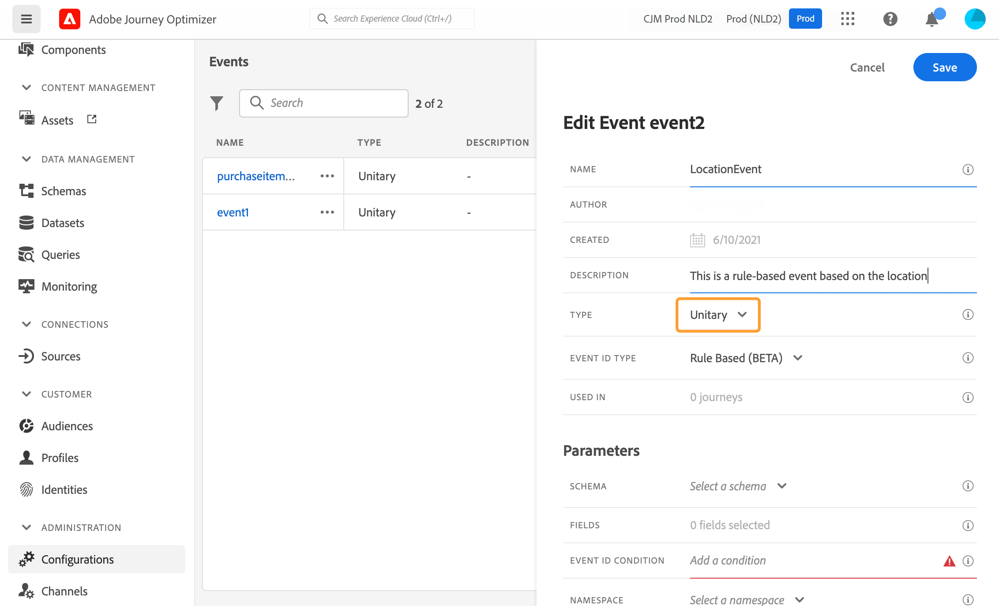

# Konfigurera en enhetshändelse {#configure-an-event}

>[!CONTEXTUALHELP]
>id="ajo_journey_event_unitary"
>title="Enhetshändelser"
>abstract="Med händelsekonfigurationen kan du definiera den information som Journey Optimizer ska ta emot som händelser. Du kan använda flera händelser (i olika steg på en resa) och flera resor kan använda samma händelse. Enhetshändelser är länkade till en viss profil. De kan vara regelbaserade eller systemgenererade."

Enhetshändelser är länkade till en viss profil. De kan vara regelbaserade eller systemgenererade.  Läs mer om enhetshändelse [det här avsnittet](../event/about-events.md).

Här följer de första stegen för att konfigurera en ny händelse:

1. I avsnittet ADMINISTRATION-menyn väljer du **[!UICONTROL Configurations]**. I  **[!UICONTROL Events]** avsnitt, klicka **[!UICONTROL Manage]**. Listan med händelser visas.

   

1. Klicka på **[!UICONTROL Create Event]** för att skapa en ny händelse. Konfigurationsfönstret för händelsen öppnas till höger på skärmen.

   

1. Ange namnet på händelsen. Du kan också lägga till en beskrivning.

   

   >[!NOTE]
   >
   >Endast alfanumeriska tecken och understreck tillåts. Maximala längden är 30 tecken.

1. I dialogrutan **[!UICONTROL Type]** fält, välj **Enhetlig**.

   

1. I dialogrutan **[!UICONTROL Event ID type]** markerar du den typ av händelse-ID som du vill använda: **Regelbaserad** eller **Systemgenererad**. Läs mer om typ av händelse-ID i [det här avsnittet](../event/about-events.md#event-id-type).

   

1. Antalet resor som använder den här händelsen visas i fältet **[!UICONTROL Used in]**. Du kan klicka på ikonen **[!UICONTROL View journeys]** för att visa en lista över resor som använder den här händelsen.

1. Definiera schema- och nyttolastfälten: Det är här du väljer den händelseinformation (kallas vanligtvis för nyttolast) som resor förväntar sig att ta emot. Du kan sedan använda den här informationen i din resa. Se [det här avsnittet](../event/about-creating.md#define-the-payload-fields).

   

   >[!NOTE]
   >
   >När du väljer kommandot **[!UICONTROL System Generated]** typ är endast scheman som har fältet eventID tillgängliga. När du väljer kommandot **[!UICONTROL Rule Based]** typ är alla Experience Event-scheman tillgängliga.

1. För regelbaserade händelser klickar du i **[!UICONTROL Event ID condition]** område. Använd den enkla eller avancerade uttrycksredigeraren och definiera det villkor som ska användas av systemet för att identifiera de händelser som kommer att utlösa din resa.

   

   I vårt exempel skrev vi ett villkor baserat på profilens stad. Detta innebär att när systemet tar emot en händelse som matchar detta villkor (**[!UICONTROL City]** och **[!UICONTROL Paris]** värde) kommer det att föras vidare till resor.

   >[!NOTE]
   >
   >I den enkla uttrycksredigeraren är inte alla operatorer tillgängliga, de beror på datatypen. För en strängtyp av fält kan du till exempel använda &quot;contains&quot; eller &quot;equal to&quot;.
   >
   >Om du ändrar schemat med nya uppräkningsvärden efter att du har skapat händelsen måste du följa de här stegen för att tillämpa ändringarna på den befintliga händelsen: avmarkera uppräkningsfältet från händelsefälten, bekräfta valet och sedan markera uppräkningsfältet igen. Det nya uppräkningsvärdet visas nu.

1. Lägg till en namnrymd. Det här steget är valfritt men rekommenderas eftersom du kan lägga till en namnrymd vilket innebär att du kan utnyttja information som lagras i realtidskundprofilen. Denna definierar vilken typ av nyckel händelsen har. Se [det här avsnittet](../event/about-creating.md#select-the-namespace).

1. Definiera profilidentifieraren: välj ett fält bland dina nyttolastfält eller definiera en formel för att identifiera den person som är associerad med händelsen. Den här nyckeln konfigureras automatiskt (men kan fortfarande redigeras) om du väljer en namnrymd. Resor väljer nyckeln som ska motsvara namnutrymmet (om du t.ex. väljer ett e-postnamnutrymme markeras e-postnyckeln). Se [det här avsnittet](../event/about-creating.md#define-the-event-key).

   

1. Klicka på **[!UICONTROL Save]**.

   Händelsen är nu konfigurerad och klar att injiceras i en resa. Ytterligare konfigurationssteg krävs för att ta emot händelser. Läs [den här sidan](../event/additional-steps-to-send-events-to-journey.md).

## Definiera nyttolastfälten {#define-the-payload-fields}

Nyttolastdefinitionen gör att du kan välja vilken information systemet förväntar sig från händelsen under din resa och nyckeln för att identifiera vilken person som är associerad med händelsen. Nyttolasten baseras på Experience Cloud XDM-fältdefinitionen. Mer information om XDM finns i [Adobe Experience Platform-dokumentation](https://experienceleague.adobe.com/docs/experience-platform/xdm/home.html?lang=sv){target="_blank"}.

1. Välj ett XDM-schema i listan och klicka på **[!UICONTROL Fields]** fält eller på **[!UICONTROL Edit]** -ikon.

   

   Alla fält som definieras i schemat visas. Listan med fält varierar mellan olika scheman. Du kan söka efter ett specifikt fält eller använda filtren för att visa alla noder och fält eller endast de markerade fälten. Enligt schemadefinitionen kan vissa fält vara obligatoriska och förmarkerade. Du kan inte avmarkera dem. Alla fält som är obligatoriska för att händelsen ska kunna tas emot på rätt sätt under resor markeras som standard.

   >[!NOTE]
   >
   >Kontrollera att du har lagt till fältgruppen &quot;orchestration&quot; i XDM-schemat för systemgenererade händelser. Detta säkerställer att schemat innehåller all information som krävs för att arbeta med [!DNL Journey Optimizer].

   

1. Markera de fält som du förväntar dig att ta emot från händelsen. Det här är de områden som affärsanvändaren kommer att utnyttja under resan. De måste även innehålla den nyckel som ska användas för att identifiera den person som är associerad med händelsen (se [det här avsnittet](../event/about-creating.md#define-the-event-key)).

   >[!NOTE]
   >
   >För systemgenererade händelser är **[!UICONTROL eventID]** fältet läggs automatiskt till i listan över markerade fält så att [!DNL Journey Optimizer] kan identifiera händelsen. Det system som skickar händelsen ska inte generera ett ID, det ska använda det som finns i nyttolastförhandsvisningen. Se [det här avsnittet](../event/about-creating.md#preview-the-payload).

1. När du är klar med att markera de fält som behövs klickar du på **[!UICONTROL Ok]** eller tryck **[!UICONTROL Enter]**.

   Antalet markerade fält visas i **[!UICONTROL Fields]** fält.

   

## Markera namnutrymmet {#select-the-namespace}

>[!CONTEXTUALHELP]
>id="ajo_journey_namespace"
>title="Identitetsnamnutrymme"
>abstract="Välj nyckeln för att identifiera kundprofilen som är kopplad till händelsen."

Med namnutrymmet kan du definiera vilken typ av nyckel som används för att identifiera den person som är associerad med händelsen. Dess konfiguration är valfri. Det krävs om du under dina resor vill hämta ytterligare information från [Kundprofil i realtid](https://experienceleague.adobe.com/docs/experience-platform/profile/home.html?lang=sv){target="_blank"}. Namnutrymmesdefinitionen behövs inte om du bara använder data från ett tredjepartssystem via en anpassad datakälla.

Du kan antingen använda en av de fördefinierade eller skapa en ny med hjälp av tjänsten Identity Namespace. Se [Adobe Experience Platform-dokumentation](https://experienceleague.adobe.com/docs/experience-platform/identity/home.html?lang=sv){target="_blank"}.

Om du väljer ett schema som har en primär identitet **[!UICONTROL Profiler identifier]** och **[!UICONTROL Namespace]** fälten är förifyllda. Om ingen identitet har definierats väljer vi _identityMap > id_ som primärnyckel. Sedan måste du välja ett namnutrymme och nyckeln är förfylld (under **[!UICONTROL Namespace]** fält) använda _identityMap > id_.

När du markerar fält taggas primära identitetsfält.

Välj ett namnutrymme i listrutan.

Endast ett namnutrymme tillåts per resa. Om du använder flera händelser under samma resa måste de använda samma namnutrymme. Läs [den här sidan](../building-journeys/journey.md).

>[!NOTE]
>
>Du kan bara välja ett personbaserat ID-namnutrymme. Om du har definierat ett namnutrymme för en uppslagstabell (till exempel: ProductID-namnutrymme för en produktsökning), är det inte tillgängligt i **Namnutrymme** listruta.

## Definiera profilidentifieraren {#define-the-event-key}

Nyckeln är fältet, eller kombinationen av fält, som är en del av händelsenyttolastdata och som gör att systemet kan identifiera den person som är associerad med händelsen. Nyckeln kan till exempel vara Experience Cloud ID, ett CRM ID eller en e-postadress.

Om du vill använda data som lagras i kundprofildatabasen för Adobe i realtid måste händelsenyckeln vara den information som du har definierat som en profils identitet i [Kundprofiltjänst i realtid](https://experienceleague.adobe.com/docs/experience-platform/profile/home.html?lang=sv){target="_blank"}.

Profilidentifieraren gör det möjligt för systemet att utföra avstämningen mellan händelsen och personens profil. Om du väljer ett schema som har en primär identitet **[!UICONTROL Profile identifier]** och **[!UICONTROL Namespace]** fälten är förifyllda. Om ingen identitet är definierad _identityMap > id_ är primärnyckeln. Sedan måste du markera ett namnutrymme och nyckeln fylls i automatiskt med _identityMap > id_.

När du markerar fält taggas primära identitetsfält.

Om du behöver använda en annan nyckel, t.ex. ett CRM-ID eller en e-postadress, måste du lägga till den manuellt enligt följande:

1. Klicka inuti **[!UICONTROL Profile identifier]** eller på pennikonen.

   

1. Välj det fält som valts som nyckel i listan över nyttolastfält.

När händelsen tas emot kan systemet med hjälp av nyckelns värde identifiera den person som är associerad med händelsen. Associerat med ett namnområde (se [det här avsnittet](../event/about-creating.md#select-the-namespace)), kan du använda den för att utföra sökningar på Adobe Experience Platform. Se [den här sidan](../building-journeys/about-journey-activities.md#orchestration-activities).
Nyckeln används också för att kontrollera att en person befinner sig på en resa. En person kan faktiskt inte befinna sig på två olika platser under samma resa. Det innebär att systemet inte tillåter att samma nyckel, till exempel nyckeln CRMID=3224, finns på olika platser under samma resa.

### Avancerad uttrycksredigerare {#adv-exp-editor}

När du definierar profilidentifieraren kan du växla till den avancerade uttrycksredigeraren för att skapa mer komplexa nycklar (till exempel en sammanfogning av två fält i händelserna).

Du har tillgång till de avancerade uttrycksfunktionerna från **[!UICONTROL Advanced mode]** -knappen om du vill utföra ytterligare ändringar. Med dessa funktioner kan du manipulera de värden som används för att utföra specifika frågor, t.ex. ändra format och utföra fältsammanfogningar, så att endast en del av ett fält beaktas (t.ex. de tio första tecknen). Läs den här [sidan](../building-journeys/expression/expressionadvanced.md).

## Förhandsgranska nyttolasten {#preview-the-payload}

Förhandsgranskning av nyttolast låter dig validera nyttolastdefinitionen.

>[!NOTE]
>
>För systemgenererade händelser sparar du händelsen och öppnar den igen när du skapar en händelse innan du visar förhandsgranskningen av nyttolasten. Det här steget behövs för att generera ett händelse-ID i nyttolasten.

1. Klicka på **[!UICONTROL View Payload]** om du vill förhandsgranska den nyttolast som systemet förväntar sig.

   

   Du kan se att de markerade fälten visas.

   

1. Kontrollera förhandsgranskningen för att validera nyttolastdefinitionen.

1. Sedan kan du dela nyttolastförhandsvisningen med den person som ansvarar för händelsen som skickar. Denna nyttolast kan hjälpa dem att utforma konfigurationen av en händelse som [!DNL Journey Optimizer]. Läs [den här sidan](../event/additional-steps-to-send-events-to-journey.md).
