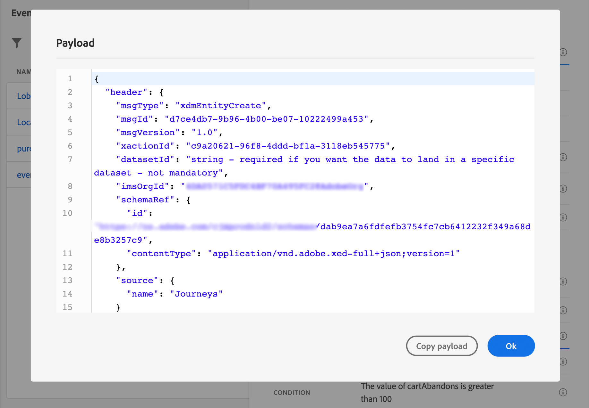

# Konfigurera en enhetshändelse {#configure-an-event}

>[!CONTEXTUALHELP]
>id="ajo_journey_event_unitary"
>title="Enhetshändelser"
>abstract="Med händelsekonfigurationen kan du definiera den information som Journey Optimizer ska ta emot som händelser. Du kan använda flera händelser (i olika steg på en resa) och flera resor kan använda samma händelse. Enhetshändelser är länkade till en viss profil. De kan vara regelbaserade eller systemgenererade."

>[!CONTEXTUALHELP]
>id="ajo_journey_event_parameters"
>title="Parametrar"
>abstract="Definiera händelsens parametrar som schemat och nyttolastfält. För regelbaserade händelser använder du fältet **[!UICONTROL Event ID condition]** för att definiera villkoret som ska användas av systemet för att identifiera de händelser som utlöser din resa. Lägg till en identitetstyp och en profilidentifierare som ska användas för händelsen."

Enhetshändelser är länkade till en viss profil. De kan vara regelbaserade eller systemgenererade.  Läs mer om enhetshändelse [det här avsnittet](../event/about-events.md).

Nedan följer de första stegen för att konfigurera en ny händelse:

1. Bläddra till **[!UICONTROL Configurations]** på menyn Administration och klicka på **[!UICONTROL Events]** i avsnittet **[!UICONTROL Manage]**. Listan med händelser visas.

   

1. Klicka på **[!UICONTROL Create Event]** för att skapa en ny händelse. Konfigurationsfönstret för händelsen öppnas till höger på skärmen.

   

1. Ange namnet på händelsen. Du kan också lägga till en beskrivning.

   >[!NOTE]
   >
   >Endast alfanumeriska tecken och understreck tillåts. Maximala längden är 30 tecken.

   

1. Välj **[!UICONTROL Type]** Enhet **i fältet**.

1. I fältet **[!UICONTROL Event ID type]** väljer du den händelse-ID-typ som du vill använda: **Regelbaserad** eller **Systemgenererad**. Läs mer om typer av händelse-ID i [det här avsnittet](../event/about-events.md#event-id-type).

   

1. Antalet resor som använder den här händelsen visas i fältet **[!UICONTROL Used in]**. Du kan klicka på ikonen **[!UICONTROL View journeys]** för att visa en lista över resor som använder den här händelsen.

1. Definiera schema- och nyttolastfälten: Här väljer du den händelseinformation (kallas vanligtvis nyttolast) som ska tas emot. Du kan sedan använda den här informationen i din resa. Se [det här avsnittet](../event/about-creating.md#define-the-payload-fields).

   

   >[!NOTE]
   >
   >När du väljer typen **[!UICONTROL System Generated]** är endast scheman som har fältet för typen eventID tillgängliga. När du väljer typen **[!UICONTROL Rule Based]** är alla Experience Event-scheman tillgängliga.

1. För regelbaserade händelser klickar du i fältet **[!UICONTROL Event ID condition]**. Använd den enkla eller avancerade uttrycksredigeraren för att definiera villkoret som ska användas av systemet för att identifiera de händelser som utlöser din resa.

   I vårt exempel skrev vi ett villkor baserat på profilens stad. Det innebär att när systemet tar emot en händelse som matchar det här villkoret (**[!UICONTROL City]** fält och **[!UICONTROL Paris]** värde), skickas den till resorna.

   >[!NOTE]
   >
   >I den enkla uttrycksredigeraren är inte alla operatorer tillgängliga, de är beroende av datatypen. För en strängtyp av fält kan du till exempel använda &quot;contains&quot; eller &quot;equal to&quot;.
   >
   >Om du ändrar schemat med nya uppräkningsvärden efter att du har skapat händelsen måste du följa de här stegen för att tillämpa ändringarna på den befintliga händelsen: avmarkera uppräkningsfältet från händelsefälten, bekräfta valet och sedan markera uppräkningsfältet igen. Det nya uppräkningsvärdet visas nu.

1. Lägg till en identitetstyp. Det här steget är valfritt, men rekommenderas eftersom du kan lägga till en identitetstyp för att utnyttja information som lagras i kundprofiltjänsten i realtid. Denna definierar vilken typ av nyckel händelsen har. Läs mer i [det här avsnittet](../event/about-creating.md#select-the-namespace).

1. Definiera profilidentifieraren: välj ett fält bland dina nyttolastfält eller definiera en formel för att identifiera den person som är associerad med händelsen. Den här nyckeln konfigureras automatiskt (men kan fortfarande redigeras) om du väljer en identitetstyp. Resor väljer nyckeln som ska motsvara identitetstypen (om du t.ex. väljer en e-postadresstyp väljs e-postnyckeln). Läs mer i [det här avsnittet](../event/about-creating.md#define-the-event-key).

1. Klicka på **[!UICONTROL Save]**.

   Händelsen är nu konfigurerad och klar att injiceras i en resa. Ytterligare konfigurationssteg krävs för att ta emot händelser. Läs [den här sidan](../event/additional-steps-to-send-events-to-journey.md).

## Definiera nyttolastfälten {#define-the-payload-fields}

Nyttolastdefinitionen gör att du kan välja vilken information systemet förväntar sig från händelsen under din resa och nyckeln för att identifiera vilken person som är associerad med händelsen. Nyttolasten baseras på fältdefinitionen för Experience Cloud XDM. Mer information om XDM finns i [Adobe Experience Platform-dokumentationen](https://experienceleague.adobe.com/docs/experience-platform/xdm/home.html?lang=sv){target="_blank"}.

1. Välj ett XDM-schema i listan och klicka på fältet **[!UICONTROL Fields]** eller på ikonen **[!UICONTROL Edit]** .

   

   Alla fält som definieras i schemat visas. Listan med fält varierar mellan olika scheman. Du kan söka efter ett specifikt fält eller använda filtren för att visa alla noder och fält eller endast de markerade fälten. Enligt schemadefinitionen kan vissa fält vara obligatoriska och förmarkerade. Du kan inte avmarkera dem. Alla fält som är obligatoriska för att händelsen ska kunna tas emot på rätt sätt under resor markeras som standard.

   >[!NOTE]
   >
   >Kontrollera att du har lagt till fältgruppen &quot;orchestration&quot; i XDM-schemat för systemgenererade händelser. Detta garanterar att schemat innehåller all nödvändig information som kan användas med [!DNL Journey Optimizer].

   

1. Markera de fält som du förväntar dig att ta emot från händelsen. Det här är de områden som affärsanvändaren kommer att utnyttja under resan. De måste även innehålla den nyckel som ska användas för att identifiera den person som är associerad med händelsen (se [det här avsnittet](../event/about-creating.md#define-the-event-key)).

   >[!NOTE]
   >
   >För systemgenererade händelser läggs fältet **[!UICONTROL eventID]** automatiskt till i listan med markerade fält så att [!DNL Journey Optimizer] kan identifiera händelsen. Det system som skickar händelsen ska inte generera ett ID, det ska använda det som finns i nyttolastförhandsvisningen. Se [det här avsnittet](../event/about-creating.md#preview-the-payload).

1. När du är klar med att markera de fält som behövs klickar du på **[!UICONTROL Ok]** eller trycker på **[!UICONTROL Enter]**.

   Antalet markerade fält visas i fältet **[!UICONTROL Fields]**.

   

## Välj identitetstyp {#select-the-namespace}

>[!CONTEXTUALHELP]
>id="ajo_journey_namespace"
>title="Identitetstyp"
>abstract="Välj nyckeln för att identifiera kundprofilen som är kopplad till händelsen."

Med identitetstypen (som tidigare kallades &#39;namnutrymme&#39;) kan du definiera vilken typ av nyckel som används för att identifiera den person som är associerad med händelsen. Dess konfiguration är valfri. Det krävs om du i dina resor vill hämta ytterligare information som kommer från [kundprofilen i realtid](https://experienceleague.adobe.com/docs/experience-platform/profile/home.html?lang=sv){target="_blank"}. Identitetstypdefinitionen behövs inte om du bara använder data från ett tredjepartssystem via en anpassad datakälla.

Du kan antingen skapa en befintlig identitetstyp eller skapa en ny med hjälp av Adobe Experience Platform identitetstjänst. Läs mer i [Adobe Experience Platform-dokumentationen](https://experienceleague.adobe.com/docs/experience-platform/identity/home.html?lang=sv){target="_blank"}.

Om du väljer ett schema som har en primär identitet fylls fälten **[!UICONTROL Profiler identifier]** och **[!UICONTROL Identity type]** i automatiskt. Om ingen identitet har definierats väljer vi _identityMap > id_ som primärnyckel. Sedan måste du välja en identitetstyp och nyckeln fylls i i automatiskt (under fältet **[!UICONTROL Identity type]**) med _identityMap > id_.

När du markerar fält taggas primära identitetsfält.

Välj en identitetstyp i listrutan.

Endast en identitetstyp tillåts per resa. Om du använder flera händelser under samma resa måste de använda samma identitetstyp. Läs [den här sidan](../building-journeys/journey.md).

>[!NOTE]
>
>Du kan bara välja en personbaserad identitetstyp. Om du har definierat en identitetstyp för en uppslagstabell (till exempel: ProductID-identitetstyp för en produktsökning), är den inte tillgänglig i listrutan **Identitetstyp**.

## Definiera profilidentifieraren {#define-the-event-key}

Nyckeln är fältet, eller kombinationen av fält, som är en del av händelsenyttolastdata och som gör att systemet kan identifiera den person som är associerad med händelsen. Nyckeln kan till exempel vara Experience Cloud-ID, ett CRM-ID eller en e-postadress.

Om du vill använda data som lagras i Adobe kundprofildatabas i realtid måste händelsenyckeln vara den information som du har definierat som en profils identitet i [kundprofiltjänsten i realtid](https://experienceleague.adobe.com/docs/experience-platform/profile/home.html?lang=sv){target="_blank"}.

Profilidentifieraren gör det möjligt för systemet att utföra avstämningen mellan händelsen och personens profil. Om du väljer ett schema som har en primär identitet fylls fälten **[!UICONTROL Profile identifier]** och **[!UICONTROL Identity type]** i automatiskt. Om ingen identitet har definierats är _identityMap > id_ primärnyckeln. Sedan måste du välja en identitetstyp och nyckeln fylls i automatiskt med _identityMap > id_.

När du markerar fält taggas primära identitetsfält.

Om du behöver använda en annan nyckel, t.ex. ett CRM-ID eller en e-postadress, måste du lägga till den manuellt enligt följande:

1. Klicka i fältet **[!UICONTROL Profile identifier]** eller på pennikonen.

   

1. Välj det fält som valts som nyckel i listan över nyttolastfält.

När händelsen tas emot kan nyckelns värde göra det möjligt för systemet att identifiera den person som är associerad med händelsen. Nyckeln är associerad med en [identitetstyp](../event/about-creating.md#select-the-namespace) och kan användas för att utföra frågor på Adobe Experience Platform. Se [den här sidan](../building-journeys/about-journey-activities.md#orchestration-activities).
Nyckeln används också för att kontrollera att en person befinner sig på en resa. En person kan faktiskt inte befinna sig på två olika platser på samma resa. Därför tillåter systemet inte att samma nyckel, till exempel nyckeln CRMID=3224, finns på olika platser under samma resa.

## Avancerad uttrycksredigerare {#adv-exp-editor}

När du definierar villkoret för händelse-ID eller profilidentifieraren kan du växla till den avancerade uttrycksredigeraren för att skapa mer komplexa nycklar (till exempel en sammanfogning av två fält för händelserna).

Du har tillgång till de avancerade uttrycksfunktionerna från knappen **[!UICONTROL Advanced mode]** om du vill utföra ytterligare ändringar. Dessa funktioner gör att du kan ändra de värden som används för att utföra specifika frågor, till exempel ändra format, utföra fältsammanfogningar, med hänsyn enbart till en del av ett fält (till exempel de 10 första tecknen). Läs den här [sidan](../building-journeys/expression/expressionadvanced.md).

## Förhandsgranska nyttolasten {#preview-the-payload}

Med nyttolastens förhandsgranskning kan du validera nyttolastdefinitionen.

>[!NOTE]
>
>För systemgenererade händelser sparar du händelsen och öppnar den igen när du skapar en händelse innan du visar nyttolastförhandsvisningen. Det här steget behövs för att generera ett händelse-ID i nyttolasten.

1. Klicka på ikonen **[!UICONTROL View Payload]** om du vill förhandsgranska den nyttolast som systemet förväntar sig.

   

   Du kan se att de markerade fälten visas.

   

1. Kontrollera förhandsgranskningen för att validera nyttolastdefinitionen.

1. Sedan kan du dela nyttolastförhandsvisningen med den person som ansvarar för händelsen som skickar. Den här nyttolasten kan hjälpa dem att utforma konfigurationen för en händelse som skickas till [!DNL Journey Optimizer]. Läs [den här sidan](../event/additional-steps-to-send-events-to-journey.md).
