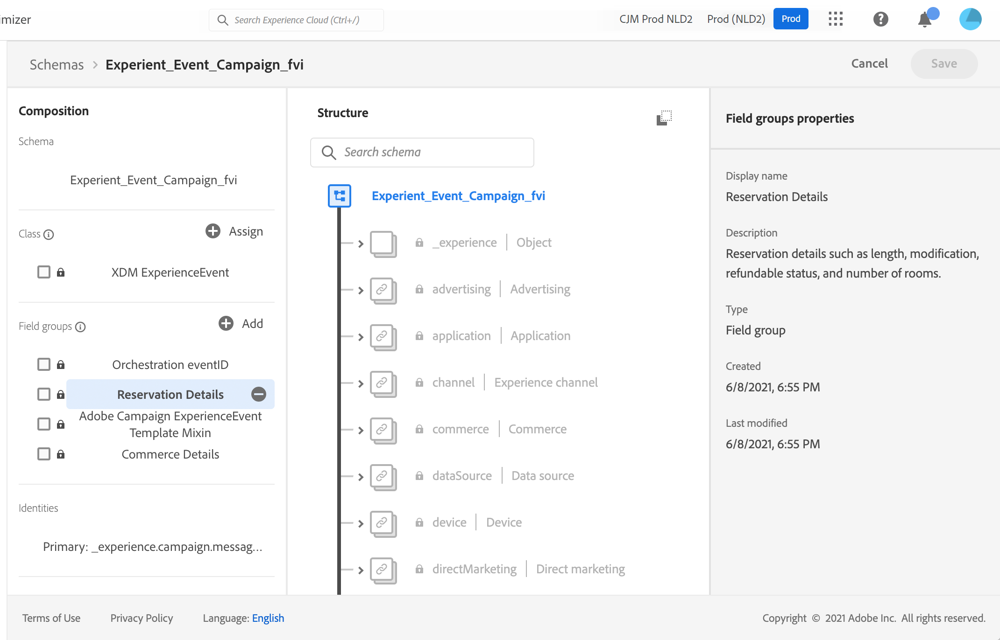
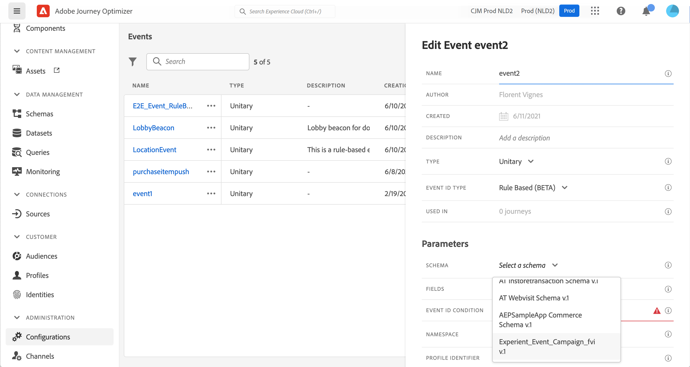

# Om ExperienceEvent-scheman för [!DNL Journey Optimizer] Händelser {#about-experienceevent-schemas}

[!DNL Journey Optimizer] -händelser är XDM Experience Events som skickas till Adobe Experience Platform via Streaming Ingmit.

Därför är en viktig förutsättning för att skapa händelser för [!DNL Journey Optimizer] är att du känner till Adobe Experience Platform Experience Data Model (eller XDM) och hur du skapar XDM Experience Event-scheman samt hur du direktuppspelar XDM-formaterade data till Adobe Experience Platform.

## Schemakrav för [!DNL Journey Optimizer] Händelser  {#schema-requirements}

Det första steget i att konfigurera en händelse för [!DNL Journey Optimizer] är att se till att du har ett definierat XDM-schema för att representera händelsen och en datauppsättning som skapas för att registrera instanser av händelsen på Adobe Experience Platform. Det är inte absolut nödvändigt att ha en datauppsättning för dina händelser, men om du skickar händelserna till en viss datauppsättning kan du behålla användarens händelsehistorik för framtida referens och analys, så det är alltid en bra idé. Om du inte redan har ett lämpligt schema och datamängd för händelsen kan båda dessa åtgärder utföras i Adobe Experience Platform webbgränssnitt.

Alla XDM-scheman som ska användas för [!DNL Journey Optimizer] ska uppfylla följande krav:

* Schemat måste vara av klassen XDM ExperienceEvent.

  

* För systemgenererade händelser måste schemat innehålla fältgruppen Orchestration-händelseID. [!DNL Journey Optimizer] använder det här fältet för att identifiera händelser som används under resor.

  

* Deklarera ett identitetsfält för att identifiera enskilda profiler i händelsen. Om ingen identitet anges kan en identitetskarta användas. Detta rekommenderas inte.

  

* Om du vill att dessa data ska vara tillgängliga för sökning senare i en resa markerar du schemat och datauppsättningen för profil.

  

  

* Du kan inkludera datafält för att samla in andra kontextdata som du vill inkludera med händelsen, till exempel information om användaren, enheten som händelsen genererades från, plats eller andra meningsfulla omständigheter som rör händelsen.

  

  

## Utnyttja schemarelationer{#leverage_schema_relationships}

Med Adobe Experience Platform kan du definiera relationer mellan scheman för att kunna använda en datauppsättning som en uppslagstabell för en annan.

Låt oss säga att er varumärkesdatamodell har ett schema som fångar upp inköp. Du har också ett schema för produktkatalogen. Du kan hämta produkt-ID:t i inköpsschemat och använda en relation för att söka efter mer fullständig produktinformation från produktkatalogen. På så sätt kan ni skapa en målgrupp för alla kunder som har köpt en bärbar dator, till exempel, utan att behöva göra en explicit lista över alla bärbara ID:n eller hämta alla produktdetaljer i transaktionssystem.

Om du vill definiera en relation måste du ha ett dedikerat fält i källschemat, i det här fallet produkt-ID-fältet i inköpsschemat. Det här fältet måste referera till produkt-ID-fältet i målschemat. Käll- och måltabellerna måste vara aktiverade för profiler och målschemat måste ha det gemensamma fältet definierat som sin primära identitet.

Här är produktkatalogschemat aktiverat för profilen med produkt-ID definierat som primär identitet.

Här är inköpsschemat med relationen definierad i produkt-ID-fältet.

>[!NOTE]
>
>Läs mer om schemarelationer i [Experience Platform dokumentation](https://experienceleague.adobe.com/docs/platform-learn/tutorials/schemas/configure-relationships-between-schemas.html).

I Journey Optimizer kan du sedan använda alla fält från de länkade tabellerna:

* när en affärshändelse eller en enhetshändelse konfigureras, [Läs mer](../event/experience-event-schema.md#unitary_event_configuration)
* vid användning av villkor under en resa, [Läs mer](../event/experience-event-schema.md#journey_conditions_using_event_context)
* personalisering av meddelanden, [Läs mer](../event/experience-event-schema.md#message_personalization)
* personalisering av anpassade åtgärder, [Läs mer](../event/experience-event-schema.md#custom_action_personalization_with_journey_event_context)

### Arrayer{#relationships_limitations}

Du kan definiera en schemarelation för en array med strängar, till exempel en lista med produkt-ID:n.

Du kan dock inte definiera en schemarelation med ett attribut inuti en objektmatris, till exempel en lista med inköpsinformation (produkt-ID, produktnamn, pris, rabatt). Uppslagsvärdena är inte tillgängliga i resor (villkor, anpassade åtgärder osv.) och personalisering av meddelanden.

### Händelsekonfiguration{#unitary_event_configuration}

De länkade schemafälten är tillgängliga i enhets- och affärshändelsekonfigurationen:

* när du bläddrar genom händelseschemafälten på händelsens konfigurationsskärm.
* när du definierar ett villkor för systemgenererade händelser.

De länkade fälten är inte tillgängliga:

* i händelsenyckelformeln
* händelse-id-villkor (regelbaserade händelser)

Mer information om hur du konfigurerar en enhetshändelse finns i detta [page](../event/about-creating.md).

### Resevillkor med händelsetyp{#journey_conditions_using_event_context}

Du kan använda data från en uppslagstabell som är länkad till en händelse som används i en resa för villkorsuppbyggnad (uttrycksredigeraren).

Lägg till ett villkor i en resa, redigera uttrycket och visa händelsnoden i uttrycksredigeraren.

Mer information om hur du definierar resevillkor finns i detta [page](../building-journeys/condition-activity.md).

### Skräddarsytt meddelande{#message_personalization}

De länkade fälten är tillgängliga när du anpassar ett meddelande. De relaterade fälten visas i det sammanhang som skickas från resan till meddelandet.

Om du vill lära dig hur du anpassar ett meddelande med sammanhangsbaserad reseinformation kan du läsa detta [page](../personalization/personalization-use-case.md).

### Anpassad åtgärdspersonalisering med reseventkontext{#custom_action_personalization_with_journey_event_context}

De länkade fälten är tillgängliga när åtgärdsparametrarna för en anpassad åtgärdsaktivitet för resan konfigureras.

Mer information om hur du använder anpassade åtgärder finns i [page](../building-journeys/using-custom-actions.md).
