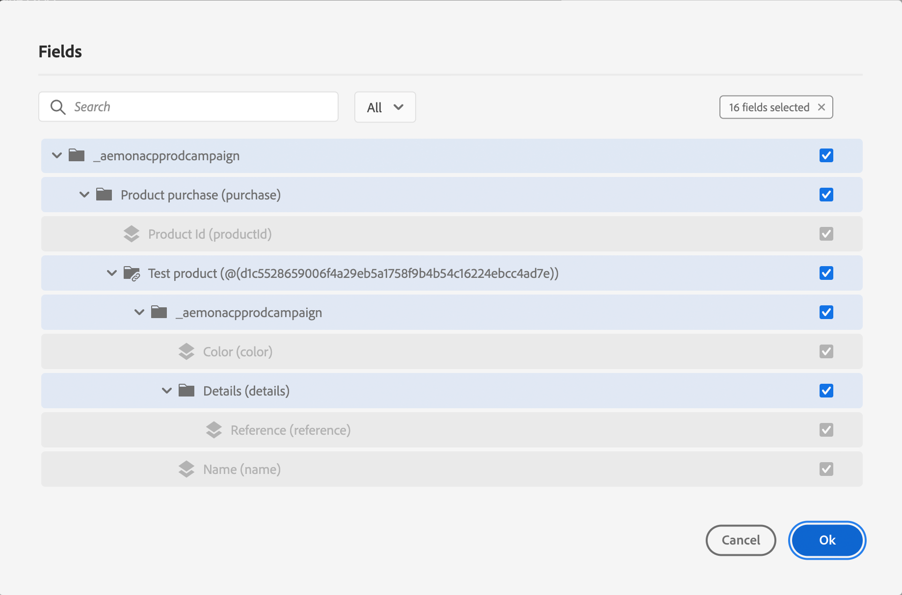

# Om ExperienceEvent-scheman för [!DNL Journey Optimizer]-händelser {#about-experienceevent-schemas}

[!DNL Journey Optimizer] händelser är XDM Experience Events som skickas till Adobe Experience Platform via Streaming Ingakes.

Därför är en viktig förutsättning för att du ska kunna konfigurera händelser för [!DNL Journey Optimizer] att du känner till Adobe Experience Platform Experience Data Model (eller XDM) och hur du skapar XDM Experience Event-scheman samt hur du direktuppspelar XDM-formaterade data till Adobe Experience Platform.

>[!CAUTION]
>
>Upplevelsehändelsesökningar i resevillkor stöds inte längre. Här kan du få tips på andra sätt. Om du har en händelse som utlöste en reseupplevelse som fortfarande behöver Experience Events-sökning och som inte kan hanteras via något av alternativen i listan, ber vi dig kontakta din Adobe-representant så hjälper vi dig att nå ditt mål.
>
>Åtkomst till kontext från starthändelsen av en resa påverkas inte.

## Schemakrav för [!DNL Journey Optimizer]-händelser  {#schema-requirements}

Det första steget i att konfigurera en händelse för [!DNL Journey Optimizer] är att se till att du har ett definierat XDM-schema som representerar händelsen och en datauppsättning som skapats för att registrera instanser av händelsen på Adobe Experience Platform. Det är inte absolut nödvändigt att ha en datauppsättning för dina händelser, men om du skickar händelserna till en viss datauppsättning kan du behålla användarens händelsehistorik för framtida referens och analys, så det är alltid en bra idé. Om du inte redan har ett lämpligt schema och datamängd för händelsen kan båda dessa åtgärder utföras i Adobe Experience Platform webbgränssnitt.

Alla XDM-scheman som används för [!DNL Journey Optimizer]-händelser ska uppfylla följande krav:

* Schemat måste vara av klassen XDM ExperienceEvent.

  

* För systemgenererade händelser måste schemat innehålla fältgruppen Orchestration-händelseID. [!DNL Journey Optimizer] använder det här fältet för att identifiera händelser som används i resor.

  

* Deklarera ett identitetsfält för att identifiera enskilda profiler i händelsen. Om ingen identitet anges kan en identitetskarta användas. Detta rekommenderas inte.

  

* Om du vill att dessa data ska vara tillgängliga för profilen markerar du schema och datauppsättning för profil. [Läs mer](../data/lookup-aep-data.md)

  

  

* Du kan inkludera datafält för att samla in andra kontextdata som du vill inkludera med händelsen, till exempel information om användaren, enheten som händelsen genererades från, plats eller andra meningsfulla omständigheter som rör händelsen.

  

  

<!--
## Leverage schema relationships{#leverage_schema_relationships}

Adobe Experience Platform allows you to define relationships between schemas in order to use one dataset as a lookup table for another. 

Let's say your brand data model has a schema capturing purchases. You also have a schema for the product catalog. You can capture the product ID in the purchase schema and use a relationship to look up more complete product details from the product catalog. This allows you to create an audience for all customers who bought a laptop, for example, without having to explicitly list out all laptop IDs or capture every single product details in transactional systems.

To define a relationship, you need to have a dedicated field in the source schema, in this case the product ID field in the purchase schema. This field needs to reference the product ID field in the destination schema. The source and destination tables must be enabled for profiles and the destination schema must have that common field defined as its primary identity. 

Here is the product catalog schema enabled for profile with the product ID defined as the primary identity. 

Here is the purchase schema with the relationship defined on the product ID field.

>[!NOTE]
>
>Learn more about schema relationships in the [Experience Platform documentation](https://experienceleague.adobe.com/docs/platform-learn/tutorials/schemas/configure-relationships-between-schemas.html?lang=sv-SE).

In Journey Optimizer, you can then leverage all the fields from the linked tables:

* when configuring a business or unitary event, [Read more](../event/experience-event-schema.md#unitary_event_configuration) 
* when using conditions in a journey, [Read more](../event/experience-event-schema.md#journey_conditions_using_event_context) 
* in message personalization, [Read more](../event/experience-event-schema.md#message_personalization) 
* in custom action personalization, [Read more](../event/experience-event-schema.md#custom_action_personalization_with_journey_event_context) 

### Arrays{#relationships_limitations}

You can define a schema relationship on an array of strings, for example, a list of product IDs.

You can also define a schema relationship with an attribute inside of an array of objects, for example a list of purchase information (product ID, product name, price, discount). The lookup values will be available in journeys (conditions, custom actions, etc.) and message personalization. 

### Event configuration{#unitary_event_configuration}

The linked schema fields are available in unitary and business event configuration:

* when browsing through the event schema fields in the event configuration screen.
* when defining a condition for system-generated events.

The linked fields are not available:

* in the event key formula
* in event id condition (rule-based events)

To learn how to configure a unitary event, refer to this [page](../event/about-creating.md).

### Journey conditions using event context{#journey_conditions_using_event_context}

You can use data from a lookup table linked to an event used in a journey for condition building (expression editor).

Add a condition in a journey, edit the expression and unfold the event node in the expression editor. 

To learn how to define journey conditions, refer to this [page](../building-journeys/condition-activity.md).

### Message personalization{#message_personalization}

The linked fields are available when personalizing a message. The related fields are displayed in the context passed from the journey to the message.

To learn how to personalize a message with contextual journey information, refer to this [page](../personalization/personalization-use-case.md).

### Custom action personalization with journey event context{#custom_action_personalization_with_journey_event_context}

The linked fields are available when configuring the action parameters of a journey custom action activity. 

To learn how to use custom actions, refer to this [page](../building-journeys/using-custom-actions.md).
-->
