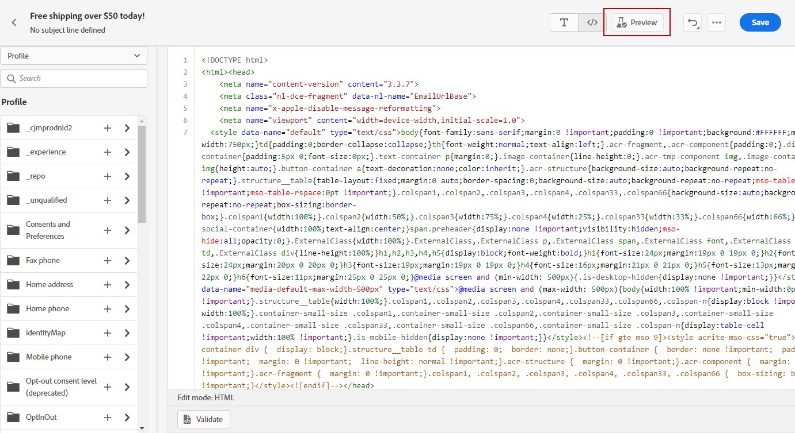
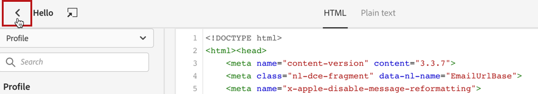

# Importera eller koda ditt e-postinnehåll {#existing-content}

Med Journey Optimizer kan du importera befintligt HTML-innehåll för att utforma dina e-postmeddelanden. Det här innehållet kan vara rå HTML-kod eller innehåll från en befintlig HTML-fil eller en zip-mapp.

Följ stegen nedan om du vill koda HTML-innehåll eller importera befintligt innehåll:

1. [Skapa ett meddelande](create-message.md)

1. Öppna **[!UICONTROL Email Designer]** från **[!UICONTROL Edit Content]**-avsnittet.

   

1. Välj **[!UICONTROL Code your own]** eller **[!UICONTROL Import HTML]**. Gå till avsnitten nedan för nästa steg.

## Koda din egen {#import-raw-html-code}

Använd läget **[!UICONTROL Code your own]** för att importera rå HTML och/eller koda ditt e-postinnehåll. Den här metoden kräver HTML-kunskaper.

>[!CAUTION]
>
> Det går inte att referera till bilder från [Adobe Experience Manager Assets Essentials](assets-essentials.md) när den här metoden används. De bilder som HTML-koden refererar till måste lagras på en offentlig plats.

1. Välj **[!UICONTROL Code your own]** på startsidan för e-postdesignern.

   

1. Ange eller klistra in HTML-koden i Raw-format.

1. Använd den vänstra rutan för att utnyttja [!DNL Journey Optimizer]-anpassningsfunktionerna. Mer information om detta finns i [det här avsnittet](personalization/personalize.md).

   

1. Om du vill öppna e-postdesignern för att starta e-postmeddelandet från en ny design väljer du **[!UICONTROL Change your design]** på Alternativ-menyn.

   

1. Klicka på knappen **[!UICONTROL Preview]** för att kontrollera meddelandets design och anpassning med testprofiler. Mer information om detta finns i [det här avsnittet](preview.md).

   

1. När koden är klar klickar du på **[!UICONTROL Save]** och går sedan tillbaka till fönstret där du skapade meddelandet för att slutföra meddelandet.

   

## Importera HTML {#import-html-content-from-file}

Du kan importera HTML-innehåll i e-postdesignern. Innehållet kan vara:

* En **HTML-fil** med en inbyggd formatmall,
* En **.zip-mapp** med HTML-filen, formatmallen (.css) och bilder.

   >[!NOTE]
   >
   >ZIP-filstrukturen har inga begränsningar. Referenserna måste dock vara relativa och passa med trädstrukturen i ZIP-mappen.

Om du vill importera en fil som innehåller HTML-innehåll följer du stegen nedan:

1. Välj **[!UICONTROL Import HTML]** på startsidan för e-postdesignern.

   

1. Dra och släpp HTML- eller ZIP-filen med HTML-innehållet.

1. När HTML-innehållet har överförts kan du använda e-postdesignerns funktioner för att redigera och förhandsgranska e-postmeddelandet. [Läs mer i det här avsnittet](create-email-content.md).

   
