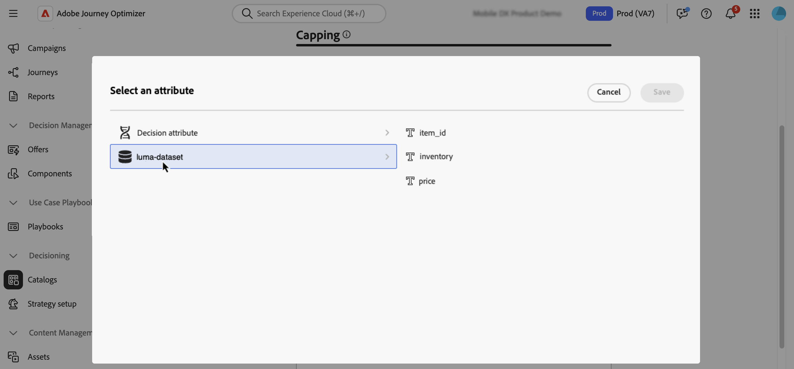

# Använd Adobe Experience Platform-data för beslut {#aep-data}

>[!CONTEXTUALHELP]
>id="ajo_exd_catalogs_dataset"
>title="Datauppsättningssökning"
>abstract="Om du vill använda attribut från Adobe Experience Platform för att fatta beslut måste du skapa en mappning som definierar hur Adobe Experience Platform datamängd kopplas till data i [!DNL Journey Optimizer]."

>[!CONTEXTUALHELP]
>id="ajo_exd_catalogs_dataset_create"
>title="Datauppsättningssökning"
>abstract="Markera datauppsättningen med de attribut du behöver bland alla Adobe Experience Platform-datauppsättningar som har aktiverats för sökning och välj sedan en mappningsnyckel (t.ex. flightnummer eller kund-ID) som finns i både beslutsobjektsattributen och datauppsättningen."

>[!CONTEXTUALHELP]
>id="ajo_exd_rules_dataset_lookup"
>title="Datauppsättningssökning"
>abstract="Markera Adobe Experience Platform dataset med de attribut du behöver. Om datauppsättningen inte visas i listan kontrollerar du att du har aktiverat den för sökning och att du har skapat en sökmappning för datauppsättningar."

>[!CONTEXTUALHELP]
>id="ajo_exd_formula_dataset_lookup"
>title="Datauppsättningssökning"
>abstract="Använd datamängdsattributen för [!DNL Adobe Experience Platform] för att dynamiskt justera rankningslogiken så att den speglar verkliga förhållanden. Klicka på **[!UICONTROL Add dataset]** för att välja Adobe Experience Platform-datauppsättningen med de attribut du behöver. Om datauppsättningen inte visas i listan kontrollerar du att du har aktiverat den för sökning och att du har skapat en sökmappning för datauppsättningar."

>[!CONTEXTUALHELP]
>id="ajo_exd_item_capping_dataset"
>title="Lägg till datauppsättning"
>abstract="Använd [!DNL Adobe Experience Platform]-datamängdsattribut för att definiera capping-villkor baserat på dynamiska, externa attribut. Klicka på **[!UICONTROL Add dataset]** för att välja Adobe Experience Platform-datauppsättningen med de attribut du behöver. Om datauppsättningen inte visas i listan kontrollerar du att du har aktiverat den för sökning och att du har skapat en sökmappning för datauppsättningar."

Med [!DNL Journey Optimizer] kan du utnyttja data från [!DNL Adobe Experience Platform] för beslut. Detta gör att du kan utöka definitionen av dina beslutsattribut till ytterligare data i datauppsättningar för bulkuppdateringar som ändras regelbundet utan att du behöver uppdatera attributen manuellt en i taget. Till exempel tillgänglighet, väntetider osv.

>[!AVAILABILITY]
>
>Den här funktionen är för närvarande tillgänglig för alla kunder i en begränsad version.

## Skyddsritningar och begränsningar {#guardrails}

* **Kanaler som stöds** - Datauppsättningssökning med beslut fungerar för e-post och anpassade åtgärder för resor. <!--Support for code-based experience channels is coming soon.-->
* **Attributanvändning** - Datauppsättningssökningsfunktionen för beslut utökar beslutsobjektsdefinitioner med ytterligare attribut - det utökar inte attribut till profiler
* **Uppslagsgränser**: [!DNL Journey Optimizer] har stöd för upp till 1 000 uppslag per princip för enstaka beslut.

## Förhandskrav

### Aktivera datauppsättningar för sökning

Innan du startar måste datauppsättningar som behövs för beslut först aktiveras för sökning. Följ stegen som beskrivs i det här avsnittet: [Använd Adobe Experience Platform-data](../data/lookup-aep-data.md).

### Skapa mappningar

Om du vill använda attribut från Adobe Experience Platform för att fatta beslut måste du skapa en mappning som definierar hur Adobe Experience Platform datamängd kopplas till data i [!DNL Journey Optimizer]. Gör så här:

1. Navigera till **[!UICONTROL Catalogs]** / **[!UICONTROL Dataset lookup]** och klicka sedan på **[!UICONTROL Create]**.

   

1. Konfigurera mappningen:

   1. Klicka på **[!UICONTROL Select dataset]** om du vill visa alla Adobe Experience Platform-datauppsättningar som har aktiverats för sökning. Markera datauppsättningen med de attribut du behöver.

   1. Klicka på **[!UICONTROL Select key]** för att välja en kopplingsnyckel (t.ex. ett flightnummer eller ett kund-ID) som finns både i beslutsobjektattributen och datauppsättningen.

   

1. Klicka på **[!UICONTROL Save]**.

## Utnyttja Adobe Experience Platform data {#leverage-aep-data}

När en datauppsättning har aktiverats för sökning och mappningar kan du använda data för att berika din beslutslogik med externa data. Detta är särskilt användbart för attribut som ändras ofta, t.ex. produkttillgänglighet eller realtidspriser.

Attribut från Adobe Experience Platform datauppsättningar kan användas i två delar av beslutslogiken:

* **Beslutsregler**: Definiera om ett beslutsobjekt kan visas.
* **Rankningsformler**: Prioritera beslutsobjekt baserat på externa data.
* **Takregler**: Använd externa data för att beräkna tröskelvärdet för appningsregler.

I nästa avsnitt beskrivs hur du använder Adobe Experience Platform-data i dessa sammanhang.

### Beslutsregler {#rules}

Med hjälp av Adobe Experience Platform data i beslutsregler kan ni definiera behörighetskriterier baserat på dynamiska, externa attribut och säkerställa att beslutsobjekten bara visas när det är relevant.

Låt oss till exempel säga att en webbutik vill marknadsföra produktrekommendationer baserat på det lokala lagret. En produkt bör endast vara berättigad till rekommendation om den finns i lager på närmaste plats. En datauppsättning som innehåller dagliga inventeringsuppdateringar överförs till Adobe Experience Platform. Regellogiken kontrollerar om `inventory_count` för en viss produkt är större än 0 för kundens önskade butik. I så fall är beslutsposten berättigad.

Så här använder du Adobe Experience Platform-data i beslutsregler:

1. Gå till menyn **[!UICONTROL Strategy setup]** / **[!UICONTROL Decision rules]** och välj **[!UICONTROL Create rule with dataset]**.

   

1. Klicka på **[!UICONTROL Add dataset]** och markera sedan datauppsättningen med de attribut du behöver.

   

1. Klicka på **[!UICONTROL Continue]**. Du kan nu komma åt datauppsättningsattributen på menyn **[!UICONTROL Dataset Lookup]** och använda dem i regelvillkoren. [Lär dig skapa en beslutsregel](../experience-decisioning/rules.md#create)

   

### Rankningsformler {#ranking-formulas}

Rankningsformler definierar prioriteten för beslutsposter. Genom att använda [!DNL Adobe Experience Platform]-datauppsättningsattribut kan du justera rankningslogiken dynamiskt för att återspegla verkliga förhållanden.

Anta att ett flygbolag använder en rankningsformel för att prioritera uppgraderingserbjudanden. Om en kund har en hög lojalitetsnivå och den aktuella platstillgängligheten är låg (baserat på en datauppsättning som uppdateras varje timme) får de högre prioritet. Datauppsättningen innehåller fält som `flight_number`, `available_seats` och `loyalty_score`.

Så här använder du Adobe Experience Platform-data i rankningsformler:

1. Skapa eller redigera en rankningsformel.

1. Klicka på **[!UICONTROL Dataset lookup]** i avsnittet **[!UICONTROL Add dataset]**.

1. Välj lämplig datauppsättning.

   

   >[!NOTE]
   >
   >Om den datauppsättning du söker inte visas i listan kontrollerar du att du har aktiverat den för sökning och att du har skapat en sökmappning för datauppsättningar. Mer information finns i avsnittet [Förutsättningar](#prerequisites).

1. Använd datauppsättningsfälten för att skapa din rankningsformel som vanligt. [Lär dig skapa en rankningsformel](ranking/ranking-formulas.md#create-ranking-formula)

   

### Begränsningsregler {#capping-rules}

Begränsningsregler används som begränsningar för att definiera det maximala antal gånger en beslutspost kan presenteras. Med hjälp av Adobe Experience Platform-data i capping-regler kan du definiera capping-villkor baserat på dynamiska, externa attribut. Detta görs genom att använda ett uttryck i din fästregel för att beräkna det önskade tröskelvärdet.

En återförsäljare kanske till exempel vill sluta ett erbjudande baserat på produktlager i realtid. I stället för att ange ett fast tröskelvärde på 500 använder de ett uttryck som refererar till fältet `inventory_count` från en Adobe Experience Platform-datauppsättning. Om datauppsättningen visar att 275 artiklar finns kvar i lager kommer erbjudandet endast att levereras upp till det numret.

>[!NOTE]
>
>Begränsningsregeln **uttryck** är för närvarande tillgänglig som en begränsad tillgänglighetsfunktion för alla användare, och stöds bara för typen **[!UICONTROL In total]** av begränsning.

Så här använder du Adobe Experience Platform-data i capping rules-uttryck:

1. Skapa eller redigera ett beslutsobjekt.

1. Klicka på **[!UICONTROL Add dataset]** och välj lämplig datauppsättning när du definierar om objektet är berättigande.

   

   >[!NOTE]
   >
   >Om den datauppsättning du söker inte visas i listan kontrollerar du att du har aktiverat den för sökning och att du har skapat en sökmappning för datauppsättningar. Mer information finns i avsnittet [Förutsättningar](#prerequisites).

1. Markera **[!UICONTROL In total]**-fästtypen och aktivera sedan alternativet **[!UICONTROL Expression]**.

   

   >[!NOTE]
   >
   >Om den datauppsättning du söker inte visas i listan kontrollerar du att du har aktiverat den för sökning och att du har skapat en sökmappning för datauppsättningar. Mer information finns i avsnittet [Förutsättningar](#prerequisites).

1. Redigera uttrycket och använd datauppsättningsfälten för att skapa uttrycket.

   

1. Slutför konfigurationen av ditt capping och regelbeslutsobjekt som vanligt. [Lär dig hur du ställer in regler för appning](../experience-decisioning/items.md#capping)
