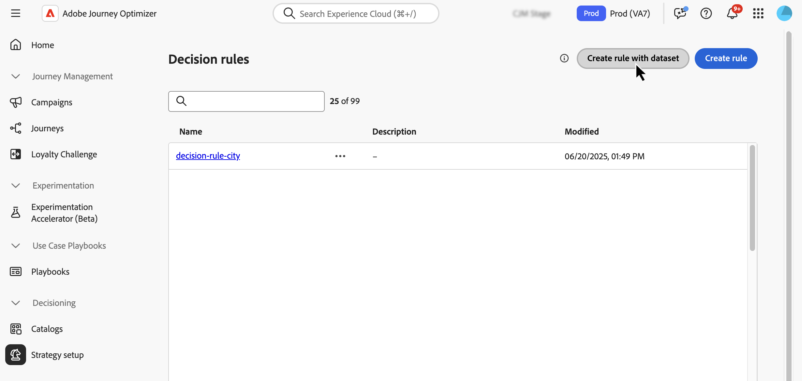

# Använd Adobe Experience Platform-data för beslut{#aep-data}

>[!CONTEXTUALHELP]
>id="ajo_exd_rules_dataset_lookup"
>title="Datauppsättningssökning"
>abstract="Med hjälp av Adobe Experience Platform data i beslutsregler kan ni definiera behörighetskriterier baserat på dynamiska, externa attribut och säkerställa att beslutsobjekten bara visas när det är relevant. Skapa en mappning för att definiera hur Adobe Experience Platform-datauppsättningen ska kopplas till data i [!DNL Journey Optimizer]. Markera datauppsättningen med de attribut du behöver och välj en kopplingsnyckel som finns i både beslutsobjektattributen och datauppsättningen."

>[!CONTEXTUALHELP]
>id="ajo_exd_formula_dataset_lookup"
>title="Datauppsättningssökning"
>abstract="Rankningsformler definierar prioriteten för beslutsposter. Genom att använda [!DNL Adobe Experience Platform]-datauppsättningsattribut kan du justera rankningslogiken dynamiskt för att återspegla verkliga förhållanden. Skapa en mappning för att definiera hur Adobe Experience Platform-datauppsättningen ska kopplas till data i [!DNL Journey Optimizer]. Markera datauppsättningen med de attribut du behöver och välj en kopplingsnyckel som finns i både beslutsobjektattributen och datauppsättningen"

>[!AVAILABILITY]
>
>Den här funktionen är för närvarande tillgänglig för alla kunder som en betaversion. Kontakta din kontorepresentant om du vill ha tillgång till den här funktionen

Med [!DNL Journey Optimizer] kan du utnyttja data från [!DNL Adobe Experience Platform] för beslut. Detta gör att du kan utöka definitionen av dina beslutsattribut till ytterligare data i datauppsättningar för bulkuppdateringar som ändras regelbundet utan att du behöver uppdatera attributen manuellt en i taget. Till exempel tillgänglighet, väntetider osv.

## Beta begränsningar och riktlinjer {#guidelines}

Observera följande begränsningar och riktlinjer innan du börjar:

* En beslutspolicy kan referera till totalt upp till tre datauppsättningar, i alla sina beslutsregler och rangordningsformler tillsammans. Om reglerna till exempel använder två datauppsättningar kan formlerna bara använda en extra datauppsättning.
* En beslutsregel kan använda 3 datauppsättningar.
* En rankningsformel kan använda 3 datamängder.
* När en beslutsprincip utvärderas kommer systemet att utföra upp till 1 000 datauppsättningsfrågor (sökningar) totalt. Varje datamängdsmappning som används av ett beslutsobjekt räknas som en fråga. Exempel: Om ett beslutsobjekt använder två datauppsättningar räknas det som två frågor mot gränsen på 1 000 frågor.

## Aktivera en datauppsättning för datasökning {#enable}

Om du vill använda data från en [!DNL Adobe Experience Platform]-datauppsättning för beslut måste du först aktivera den för sökning via ett API-anrop. Detaljerade anvisningar finns i det här avsnittet: [Utnyttja Adobe Experience Platform-datauppsättningar i Journey Optimizer](../data/lookup-aep-data.md).

## Använd Adobe Experience Platform-data för beslut

När en datauppsättning har aktiverats för sökning kan du använda dess attribut för att berika din beslutslogik med externa data. Detta är särskilt användbart för attribut som ändras ofta, t.ex. produkttillgänglighet eller realtidspriser.

Attribut från Adobe Experience Platform datauppsättningar kan användas i två delar av beslutslogiken:

* **Beslutsregler**: Definiera om ett beslutsobjekt kan visas.
* **Rankningsformler**: Prioritera beslutsobjekt baserat på externa data.

I nästa avsnitt beskrivs hur du använder Adobe Experience Platform-data i båda kontexterna.

### Beslutsregler {#rules}

Med hjälp av Adobe Experience Platform data i beslutsregler kan ni definiera behörighetskriterier baserat på dynamiska, externa attribut och säkerställa att beslutsobjekten bara visas när det är relevant.

Låt oss till exempel säga att en webbutik vill marknadsföra produktrekommendationer baserat på det lokala lagret. En produkt bör endast vara berättigad till rekommendation om den finns i lager på närmaste plats. En datauppsättning som innehåller dagliga inventeringsuppdateringar överförs till Adobe Experience Platform. Regellogiken kontrollerar om `inventory_count` för en viss produkt är större än 0 för kundens önskade butik. I så fall är beslutsposten berättigad.

Så här använder du Adobe Experience Platform-data i beslutsregler:

1. Gå till menyn **[!UICONTROL Strategy setup]** / **[!UICONTROL Decision rules]** och välj **[!UICONTROL Create rule with dataset]**.

   

1. Klicka på **[!UICONTROL Create mapping]** för att definiera hur Adobe Experience Platform-datauppsättningen ska kopplas med data i [!DNL Journey Optimizer].

   * Markera datauppsättningen med de attribut du behöver.
   * Välj en kopplingsnyckel (t.ex. produkt-ID eller butiks-ID) som finns både i beslutsobjektattributen och datauppsättningen.

   

   >[!NOTE]
   >
   >Du kan skapa upp till tre mappningar per regel.

1. Klicka på **[!UICONTROL Continue]**. Du kan nu komma åt datauppsättningsattributen på menyn **[!UICONTROL Dataset Lookup]** och använda dem i regelvillkoren. [Lär dig skapa en beslutsregel](../experience-decisioning/rules.md#create)

   

### Rankningsformler

Rankningsformler definierar prioriteten för beslutsposter. Genom att använda [!DNL Adobe Experience Platform]-datauppsättningsattribut kan du justera rankningslogiken dynamiskt för att återspegla verkliga förhållanden.

Anta att ett flygbolag använder en rankningsformel för att prioritera uppgraderingserbjudanden. Om en kund har en hög lojalitetsnivå och den aktuella platstillgängligheten är låg (baserat på en datauppsättning som uppdateras varje timme) får de högre prioritet. Datauppsättningen innehåller fält som `flight_number`, `available_seats` och `loyalty_score`.

Så här använder du Adobe Experience Platform-data i rankningsformler:

1. Skapa eller redigera en rankningsformel. Klicka på **[!UICONTROL Create mapping]** i avsnittet **[!UICONTROL Dataset lookup]**.

1. Definiera datamängdsmappningen:

   * Välj lämplig datauppsättning (t.ex. platstillgänglighet per flygning).
   * Välj en kopplingsnyckel (t.ex. flightnummer eller kund-ID) som finns både i beslutsobjektsattributen och datauppsättningen.

   

   >[!NOTE]
   >
   >Du kan skapa upp till tre mappningar per rankningsformel.

1. Använd datauppsättningsfälten för att skapa din rankningsformel som vanligt. [Lär dig skapa en rankningsformel](../experience-decisioning/exd-ranking-formulas.md#create-ranking-formula)

   
