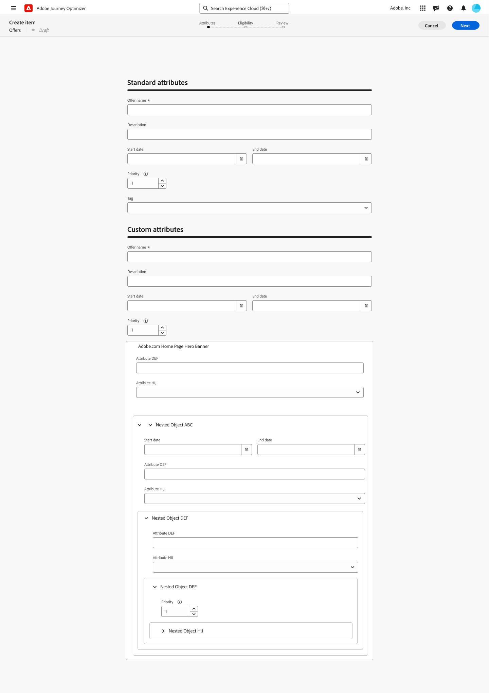

# Artikelkatalog {#catalog}

I beslut fungerar kataloger som centrala behållare för att organisera beslutsobjekt. Varje katalog är länkad till ett Adobe Experience Platform-schema som innehåller alla attribut som kan tilldelas ett beslutsobjekt.

För närvarande konsolideras alla beslutsobjekt som skapats i en enda katalog för erbjudanden som nås via menyn **[!UICONTROL Catalogs]**.

## Skyddsritningar och begränsningar

För att säkerställa optimal prestanda och enhetlighet tillämpar beslut följande säkerhetsförslag och begränsningar:

* **Datatyper som stöds**

  För närvarande har Decisioning exklusivt stöd för följande datatyper: String, Integer, Boolean, Date, DateTime, Decisioning Asset och Object. Fält som ligger utanför dessa datatyper är inte tillgängliga för redigering av beslutsobjekt eller kataloger.

* **Anpassad attributgräns**

  Varje beslutsobjekt kan innehålla upp till 100 anpassade attribut.

* **Kapslingsbegränsningar**

  Högst fyra kapslingsnivåer stöds. Bilder stöds inte på den sista nivån.

## Åtkomst till och redigering av katalogschemat {#access-catalog-schema}

Följ de här stegen för att komma åt katalogschemat där beslutsobjektens attribut lagras:

1. Klicka på knappen **[!UICONTROL Edit schema]** bredvid knappen **[!UICONTROL Create item]** i objektlistan.

1. Katalogens schema öppnas på en ny flik, enligt strukturen nedan:

   * Noden **`_experience`** innehåller standardattribut för beslutsobjekt som namn, start- och slutdatum samt beskrivning.
   * Noden **`_<imsOrg>`** innehåller attribut för anpassade beslutsobjekt. Som standard har inga anpassade attribut konfigurerats, men du kan lägga till så många som behövs för att passa dina behov. När du är klar visas anpassade attribut tillsammans med standardattributen på skärmen för att skapa beslutsobjekt.

   

1. Om du vill lägga till ett anpassat attribut i schemat expanderar du noden **`_<imsOrg>`** och klickar på plusknappen (+) på önskad plats i strukturen.

   

1. Fyll i de fält som krävs för det tillagda attributet och klicka på **[!UICONTROL Apply]**.

   Värdet som anges för ett attribut med ett decimalresursattribut är en publik url. För det mesta pekar detta på en bild.

   Detaljerad information om hur du arbetar med Adobe Experience Platform-scheman finns i [XDM-systemdokumentationen](https://experienceleague.adobe.com/docs/experience-platform/xdm/ui/overview.html?lang=sv-SE).

1. Spara schemat när du har lagt till de anpassade attributen. Det nya fältet är nu tillgängligt på skärmen för att skapa beslutsobjekt i avsnittet **[!UICONTROL Custom attributes]**.

   I exemplet nedan visas en skärm för att skapa objekt med anpassade attribut, till exempel objekt som definierats i schemat.

   

